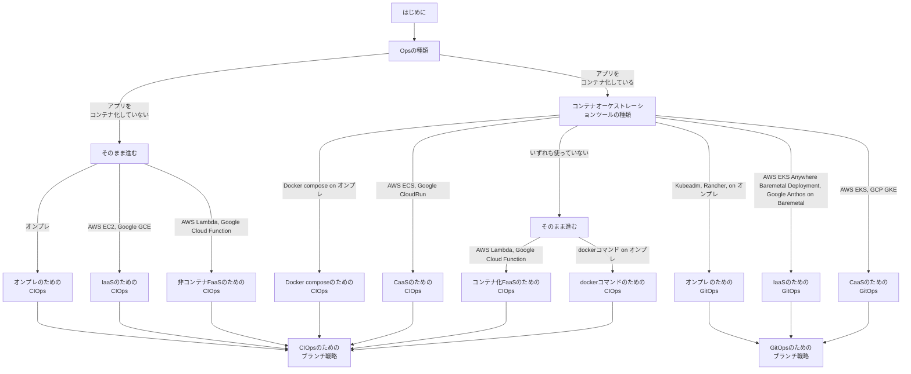

# CI/CD

## はじめに

本サイトにつきまして、以下をご認識のほど宜しくお願いいたします。

> ↪️ 参考：https://hiroki-it.github.io/tech-notebook/

 

## 01. Opsの種類

### CIOps

#### ▼ CIOpsとは

DevOpsを実現する技術的要素の一つ。

CIツールを使用して、CIパイプラインとCDパイプラインの両方を行う手法のこと。

例えばCircleCIでアプリケーションのビルドからデプロイまでを実装する。

> ↪️ 参考：
>
> - https://atmarkit.itmedia.co.jp/ait/articles/2105/26/news005.html
> - https://medium.com/orangesys/kubernetes-anti-patterns-lets-do-gitops-not-ciops-62cfecd1c1a9

#### ▼ 技術ツール例

CIOpsでは、全ての手順をCIツールで実施する。

そのため、多機能かつユーザーフレンドリーなツールが良い。

- CircleCI
- GitHub Actions
- GitLab CI
- Jenkins
- CodePipeline

#### ▼ アンチパターンとなる場合

KubernetesのCI/CDパイプラインにCIOpsを採用する場合、以下の理由でCIOpsはアンチパターンとされている。

| 理由           | 説明                                                                                                                                                                                                                                                                                                                                                  | 補足                                                                                                                                           |
| -------------- | ----------------------------------------------------------------------------------------------------------------------------------------------------------------------------------------------------------------------------------------------------------------------------------------------------------------------------------------------------- | ---------------------------------------------------------------------------------------------------------------------------------------------- |
| セキュリティ   | リポジトリ側に`~/.kube/config`ファイルを置く必要がある。`~/.kube/config`ファイルは機密性が高く、漏洩させたくない。ただし、どうしてもCIOpsを採用したいのであれば、暗号化キー (例：AWS KMS、Google CKM、など) で`~/.kube/config`ファイルを暗号化しておき、これをCIパイプライン内に出力する。                                                            | ↪️ 参考： ・https://devops-blog.virtualtech.jp/entry/20220418/1650250499  ・https://devops-blog.virtualtech.jp/entry/20220418/1650250499 |
| 責務境界の分離 | CIOpsの場合、CIとCDが強く結合しており、切り分けにくい。そのため、結果的にCIの構築/運用を担当するアプリエンジニアが、CDも構築/運用することになる。特に、CDはインフラに影響するため、アプリエンジニアチームが責任を持つべきではない。一方でGitOpsであれば、CIとCDを切り分けやすため、CIとCDの構築/運用をアプリチームとSREチームで分担できるようになる。 | ↪️ 参考：https://news.mynavi.jp/techplus/article/techp5025/                                                                                    |

 

### GitOps

#### ▼ GitOpsとは

DevOpsを実現する技術的要素の一つ。

CIツールを使用してCIパイプラインを、またはCDツールを使用してCDパイプラインを、実装する手法のこと。

> ↪️ 参考：
>
> - https://atmarkit.itmedia.co.jp/ait/articles/2105/26/news005.html
> - https://github.com/argoproj/gitops-engine/blob/master/specs/design.md

#### ▼ 技術ツール例

GitOpsでは、CDツールで実施する手順が多いため、多機能かつユーザーフレンドリーなツールが良い。

執筆時点 (2022/11/09) ではどのようなユースケースでも、OSSの開発が活発なArgoCDが良いかも。

- ArgoCD
- Flux
- Jenkins X
- PipeCD
- Harness

#### ▼ 相性の良いCIツール

CIOpsでなくGitOpsを採用する場合、アプリケーションはマイクロサービスアーキテクチャを採用しているはずである。

GitOpsでは、CIツールで実施する手順が少ないため、基本的にいずれのツールを使用しても問題ない。

ただし、リポジトリの分割戦略にポリリポジトリ (マイクロサービスごとにリポジトリを用意する) を採用している場合、リポジトリで同じ設定ファイルを横展開するよりも、CIツールの設定ファイルの共有部分はは特定のリポジトリで中央集権的に管理し、他のリポジトリでこれを読み込むようにした方が楽である。

外部リポジトリに置いた設定ファイルをリモート参照できるような機能を持つCIツール (例：GitLab CI) であれば、ポリリポジトリ戦略と相性が良い。

 

### Opsの選び方

以下のフローで、要件にあったOpsを選んでいく。

 

## 02. CI/CDパイプライン

### CI/CDパイプラインとは

CIパイプラインとCDパイプラインを組み合わせた手法のこと。

> ↪️ 参考：https://www.redhat.com/ja/topics/devops/what-cicd-pipeline

 

### CI/CDパイプラインの構成要素

#### ▼ CI：Continuous Integration

アプリケーションの機能追加/変更/削除からテストまでを『自動的』かつ『継続的に』行う。

| ステップ | 詳細                                                                     | 自動化の可否 | 説明                                                 |
| -------- | ------------------------------------------------------------------------ | :----------: | ---------------------------------------------------- |
| ビルド   | アプリケーションのビルド                                                 |    `⭕️`     | CIツールとIaCツールで自動化できる。                  |
| テスト   | ホワイトボックステスト (単体テスト、機能テスト、回帰テスト、など) の実施 |    `⭕️`     | CIツールとテストフレームワークで自動化できる。       |
|          | 結合テスト                                                               |      ×       | ブラックボックステストで、動作を確認する必要がある。 |
|          | コーディング規約に関するレビュー                                         |    `⭕️`     | CIツールと静的解析ツールで自動化できる。             |
|          | 仕様に関するレビュー                                                     |      ×       | GitHub上でレビューする必要がある。                   |

> ↪️ 参考：https://tracpath.com/works/devops/11_topics_for_devops/

#### ▼ CD：Continuous Delivery

変更内容を『自動的』かつ『継続的に』ステージング環境と本番環境にデプロイする。

| ステップ (ステージング環境の場合) | 詳細                                 | 自動化の可否 | 説明                     |
| --------------------------------- | ------------------------------------ | :----------: | ------------------------ |
| デプロイ                          | ステージング環境に対するデプロイ     |    `⭕️`     | CDツールで自動化できる。 |
| DBマイグレーション                | ステージング環境のDBに対するデプロイ |    `⭕️`     | CDツールで自動化できる。 |

本番環境へのデプロイ前に、承認ステップを設ける。

| ステップ (本番環境の場合) | 詳細                           | 自動化の可否 | 説明                     |
| ------------------------- | ------------------------------ | :----------: | ------------------------ |
| 承認                      | 本番環境に対するデプロイの承認 |    `⭕️`     | CDツールで自動化できる。 |
| デプロイ                  | 本番環境に対するデプロイ       |    `⭕️`     | CDツールで自動化できる。 |
| DBマイグレーション        | 本番環境のDBに対するデプロイ   |    `⭕️`     | CDツールで自動化できる。 |

> ↪️ 参考：https://blog.kyanny.me/entry/2014/12/24/145001

#### ▼ PD：Progressive Delivery

特にカナリアリリースやブルー/グリーンデプロイメントでデプロイされたアプリケーションに関して、ユーザーのアクセスから収集されたテレメトリーを分析し、問題が起これば自動的にロールバックする。

問題の判定基準としては、障害の有無やSLO閾値未満がある。

| ステップ | 詳細                                 | 自動化の可否 | 説明                                                         |
| -------- | ------------------------------------ | :----------: | ------------------------------------------------------------ |
| 分析     | ステージング環境のテレメトリーを分析 |    `⭕️`     | CDツールとテレメトリー収集ツールを組み合わせて自動化できる。 |
|          | 本番環境のテレメトリーを分析         |    `⭕️`     | CDツールとテレメトリー収集ツールを組み合わせて自動化できる。 |

> ↪️ 参考：
>
> - https://r-kaga.com/blog/what-is-progressive-delivery
> - https://codezine.jp/article/detail/14476
> - https://speakerdeck.com/tozastation/3-shake-inc-niokeru-progressive-dellivery-dao-ru-madefalsenao-mitoqu-rizu-mi-cndt2021?slide=25

 
