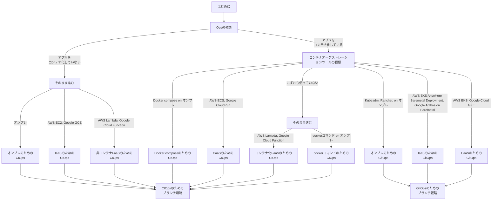

# CI/CD＠技術的要素

## はじめに

本サイトにつきまして、以下をご認識のほど宜しくお願いいたします。

> - https://hiroki-it.github.io/tech-notebook/

 

## 01. CI/CDとは

CI/CDは、DevOpsを構成する『技術的要素』『組織文化的要素』のうち、技術的要素に相当する概念である。

 

## 02. CI/CDの必要性

### 自動化による高品質なシステムの維持

CI/CDの一連の流れ (パイプライン) の中でテストを自動化できる。

そのため、一定水準以上の品質を維持しやすくする。

システム（ソフトウェアとハードウェア、があるがここでは特にソフトウェア）には、例えば以下の品質の特性がある（ISOの規格の場合）。

- **機能性**
- 性能効率性
- 互換性
- 利便性（使いやすさ）
- 信頼性
- 安全性
- 保守性
- 移植性（汎用性）

テストステップで特に機能性を検証し、一定水準以上の品質を維持するように設計する。

 

### 自動化による工数削減

開発からリリースには、以下のステップがある。

CI/CDの一連の流れ (パイプライン) の中でこれらのステップを自動化できるため、工数を削減できる。

1. アプリのビルド
2. テスト
3. 承認
4. デプロイ
5. DBマイグレーション

 

## 03. CI/CDパイプラインのステップについて

### CI/CDパイプラインとは

CIパイプラインとCDパイプラインを組み合わせた手法のこと。

> - https://www.redhat.com/ja/topics/devops/what-cicd-pipeline

 

### CIパイプライン

アプリの機能追加/変更/削除からテストまでを『自動的』かつ『継続的に』実行する。

| ステップ | 詳細                                                                     | 自動化の可否 | 説明                                                                                                                              |
| -------- | ------------------------------------------------------------------------ | :----------: | --------------------------------------------------------------------------------------------------------------------------------- |
| ビルド   | アプリのビルド                                                           |     `⭕️`     | CIツールとIaCツールで自動化できる。                                                                                               |
| テスト   | ホワイトボックステスト (単体テスト、機能テスト、回帰テスト、など) の実施 |     `⭕️`     | CIツールとテストフレームワークで自動化できる。                                                                                    |
|          | 結合テスト                                                               |      △       | 基本的にはブラックボックステストで、動作を確認する必要がある。ただし、自動的なE2Eテストを簡易的な結合テストの代わりにしてもよい。 |
|          | コーディング規約に関するレビュー                                         |     `⭕️`     | CIツールと静的解析ツールで自動化できる。                                                                                          |
|          | 仕様に関するレビュー                                                     |      ×       | GitHub上でレビューする必要がある。                                                                                                |

> - https://tracpath.com/works/devops/11_topics_for_devops/

 

### CDパイプライン

変更内容を『自動的』かつ『継続的に』ステージング環境と本番環境にデプロイする。

| ステップ (ステージング環境の場合) | 詳細                                 | 自動化の可否 | 説明                     |
| --------------------------------- | ------------------------------------ | :----------: | ------------------------ |
| デプロイ                          | ステージング環境に対するデプロイ     |     `⭕️`     | CDツールで自動化できる。 |
| DBマイグレーション                | ステージング環境のDBに対するデプロイ |     `⭕️`     | CDツールで自動化できる。 |

本番環境へのデプロイ前に、承認ステップを設ける。

承認ステップがある場合を、デプロイではなく特に『デリバリー』と呼ぶことがある。

| ステップ (本番環境の場合) | 詳細                           | 自動化の可否 | 説明                     |
| ------------------------- | ------------------------------ | :----------: | ------------------------ |
| 承認                      | 本番環境に対するデプロイの承認 |     `⭕️`     | CDツールで自動化できる。 |
| デプロイ                  | 本番環境に対するデプロイ       |     `⭕️`     | CDツールで自動化できる。 |
| DBマイグレーション        | 本番環境のDBに対するデプロイ   |     `⭕️`     | CDツールで自動化できる。 |

> - https://blog.kyanny.me/entry/2014/12/24/145001
> - https://aws.amazon.com/jp/devops/continuous-delivery/

 

### PD：Progressive Delivery

特にカナリアリリースやブルー/グリーンデプロイメントでデプロイされたアプリに関して、ユーザーのアクセスから収集されたテレメトリーを分析し、問題が起これば自動的にロールバックする。

問題の判定基準としては、障害の有無やSLO閾値未満がある。

| ステップ | 詳細                                 | 自動化の可否 | 説明                                                         |
| -------- | ------------------------------------ | :----------: | ------------------------------------------------------------ |
| 分析     | ステージング環境のテレメトリーを分析 |     `⭕️`     | CDツールとテレメトリー収集ツールを組み合わせて自動化できる。 |
|          | 本番環境のテレメトリーを分析         |     `⭕️`     | CDツールとテレメトリー収集ツールを組み合わせて自動化できる。 |

> - https://r-kaga.com/blog/what-is-progressive-delivery
> - https://codezine.jp/article/detail/14476
> - https://speakerdeck.com/tozastation/3-shake-inc-niokeru-progressive-dellivery-dao-ru-madefalsenao-mitoqu-rizu-mi-cndt2021?slide=25

 

## 04. 要件定義事項

### CI/CDパイプラインのステップをどこまで採用する必要があるかの質問

CI/CDパイプラインには種々のステップがあり、どこまで採用するべきかを判断するために、以下をヒアリングする。

| 質問                                                               | 質問の意図                                                                                                                                                                                                                             |
| ------------------------------------------------------------------ | -------------------------------------------------------------------------------------------------------------------------------------------------------------------------------------------------------------------------------------- |
| アプリをリリースするまでに実施している手順は？                     | 現状、どのような方法でアプリをリリースしているのかを知りたい。                                                                                                                                                                         |
| 本番環境にて、バグが混入のインシデントが “頻繁に起こることがある？ | 品質を維持できているかどうかを聞きたい。CI/CDのビルドステップやテストステップを採用する必要があるか。もしテストコード自体も採用していない場合はこちらも採用してもらう必要があるが、テストコード設計はCI/CDと話が逸れるため言及しない。 |

 

### アプリが稼働しているインフラの技術スタックについての質問

CI/CDの設計はアプリが稼働している既存のインフラの技術スタックで決まるため、以下をヒアリングする。

1. まずはこちらをどうぞ。

| 質問                                                                                 | 質問の意図                                                                                          |
| ------------------------------------------------------------------------------------ | --------------------------------------------------------------------------------------------------- |
| アプリはコンテナ化しているか                                                         | アプリをコンテナ化しているかどうかで適切なCIOpsが異なるため、聞いておきたい。                       |
| アプリをコンテナ化している場合は、コンテナオーケストレーションツールを使用しているか | コンテナオーケストレーションツールを使用しているかどうかで適切なCIOpsが異なるため、聞いておきたい。 |

1. アプリをコンテナ化していない場合は、こちらをどうぞ。

| 質問                                                                    | 質問の意図                                                                                                                                                                                                                                                                                     |
| ----------------------------------------------------------------------- | ---------------------------------------------------------------------------------------------------------------------------------------------------------------------------------------------------------------------------------------------------------------------------------------------- |
| オンプレでアプリが稼働しているか。                                      | オンプレ上で非コンテナ化のアプリを動かしている場合、適切なCIOpsが異なるため、聞いておきたい。クラウドプロバイダー (例：AWS) によっては、オンプレ上に専用エージェント (CodeDeployエージェント) を稼働させることにより、クラウドからオンプレサーバー上にアプリを安全にデプロイできる場合がある。 |
| IaaS (EC2、GCEなど) でアプリが稼働しているか。                          | IaaS上で非コンテナ化のアプリを動かしている場合、適切なCIOpsが異なるため、聞いておきたい。クラウドプロバイダー (例：AWS) によっては、CI/CDツール (例：Code三兄弟) やクラウドロードバランサーを使用することにより、IaaS上にアプリを安全にデプロイできる可能性がある。                            |
| 非コンテナFaaS (Lambda、CloudFunction、など) でアプリが稼働しているか。 | FaaS上で非コンテナ化のアプリを動かしている場合、適切なCIOpsが異なるため、聞いておきたい。クラウドプロバイダーによっては、CI/CDツールを使用することにより、非コンテナFaaS上にアプリを安全にデプロイできる可能性がある。                                                                         |

1. アプリをコンテナ化しつつ、オーケストレーションツールを使用していない場合は、こちらをどうぞ。

| 質問                                                     | 質問の意図                                                                                                                                                                                                                                                                                                                                                                                       |
| -------------------------------------------------------- | ------------------------------------------------------------------------------------------------------------------------------------------------------------------------------------------------------------------------------------------------------------------------------------------------------------------------------------------------------------------------------------------------ |
| オンプレ上で`docker`コマンドを使用しているか。           | オンプレ上で`docker`コマンドを使用してアプリを動かしている場合、適切なCIOpsが異なるため、聞いておきたい。クラウドプロバイダーによっては、オンプレ上に専用エージェントを稼働させることにより、クラウドからオンプレサーバー上にアプリを安全にデプロイできる場合がある。もしクラウドプロバイダーを使用できないのであれば、オンプレのみで完結できるCI/CDツール (例：Capistrano) の検討が必要になる。 |
| コンテナ化Faas (Lamba、CloudFunction) を使用しているか。 | コンテナ化FaaSのアプリを動かしている場合、適切なCIOpsがあるため、聞いておきたい。CI/CDツールを使用することにより、コンテナ化FaaS上にアプリを安全にデプロイできる可能性がある。                                                                                                                                                                                                                   |

1. アプリをコンテナ化しつつ、Kubernetes系ではないオーケストレーションツールを使用している場合は、こちらをどうぞ。

| 質問                                         | 質問の意図                                                                                      |
| -------------------------------------------- | ----------------------------------------------------------------------------------------------- |
| オンプレ上でDocker Composeを使用しているか。 | Docker Composeでオーケストレーションを実施している場合、適切なCIOpsがあるため、聞いておきたい。 |
| CaaS (ECS、CloudRun) を使用しているか。      | CaaSでオーケストレーションを実施している場合、適切なCIOpsがあるため、聞いておきたい。           |

1. アプリをコンテナ化しつつ、Kubernetes系のオーケストレーションツールを使用している場合は、こちらをどうぞ。

| 質問                                                                                                                                                       | 質問の意図                                                                                                                                |
| ---------------------------------------------------------------------------------------------------------------------------------------------------------- | ----------------------------------------------------------------------------------------------------------------------------------------- |
| オンプレ上でセルフマネージドなKuberbetesオーケストレーションツール (Kubeadm、Rancher) を使用しているか。                                                   | セルフマネージドなKuberbetesオーケストレーションツールを使用している場合、適切なCIOpsがあるため、聞いておきたい。                         |
| ベアメタル型IaaS上でクラウドプロバイダーのKuberbetesオーケストレーションツール (例：AWS EKS Anywhere、Google Cloud Anthos on Baremetal) を使用しているか。 | ベアメタル型IaaS上でクラウドプロバイダーのKuberbetesオーケストレーションツールを使用している場合、適切なCIOpsがあるため、聞いておきたい。 |
| CaaS (EKS、GKE) を使用しているか。                                                                                                                         | CaaSを使用している場合、適切なCIOpsがあるため、聞いておきたい。                                                                           |

 

### ドメインに応じた規定についての質問

準拠しなければならない国の規定に関してヒアリングする。

| 質問                                                         | 質問の意図                                                                                                                                          |
| ------------------------------------------------------------ | --------------------------------------------------------------------------------------------------------------------------------------------------- |
| システムを作るにあたって、準拠しなければならない規定はあるか | システム化するドメイン (例：クレジットカード) によっては、国が用意した規定の要件 (例：PCI DSS) に準拠したシステムを設計しないといけない場合がある。 |
| 過去に準拠したシステムは構築したことがあるか                 | 過去の設計を参考にすれば、要件をいずれの技術をして実装できるかがわかる。                                                                            |
| 監査が入るタイミングはいつか。                               | 構築時点では完全に準拠できていなくても                                                                                                              |

 

## 05. 要件回答に基づく技術選定フローチャート

要件定義でヒアリングした回答に基づいて、要件にあったCI/CDを選択していく。

 

## 06. CIOps

### CIOpsとは

DevOpsを実現する技術的要素の一つ。

CIツール (例：GitHub Actions、CircleCI、GitLab CI、Argo Workflows、Tekton、など) を使用して、CIパイプラインとCDパイプラインの両方を実行する手法のこと。

> - https://atmarkit.itmedia.co.jp/ait/articles/2105/26/news005.html
> - https://medium.com/orangesys/kubernetes-anti-patterns-lets-do-gitops-not-ciops-62cfecd1c1a9

 

### CIOpsを採用する場合のCIツールの一覧

CIOpsでは、全ての手順をCIツールで実施する。

そのため、多機能かつユーザーフレンドリーなツールが良い。

- CircleCI
- GitHub Actions
- GitLab CI
- Jenkins
- CodePipeline

 

### アンチパターンとなる場合

#### ▼ セキュリティ

KubernetesのCI/CDパイプラインにCIOpsを採用する場合、セキュリティ上の理由でCIOpsはアンチパターンとされている。

リポジトリ側に`kubeconfig`ファイルを置く必要がある。

`kubeconfig`ファイルは機密性が高く、漏洩させたくない。

ただし、どうしてもCIOpsを採用したいのであれば、暗号化キー (例：AWS KMS、Google Cloud CKM、GPG、PGP、など) で`kubeconfig`ファイルを暗号化しておき、これをCIパイプライン内に出力する。

> - https://devops-blog.virtualtech.jp/entry/20220418/1650250499

#### ▼ 責務境界の分離

KubernetesのCI/CDパイプラインにCIOpsを採用する場合、責務協会の分離上の理由でCIOpsはアンチパターンとされている。

CIOpsの場合、CIとCDが強く結合しており、切り分けにくい。

そのため、結果的にCIの構築/運用を担当するアプリエンジニアが、CDも構築/運用することになる。

特に、CDはインフラに影響するため、アプリエンジニアチームが責任を持つべきではない。

一方でGitOpsであれば、CIとCDを切り分けやすため、CIとCDの構築/運用をアプリチームとSREチームで分担できるようになる。

> - https://news.mynavi.jp/techplus/article/techp5025/

 

## 07. GitOps

### GitOpsとは

DevOpsを実現する技術的要素の一つ。

CIツール (例：GitHub Actions、CircleCI、GitLab CI、Argo Workflows、Tekton、など) を使用してCIパイプラインを、またはCDツール (例：ArgoCD、Flux、など) を使用してCDパイプラインを、実装する手法のこと。

> - https://atmarkit.itmedia.co.jp/ait/articles/2105/26/news005.html
> - https://github.com/argoproj/gitops-engine/blob/v0.6.2/specs/design.md

 

### 技術ツール例

GitOpsでは、CDツールで実施する手順が多いため、多機能かつユーザーフレンドリーなツールが良い。

執筆時点 (2022/11/09) ではどのようなユースケースでも、OSSの開発が活発なArgoCDが良いかも。

- ArgoCD
- Flux
- Jenkins X
- PipeCD
- Harness

 

### 相性の良いCIツール

CIOpsでなくGitOpsを採用する場合、アプリはマイクロサービスアーキテクチャを採用しているはずである。

GitOpsでは、CIツールで実施する手順が少ないため、基本的にいずれのツールを使用しても問題ない。

ただし、リポジトリの分割戦略にポリリポジトリ (マイクロサービスごとにリポジトリを用意する) を採用している場合、リポジトリで同じ設定ファイルを横展開するよりも、CIツールの設定ファイルの共有部分はは特定のリポジトリで中央集権的に管理し、他のリポジトリでこれを読み込むようにした方が楽である。

外部リポジトリに置いた設定ファイルをリモート参照できるような機能を持つCIツール (例：GitLab CI) であれば、ポリリポジトリ戦略と相性が良い。

 
