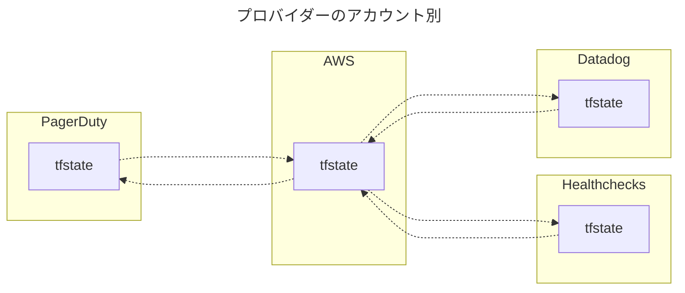
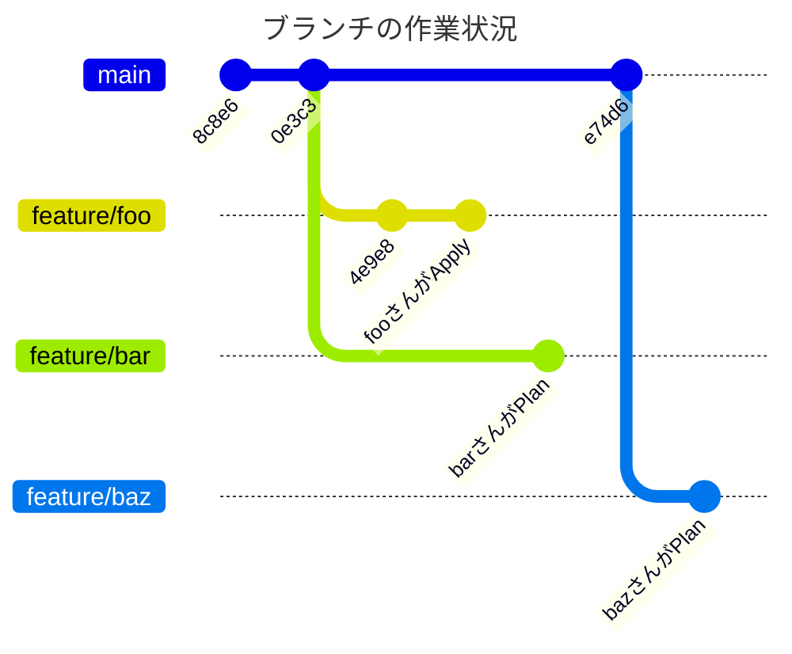
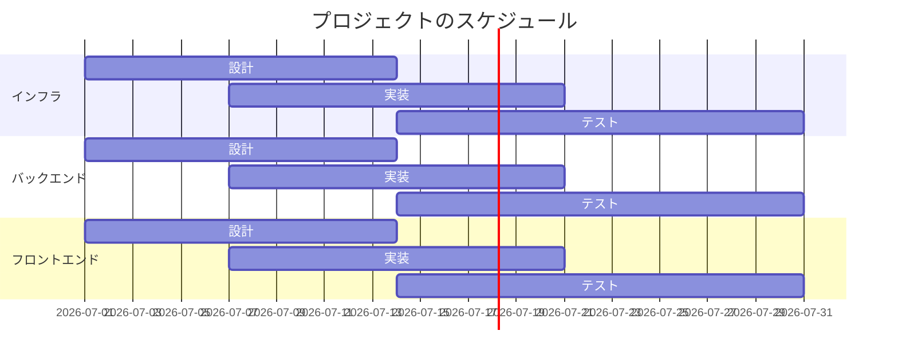

# マーメイド＠開発手法

### はじめに

本サイトにつきまして、以下をご認識のほど宜しくお願いいたします。

> ↪️：https://hiroki-it.github.io/tech-notebook/

 

## フローチャート

 

> ↪️：https://mermaid.js.org/syntax/flowchart.html?id=flowcharts-basic-syntax

## Gitグラフ

> ↪️：https://mermaid.js.org/syntax/gitgraph.html

 

## ガントチャート

> ↪️：https://mermaid.js.org/syntax/gantt.html

 
