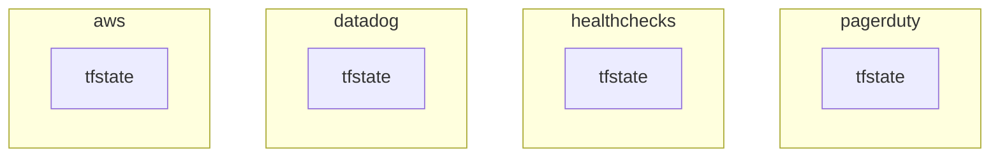
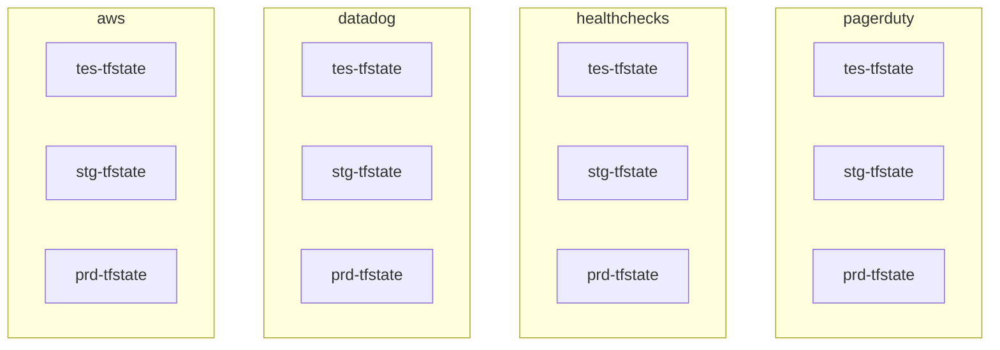
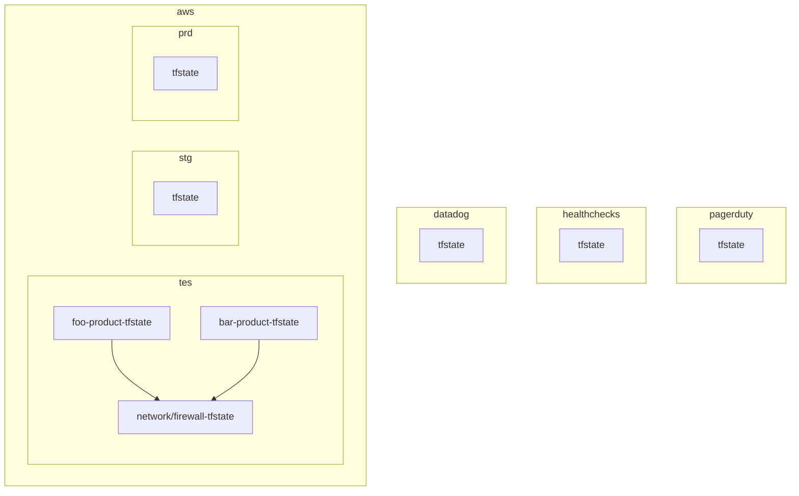
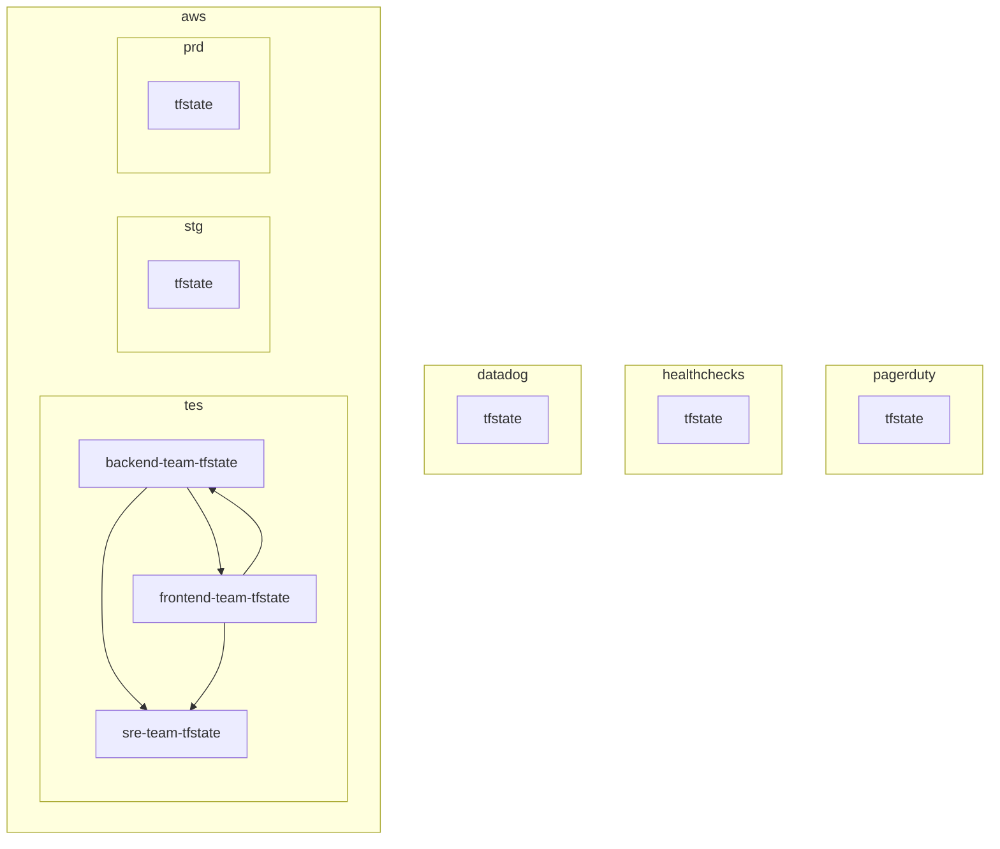
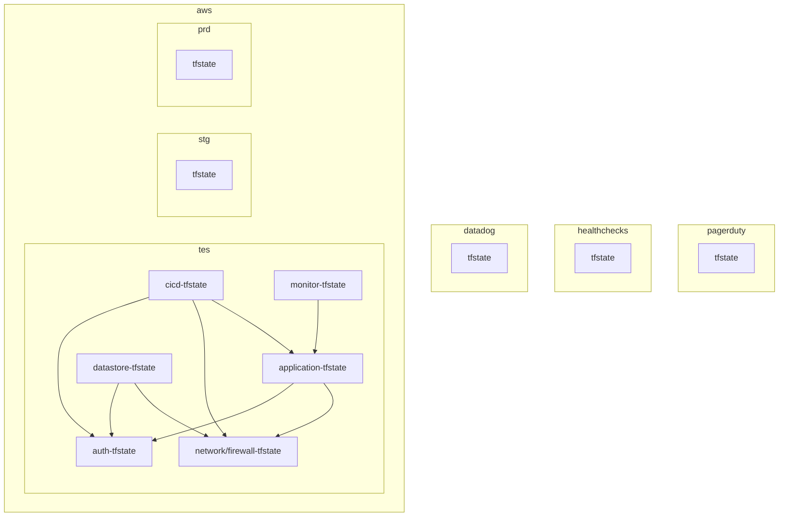
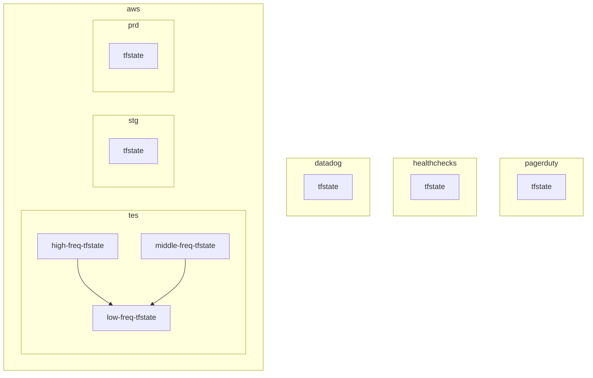
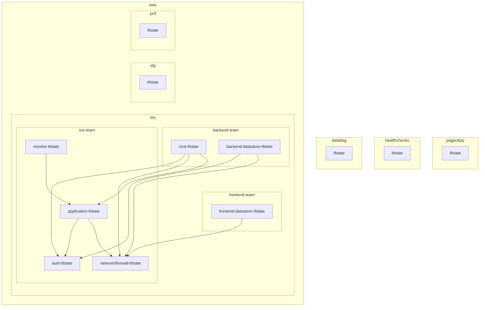

# `.tfstate`ファイルの分割＠設計ポリシー

## はじめに

本サイトにつきまして、以下をご認識のほど宜しくお願いいたします。

> ↪️：https://hiroki-it.github.io/tech-notebook/

<br>

## 01. tfstateファイルの分割について

ディレクトリをゼロから設計する場合や、既存のディレクトリの設計ポリシーを察する場合に使っている見方を整理した。

Terraformのディレクトリ構成は新興宗教で、あくまで以下は私の宗派である (他の人にとっては邪教かも)。

**本資料で “依存” という言葉を使っていますが、これはその対象 ”使用すること” を意味している。**

アプリケーション開発の文脈で対象を “使用すること” を “依存” と表現するため、それに合わせている。

Terraformに限らずアプリケーションでも注意が必要ですが、例えば循環参照エラーは相互依存が原因である。

<br>

## 02. tfstateファイル分割を含むディレクトリ構成

まず、Terraformのディレクトリ構成はtfstateファイルの粒度に合わせること。

そしてTerraformのtfstateファイルの分割の境目を見つけるコツは、

“**他の状態にできるだけ依存しない (`terraform_remote_state`ブロックで他のtfstateファイルを参照しない) リソースの関係”**

に注目することである。

`terraform_remote_state`ブロック以外の方法 (例：dataリソースで他のtfstateファイル由来のリソースをタグ等から取得) で他のtfstateファイルを取得できるが、考え方は同じである。

ここでは、観測範囲内で境目の例を挙げているだけで、実際の現場では依存せざるを得ない状況があるかもしれない。

分割したtfstateファイルの依存方向図を書きながら設計することをお勧めする。

<br>

### 手順

#### ▼ 具体的な方法

前提として、`terraform`ブロックから`backend`オプションを切り分け、`backend.tfvars`ファイルを作成する。

`backend.tfvars`ファイルでは、tfstateファイルのあるバックエンドを定義するとする。

1と2は必須であるが、3は状況（例：プロダクトのフェーズ、システムの規模）によって読み手が選ぶようにする。

1. 最上層をクラウドプロバイダーのアカウントで切る。
2. 最下層を実行環境別で切る。
3. 中間層を以下のいずれか / 組み合わせで切る。

   ここではCloudFormationの分割プラクティスをTerraformにも適用して考える。

   - 同じテナント内のプロダクト別
   - 運用チームの責務範囲
   - プロダクトのサブコンポーネント
   - リソースの状態の変更頻度
   - blast radius（影響範囲、障害範囲）

   [AWS CloudFormation best practices - AWS CloudFormation](https://docs.aws.amazon.com/AWSCloudFormation/latest/UserGuide/best-practices.html#organizingstacks)

プロジェクトによっては、特に中間層ディレクトリで複数の設計ポリシーを組み合わせている場合があり、一つだけ採用されているとは限らないことに注意する。
**おそらく一番現実的なのが、後述の通り、運用チームの責務範囲とサブコンポーネントを組み合わせて分割する方法である。**

#### ▼ ほかのtfstateファイルに依存する場合

tfstateファイルを分割するということは、互いリソース値に依存しない想定である (**はじめにの項目に記載がある通り**)。

例えば、AWSリソースのブロックがGoogleCloudリソースのブロックに依存することはな。

しかしtfstateファイルを分割したとしても、一方の`tfstate`ファイルがもう一方に依存せざるを得ない場合がある。

tfstateファイルが他から独立している想定で分割しているので、あまり望ましくないが、他のtfstateファイルに依存する場合`terraform_remote_state`ブロックを使用する

```yaml
repository/
├── foo/
│   ├── backend.tf # バックエンド内の/foo/terraform.tfstate
│   ├── provider.tf
│   ...
│
├── bar/
│   ├── backend.tf # バックエンド内の/bar/terraform.tfstate
│   ├── remote_state.tf # terraform_remote_stateブロックを使用し、fooのtfstateファイルに依存してもよい
│   ├── provider.tf
│   ...
│
...
```

```bash
# 分割した異なるfooというtfstateファイルから取得する
data "terraform_remote_state" "foo" {
  backend = "s3"

  config = {
    bucket = "foo-tfstate"
    key    = "foo/terraform.tfstate"
    region = "ap-northeast-1"
  }
}
```

<br>

### 最上層ディレクトリ

#### ▼ クラウドプロバイダーのアカウント

最上層ディレクトリはプロバイダーのアカウント別でtfstateファイルを含むディレクトリを分割する。

この場合は、ディレクトリではなくリポジトリ自体を別にしてしまっても良い。

**プロバイダーが他プロバイダーのtfstateファイルに依存することはない想定なので、`terraform_remote_state`ブロックを使用せずに完全に分割できるはずである。**



tfstateファイルのコメントアウトは、バックエンド内のディレクトリ構成を示している。

(例)

分割したtfstateファイルを同じリポジトリで管理する場合

```yaml

# ディレクトリの名前は一例であり、任意である。
repository/
├── aws/ # AWS
│   ├── backend.tf # バックエンド内の/aws/terraform.tfstate
│   ├── provider.tf
│   ...
│
├── datadog/ # Datadog
│   ├── backend.tf # バックエンド内の/datadog/terraform.tfstate
│   ├── provider.tf
│   ...
│
├── healthchecks/ # Healthchecks
│   ├── backend.tf # バックエンド内の/healthchecks/terraform.tfstate
│   ├── provider.tf
│   ...
│
└── pagerduty/ # PagerDuty
    ├── backend.tf
    ├── provider.tf
    ...
```

(例)

分割したtfstateファイルを異なるリポジトリで管理する場合

```yaml
# ディレクトリの名前は一例であり、任意である。
aws-repository/
├── backend.tf # バックエンド内の/aws/terraform.tfstate
├── provider.tf
...
```

```yaml
datadog-repository/ # Datadog
├── backend.tf # バックエンド内の/datadog/terraform.tfstate
├── provider.tf
...
```

```yaml
healthchecks-repository/ # Healthchecks
├── backend.tf # バックエンド内の/healthchecks/terraform.tfstate
├── provider.tf
...
```

```yaml
pagerduty-repository/ # PagerDuty
├── backend.tf
├── provider.tf
...
```

<br>

### 最下層ディレクトリ

#### ▼ 実行環境別

実行環境別でtfstateファイルを含むディレクトリを分割する。

この場合は、リポジトリ自体は分割しない。

**実行環境が他実行環境のtfstateファイルに依存することはない想定なので、`terraform_remote_state`ブロックを使用せずに完全に分割できるはずである。**



tfstateファイルのコメントアウトは、バックエンド内のディレクトリ構成を示している。

なお、クラウドプロバイダーはリポジトリで分割した前提とする。

```yaml

# ディレクトリの名前は一例であり、任意である。
aws-repository/
├── provider.tf
├── tes/ # テスト環境
│   ├── backend.tfvars # バックエンド内のaws/terraform.tfstate
│   ...
│
├── stg/ # ステージング環境
└── prd/ # 本番環境
```

```yaml
datadog-repository/
├── provider.tf
├── tes/ # テスト環境
├── stg/ # ステージング環境
└── prd/ # 本番環境

```

```yaml
healthchecks-repository/
├── provider.tf
├── tes/ # テスト環境
├── stg/ # ステージング環境
└── prd/ # 本番環
```

```yaml
pagerduty-repository/
├── provider.tf
├── tes/ # テスト環境
├── stg/ # ステージング環境
└── prd/ # 本番環境
```

<br>

### 中間層ディレクトリ

#### ▼ 同じテナントのプロダクト別

この場合は、ディレクトリではなくリポジトリ自体を別にしてしまっても良い。

同じテナント (例：同じAWSアカウントの同じVPC) 内に複数のプロダクトがある場合に、プロダクト別でディレクトリを分割する。

プロダクトごとにVPCを分けたいところではあるが…

**各プロダクトのtfstateが共有コンポーネント (例：VPC) のそれに依存し、前者が`terraform_remote_state`ブロックを使用する可能性がある**

(例)

- 共有のnetwork/firewall系コンポーネント (例：VPC、SecurityGroup)
- foo-product
- bar-product

があるとする。

依存方向は矢印の通り。



この場合のディレクトリ構成例は以下の通りである。

tfstateファイルのコメントアウトは、バックエンド内のディレクトリ構成を示している。

なお、クラウドプロバイダーはリポジトリで分割した前提とする。

(例)

分割した各tfstateファイルを同じリポジトリで管理する場合

```yaml

# ディレクトリの名前は一例であり、任意である。
aws-repository/
├── foo-product/
│   ├── provider.tf
│   ├── tes # テスト環境
│   │   ├── backend.tfvars # tes用バックエンド内の/aws/foo-product/terraform.tfstate
│   │   ...
│   │
│   ├── stg # ステージング環境
│   │   ├── backend.tfvars # stg用バックエンド内の/aws/foo-product/terraform.tfstate
│   │   ...
│   │
│   └── prd # 本番環境
│       ├── backend.tfvars # prd用バックエンド内の/aws/foo-product/terraform.tfstate
│       ...
│
├── bar-product/
│   ├── provider.tf
│   ├── tes # テスト環境
│   │   ├── backend.tfvars # tes用バックエンド内の/aws/bar-product/terraform.tfstate
│   │   ...
│   │
│   ├── stg # ステージング環境
│   │   ├── backend.tfvars # stg用バックエンド内の/aws/bar-product/terraform.tfstate
│   │   ...
│   │
│   └── prd # 本番環境
│       ├── backend.tfvars # prd用バックエンド内の/aws/bar-product/terraform.tfstate
│       ...
│
└── network-firewall
    ├── provider.tf
    ├── vpc.tf # ネットワーク系のリソース
    ├── security-group.tf # ファイアウォール系のリソース
    ├── tes # テスト環境
    │   ├── backend.tfvars # tes用バックエンド内の/aws/network-firewall/terraform.tfstate
    │   ...
    │
    ├── stg # ステージング環境
    │   ├── backend.tfvars # stg用バックエンド内の/aws/network-firewall/terraform.tfstate
    │   ...
    │
    └── prd # 本番環境
        ├── backend.tfvars # prd用バックエンド内の/aws/network-firewall/terraform.tfstate
        ...

```

(例)

分割した各tfstateファイルを異なるリポジトリで管理する場合

```yaml
# ディレクトリの名前は一例であり、任意である。
aws-foo-product-repository/
├── provider.tf
├── tes # テスト環境
│   ├── backend.tfvars # tes用バックエンド内の/aws/foo-product/terraform.tfstate
│   ...
│
├── stg # ステージング環境
│   ├── backend.tfvars # stg用バックエンド内の/aws/foo-product/terraform.tfstate
│   ...
│
└── prd # 本番環境
    ├── backend.tfvars # prd用バックエンド内の/aws/foo-product/terraform.tfstate
    ...
```

```yaml
aws-bar-product-repository/
├── provider.tf
├── tes # テスト環境
│   ├── backend.tfvars # tes用バックエンド内の/aws/bar-product/terraform.tfstate
│   ...
│
├── stg # ステージング環境
│   ├── backend.tfvars # stg用バックエンド内の/aws/bar-product/terraform.tfstate
│   ...
│
└── prd # 本番環境
    ├── backend.tfvars # prd用バックエンド内の/aws/bar-product/terraform.tfstate
       ...
```

```yaml
aws-network-firewall-repository
├── provider.tf
├── vpc.tf # ネットワーク系のリソース
├── tes # テスト環境
│   ├── backend.tfvars # tes用バックエンド内の/aws/network-firewall/terraform.tfstate
│   ...
│
├── stg # ステージング環境
│   ├── backend.tfvars # stg用バックエンド内の/aws/network-firewall/terraform.tfstate
│   ...
│
└── prd # 本番環境
    ├── backend.tfvars # prd用バックエンド内の/aws/network-firewall/terraform.tfstate
    ...
```

#### ▼ 運用チームの責務範囲

運用チームのリソースの責務範囲別でディレクトリを分割する。

この場合は、ディレクトリではなくリポジトリ自体を別にしてしまっても良い。

この時、バックエンド（例：AWS S3、GCP GCS、など）のポリシー（例：IAM、バケットポリシー、など）で認可スコープを制御する。

**それぞれのtfstateが相互依存し、各運用チームが`terraform_remote_state`ブロックを使用する可能性がある**

（例）

- backendチーム
- frontendチーム
- sreチーム

があるとする。

依存方向は矢印の通り。



この場合のディレクトリ構成例は以下の通りである。

tfstateファイルのコメントアウトは、バックエンド内のディレクトリ構成を示している。

なお、クラウドプロバイダーはリポジトリで分割した前提とする。

(例)

分割した各tfstateファイルを同じリポジトリで管理する場合

```yaml

# ディレクトリの名前は一例であり、任意である。
aws-repository/
├── frontend-team # frontendチーム
│   ├── provider.tf
│   ├── s3.tf
│   ├── tes # テスト環境
│   │   ├── backend.tfvars # tes用バックエンド内の/aws/frontend-team/terraform.tfstate
│   │   ├── remote_state.tf # terraform_remote_stateブロックを使用し、backend-teamとsre-teamのtfstateファイルに依存している
│   │   ...
│   │
│   ├── stg # ステージング環境
│   │   ├── backend.tfvars # stg用バックエンド内の/aws/frontend-team/terraform.tfstate
│   │   ├── remote_state.tf # terraform_remote_stateブロックを使用し、backend-teamとsre-teamのtfstateファイルに依存している
│   │   ...
│   │
│   └── prd # 本番環境
│       ├── backend.tfvars # prd用バックエンド内の/aws/frontend-team/terraform.tfstate
│       ├── remote_state.tf # terraform_remote_stateブロックを使用し、backend-teamとsre-teamのtfstateファイルに依存している
│       ...
│
├── backend-team # backendチーム
│   ├── provider.tf
│   ├── ses.tf
│   ├── sns.tf
│   ├── rds.tf
│   ├── tes
│   │   ├── backend.tfvars # tes用バックエンド内の/aws/backend-team/terraform.tfstate
│   │   ├── remote_state.tf # terraform_remote_stateブロックを使用し、frontend-teamとsre-teamのtfstateファイルに依存している
│   │   ...
│   │
│   ├── stg
│   │   ├── backend.tfvars # stg用バックエンド内の/aws/backend-team/terraform.tfstate
│   │   ├── remote_state.tf # terraform_remote_stateブロックを使用し、frontend-teamとsre-teamのtfstateファイルに依存している
│   │   ...
│   │
│   └── prd
│       ├── backend.tfvars # prd用バックエンド内の/aws/backend-team/terraform.tfstate
│       ├── remote_state.tf # terraform_remote_stateブロックを使用し、frontend-teamとsre-teamのtfstateファイルに依存している
│       ...
│
└── sre-team # baz-sreチーム
    ├── provider.tf
    ├── alb.tf
    ├── cloudwatch.tf
    ├── ec2.tf
    ├── ecs.tf
    ├── eks.tf
    ├── iam.tf
    ├── vpc.tf
    ├── tes
    │   ├── backend.tfvars # tes用バックエンド内の/aws/sre-team/terraform.tfstate
    │   ...
    │
    ├── stg
    │   ├── backend.tfvars # stg用バックエンド内の/aws/sre-team/terraform.tfstate
    │   ...
    │
    └── prd
        ├── backend.tfvars # prd用バックエンド内の/aws/sre-team/terraform.tfstate
        ...
```

(例)

分割した各tfstateファイルを異なるリポジトリで管理する場合

```yaml
# ディレクトリの名前は一例であり、任意である。
aws-frontend-repository/ # frontendチーム
├── provider.tf
├── s3.tf
├── tes # テスト環境
│   ├── backend.tfvars # tes用バックエンド内の/aws/frontend-team/terraform.tfstate
│   ├── remote_state.tf # terraform_remote_stateブロックを使用し、backend-teamとsre-teamのtfstateファイルに依存している
│   ...
│
├── stg # ステージング環境
│   ├── backend.tfvars # stg用バックエンド内の/aws/frontend-team/terraform.tfstate
│   ├── remote_state.tf # terraform_remote_stateブロックを使用し、backend-teamとsre-teamのtfstateファイルに依存している
│   ...
│
└── prd # 本番環境
    ├── backend.tfvars # prd用バックエンド内の/aws/frontend-team/terraform.tfstate
    ├── remote_state.tf # terraform_remote_stateブロックを使用し、backend-teamとsre-teamのtfstateファイルに依存している
    ...
```

```yaml
aws-backend-repository/ # backendチーム
├── provider.tf
├── ses.tf
├── sns.tf
├── rds.tf
├── tes
│   ├── backend.tfvars # tes用バックエンド内の/aws/backend-team/terraform.tfstate
│   ├── remote_state.tf # terraform_remote_stateブロックを使用し、frontend-teamとsre-teamのtfstateファイルに依存している
│   ...
│
├── stg
│   ├── backend.tfvars # stg用バックエンド内の/aws/backend-team/terraform.tfstate
│   ├── remote_state.tf # terraform_remote_stateブロックを使用し、frontend-teamとsre-teamのtfstateファイルに依存している
│   ...
│
└── prd
    ├── backend.tfvars # prd用バックエンド内の/aws/backend-team/terraform.tfstate
    ├── remote_state.tf # terraform_remote_stateブロックを使用し、frontend-teamとsre-teamのtfstateファイルに依存している
     ...
```

```yaml
aws-sre-team-repository/ # baz-sreチーム
├── provider.tf
├── alb.tf
├── cloudwatch.tf
├── ec2.tf
├── ecs.tf
├── eks.tf
├── iam.tf
├── vpc.tf
├── tes
│   ├── backend.tfvars # tes用バックエンド内の/aws/sre-team/terraform.tfstate
│   ...
│
├── stg
│   ├── backend.tfvars # stg用バックエンド内の/aws/sre-team/terraform.tfstate
│   ...
│
└── prd
    ├── backend.tfvars # prd用バックエンド内の/aws/sre-team/terraform.tfstate
    ...
```

#### ▼ プロダクトのサブコンポーネント

一つのプロダクトを構成するサブコンポーネント（どの程度の大きさかはシステムの規模、プロダクトのフェーズ、による）別でディレクトリを分割する。

この場合は、リポジトリ自体を別にすると管理が大変になるので、同じリポジトリで管理した方が良い。

ディレクトリ名に番号をつけて、番号の小さい方から大きい方に依存関係の方向があることを明示するなどもあり。

**多くのリソースを要する上位のコンポーネント (例：EKS、EC2) のtfstateが、それだけで完結する共有コンポーネント tfstateに依存し、前者が`terraform_remote_state`ブロックを使用する可能性がある**

(例)

- application系 (例：AWS ECS、AWS EKS) のコンポーネント
- cicd系 (例：AWS Code三兄弟) のコンポーネント
- datastore / storage系 (例：AWS Aurora RDS) のコンポーネント
- monitor系 (例：AWS CloudWatch) のコンポーネント
- それだけで完結するauth系 (例：AWS IAM) のコンポーネント
- それだけで完結するnetwork/firewall 系コンポーネント (例：VPC、SecurityGroup)

があるとする。

依存方向は矢印の通り。



この場合のディレクトリ構成例は以下の通りである。

tfstateファイルのコメントアウトは、バックエンド内のディレクトリ構成を示している。

なお、クラウドプロバイダーはリポジトリで分割した前提とする。

```yaml

# ディレクトリの名前は一例であり、任意である。
aws-repository/
├── application/
│   ├── provider.tf
│   ├── alb.tf
│   ├── ec2.tf
│   ├── ecs.tf
│   ├── eks.tf
│   ├── tes # テスト環境
│   │   ├── backend.tfvars # tes用バックエンド内の/aws/application/terraform.tfstate
│   │   ...
│   │
│   ├── stg # ステージング環境
│   │   ├── backend.tfvars # stg用バックエンド内の/aws/application/terraform.tfstate
│   │   ...
│   │
│   └── prd # 本番環境
│       ├── backend.tfvars # prd用バックエンド内の/aws/application/terraform.tfstate
│       ...
│
├── auth/
│   ├── iam.tf
│   ├── provider.tf
│   ├── tes # テスト環境
│   │   ├── backend.tfvars # tes用バックエンド内の/aws/auth/terraform.tfstate
│   │   ...
│   │
│   ├── stg # ステージング環境
│   │   ├── backend.tfvars # stg用バックエンド内の/aws/auth/terraform.tfstate
│   │   ...
│   │
│   └── prd # 本番環境
│       ├── backend.tfvars # prd用バックエンド内の/aws/auth/terraform.tfstate
│       ...
│
├── cicd/
│   ├── provider.tf
│   ├── codebuild.tf
│   ├── codecommit.tf
│   ├── codedeploy.tf
│   ├── tes # テスト環境
│   │   ├── backend.tfvars # tes用バックエンド内の/aws/cicd/terraform.tfstate
│   │   ...
│   │
│   ├── stg # ステージング環境
│   │   ├── backend.tfvars # stg用バックエンド内の/aws/cicd/terraform.tfstate
│   │   ...
│   │
│   └── prd # 本番環境
│       ├── backend.tfvars # prd用バックエンド内の/aws/cicd/terraform.tfstate
│       ...
│
├── datastore/
│   ├── provider.tf
│   ├── rds.tf
│   ├── s3.tf
│   ├── tes # テスト環境
│   │   ├── backend.tfvars # tes用バックエンド内の/aws/datastore/terraform.tfstate
│   │   ...
│   │
│   ├── stg # ステージング環境
│   │   ├── backend.tfvars # stg用バックエンド内の/aws/datastore/terraform.tfstate
│   │   ...
│   │
│   └── prd # 本番環境
│       ├── backend.tfvars # prd用バックエンド内の/aws/datastore/terraform.tfstate
│       ...
│
├── monitor/
│   ├── provider.tf
│   ├── cloudwatch.tf
│   ├── tes # テスト環境
│   │   ├── backend.tfvars # tes用バックエンド内の/aws/monitor/terraform.tfstate
│   │   ...
│   │
│   ├── stg # ステージング環境
│   │   ├── backend.tfvars # stg用バックエンド内の/aws/monitor/terraform.tfstate
│   │   ...
│   │
│   └── prd # 本番環境
│       ├── backend.tfvars # prd用バックエンド内の/aws/monitor/terraform.tfstate
│       ...
│
└── network-firewall
    ├── provider.tf
    ├── security-group.tf
    ├── vpc.tf
    ├── tes # テスト環境
    │   ├── backend.tfvars # tes用バックエンド内の/aws/network-firewall/terraform.tfstate
    │   ...
    │
    ├── stg # ステージング環境
    │   ├── backend.tfvars # stg用バックエンド内の/aws/network-firewall/terraform.tfstate
    │   ...
    │
    └── prd # 本番環境
        ├── backend.tfvars # prd用バックエンド内の/aws/network-firewall/terraform.tfstate
        ...
```

#### ▼ リソースの状態の変更頻度

リソースの状態をどの程度の頻度で変更するか別にディレクトリを分割する。

なお、クラウドプロバイダーはリポジトリで分割した前提とする。

この場合は、リポジトリ自体を別にすると管理が大変になるので、同じリポジトリで管理した方が良い。

**変更頻度の大きい方 (例：EC2、セキュリティグループ、CloudWatch、s3) がそれの小さい方 (例：VPC) に依存し、変更頻度の大きい方が`terraform_remote_state`ブロックを使用する可能性がある**

（例）

変更高頻度 / 中頻度 / 低頻度なコンポーネント があるとする。

依存方向は矢印の通り。



この場合のディレクトリ構成例は以下の通りである。

tfstateファイルのコメントアウトは、バックエンド内のディレクトリ構成を示している。

なお、クラウドプロバイダーはリポジトリで分割した前提とする。

```yaml

# ディレクトリの名前は一例であり、任意である。
aws-repository/
├── high-freq # 高頻度リソース（サーバー系、コンテナ系、セキュリティ系、監視系、ストレージ系など）
│   ├── provider.tf
│   ├── ec2.tf
│   ├── ecs.tf
│   ├── eks.tf
│   ├── rds.tf
│   ├── cloudwatch.tf
│   ├── tes # テスト環境
│   │   ├── backend.tfvars # tes用バックエンド内のaws/high-freq/terraform.tfstate
│   │   ├── remote_state.tf # terraform_remote_stateブロックを使用し、low-freqのtfstateファイルに依存してもよい
│   │   ...
│   │
│   ├── stg # ステージング環境
│   │   ├── backend.tfvars # stg用バックエンド内のaws/high-freq/terraform.tfstate
│   │   ├── remote_state.tf # terraform_remote_stateブロックを使用し、low-freqのtfstateファイルに依存してもよい
│   │   ...
│   │
│   └── prd # 本番環境
│       ├── backend.tfvars # prd用バックエンド内のaws/high-freq/terraform.tfstate
│       ├── remote_state.tf # terraform_remote_stateブロックを使用し、low-freqのtfstateファイルに依存してもよい
│       ...
│
├── low-freq # 低頻度リソース（ネットワーク系、など）
│   ├── provider.tf
│   ├── vpc.tf
│   ├── tes
│   │   ├── backend.tfvars # tes用バックエンド内のaws/low-freq/terraform.tfstate
│   │   ...
│   │
│   ├── stg
│   │   ├── backend.tfvars # stg用バックエンド内のaws/low-freq/terraform.tfstate
│   │   ...
│   │
│   └── prd
│       ├── backend.tfvars # prd用バックエンド内のaws/low-freq/terraform.tfstate
│       ...
│
└── middle-freq # 中頻度リソース（高頻度とも低頻度とも言えないリソース）
    ├── provider.tf
    ├── tes
    │   ├── backend.tfvars # tes用バックエンド内のaws/middle-freq/terraform.tfstate
    │   ├── remote_state.tf # terraform_remote_stateブロックを使用し、low-freqのtfstateファイルに依存してもよい
    │   ...
    │
    ├── stg
    │   ├── backend.tfvars # stg用バックエンド内のaws/middle-freq/terraform.tfstate
    │   ├── remote_state.tf # terraform_remote_stateブロックを使用し、low-freqのtfstateファイルに依存してもよい
    │   ...
    │
    └── prd
        ├── backend.tfvars # prd用バックエンド内のaws/middle-freq/terraform.tfstate
        ├── remote_state.tf # terraform_remote_stateブロックを使用し、low-freqのtfstateファイルに依存してもよい
        ...
```

#### ▼ blast radius (障害範囲、影響範囲)

記入中…

(というか書いてもそういうユースケースの場面がないような…)

#### ▼ 運用チーム × プロダクトサブコンポーネント

最初の手順の項目にも記載したが、**運用チームとプロダクトサブコンポーネントの組み合わせが一番現実的かも。**

なお、Terraformの運用チームが一つだけしかなければ、プロダクトサブコンポーネントのみになる。

組み合わせる場合は、まず大きく運用チームでディレクトリを切って、その下に各運用チームでサブコンポーネントを分割していく。

(例)

依存方向は矢印の通り。

矢印が発生するかどうかはリソースのユースケース次第ではあるので、いっぱいある矢印の関係はおいておいて、とりあえずbackendチームとfrontendチームからsreチームへの依存方向のみになっていることに着目してほしい。



この場合のディレクトリ構成例は以下の通りである。

tfstateファイルのコメントアウトは、バックエンド内のディレクトリ構成を示している。

なお、クラウドプロバイダーはリポジトリで分割した前提とする。

```yaml
aws-frontend-team-repository/
└── datastore/
    ├── provider.tf
    ├── s3.tf
    ├── tes # テスト環境
    │   ├── backend.tfvars # tes用バックエンド内の/aws/frontend-team/datastore/terraform.tfstate
    │   ...
    │
    ├── stg # ステージング環境
    │   ├── backend.tfvars # stg用バックエンド内の/aws/frontend-team/datastore/terraform.tfstate
    │   ...
    │
    └── prd # 本番環境
        ├── backend.tfvars # prd用バックエンド内の/aws/frontend-team/datastore/terraform.tfstate
        ...
```

```yaml
aws-backend-team-repository/
├── cicd/
│   ├── provider.tf
│   ├── codebuild.tf
│   ├── codecommit.tf
│   ├── codedeploy.tf
│   ├── tes # テスト環境
│   │   ├── backend.tfvars # tes用バックエンド内の/aws/cicd/terraform.tfstate
│   │   ...
│   │
│   ├── stg # ステージング環境
│   │   ├── backend.tfvars # stg用バックエンド内の/aws/cicd/terraform.tfstate
│   │   ...
│   │
│   └── prd # 本番環境
│       ├── backend.tfvars # prd用バックエンド内の/aws/cicd/terraform.tfstate
│       ...
│
└── datastore/
    ├── provider.tf
    ├── rds.tf
    ├── tes # テスト環境
    │   ├── backend.tfvars # tes用バックエンド内の/aws/backend-team/datastore/terraform.tfstate
    │   ...
    │
    ├── stg # ステージング環境
    │   ├── backend.tfvars # stg用バックエンド内の/aws/backend-team/datastore/terraform.tfstate
    │   ...
    │
    └── prd # 本番環境
        ├── backend.tfvars # prd用バックエンド内の/aws/backend-team/datastore/terraform.tfstate
        ...
```

```yaml
aws-sre-team-repository/
├── application/
│   ├── provider.tf
│   ├── alb.tf
│   ├── ec2.tf
│   ├── ecs.tf
│   ├── eks.tf
│   ├── iam.tf
│   ├── tes # テスト環境
│   │   ├── backend.tfvars # バックエンド内の/aws/sre-team/application/terraform.tfstate
│   │   ...
│   │
│   ├── stg # ステージング環境
│   │   ├── backend.tfvars # バックエンド内の/aws/sre-team/application/terraform.tfstate
│   │   ...
│   │
│   └── prd # 本番環境
│       ├── backend.tfvars # バックエンド内の/aws/sre-team/application/terraform.tfstate
│       ...
│
├── monitor/
│   ├── provider.tf
│   ├── cloudwatch.tf
│   ├── tes # テスト環境
│   │   ├── backend.tfvars # tes用バックエンド内の/aws/monitor/terraform.tfstate
│   │   ...
│   │
│   ├── stg # ステージング環境
│   │   ├── backend.tfvars # stg用バックエンド内の/aws/monitor/terraform.tfstate
│   │   ...
│   │
│   └── prd # 本番環境
│       ├── backend.tfvars # prd用バックエンド内の/aws/monitor/terraform.tfstate
│       ...
│
└── network-firewall
    ├── provider.tf
    ├── vpc.tf
    ├── tes # テスト環境
    │   ├── backend.tfvars # バックエンド内の/aws/sre-team/network-firewall/terraform.tfstate
    │   ...
    │
    ├── stg # ステージング環境
    │   ├── backend.tfvars # バックエンド内の/aws/sre-team/network-firewall/terraform.tfstate
    │   ...
    │
    └── prd # 本番環境
        ├── backend.tfvars # バックエンド内の/aws/sre-team/network-firewall/terraform.tfstate
        ...
```

## 03. ローカル/リモートモジュールのディレクトリ構成

ここから先の話は遊びみたいなもんです👶🏻

ローカルモジュールとリモートモジュールは、”汎用的に使用できるresourceブロックやdataブロックのセット” である。

これらは、モジュールがローカルリポジトリまたはリモートリポジトリのいずれにあるかの違いしかない。

そのため、このディレクトリ構成はローカル / リモートモジュールの両方に適用できる。

ローカルモジュールに関して、これをリポジトリ内で汎用的に使い回すユースケースのみ作成するべきである。

そのため、**ローカルモジュールを制限使用にする、自前リモートモジュール化する、公式リモートモジュールを使用する、**のほうが良い。

ローカル/リモートモジュールのディレクトリ構成に関して、**tfstateファイルは粒度に関係ないので、これといった目安はない**が、参考までに今までに観測したことのある例をあげた。

<br>

### リソース別

最上層は、リソース（AWSリソース、GCPリソース）で分割する。

またスクリプトを使用するリソース（例：Lambda）では、そのソースコードをモジュール下で管理する。

```bash
aws-repository/
└── modules/ # ローカルモジュール
    ├── acm/ # ACM
    ├── alb/ # ALB
    ├── lambda/ # Lambda
    │   ├── foo_function/ # とある関数
    ...
```

<br>

### リージョン別

リソースのプロビジョニング先のリージョン別にローカルモジュールを分割する。

例えば、ACMは同じリージョンのAWSリソースにしかアタッチできない制約があるため、AWSリソースによっては複数リージョン必要になる。

(例)

ローカルモジュールの場合

ただ前述の通り、ローカルモジュールを使用禁止にする、自前リモートモジュール化する、公式リモートモジュールを使用する、のほうが良い。

```yaml
aws-repository/
└── modules/ # ローカルモジュール
    └── acm/ # ACM
        ├── ap-northeast-1/ # 東京リージョン
        └── us-east-1/      # バージニアリージョン

```

(例)

リモートモジュールの場合

```yaml
aws-remote-repository/
└── acm/ # ACM
    ├── ap-northeast-1/ # 東京リージョン
    └── us-east-1/      # バージニアリージョン
```

<br>

### 実行環境別

環境ごとに差分が大きいリソースに関して、実行環境別にローカルモジュールを分割する。

なおcountで条件分岐しても良い

(例)

ローカルモジュールの場合

ただ前述の通り、ローカルモジュールを使用禁止にする、自前リモートモジュール化する、公式リモートモジュールを使用する、のほうが良い。

```yaml
aws-repository/
└── modules/ # ローカルモジュール
    ├── route53/ # Route53
    │   ├── tes/ # テスト環境
    │   ├── stg/ # ステージング環境
    │   └── prd/ # 本番環境
    │
    ├── ssm/ # Systems Manager
    │   ├── tes/
    │   ├── stg/
    │   └── prd/
    │
    └── waf/ # WAF
        └── alb/
            ├── tes/
            ├── prd/
            └── stg/
```

(例)

リモートモジュールの場合

```yaml
aws-remote-repository/
├── route53/ # Route53
│   ├── tes/ # テスト環境
│   ├── stg/ # ステージング環境
│   └── prd/ # 本番環境
│
├── ssm/ # Systems Manager
│   ├── tes/
│   ├── stg/
│   └── prd/
│
└── waf/ # WAF
    └── alb/
        ├── tes/
        ├── prd/
        └── stg/
```

<br>

### 依存リソース別

依存先の多いリソースに関して、依存先のリソース別にローカルモジュールを分割する。

(例)

ローカルモジュールの場合

ただ前述の通り、ローカルモジュールを使用禁止にする、自前リモートモジュール化する、公式リモートモジュールを使用する、のほうが良い。

```yaml
aws-repository/
└── modules/ # ローカルモジュール
    └── eks/ # EKS
        ├── auto_scaling/ # オートスケーリング
        │   ├── main.tf
        │   ├── outputs.tf
        │   └── variables.tf
        │
        ├── iam/ # IAMロール
        │   ├── main.tf
        │   ├── outputs.tf
        │   └── variables.tf
        │
        ├── kubernetes/ # Kubernetesリソース（例：RoleBinding、StorageClass、など）
        │   ├── main.tf
        │   ├── outputs.tf
        │   └── variables.tf
        │
        ├── launch_template/ # 起動テンプレート
        │   ├── main.tf
        │   ├── outputs.tf
        │   └── variables.tf
        │
        ├── security_group/ # セキュリティグループ
        │   ├── main.tf
        │   ├── outputs.tf
        │   └── variables.tf
        │
        └── node_group/ # Nodeグループ
            ├── main.tf
            ├── outputs.tf
            └── variables.tf
```

(例)

リモートモジュールの場合

```yaml
aws-remote-repository/
└── eks/ # EKS
    ├── auto_scaling/ # オートスケーリング
    │   ├── main.tf
    │   ├── outputs.tf
    │   └── variables.tf
    │
    ├── iam/ # IAMロール
    │   ├── main.tf
    │   ├── outputs.tf
    │   └── variables.tf
    │
    ├── kubernetes/ # Kubernetesリソース（例：RoleBinding、StorageClass、など）
    │   ├── main.tf
    │   ├── outputs.tf
    │   └── variables.tf
    │
    ├── launch_template/ # 起動テンプレート
    │   ├── main.tf
    │   ├── outputs.tf
    │   └── variables.tf
    │
    ├── security_group/ # セキュリティグループ
    │   ├── main.tf
    │   ├── outputs.tf
    │   └── variables.tf
    │
    └── node_group/ # Nodeグループ
        ├── main.tf
        ├── outputs.tf
        └── variables.tf
```

<br>

## 04. モノリスな`.tfstate`ファイルを分割する

モノリスな`.tfstate`ファイルとは、例えば特定のAWSアカウント内のAWSリソースを全て一つの`.tfstate`ファイルで管理している場合である。

AWSリソース値を参照しない関係であれば、これらは別の`.tfstate`ファイルに分割できる。

`【１】`

: 既存のバックエンド内に新しいディレクトリを作成し、その配下に`.tfstate`ファイルを新しく作成する。

     ここでは、サブシステムを分割するとする。

```yaml
repository/
├── foo/
│   ├── backend.tf # バックエンド内の/foo/terraform.tfstate
│   ├── provider.tf
│   ...
│
├── bar/
│   ├── backend.tf # バックエンド内の/bar/terraform.tfstate
│   ├── remote_state.tfvars # terraform_remote_stateブロックを使用し、fooのtfstateファイルに依存してもよい
│   ├── provider.tf
│   ...
│
...
```

```terraform
terraform {
  backend "s3" {
    bucket = "foo-tfstate"
    key    = "foo-sub-system/terraform.tfstate"
    region = "ap-northeast-1"
  }
}
```

`【２】`

: bar側では、foo側の`.tfstate`ファイルからリソース値を取得しつつ、

```terraform
# 分割した異なるfooというtfstateファイルから取得する
data "terraform_remote_state" "foo" {
  backend = "s3"

  config = {
    bucket = "foo-tfstate"
    key    = "foo/terraform.tfstate"
    region = "ap-northeast-1"
  }
}
```

`【３】`

: 新しい`.tfstate`ファイルに、既存のサブシステムの状態をインポートする。

     事前に、バックエンドを新しいサブシステムの`.tfstate`ファイルに切り替える。

```bash
$ terraform init -reconfigure -backend-config=foo-sub-backend.tfvars
$ terraform import
```

`【４】`

: サブシステムの`.tfstate`ファイルで差分がないことを確認する。

```bash
$ terraform init -reconfigure -backend-config=foo-sub-backend.tfvars
$ terraform plan
```

`【５】`

: モノリスな`.tfstate`ファイルから、サブシステムの状態を削除する。

     事前に、バックエンドをモノリスな`.tfstate`ファイルに切り替える。

```bash
$ terraform init -reconfigure -backend-config=foo-backend.tfvars
$ terraform state rm <サブシステムの状態>
```

<br>
