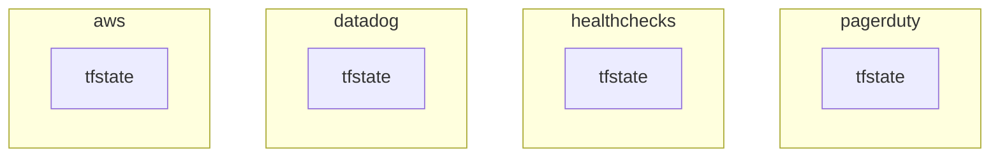
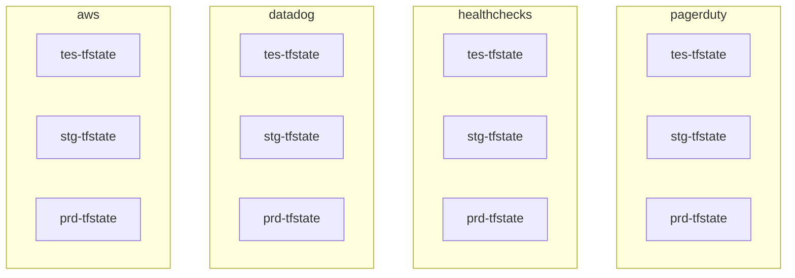
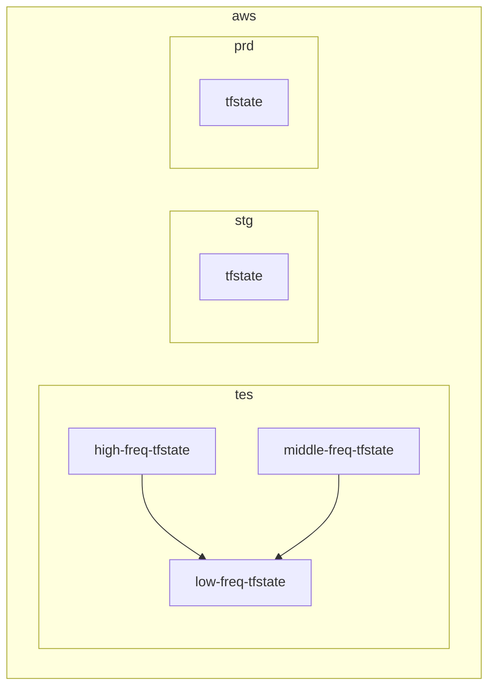
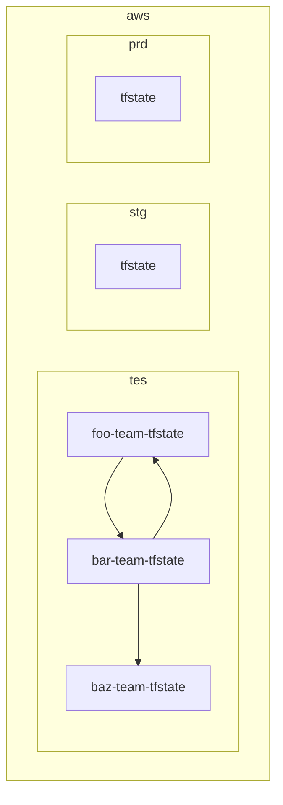
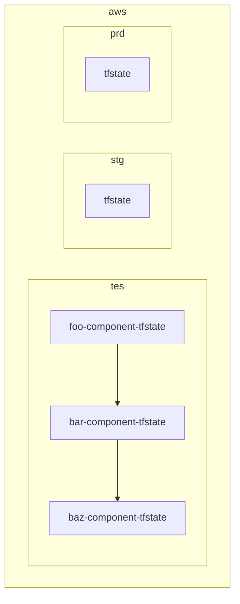

# `tfstate`ファイルの分割＠設計ポリシー

## はじめに

本サイトにつきまして、以下をご認識のほど宜しくお願いいたします。

> ↪️：https://hiroki-it.github.io/tech-notebook/

<br>

## 01. tfstateファイルの分割について

ディレクトリをゼロから設計する場合や、既存のディレクトリの設計ポリシーを察する場合に使っている見方を整理した。

本ノートで “依存” という言葉を使っているが、これはその対象 ”使用すること” を意味している。

アプリケーション開発の文脈で対象を “使用すること” を “依存” と表現するため、それに合わせている。

Terraformの`tfstate`ファイルの分割の境目を見つけるコツは、 他の状態にできるだけ依存しない (`terraform_remote_state`ブロックで他の`tfstate`ファイルを参照しない) リソースの関係に注目することである。

たまに遭遇する循環参照エラー (リソースが互いに依存し合う) も、この依存方向の設計ミスが原因です。

<br>

## 02 `.tfstate`ファイルを含むルートモジュールの分割

### `.tfstate`ファイルを含むルートモジュールの分割とは

#### ▼ メリット

`.tfstate`ファイルを分割することにより、以下のメリットがある。

- `terraform plan`コマンドや`terraform apply`コマンドをバックエンド間で独立させられ (同じバックエンド内で異なるディレクトリ配下に`tfstate`ファイルを配置している場合も含む) 、特定のバックエンドを変更しても他のバックエンドには差分として表示されない。
- `terraform plan`コマンドや`terraform apply`コマンドの実行時間を短縮できる。
- `terraform apply`コマンドの実行途中に問題が発生し、`.tfstate`ファイルが破損したとしても、影響範囲をその`.tfstate`ファイルのリソース内に閉じられる。
- リソースタイプが同じであっても、同じ名前を付けられる。
- 複数人が同時にTerraformの実装を修正する場合、異なる`.tfstate`ファイルの間では、誰かのプロビジョニングによって他の誰かのプロビジョニングを元に戻してしまうような、作業の衝突が起こらない。

> ↪️：https://qiita.com/yukihira1992/items/a674fe717a8ead7263e4

#### ▼ 方法

前提として、`terraform`ブロックから`backend`オプションを切り分け、`backend.tfvars`ファイルを作成する。

`backend.tfvars`ファイルでは、`.tfstate`ファイルのあるバックエンドを定義するとする。

１と２は必須であるが、３は状況 (例：プロダクトのフェーズ、システムの規模) によって読み手が選ぶようにする。

例ではディレクトリで分割しているが、基点ブランチで作業が衝突する可能性があることと、作業のわかりやすさから、リポジトリを分割した方がよさそうである。

`【１】`

: 最上層をクラウドプロバイダーで切る。

     クラウドプロバイダーに関して、例ではディレクトリで分割している。

     ただし、基点ブランチで作業が衝突する可能性があることと、作業のわかりやすさから、リポジトリを分割した方がよさそう。

`【２】`

: 最下層を実行環境別で切る。

`【３】`

: 中間層を以下のいずれかで切る。

     分割の粒度としては、可能な限りお互いのtfstateファイル間で依存がないほど、terraform planコマンド時に差分が混在しなくなるため、targetオプションの使用頻度が減ってよい。

     プロジェクトによっては、特に中間層ディレクトリで複数の設計ポリシーを組み合わせている場合があり、一つだけ採用されているとは限らないことに注意する。

     CloudFormationの分割プラクティスをTerraformにも適用する。

     - クラウドインフラのリソースの変更頻度
     - 運用チームの責務範囲
     - blast radius (影響範囲、障害範囲)
     - システムコンポーネント

     > ↪️：https://docs.aws.amazon.com/AWSCloudFormation/latest/UserGuide/best-practices.html#organizingstacks

#### ▼ ほかの`tfstate`ファイルに依存する場合

tfstateファイルを分割するということは、互いリソース値に依存しない想定である (はじめにの項目に記載がある通り)。

(例えば、AWSリソースのブロックがGoogleCloudリソースのブロックに依存することはない)

しかしtfstateファイルを分割したとしても、一方のtfstateファイルがもう一方に依存せざるを得ない場合がある。

tfstateファイルが他から独立している想定で分割しているので、あまり望ましくないが、他のtfstateファイルに依存する場合terraform_remote_stateブロックを使用する

```yaml
repository/
├── foo/
│   ├── backend.tf # バックエンド内の/foo/terraform.tfstate
│   ├── provider.tf
│   ...
│
├── bar/
│   ├── backend.tf # バックエンド内の/bar/terraform.tfstate
│   ├── data.tf # terraform_remote_stateブロックを使用し、fooのtfstateファイルに依存してもよい
│   ├── provider.tf
│   ...
│
...
```

```terraform
# 分割した異なるfooというtfstateファイルから取得する
data "terraform_remote_state" "foo" {
  backend = "s3"

  config = {
    bucket = "foo-tfstate"
    key    = "foo/terraform.tfstate"
    region = "ap-northeast-1"
  }
}
```

<br>

### 最上層ディレクトリ

#### ▼ クラウドプロバイダー別 (必須)

最上層ディレクトリはプロバイダー別にtfstateファイルとディレクトリを分割する。

tfstateファイルのコメントアウトは、バックエンド内のディレクトリ構成を示している。

`.tfstate`ファイルのコメントアウトは、バックエンド内のディレクトリ構成を示している。

プロバイダーが他プロバイダーのtfstateファイルに依存することはない想定なので、terraform_remote_stateブロックを使用せずに完全に分割できるはずである。



```yaml
repository/
├── aws/ # AWS
│   ├── backend.tf # バックエンド内の/aws/terraform.tfstate
│   ├── provider.tf
│   ...
│
├── datadog/ # Datadog
│   ├── backend.tf # バックエンド内の/datadog/terraform.tfstate
│   ├── provider.tf
│   ...
│
├── healthchecks/ # Healthchecks
│   ├── backend.tf # バックエンド内の/healthchecks/terraform.tfstate
│   ├── provider.tf
│   ...
│
└── pagerduty/ # PagerDuty
├── backend.tf
├── provider.tf
...
```

<br>

### 最下層ディレクトリ

#### ▼ 実行環境別 (必須)

実行環境別にtfstateファイルとディレクトリを分割する。

tfstateファイルのコメントアウトは、バックエンド内のディレクトリ構成を示している。

実行環境が他実行環境のtfstateファイルに依存することはない想定なので、terraform_remote_stateブロックを使用せずに完全に分割できるはずである。



```yaml
repository/
├── aws/ # AWS
│   ├── provider.tf
│   ├── tes/ # テスト環境
│   │   ├── backend.tfvars # バックエンド内のaws/terraform.tfstate
│   │   ...
│   │
│   ├── stg/ # ステージング環境
│   └── prd/ # 本番環境
│
├── datadog/ # Datadog
│   ├── provider.tf
│   ├── tes/ # テスト環境
│   ├── stg/ # ステージング環境
│   └── prd/ # 本番環境
│
├── healthchecks/ # Healthchecks
│   ├── provider.tf
│   ├── tes/ # テスト環境
│   ├── stg/ # ステージング環境
│   └── prd/ # 本番環
│
└── pagerduty/ # PagerDuty
├── provider.tf
├── tes/ # テスト環境
├── stg/ # ステージング環境
└── prd/ # 本番環境
```

<br>

### 中間層ディレクトリ

#### ▼ 分割の目安

CloudFormationでは、クラウドインフラのリソースの実装変更頻度、運用チームの責務範囲、blast-radius、システムコンポーネント、などを状態管理の単位とすることが推奨されており、Terraformでのコンポーネント分割でもこれを真似すると良い。

これらの観点の分割が混在してしまうと可読性が悪くなるため、個人的にはいずれかの観点に統一した方が良い。

> ↪️：
>
> - https://zoo200.net/terraform-tutorial-module-and-directory/
> - https://docs.aws.amazon.com/AWSCloudFormation/latest/UserGuide/best-practices.html#organizingstacks
> - https://zenn.dev/hajimeni/articles/e17b9808e0e82e

#### ▼ クラウドインフラのリソースの変更頻度

インフラリソースの設定値をどの程度の頻度で変更するか別にtfstateファイルとディレクトリを分割する。

tfstateファイルのコメントアウトは、バックエンド内のディレクトリ構成を示している。

頻度別のディレクトリの名前は一例であり、任意である。

> ↪️：
>
> - https://towardsdatascience.com/data-quality-dataops-and-the-trust-blast-radius-4b0e9556bbda
> - https://qiita.com/yukihira1992/items/a674fe717a8ead7263e4



```yaml
repository/
├── aws/ # AWS
│   ├── high-freq # 高頻度リソース（サーバー系、コンテナ系、セキュリティ系、監視系など）
│   │   ├── provider.tf
│   │   ├── tes # テスト環境
│   │   │   ├── backend.tfvars # バックエンド内のaws/terraform.tfstateaws/high-freq/terraform.tfstate
│   │   │   ├── data.tf # terraform_remote_stateブロックを使用し、low-freqのtfstateファイルに依存してもよい
│   │   │   ...
│   │   │
│   │   ├── stg # ステージング環境
│   │   │   ├── backend.tfvars # バックエンド内のaws/low-freq/terraform.tfstate
│   │   │   ├── data.tf # terraform_remote_stateブロックを使用し、low-freqのtfstateファイルに依存してもよい
│   │   │   ...
│   │   │
│   │   └── prd # 本番環境
│   │       ├── backend.tfvars # バックエンド内のaws/middle-freq/terraform.tfstate
│   │   │   ├── data.tf # terraform_remote_stateブロックを使用し、low-freqのtfstateファイルに依存してもよい
│   │       ...
│   │
│   ├── low-freq # 低頻度リソース（ネットワーク系、ストレージ系、など）
│   │   ├── provider.tf
│   │   ├── tes
│   │   │   ├── backend.tfvars
│   │   │   ...
│   │   │
│   │   ├── stg
│   │   │   ├── backend.tfvars
│   │   │   ...
│   │   │
│   │   └── prd
│   │       ├── backend.tfvars
│   │       ...
│   │
│   └── middle-freq # 中頻度リソース（高頻度とも低頻度とも言えないリソース）
│       ├── provider.tf
│       ├── tes
│       │   ├── backend.tfvars
│       │   ├── data.tf # terraform_remote_stateブロックを使用し、low-freqのtfstateファイルに依存してもよい
│       │   ...
│       │
│       ├── stg
│       │   ├── backend.tfvars
│       │   ├── data.tf # terraform_remote_stateブロックを使用し、low-freqのtfstateファイルに依存してもよい
│       │   ...
│       │
│       └── prd
│           ├── backend.tfvars
│           ├── data.tf # terraform_remote_stateブロックを使用し、low-freqのtfstateファイルに依存してもよい
│           ...
│
├── datadog/ # Datadog
├── healthchecks/ # Healthchecks
└── pagerduty/ # PagerDuty
```

#### ▼ 運用チームの責務範囲

運用チームの責務範囲を分割の粒度とする。バックエンド（例：AWS S3、GCP GCS、など）のポリシー（例：IAM、バケットポリシー、など）で認可スコープを制御する。

tfstateファイルのコメントアウトは、バックエンド内のディレクトリ構成を示している。

チーム別のディレクトリの名前は一例であり、任意である。



```yaml
repository/
├── aws/ # AWS
│   ├── foo-team # fooチーム
│   │   ├── provider.tf
│   │   ├── tes # テスト環境
│   │   │   ├── backend.tfvars # バックエンド内の/aws/foo-team/terraform.tfstate
│   │   │   ├── data.tf # terraform_remote_stateブロックを使用し、bar-teamのtfstateファイルに依存してもよい
│   │   │   ...
│   │   │
│   │   ├── stg # ステージング環境
│   │   │   ├── backend.tfvars # バックエンド内の/aws/bar-team/terraform.tfstate
│   │   │   ├── data.tf # terraform_remote_stateブロックを使用し、bar-teamのtfstateファイルに依存してもよい
│   │   │   ...
│   │   │
│   │   └── prd # 本番環境
│   │       ├── backend.tfvars # バックエンド内の/aws/baz-team/terraform.tfstate
│   │       ├── data.tf # terraform_remote_stateブロックを使用し、bar-teamのtfstateファイルに依存してもよい
│   │       ...
│   │
│   ├── bar-team # barチーム
│   │   ├── provider.tf
│   │   ├── tes
│   │   │   ├── backend.tfvars
│   │   │   ├── data.tf # terraform_remote_stateブロックを使用し、foo-teamのtfstateファイルに依存してもよい
│   │   │   ...
│   │   │
│   │   ├── stg
│   │   │   ├── backend.tfvars
│   │   │   ├── data.tf # terraform_remote_stateブロックを使用し、foo-teamのtfstateファイルに依存してもよい
│   │   │   ...
│   │   │
│   │   └── prd
│   │       ├── backend.tfvars
│   │       ├── data.tf # terraform_remote_stateブロックを使用し、foo-teamのtfstateファイルに依存してもよい
│   │       ...
│   │
│   └── baz-team # bazチーム
│       ├── provider.tf
│       ├── tes
│       │   ├── backend.tfvars
│       │   ...
│       │
│       ├── stg
│       │   ├── backend.tfvars
│       │   ...
│       │
│       └── prd
│           ├── backend.tfvars
│           ...
│
├── datadog/ # Datadog
├── healthchecks/ # Healthchecks
└── pagerduty/ # PagerDuty
```

#### ▼ システムコンポーネント

blast radius、システムコンポーネント（システムの規模、プロダクトのフェーズ、による）別にtfstateファイルとディレクトリを分割する。

番号をつけて、依存関係の方向を明示するなどもあり。

tfstateファイルのコメントアウトは、バックエンド内のディレクトリ構成を示している。

ディレクトリの名前は一例であり、任意である。

より上位コンポーネントが土台の下位コンポーネントに依存することがあり、上位コンポーネントがterraform_remote_stateブロックを使用する可能性がある



```yaml
repository/
├── aws/ # AWS
│   ├── 01-foo/
│   │   ├── provider.tf
│   │   ├── tes # テスト環境
│   │   │   ├── backend.tfvars # バックエンド内の/aws/foo-team/terraform.tfstate
│   │   │   ...
│   │   │
│   │   ├── stg # ステージング環境
│   │   │   ├── backend.tfvars # バックエンド内の/aws/bar-team/terraform.tfstate
│   │   │   ...
│   │   │
│   │   └── prd # 本番環境
│   │       ├── backend.tfvars # バックエンド内の/aws/baz-team/terraform.tfstate
│   │       ...
│   │
│   ├── 02-bar/
│   ├── 03-baz/
│   ├── 04-qux/
│   ├── 05-quux/
│   └── 06-corge/
│
├── datadog/ # Datadog
├── healthchecks/
└── pagerduty/
```

コンポーネントとしては、例えば以下の分け方がある。

| 分け方    | 例                                                 |
| --------- | -------------------------------------------------- |
| 領域      | `network`、`database`、`k8s_cluster`、`monotoring` |
| 記入中... | 記入中...                                          |

> ↪️：https://sreake.com/blog/terraform-state-structure/

<br>

## 03. モノリスな`tfstate`ファイルを分割する

モノリスな`tfstate`ファイルとは、例えば特定のAWSアカウント内のAWSリソースを全て一つの`tfstate`ファイルで管理している場合である。

AWSリソース値を参照しない関係であれば、これらは別の`tfstate`ファイルに分割できる。

`【１】`

: 既存のバックエンド内に新しいディレクトリを作成し、その配下に`tfstate`ファイルを新しく作成する。

     ここでは、サブシステムを分割するとする。

```yaml
repository/
├── foo/
│   ├── backend.tf # バックエンド内の/foo/terraform.tfstate
│   ├── provider.tf
│   ...
│
├── bar/
│   ├── backend.tf # バックエンド内の/bar/terraform.tfstate
│   ├── data.tfvars # terraform_remote_stateブロックを使用し、fooのtfstateファイルに依存してもよい
│   ├── provider.tf
│   ...
│
...
```

```terraform
terraform {
  backend "s3" {
    bucket = "foo-tfstate"
    key    = "foo-sub-system/terraform.tfstate"
    region = "ap-northeast-1"
  }
}
```

`【２】`

: bar側では、foo側の`tfstate`ファイルからリソース値を取得しつつ、

```terraform
# 分割した異なるfooというtfstateファイルから取得する
data "terraform_remote_state" "foo" {
  backend = "s3"

  config = {
    bucket = "foo-tfstate"
    key    = "foo/terraform.tfstate"
    region = "ap-northeast-1"
  }
}
```

`【３】`

: 新しい`tfstate`ファイルに、既存のサブシステムの状態をインポートする。

     事前に、バックエンドを新しいサブシステムの`tfstate`ファイルに切り替える。

```bash
$ terraform init -reconfigure -backend-config=foo-sub-backend.tfvars
$ terraform import
```

`【４】`

: サブシステムの`tfstate`ファイルで差分がないことを確認する。

```bash
$ terraform init -reconfigure -backend-config=foo-sub-backend.tfvars
$ terraform plan
```

`【５】`

: モノリスな`tfstate`ファイルから、サブシステムの状態を削除する。

     事前に、バックエンドをモノリスな`tfstate`ファイルに切り替える。

```bash
$ terraform init -reconfigure -backend-config=foo-backend.tfvars
$ terraform state rm <サブシステムの状態>
```

<br>
