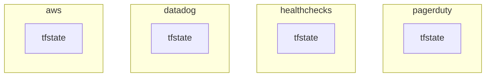
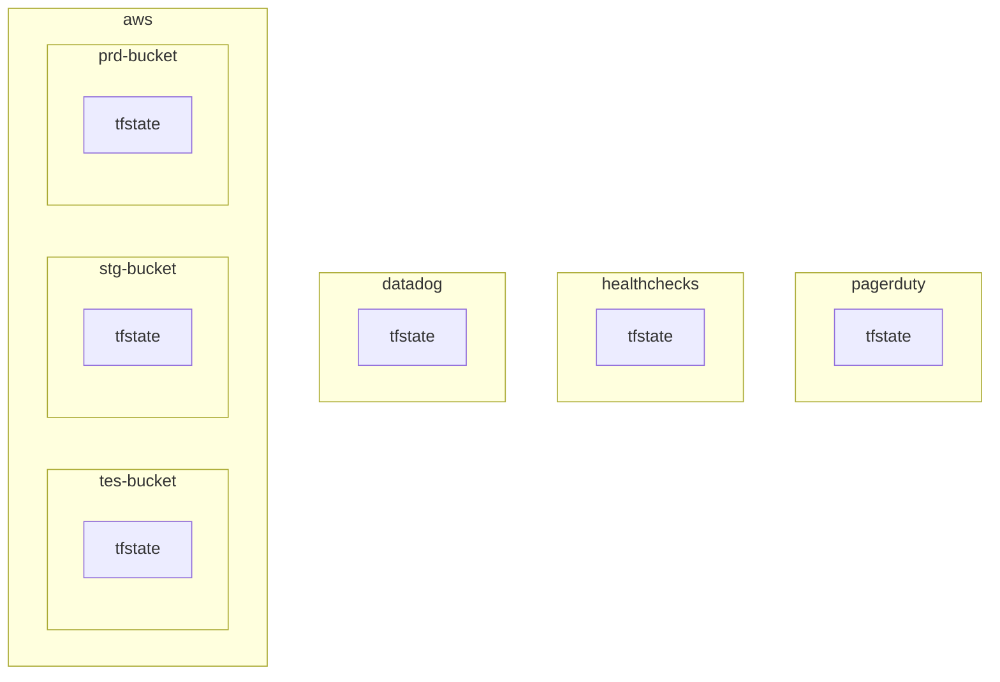
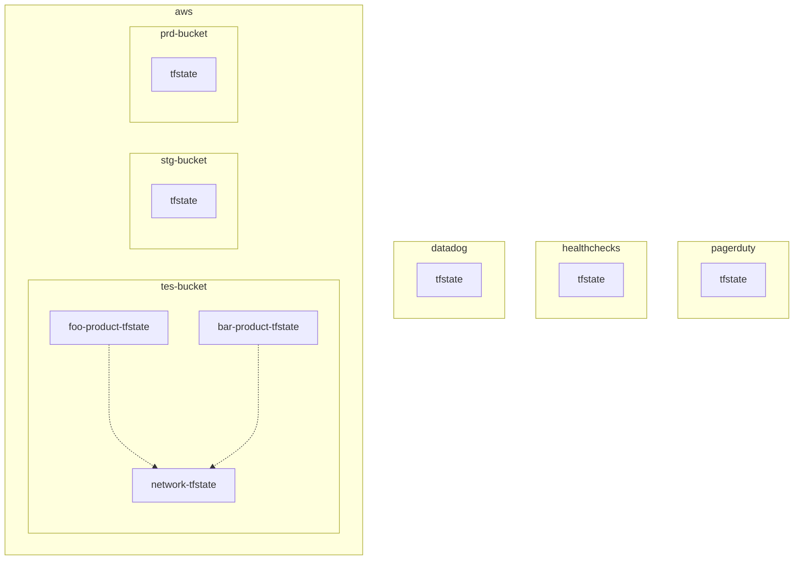
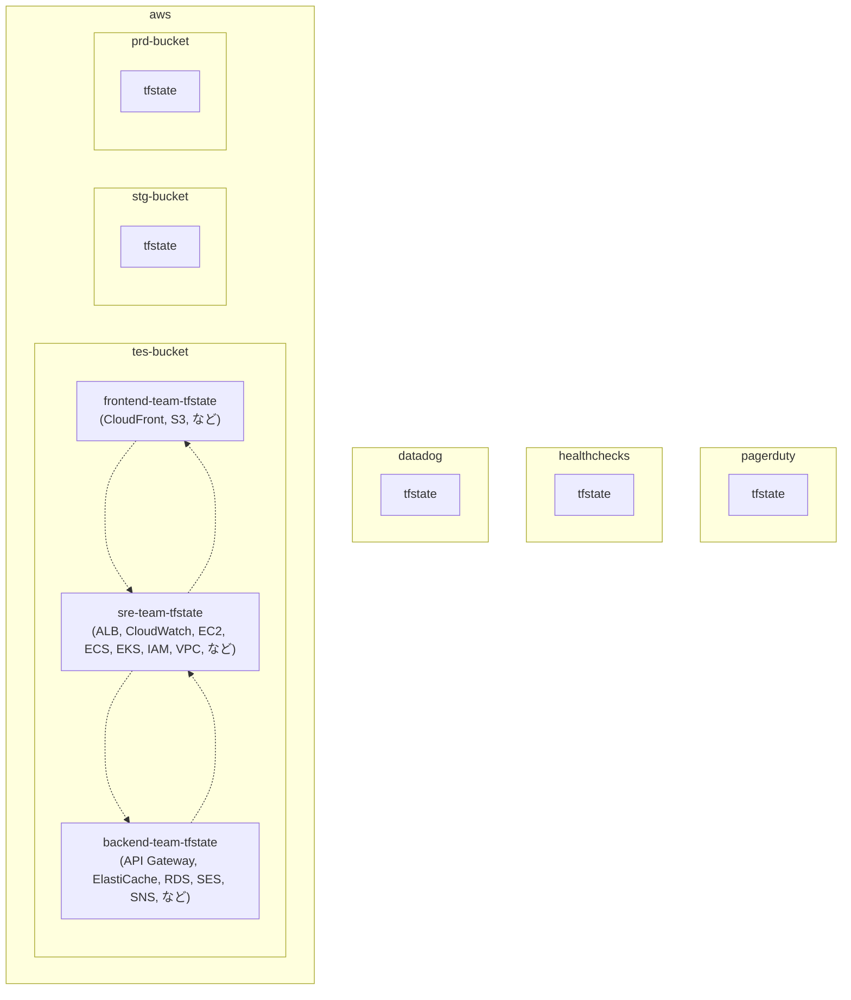
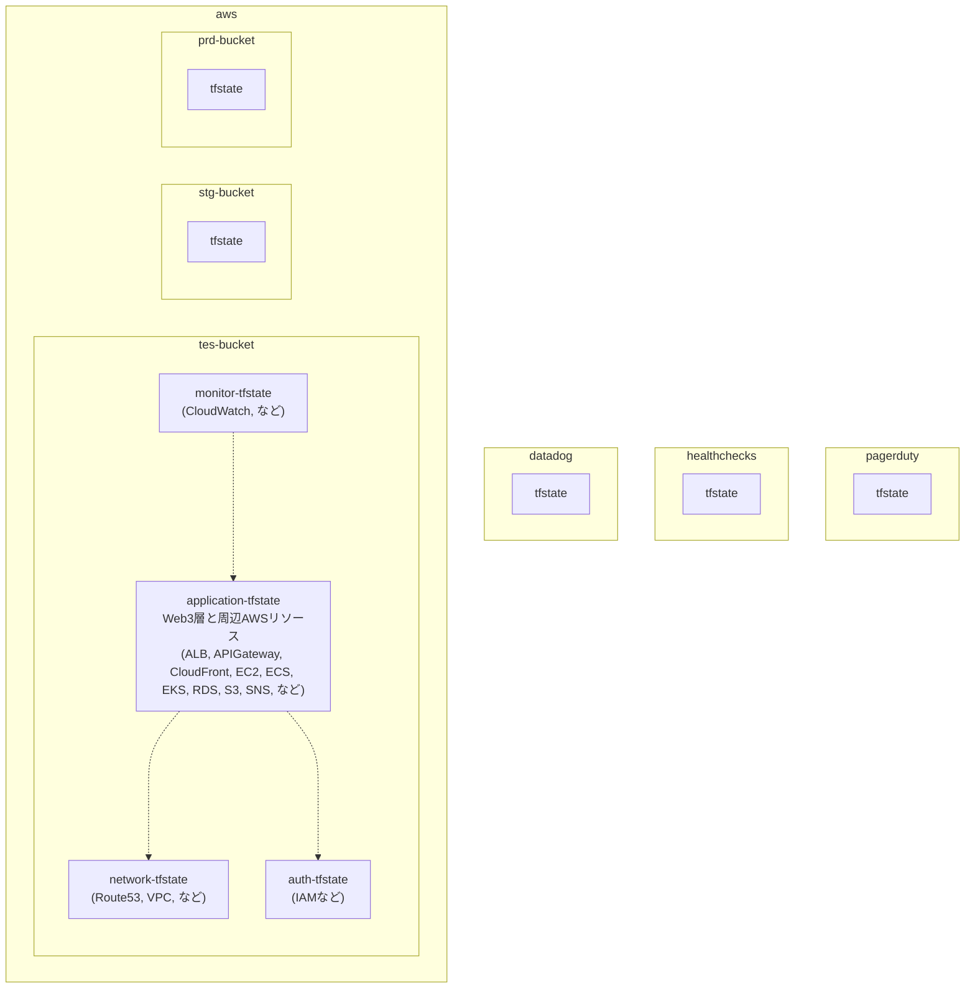
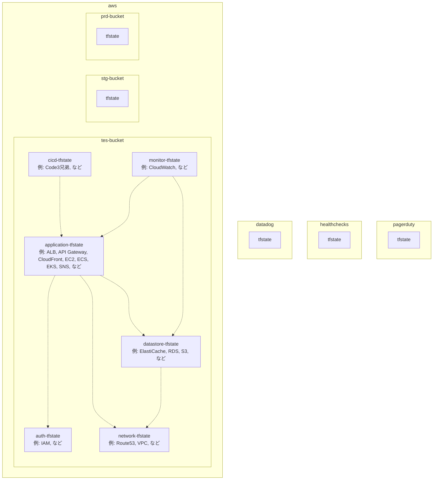
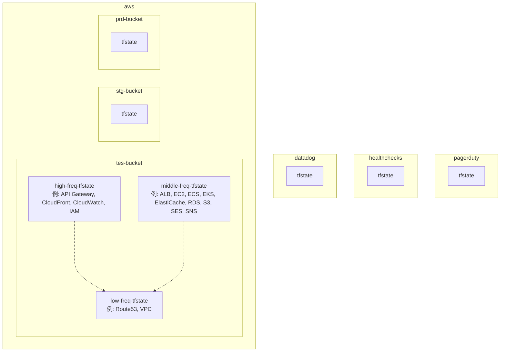
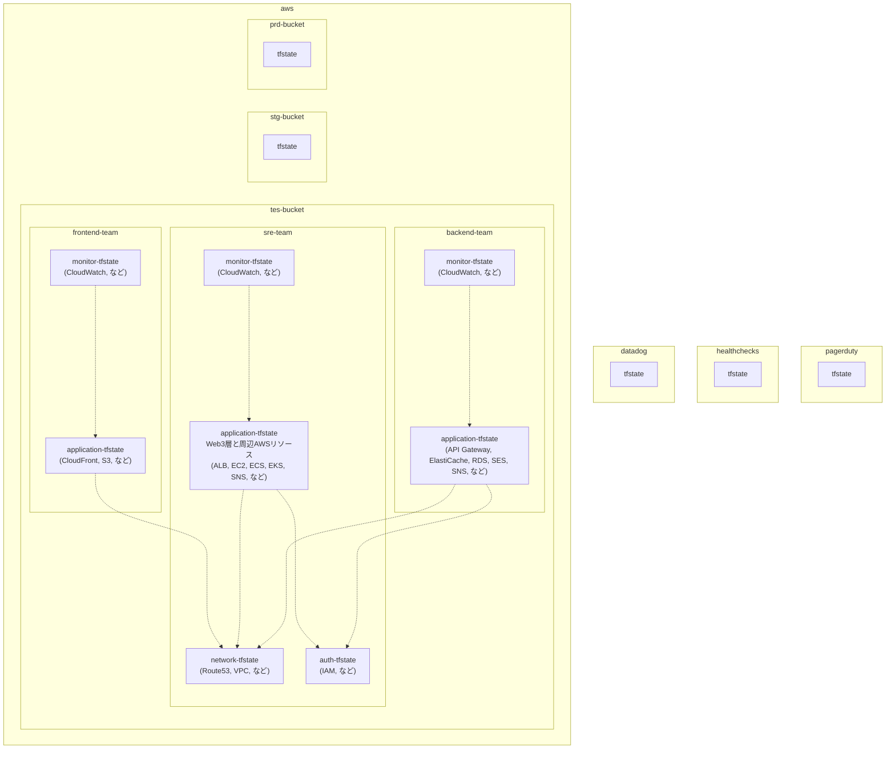

# `tfstate`ファイルの分割＠設計規約

## はじめに

本サイトにつきまして、以下をご認識のほど宜しくお願いいたします。

> - https://hiroki-it.github.io/tech-notebook/

<br>

## 01. `tfstate`ファイルの分割について

一つのバケット内でtfstateファイルをいい感じに分割し、適切な依存関係にしたい…？

その夢、叶えます。

ディレクトリをゼロから設計する場合や、既存のディレクトリの設計規約を察する場合に使っている見方を整理した。

Terraformのディレクトリ構成は新興宗教で、あくまで以下は私の宗派である (他の人にとっては邪教かも) 。

**本資料で “依存” という言葉を使っていますが、これはその対象 ”使用すること” を意味している。**

アプリケーション開発の文脈で対象を “使用すること” を “依存” と表現するため、それに合わせている。

Terraformに限らずアプリケーションでも注意が必要ですが、例えば循環参照エラーは相互依存が原因である。

<br>

## 02. `tfstate`ファイル分割を含むディレクトリ構成

まず、Terraformのディレクトリ構成は`tfstate`ファイルの粒度に合わせること。

ディレクトリを分割しているのに、各ディレクトリ配下で使う`tfstate`ファイルが同じであると、ディレクトリを分割する旨みがなさそう。

そしてTerraformの`tfstate`ファイルの分割の境目を見つけるコツは、

“**他の状態にできるだけ依存しない (`terraform_remote_state`ブロックや`data`ブロックで他の`tfstate`ファイルを参照しない) リソースの関係”**

に注目することである。

ここでは、観測範囲内で境目の例を挙げているだけで、実際の現場では依存せざるを得ない状況があるかもしれない。

`tfstate`ファイルを分割するだけではダメで、`tfstate`ファイル間の依存方向図を書きながら設計することをお勧めする。

<br>

### 手順

前提として、`terraform`ブロックから`backend`オプションを切り分け、`backend.tfvars`ファイルを作成する。

`backend.tfvars`ファイルでは、`tfstate`ファイルのあるバックエンドを定義するとする。

1と2は必須であるが、3は状況（例：プロダクトのフェーズ、システムの規模）によって読み手が選ぶようにする。

1. 最上層をクラウドプロバイダーのアカウントで分割する。
2. 最下層を実行環境別で分割する。
3. 中間層を以下のいずれか / 組み合わせで分割する。

<br>

### 中間層について

中間層の分割方法が一番難しい。

- 同じテナント内のプロダクト別
- 運用チーム責務範囲別
- プロダクトのサブコンポーネント別
- AWSリソースの種類別
- AWSリソースの状態の変更頻度別
- blast radius（影響範囲、障害範囲）
- 上記の組み合わせ

プロジェクトによっては、特に中間層ディレクトリで複数の設計規約を組み合わせている場合があり、一つだけ採用されているとは限らないことに注意する。

中間層の切り方でおそらく一番現実的なのが、以下のいずれかである。

- 運用チーム責務範囲別
- プロダクトのサブコンポーネント別
- 上記の組み合わせ

<br>

### ほかの`tfstate`ファイルから状態を参照する方法

#### ▼ 観点

`tfstate`ファイルを分割するということは、互いのAWSリソース値に依存しない想定である (**はじめにの項目に記載がある通り**) 。

例えば、AWSリソースのブロックがGoogleCloudリソースのブロックに依存することはない。

しかし`tfstate`ファイルを分割したとしても、一方の`tfstate`ファイルがもう一方に依存せざるを得ない場合がある。

`tfstate`ファイルが他から独立している想定で分割しているので、あまり望ましくないが、依存先の`tfstate`ファイルから状態を参照するような定義が必要になる。

#### ▼ `terraform_remote_state`ブロックを使用する場合

`terraform_remote_state`ブロックを使用する場合、以下のメリットがある。

- 依存先のAWSリソースに関わらず、同じ`terraform_remote_state`ブロックを使い回すことができる

一方で、以下のデメリットがある。

- 別途`output`ブロックの定義が必要になり、可読性が低くなる。
- 依存先と依存元の間でTerraformのバージョンに差がありすぎると、`tfstate`ファイル間で互換性がなくなり、`terraform_remote_state`ブロックで状態を参照できない場合がある。

今回は、状態参照の一般的な方法であるこちらで話を進める。

```terraform
# VPCの状態は、fooのtfstateファイルで管理している
data "terraform_remote_state" "foo" {

  backend = "s3"

  config = {
    bucket = "foo-tfstate"
    key    = "foo/terraform.tfstate"
    region = "ap-northeast-1"
  }
}
```

```terraform
# barリソースは、fooのtfstateとは異なるbarのtfstateで管理している
# barのtfstateは、fooのtfstateに依存していると考えることができる
resource "example" "bar" {
  vpc_id     = data.terraform_remote_state.foo.outputs.vpc_id
  subnet_ids = data.terraform_remote_state.foo.outputs.vpc_private_subnet_ids
}
```

```yaml
repository/
├── foo/
│   ├── backend.tf # バックエンド内の/foo/terraform.tfstate
│   ├── output.tf # 他の他のtfstateファイルを参照できるように、outputブロックを定義する
│   ├── provider.tf
│   ...
│
├── bar/
│   ├── backend.tf # バックエンド内の/bar/terraform.tfstate
│   ├── remote_state.tf # terraform_remote_stateブロックを使用し、fooのtfstateファイルから状態を参照する
│   ├── resource.tf # fooのtfstateファイルから参照した状態を使用する
│   ├── provider.tf
│   ...
│
...
```

#### ▼ `data`ブロックを使用する場合

`data`ブロックを使用する場合、以下のメリットがある。

- `output`ブロックが不要で可読性が高い。
- `data`ブロックは、`tfstate`ファイルが自身以外 (例：コンソール画面) で作成されたAWSリソースの状態を参照するために使用でき、異なる`tfstate`ファイルから状態を参照することにも使用できる。

一方で以下のデメリットがある。

- 依存先のAWSリソースごとにdataブロックを定義する必要がある。

今回は`data`ブロックでは話を進めないが、こちらの方法で採用しても “他の`tfstate`ファイルに依存する” という考え方は同じである。

```terraform
# VPCの状態は、fooのtfstateファイルで管理している
data "aws_vpc" "foo" {

filter {
name   = "tag:Name"
values = ["<異なるtfstateファイルで管理しているVPCの名前>"]
}
}

data "aws_subnet" "foo_private" {

filter {
name   = "vpc-id"
values = [data.aws_vpc.foo.id]
}

filter {
name = "tag:Name"
values = ["<異なるtfstateファイルで管理しているVPCのプライベートサブネットの名前>"]
}
}
```

```terraform
# barリソースは、fooのtfstateとは異なるbarのtfstateで管理している
# barのtfstateは、fooのtfstateに依存していると考えることができる
resource "example" "bar" {
   vpc_id     = data.aws_vpc.foo.id
   subnet_ids = data.aws_subnet.foo_private.ids
}
```

```yaml
repository/
├── foo/
│   ├── backend.tf # バックエンド内の/foo/terraform.tfstate
│   ├── provider.tf
│   ...
│
├── bar/
│   ├── backend.tf # バックエンド内の/bar/terraform.tfstate
│   ├── data.tf # dataブロックを使用し、fooのtfstateファイルから状態を参照する
│   ├── resource.tf # fooのtfstateファイルから参照した状態を使用する
│   ├── provider.tf
│   ...
│
...
```

<br>

### 最上層ディレクトリ

#### ▼ クラウドプロバイダーのアカウント

最上層ディレクトリはプロバイダーのアカウント別で`tfstate`ファイルを含むディレクトリを分割する。

この場合は、ディレクトリではなくリポジトリ自体を別にしてしまっても良い。

**プロバイダーが他プロバイダーの`tfstate`ファイルに依存することはない想定なので、`terraform_remote_state`ブロックを使用せずに完全に分割できるはずである。**



`tfstate`ファイルのコメントアウトは、バックエンド内のディレクトリ構成を示している。

(例)

分割した`tfstate`ファイルを同じリポジトリで管理する場合

```yaml

repository/
├── aws/
│   ├── backend.tf # aws用バックエンド内のterraform.tfstate
│   ├── provider.tf
│   ...
│
├── datadog/
│   ├── backend.tf # datadog用バックエンド内のterraform.tfstate
│   ├── provider.tf
│   ...
│
├── healthchecks/
│   ├── backend.tf # healthchecks用バックエンド内のterraform.tfstate
│   ├── provider.tf
│   ...
│
└── pagerduty/
    ├── backend.tf # pagerduty用バックエンド内のterraform.tfstate
    ├── provider.tf
    ...
```

(例)

分割した`tfstate`ファイルを異なるリポジトリで管理する場合

```yaml
aws-repository/
├── backend.tf # aws用バックエンド内のterraform.tfstate
├── provider.tf
...
```

```yaml
datadog-repository/
├── backend.tf # datadog用バックエンド内のterraform.tfstate
├── provider.tf
...
```

```yaml
healthchecks-repository/
├── backend.tf # healthchecks用バックエンド内のterraform.tfstate
├── provider.tf
...
```

```yaml
pagerduty-repository/
├── backend.tf # pagerduty用バックエンド内のterraform.tfstate
├── provider.tf
...
```

<br>

### 最下層ディレクトリ

#### ▼ 実行環境別

実行環境別で`tfstate`ファイルを含むディレクトリを分割する。

この場合は、リポジトリ自体は分割しない。

**実行環境が他実行環境の`tfstate`ファイルに依存することはない想定なので、`terraform_remote_state`ブロックを使用せずに完全に分割できるはずである。**



`tfstate`ファイルのコメントアウトは、バックエンド内のディレクトリ構成を示している。

なお、クラウドプロバイダーはリポジトリで分割した前提とする。

```yaml

aws-repository/
├── provider.tf
├── tes/ # テスト環境
│   ├── backend.tfvars # aws用バックエンド内のterraform.tfstate
│   ...
│
├── stg/ # ステージング環境
└── prd/ # 本番環境
```

```yaml
datadog-repository/
├── provider.tf
├── tes/ # テスト環境
├── stg/ # ステージング環境
└── prd/ # 本番環境

```

```yaml
healthchecks-repository/
├── provider.tf
├── tes/ # テスト環境
├── stg/ # ステージング環境
└── prd/ # 本番環
```

```yaml
pagerduty-repository/
├── provider.tf
├── tes/ # テスト環境
├── stg/ # ステージング環境
└── prd/ # 本番環境
```

<br>

### 中間層ディレクトリ

#### ▼ 同じテナントのプロダクト別

この場合は、ディレクトリではなくリポジトリ自体を別にしてしまっても良い。

同じテナント (例：同じAWSアカウントの同じVPC) 内に複数のプロダクトがある場合に、プロダクト別でディレクトリを分割する。

ここでいうプロダクトの粒度は、アプリを動かす EKS/ECS/AppRunner/EC2 とそれを取り巻くAWSリソースである。

そもそも、プロダクトごとにVPCを分けるべきとは思っているが、実際にそういう構成に遭遇したので…😭

**各プロダクトのtfstateファイルが共有コンポーネント (例：VPC) のそれに依存し、前者が`terraform_remote_state`ブロックを使用する可能性がある**

(例)

- 共有のnetwork系コンポーネント (例：VPC、Route53)
- foo-product
- bar-product

があるとする。

依存方向は矢印の通り。



この場合のディレクトリ構成例は以下の通りである。

`tfstate`ファイルのコメントアウトは、バックエンド内のディレクトリ構成を示している。

なお、クラウドプロバイダーはリポジトリで分割した前提とする。

(例)

分割した各`tfstate`ファイルを同じリポジトリで管理する場合

```yaml

aws-repository/
├── foo-product/
│   ├── provider.tf
│   ├── tes # テスト環境
│   │   ├── backend.tfvars # tes用バックエンド内の/foo-product/terraform.tfstate
│   │   ...
│   │
│   ├── stg # ステージング環境
│   │   ├── backend.tfvars # stg用バックエンド内の/foo-product/terraform.tfstate
│   │   ...
│   │
│   └── prd # 本番環境
│       ├── backend.tfvars # prd用バックエンド内の/foo-product/terraform.tfstate
│       ...
│
├── bar-product/
│   ├── provider.tf
│   ├── tes # テスト環境
│   │   ├── backend.tfvars # tes用バックエンド内の/bar-product/terraform.tfstate
│   │   ...
│   │
│   ├── stg # ステージング環境
│   │   ├── backend.tfvars # stg用バックエンド内の/bar-product/terraform.tfstate
│   │   ...
│   │
│   └── prd # 本番環境
│       ├── backend.tfvars # prd用バックエンド内の/bar-product/terraform.tfstate
│       ...
│
└── network
    ├── provider.tf
    ├── output.tf # 他のtfstateファイルを参照できるように、outputブロックを定義する
    ├── route53.tf
    ├── vpc.tf
    ├── tes # テスト環境
    │   ├── backend.tfvars # tes用バックエンド内の/network/terraform.tfstate
    │   ...
    │
    ├── stg # ステージング環境
    │   ├── backend.tfvars # stg用バックエンド内の/network/terraform.tfstate
    │   ...
    │
    └── prd # 本番環境
        ├── backend.tfvars # prd用バックエンド内の/network/terraform.tfstate
        ...

```

(例)

分割した各`tfstate`ファイルを異なるリポジトリで管理する場合

```yaml
aws-foo-product-repository/
├── provider.tf
├── tes # テスト環境
│   ├── backend.tfvars # tes用バックエンド内の/foo-product/terraform.tfstate
│   ...
│
├── stg # ステージング環境
│   ├── backend.tfvars # stg用バックエンド内の/foo-product/terraform.tfstate
│   ...
│
└── prd # 本番環境
    ├── backend.tfvars # prd用バックエンド内の/foo-product/terraform.tfstate
    ...
```

```yaml
aws-bar-product-repository/
├── provider.tf
├── tes # テスト環境
│   ├── backend.tfvars # tes用バックエンド内の/bar-product/terraform.tfstate
│   ...
│
├── stg # ステージング環境
│   ├── backend.tfvars # stg用バックエンド内の/bar-product/terraform.tfstate
│   ...
│
└── prd # 本番環境
    ├── backend.tfvars # prd用バックエンド内の/bar-product/terraform.tfstate
       ...
```

```yaml
aws-network-repository
├── provider.tf
├── output.tf # 他のtfstateファイルを参照できるように、outputブロックを定義する
├── route53.tf
├── vpc.tf
├── tes # テスト環境
│   ├── backend.tfvars # tes用バックエンド内の/network/terraform.tfstate
│   ...
│
├── stg # ステージング環境
│   ├── backend.tfvars # stg用バックエンド内の/network/terraform.tfstate
│   ...
│
└── prd # 本番環境
    ├── backend.tfvars # prd用バックエンド内の/network/terraform.tfstate
    ...
```

また、S3バケット内のディレクトリ構成は以下の通りになるはずである。

```yaml
# AWSのtes用バケットの場合
tes-bucket/
├── foo-product
│   └── terraform.tfstate
│
├── bar-product
│   └── terraform.tfstate
│
└── network
└── terraform.tfstate
```

#### ▼ 運用チーム責務範囲別

運用チームのAWSリソースの責務範囲別でディレクトリを分割する。

これは、インフラ寄りのチームに依頼することなく、アプリ寄りのチームが自律的にAWSリソースを変更できるようにするため分割する。

この場合は、ディレクトリではなくリポジトリ自体を別にしてしまっても良い。

この時、バックエンド（例：AWS S3、GCP GCS、など）のポリシー（例：IAM、バケットポリシー、など）で認可スコープを制御する。

**それぞれの他のtfstateファイルを相互依存し、各運用チームが`terraform_remote_state`ブロックを使用する可能性がある**

(例)

以下のコンポーネントがあるとする。

- frontendチーム
- backendチーム
- sreチーム

依存方向は矢印の通り。

各チームがいずれのAWSリソースを管理するかによるが、依存関係が一方向にならない可能性がある。

**これは、後述の “プロダクトのサブコンポーネント別との組み合わせ” で解消できる可能性がある。**



この場合のディレクトリ構成例は以下の通りである。

`tfstate`ファイルのコメントアウトは、バックエンド内のディレクトリ構成を示している。

なお、クラウドプロバイダーはリポジトリで分割した前提とする。

(例)

分割した各`tfstate`ファイルを同じリポジトリで管理する場合

```yaml

aws-repository/
├── frontend-team # frontendチーム
│   ├── provider.tf
│   ├── output.tf # 他のtfstateファイルを参照できるように、outputブロックを定義する
│   ├── cloudfront.tf
│   ├── s3.tf
│   ├── tes # テスト環境
│   │   ├── backend.tfvars # tes用バックエンド内の/frontend-team/terraform.tfstate
│   │   ├── remote_state.tf # terraform_remote_stateブロックを使用し、backend-teamとsre-teamのtfstateファイルに依存している
│   │   ...
│   │
│   ├── stg # ステージング環境
│   │   ├── backend.tfvars # stg用バックエンド内の/frontend-team/terraform.tfstate
│   │   ├── remote_state.tf # terraform_remote_stateブロックを使用し、backend-teamとsre-teamのtfstateファイルに依存している
│   │   ...
│   │
│   └── prd # 本番環境
│       ├── backend.tfvars # prd用バックエンド内の/frontend-team/terraform.tfstate
│       ├── remote_state.tf # terraform_remote_stateブロックを使用し、backend-teamとsre-teamのtfstateファイルに依存している
│       ...
│
├── backend-team # backendチーム
│   ├── provider.tf
│   ├── output.tf # 他のtfstateファイルを参照できるように、outputブロックを定義する
│   ├── elasticache.tf
│   ├── ses.tf
│   ├── sns.tf
│   ├── rds.tf
│   ├── tes
│   │   ├── backend.tfvars # tes用バックエンド内の/backend-team/terraform.tfstate
│   │   ├── remote_state.tf # terraform_remote_stateブロックを使用し、frontend-teamとsre-teamのtfstateファイルに依存している
│   │   ...
│   │
│   ├── stg
│   │   ├── backend.tfvars # stg用バックエンド内の/backend-team/terraform.tfstate
│   │   ├── remote_state.tf # terraform_remote_stateブロックを使用し、frontend-teamとsre-teamのtfstateファイルに依存している
│   │   ...
│   │
│   └── prd
│       ├── backend.tfvars # prd用バックエンド内の/backend-team/terraform.tfstate
│       ├── remote_state.tf # terraform_remote_stateブロックを使用し、frontend-teamとsre-teamのtfstateファイルに依存している
│       ...
│
└── sre-team # sreチーム
    ├── provider.tf
    ├── output.tf # 他のtfstateファイルを参照できるように、outputブロックを定義する
    ├── alb.tf
    ├── cloudwatch.tf
    ├── ec2.tf
    ├── ecs.tf
    ├── eks.tf
    ├── iam.tf
    ├── vpc.tf
    ├── tes
    │   ├── backend.tfvars # tes用バックエンド内の/sre-team/terraform.tfstate
    │   ...
    │
    ├── stg
    │   ├── backend.tfvars # stg用バックエンド内の/sre-team/terraform.tfstate
    │   ...
    │
    └── prd
        ├── backend.tfvars # prd用バックエンド内の/sre-team/terraform.tfstate
        ...
```

(例)

分割した各`tfstate`ファイルを異なるリポジトリで管理する場合

```yaml
aws-frontend-team-repository/ # frontendチーム
├── provider.tf
├── output.tf # 他のtfstateファイルを参照できるように、outputブロックを定義する
├── cloudfront.tf
├── s3.tf
├── tes # テスト環境
│   ├── backend.tfvars # tes用バックエンド内の/frontend-team/terraform.tfstate
│   ├── remote_state.tf # terraform_remote_stateブロックを使用し、backend-teamとsre-teamのtfstateファイルに依存している
│   ...
│
├── stg # ステージング環境
│   ├── backend.tfvars # stg用バックエンド内の/frontend-team/terraform.tfstate
│   ├── remote_state.tf # terraform_remote_stateブロックを使用し、backend-teamとsre-teamのtfstateファイルに依存している
│   ...
│
└── prd # 本番環境
    ├── backend.tfvars # prd用バックエンド内の/frontend-team/terraform.tfstate
    ├── remote_state.tf # terraform_remote_stateブロックを使用し、backend-teamとsre-teamのtfstateファイルに依存している
    ...
```

```yaml
aws-backend-team-repository/ # backendチーム
├── provider.tf
├── output.tf # 他のtfstateファイルを参照できるように、outputブロックを定義する
├── elasticache.tf
├── ses.tf
├── sns.tf
├── rds.tf
├── tes
│   ├── backend.tfvars # tes用バックエンド内の/backend-team/terraform.tfstate
│   ├── remote_state.tf # terraform_remote_stateブロックを使用し、frontend-teamとsre-teamのtfstateファイルに依存している
│   ...
│
├── stg
│   ├── backend.tfvars # stg用バックエンド内の/backend-team/terraform.tfstate
│   ├── remote_state.tf # terraform_remote_stateブロックを使用し、frontend-teamとsre-teamのtfstateファイルに依存している
│   ...
│
└── prd
    ├── backend.tfvars # prd用バックエンド内の/backend-team/terraform.tfstate
    ├── remote_state.tf # terraform_remote_stateブロックを使用し、frontend-teamとsre-teamのtfstateファイルに依存している
     ...
```

```yaml
aws-sre-team-repository/ # sreチーム
├── provider.tf
├── output.tf # 他のtfstateファイルを参照できるように、outputブロックを定義する
├── alb.tf
├── cloudwatch.tf
├── ec2.tf
├── ecs.tf
├── eks.tf
├── iam.tf
├── vpc.tf
├── tes
│   ├── backend.tfvars # tes用バックエンド内の/sre-team/terraform.tfstate
│   ...
│
├── stg
│   ├── backend.tfvars # stg用バックエンド内の/sre-team/terraform.tfstate
│   ...
│
└── prd
    ├── backend.tfvars # prd用バックエンド内の/sre-team/terraform.tfstate
    ...
```

また、S3バケット内のディレクトリ構成は以下の通りになるはずである。

```yaml
# AWSのtes用バケットの場合
tes-bucket/
├── frontend-team
│   └── terraform.tfstate
│
├── backend-team
│   └── terraform.tfstate
│
└── sre-team
└── terraform.tfstate
```

このプラクティスは、CloudFormationの`tfstate`ファイルの分割プラクティスにも記載がある。

[AWS CloudFormation best practices - AWS CloudFormation](https://docs.aws.amazon.com/AWSCloudFormation/latest/UserGuide/best-practices.html#organizingstacks)

#### ▼ プロダクトのサブコンポーネント別

プロダクトのサブコンポーネント（アプリ、ネットワーク、認証認可、監視、など）別でディレクトリを分割する。

この場合は、リポジトリ自体を別にすると管理が大変になるので、同じリポジトリで管理した方が良い。

ディレクトリ名に番号をつけて、番号の小さい方から大きい方に依存関係の方向があることを明示するなどもあり。

多くのAWSリソースを要する上位のコンポーネント (例：EKS、EC2) の`tfstate`ファイルが、いずれにも依存しない共有コンポーネント tfstateに依存し、前者が`terraform_remote_state`ブロックを使用する可能性がある

(例)

以下のコンポーネントがあるとする。

- application
- auth
- monitor
- network

依存方向は矢印の通り。

**依存関係が一方向になるなら、異なるコンポーネントに分けなくてもよい場合がある (applicationとmonitorは同じ`tfstate`ファイルで管理するなど) 。**



この場合のディレクトリ構成例は以下の通りである。

`tfstate`ファイルのコメントアウトは、バックエンド内のディレクトリ構成を示している。

なお、クラウドプロバイダーはリポジトリで分割した前提とする。

```yaml

aws-repository/
├── application/
│   ├── output.tf # 他のtfstateファイルを参照できるように、outputブロックを定義する
│   ├── provider.tf
│   ├── alb.tf
│   ├── cloudfront.tf
│   ├── ec2.tf
│   ├── ecs.tf
│   ├── eks.tf
│   ├── ses.tf
│   ├── sns.tf
│   ├── tes # テスト環境
│   │   ├── backend.tfvars # tes用バックエンド内の/application/terraform.tfstate
│   │   ...
│   │
│   ├── stg # ステージング環境
│   │   ├── backend.tfvars # stg用バックエンド内の/application/terraform.tfstate
│   │   ...
│   │
│   └── prd # 本番環境
│       ├── backend.tfvars # prd用バックエンド内の/application/terraform.tfstate
│       ...
│
├── auth/
│   ├── provider.tf
│   ├── output.tf # 他のtfstateファイルを参照できるように、outputブロックを定義する
│   ├── iam.tf
│   ├── tes # テスト環境
│   │   ├── backend.tfvars # tes用バックエンド内の/auth/terraform.tfstate
│   │   ...
│   │
│   ├── stg # ステージング環境
│   │   ├── backend.tfvars # stg用バックエンド内の/auth/terraform.tfstate
│   │   ...
│   │
│   └── prd # 本番環境
│       ├── backend.tfvars # prd用バックエンド内の/auth/terraform.tfstate
│       ...
│
├── monitor/
│   ├── provider.tf
│   ├── cloudwatch.tf
│   ├── tes # テスト環境
│   │   ├── backend.tfvars # tes用バックエンド内の/monitor/terraform.tfstate
│   │   ...
│   │
│   ├── stg # ステージング環境
│   │   ├── backend.tfvars # stg用バックエンド内の/monitor/terraform.tfstate
│   │   ...
│   │
│   └── prd # 本番環境
│       ├── backend.tfvars # prd用バックエンド内の/monitor/terraform.tfstate
│       ...
│
└── network
    ├── provider.tf
    ├── output.tf # 他のtfstateファイルを参照できるように、outputブロックを定義する
    ├── route53.tf
    ├── vpc.tf
    ├── tes # テスト環境
    │   ├── backend.tfvars # tes用バックエンド内の/network/terraform.tfstate
    │   ...
    │
    ├── stg # ステージング環境
    │   ├── backend.tfvars # stg用バックエンド内の/network/terraform.tfstate
    │   ...
    │
    └── prd # 本番環境
        ├── backend.tfvars # prd用バックエンド内の/network/terraform.tfstate
        ...
```

また、S3バケット内のディレクトリ構成は以下の通りになるはずである。

```yaml
# AWSのtes用バケットの場合
tes-bucket/
├── application
│   └── terraform.tfstate
│
├── auth
│   └── terraform.tfstate
│
├── monitor
│   └── terraform.tfstate
│
└── network
└── terraform.tfstate
```

> - https://charotamine.medium.com/terraform-organization-part-i-what-if-you-split-your-components-2fa3e8bf34b1
> - https://www.endava.com/en/blog/Engineering/2019/11-Things-I-wish-I-knew-before-working-with-Terraform-I

#### ▼ AWSリソースの種類別

AWSリソースの種類別にディレクトリを分割する。

プロダクトのサブコンポーネントよりもさらに細かい。

`tfstate`ファイルの分割が細かすぎて、`terraform_remote_state`ブロックがたくさん必要になる可能性がある。

実用性は度外視して、”同じ特徴のものをグループ化する” という作業自体が超楽しいし性癖に刺さるので、この分割方法は好きです！！！

(例)

以下のコンポーネントがあるとする。

- application
- auth
- datastore
- cicd
- monitor
- network

依存方向は矢印の通り。



```yaml
aws-repository/
├── application/
│   ├── provider.tf
│   ├── output.tf # 他のtfstateファイルを参照できるように、outputブロックを定義する
│   ├── alb.tf
│   ├── api_gateway.tf
│   ├── cloudfront.tf
│   ├── ec2.tf
│   ├── ecs.tf
│   ├── eks.tf
│   ├── ses.tf
│   ├── sns.tf
│   ├── tes # テスト環境
│   │   ├── backend.tfvars # tes用バックエンド内の/application/terraform.tfstate
│   │   ...
│   │
│   ├── stg # ステージング環境
│   │   ├── backend.tfvars # stg用バックエンド内の/application/terraform.tfstate
│   │   ...
│   │
│   └── prd # 本番環境
│       ├── backend.tfvars # prd用バックエンド内の/application/terraform.tfstate
│       ...
│
├── auth/
│   ├── provider.tf
│   ├── output.tf # 他のtfstateファイルを参照できるように、outputブロックを定義する
│   ├── iam.tf
│   ├── tes # テスト環境
│   │   ├── backend.tfvars # tes用バックエンド内の/auth/terraform.tfstate
│   │   ...
│   │
│   ├── stg # ステージング環境
│   │   ├── backend.tfvars # stg用バックエンド内の/auth/terraform.tfstate
│   │   ...
│   │
│   └── prd # 本番環境
│       ├── backend.tfvars # prd用バックエンド内の/auth/terraform.tfstate
│       ...
│
├── cicd/
│   ├── provider.tf
│   ├── codebuild.tf
│   ├── codecommit.tf
│   ├── codedeploy.tf
│   ├── tes # テスト環境
│   │   ├── backend.tfvars # tes用バックエンド内の/cicd/terraform.tfstate
│   │   ...
│   │
│   ├── stg # ステージング環境
│   │   ├── backend.tfvars # stg用バックエンド内の/cicd/terraform.tfstate
│   │   ...
│   │
│   └── prd # 本番環境
│       ├── backend.tfvars # prd用バックエンド内の/cicd/terraform.tfstate
│       ...
│
├── datastore/
│   ├── provider.tf
│   ├── output.tf # 他のtfstateファイルを参照できるように、outputブロックを定義する
│   ├── elasticache.tf
│   ├── rds.tf
│   ├── s3.tf
│   ├── tes # テスト環境
│   │   ├── backend.tfvars # tes用バックエンド内の/datastore/terraform.tfstate
│   │   ...
│   │
│   ├── stg # ステージング環境
│   │   ├── backend.tfvars # stg用バックエンド内の/datastore/terraform.tfstate
│   │   ...
│   │
│   └── prd # 本番環境
│       ├── backend.tfvars # prd用バックエンド内の/datastore/terraform.tfstate
│       ...
│
├── monitor/
│   ├── provider.tf
│   ├── cloudwatch.tf
│   ├── tes # テスト環境
│   │   ├── backend.tfvars # tes用バックエンド内の/monitor/terraform.tfstate
│   │   ...
│   │
│   ├── stg # ステージング環境
│   │   ├── backend.tfvars # stg用バックエンド内の/monitor/terraform.tfstate
│   │   ...
│   │
│   └── prd # 本番環境
│       ├── backend.tfvars # prd用バックエンド内の/monitor/terraform.tfstate
│       ...
│
└── network
    ├── provider.tf
    ├── output.tf # 他のtfstateファイルを参照できるように、outputブロックを定義する
    ├── route53.tf
    ├── vpc.tf
    ├── tes # テスト環境
    │   ├── backend.tfvars # tes用バックエンド内の/network/terraform.tfstate
    │   ...
    │
    ├── stg # ステージング環境
    │   ├── backend.tfvars # stg用バックエンド内の/network/terraform.tfstate
    │   ...
    │
    └── prd # 本番環境
        ├── backend.tfvars # prd用バックエンド内の/network/terraform.tfstate
        ...
```

また、S3バケット内のディレクトリ構成は以下の通りになるはずである。

```yaml
# AWSのtes用バケットの場合
tes-bucket/
├── application
│   └── terraform.tfstate
│
├── auth
│   └── terraform.tfstate
│
├── cicd
│   └── terraform.tfstate
│
├── datastore
│   └── terraform.tfstate
│
├── monitor
│   └── terraform.tfstate
│
└── network
└── terraform.tfstate
```

#### ▼ AWSリソースの状態の変更頻度別

AWSリソースの状態をどの程度の頻度で変更するか別にディレクトリを分割する。

この場合は、リポジトリ自体を別にすると管理が大変になるので、同じリポジトリで管理した方が良い。

変更頻度の大きい方がそれの小さい方に依存し、変更頻度の大きい方が`terraform_remote_state`ブロックを使用する可能性がある。

(例)

以下のコンポーネントがあるとする。

- 変更高頻度
- 中頻度
- 低頻度

依存方向は矢印の通り。



この場合のディレクトリ構成例は以下の通りである。

`tfstate`ファイルのコメントアウトは、バックエンド内のディレクトリ構成を示している。

なお、クラウドプロバイダーはリポジトリで分割した前提とする。

```yaml

aws-repository/
├── high-freq # 高頻度変更リソース
│   ├── provider.tf
│   ├── api_gateway.tf
│   ├── cloudfront.tf
│   ├── cloudwatch.tf
│   ├── ec2.tf
│   ├── ecs.tf
│   ├── eks.tf
│   ├── iam.tf
│   ├── tes # テスト環境
│   │   ├── backend.tfvars # tes用バックエンド内の/high-freq/terraform.tfstate
│   │   ├── remote_state.tf # terraform_remote_stateブロックを使用し、low-freqのtfstateファイルに依存してもよい
│   │   ...
│   │
│   ├── stg # ステージング環境
│   │   ├── backend.tfvars # stg用バックエンド内の/high-freq/terraform.tfstate
│   │   ├── remote_state.tf # terraform_remote_stateブロックを使用し、low-freqのtfstateファイルに依存してもよい
│   │   ...
│   │
│   └── prd # 本番環境
│       ├── backend.tfvars # prd用バックエンド内の/high-freq/terraform.tfstate
│       ├── remote_state.tf # terraform_remote_stateブロックを使用し、low-freqのtfstateファイルに依存してもよい
│       ...
│
├── low-freq # 低頻度変更リソース
│   ├── provider.tf
│   ├── output.tf # 他のtfstateファイルを参照できるように、outputブロックを定義する
│   ├── route53.tf
│   ├── vpc.tf
│   ├── tes
│   │   ├── backend.tfvars # tes用バックエンド内の/low-freq/terraform.tfstate
│   │   ...
│   │
│   ├── stg
│   │   ├── backend.tfvars # stg用バックエンド内の/low-freq/terraform.tfstate
│   │   ...
│   │
│   └── prd
│       ├── backend.tfvars # prd用バックエンド内の/low-freq/terraform.tfstate
│       ...
│
└── middle-freq # 中頻度変更リソース（高頻度とも低頻度とも言えないリソース）
    ├── provider.tf
    ├── elasticache.tf
    ├── rds.tf
    ├── s3.tf
    ├── ses.tf
    ├── tes
    │   ├── backend.tfvars # tes用バックエンド内の/middle-freq/terraform.tfstate
    │   ├── remote_state.tf # terraform_remote_stateブロックを使用し、low-freqのtfstateファイルに依存してもよい
    │   ...
    │
    ├── stg
    │   ├── backend.tfvars # stg用バックエンド内の/middle-freq/terraform.tfstate
    │   ├── remote_state.tf # terraform_remote_stateブロックを使用し、low-freqのtfstateファイルに依存してもよい
    │   ...
    │
    └── prd
        ├── backend.tfvars # prd用バックエンド内の/middle-freq/terraform.tfstate
        ├── remote_state.tf # terraform_remote_stateブロックを使用し、low-freqのtfstateファイルに依存してもよい
        ...

```

また、S3バケット内のディレクトリ構成は以下の通りになるはずである。

```yaml
# AWSのtes用バケットのディレクトリ構成
tes-bucket/
├── high-freq
│   └── terraform.tfstate
│
├── middle-freq
│   └── terraform.tfstate
│
└── low-freq
└── terraform.tfstate
```

#### ▼ blast radius別：障害範囲、影響範囲

記入中…

(というか書いてもそういうユースケースの場面がないような…)

#### ▼ 運用チーム別 × プロダクトサブコンポーネント別

運用チーム責務範囲別とプロダクトサブコンポーネント別を組み合わせる。

なお、Terraformの運用チームが一つだけしかなければ、プロダクトサブコンポーネントのみになる。

組み合わせる場合は、まず大きく運用チームでディレクトリを切って、その下に各運用チームでサブコンポーネントを分割していく。

(例)

以下のコンポーネントがあるとする。

- frontendチーム
  - application
  - monitor
- backendチーム
  - application
  - monitor
- sreチーム
  - application
  - auth
  - monitor
  - network

**依存関係が一方向になるなら、異なるコンポーネントに分けなくてもよい場合がある (applicationとmonitorは同じ`tfstate`ファイルで管理するなど) 。**

運用チーム責務範囲別であると依存関係が一方向にならなかったが、プロダクトサブコンポーネントと組み合わせることにより、依存方向を一方向にする。

backendチームとfrontendチームがいずれのAWSリソースを運用できるかは状況による。

ただ、backendチームとfrontendチームがAWSリソースに詳しくなければ、sreチームがAWSリソースを構築し、以降はbackendチームとfrontendチームに運用を任せるような方法でもよい。

依存方向は矢印の通り。



この場合のディレクトリ構成例は以下の通りである。

`tfstate`ファイルのコメントアウトは、バックエンド内のディレクトリ構成を示している。

なお、クラウドプロバイダーはリポジトリで分割した前提とする。

```yaml

aws-frontend-team-repository/
├── application/
│   ├── provider.tf
│   ├── output.tf # 他のtfstateファイルを参照できるように、outputブロックを定義する
│   ├── cloudfront.tf
│   ├── ses.tf
│   ├── tes # テスト環境
│   │   ├── backend.tfvars # tes用バックエンド内の/frontend-team/application/terraform.tfstate
│   │   ...
│   │
│   ├── stg # ステージング環境
│   │   ├── backend.tfvars # stg用バックエンド内の/frontend-team/application/terraform.tfstate
│   │   ...
│   │
│   └── prd # 本番環境
│       ├── backend.tfvars # prd用バックエンド内の/frontend-team/application/terraform.tfstate
│       ...
│
└── monitor/
    ├── provider.tf
    ├── cloudwatch.tf
    ├── tes # テスト環境
    │   ├── backend.tfvars # tes用バックエンド内の/frontend-team/monitor/terraform.tfstate
    │   ...
    │
    ├── stg # ステージング環境
    │   ├── backend.tfvars # stg用バックエンド内の/frontend-team/monitor/terraform.tfstate
    │   ...
    │
    └── prd # 本番環境
        ├── backend.tfvars # prd用バックエンド内の/frontend-team/monitor/terraform.tfstate
        ...
```

```yaml
aws-backend-team-repository/
├── application/
│   ├── provider.tf
│   ├── output.tf # 他のtfstateファイルを参照できるように、outputブロックを定義する
│   ├── api_gateway.tf
│   ├── elasticache.tf
│   ├── rds.tf
│   ├── ses.tf
│   ├── sns.tf
│   ├── tes # テスト環境
│   │   ├── backend.tfvars # tes用バックエンド内の/backend-team/application/terraform.tfstate
│   │   ...
│   │
│   ├── stg # ステージング環境
│   │   ├── backend.tfvars # stg用バックエンド内の/backend-team/application/terraform.tfstate
│   │   ...
│   │
│   └── prd # 本番環境
│       ├── backend.tfvars # prd用バックエンド内の/backend-team/application/terraform.tfstate
│       ...
│
└── monitor/
    ├── provider.tf
    ├── cloudwatch.tf
    ├── tes # テスト環境
    │   ├── backend.tfvars # tes用バックエンド内の/backend-team/monitor/terraform.tfstate
    │   ...
    │
    ├── stg # ステージング環境
    │   ├── backend.tfvars # stg用バックエンド内の/backend-team/monitor/terraform.tfstate
    │   ...
    │
    └── prd # 本番環境
        ├── backend.tfvars # prd用バックエンド内の/backend-team/monitor/terraform.tfstate
        ...
```

```yaml
aws-sre-team-repository/
├── application/
│   ├── provider.tf
│   ├── output.tf # 他のtfstateファイルを参照できるように、outputブロックを定義する
│   ├── alb.tf
│   ├── ec2.tf
│   ├── ecs.tf
│   ├── eks.tf
│   ├── tes # テスト環境
│   │   ├── backend.tfvars # バックエンド内の/sre-team/application/terraform.tfstate
│   │   ...
│   │
│   ├── stg # ステージング環境
│   │   ├── backend.tfvars # バックエンド内の/sre-team/application/terraform.tfstate
│   │   ...
│   │
│   └── prd # 本番環境
│       ├── backend.tfvars # バックエンド内の/sre-team/application/terraform.tfstate
│       ...
│
├── auth/
│   ├── provider.tf
│   ├── output.tf # 他のtfstateファイルを参照できるように、outputブロックを定義する
│   ├── iam.tf
│   ├── tes # テスト環境
│   │   ├── backend.tfvars # バックエンド内の/sre-team/application/terraform.tfstate
│   │   ...
│   │
│   ├── stg # ステージング環境
│   │   ├── backend.tfvars # バックエンド内の/sre-team/application/terraform.tfstate
│   │   ...
│   │
│   └── prd # 本番環境
│       ├── backend.tfvars # バックエンド内の/sre-team/application/terraform.tfstate
│       ...
│
├── monitor/
│   ├── provider.tf
│   ├── cloudwatch.tf
│   ├── tes # テスト環境
│   │   ├── backend.tfvars # tes用バックエンド内の/sre-team/monitor/terraform.tfstate
│   │   ...
│   │
│   ├── stg # ステージング環境
│   │   ├── backend.tfvars # stg用バックエンド内の/sre-team/monitor/terraform.tfstate
│   │   ...
│   │
│   └── prd # 本番環境
│       ├── backend.tfvars # prd用バックエンド内の/sre-team/monitor/terraform.tfstate
│       ...
│
└── network
    ├── provider.tf
    ├── output.tf # 他のtfstateファイルを参照できるように、outputブロックを定義する
    ├── route53.tf
    ├── vpc.tf
    ├── tes # テスト環境
    │   ├── backend.tfvars # バックエンド内の/sre-team/network/terraform.tfstate
    │   ...
    │
    ├── stg # ステージング環境
    │   ├── backend.tfvars # バックエンド内の/sre-team/network/terraform.tfstate
    │   ...
    │
    └── prd # 本番環境
        ├── backend.tfvars # バックエンド内の/sre-team/network/terraform.tfstate
        ...
```

また、S3バケット内のディレクトリ構成は以下の通りになるはずである。

```yaml
# AWSのtes用バケットの場合
tes-bucket/
├── frontend-team
│   ├── application
│   │   └── terraform.tfstate
│   │
│   └── monitor
│       └── terraform.tfstate
│
├── backend-team
│   ├── application
│   │   └── terraform.tfstate
│   │
│   └── monitor
│       └── terraform.tfstate
│
└── sre-team
├── application
│   └── terraform.tfstate
│
├── auth
│   └── terraform.tfstate
│
├── monitor
│   └── terraform.tfstate
│
└── network
└── terraform.tfstate
```

<br>

## 03. ローカル/リモートモジュールのディレクトリ構成

ここから先の話は遊びみたいなもんです👶🏻

ローカルモジュールとリモートモジュールは、”汎用的に使用できる`resource`ブロックや`data`ブロックのセット” である。

これらは、モジュールがローカルリポジトリまたはリモートリポジトリのいずれにあるかの違いしかない。

そのため、このディレクトリ構成はローカル / リモートモジュールの両方に適用できる。

ローカルモジュールに関して、これをリポジトリ内で汎用的に使い回すユースケースのみ作成するべきである。

そのためローカルモジュールに関しては、

- そもそもローカルモジュールを制限使用にする
- ローカルモジュールは自前リモートモジュール化する
- 公式リモートモジュールを使用する

のほうが良い。

ローカル/リモートモジュールのディレクトリ構成に関して、**`tfstate`ファイルは粒度に関係ないので、これといった目安はない**が、参考までに今までに観測したことのある例をあげた。

<br>

### 依存先AWSリソース別

依存先の多いAWSリソースに関して、依存先のAWSリソース別にローカルモジュールを分割する。

依存先AWSリソース別の分割方法は、Terraformの公式リモートモジュールに一番多い構成である。

(例)

ローカルモジュールの場合

ただ前述の通り、ローカルモジュールの使用するかどうかは考え直したほうが良い。

```yaml
aws-repository/
└── modules/ # ローカルモジュール
    └── eks/ # EKS
        ├── auto_scaling/ # AutoScaling
        │   ├── main.tf
        │   ├── outputs.tf
        │   └── variables.tf
        │
        ├── iam/ # IAMロール
        │   ├── main.tf
        │   ├── outputs.tf
        │   └── variables.tf
        │
        ├── kubernetes/ # Kubernetesリソース（例：RoleBinding、StorageClass、など）
        │   ├── main.tf
        │   ├── outputs.tf
        │   └── variables.tf
        │
        ├── launch_template/ # 起動テンプレート
        │   ├── main.tf
        │   ├── outputs.tf
        │   └── variables.tf
        │
        ├── security_group/ # セキュリティグループ
        │   ├── main.tf
        │   ├── outputs.tf
        │   └── variables.tf
        │
        └── node_group/ # Nodeグループ
            ├── main.tf
            ├── outputs.tf
            └── variables.tf
```

(例)

リモートモジュールの場合

```yaml
aws-remote-repository/
└── eks/ # EKS
    ├── auto_scaling/ # AutoScaling
    │   ├── main.tf
    │   ├── outputs.tf
    │   └── variables.tf
    │
    ├── iam/ # IAMロール
    │   ├── main.tf
    │   ├── outputs.tf
    │   └── variables.tf
    │
    ├── kubernetes/ # Kubernetesリソース（例：RoleBinding、StorageClass、など）
    │   ├── main.tf
    │   ├── outputs.tf
    │   └── variables.tf
    │
    ├── launch_template/ # 起動テンプレート
    │   ├── main.tf
    │   ├── outputs.tf
    │   └── variables.tf
    │
    ├── security_group/ # セキュリティグループ
    │   ├── main.tf
    │   ├── outputs.tf
    │   └── variables.tf
    │
    └── node_group/ # Nodeグループ
        ├── main.tf
        ├── outputs.tf
        └── variables.tf
```

<br>

### リソース別

最上層は、AWSリソースで分割する。

またスクリプトを使用するAWSリソース（例：Lambda）では、そのソースコードをモジュール下で管理する。

(例)

ローカルモジュールの場合

ただ前述の通り、ローカルモジュールの使用するかどうかは考え直したほうが良い。

```yaml
aws-repository/
└── modules/ # ローカルモジュール
    ├── acm/ # ACM
    ├── alb/ # ALB
    ├── lambda/ # Lambda
    │   ├── foo_function/ # とある関数
    ...
```

(例)

リモートモジュールの場合

```yaml
aws-remote-repository/
├── acm/ # ACM
├── alb/ # ALB
├── lambda/ # Lambda
│   ├── foo_function/ # とある関数
    ...
```

<br>

### リージョン別

AWSリソースのプロビジョニング先のリージョン別にローカルモジュールを分割する。

例えば、ACMは同じリージョンのAWSリソースにしかアタッチできない制約があるため、AWSリソースによっては複数リージョン必要になる。

(例)

ローカルモジュールの場合

ただ前述の通り、ローカルモジュールの使用するかどうかは考え直したほうが良い。

```yaml
aws-repository/
└── modules/ # ローカルモジュール
    └── acm/ # ACM
        ├── ap-northeast-1/ # 東京リージョン
        └── us-east-1/      # バージニアリージョン

```

(例)

リモートモジュールの場合

```yaml
aws-remote-repository/
└── acm/ # ACM
    ├── ap-northeast-1/ # 東京リージョン
    └── us-east-1/      # バージニアリージョン
```

<br>

### 実行環境別

環境ごとに差分が大きいAWSリソースに関して、実行環境別にローカルモジュールを分割する。

なおcountで条件分岐しても良い

(例)

ローカルモジュールの場合

ただ前述の通り、ローカルモジュールの使用するかどうかは考え直したほうが良い。

```yaml
aws-repository/
└── modules/ # ローカルモジュール
    ├── route53/ # Route53
    │   ├── tes/ # テスト環境
    │   ├── stg/ # ステージング環境
    │   └── prd/ # 本番環境
    │
    ├── ssm/ # Systems Manager
    │   ├── tes/
    │   ├── stg/
    │   └── prd/
    │
    └── waf/ # WAF
        └── alb/
            ├── tes/
            ├── prd/
            └── stg/
```

(例)

リモートモジュールの場合

```yaml
aws-remote-repository/
├── route53/ # Route53
│   ├── tes/ # テスト環境
│   ├── stg/ # ステージング環境
│   └── prd/ # 本番環境
│
├── ssm/ # Systems Manager
│   ├── tes/
│   ├── stg/
│   └── prd/
│
└── waf/ # WAF
    └── alb/
        ├── tes/
        ├── prd/
        └── stg/
```

<br>

## 04. モノリスな`tfstate`ファイルを分割する

モノリスな`tfstate`ファイルとは、例えば特定のAWSアカウント内のAWSリソースを全て一つの`tfstate`ファイルで管理している場合である。

AWSリソース値を参照しない関係であれば、これらは別の`tfstate`ファイルに分割できる。

`【１】`

: 既存のバックエンド内に新しいディレクトリを作成し、その配下に`tfstate`ファイルを新しく作成する。

     ここでは、サブシステムを分割するとする。

```yaml
repository/
├── foo/
│   ├── backend.tf # バックエンド内の/foo/terraform.tfstate
│   ├── provider.tf
│   ...
│
├── bar/
│   ├── backend.tf # バックエンド内の/bar/terraform.tfstate
│   ├── remote_state.tfvars # terraform_remote_stateブロックを使用し、fooのtfstateファイルから状態を参照する
│   ├── resource.tf # fooのtfstateファイルから参照した状態を使用する
│   ├── provider.tf
│   ...
│
...
```

```terraform
terraform {
  backend "s3" {
    bucket = "foo-tfstate"
    key    = "foo-sub-system/terraform.tfstate"
    region = "ap-northeast-1"
  }
}
```

`【２】`

: bar側では、foo側の`tfstate`ファイルからリソース値を取得しつつ、

```terraform
# 分割した異なるfooというtfstateファイルから取得する
data "terraform_remote_state" "foo" {
  backend = "s3"

  config = {
    bucket = "foo-tfstate"
    key    = "foo/terraform.tfstate"
    region = "ap-northeast-1"
  }
}
```

`【３】`

: 新しい`tfstate`ファイルに、既存のサブシステムの状態をインポートする。

     事前に、バックエンドを新しいサブシステムの`tfstate`ファイルに切り替える。

```bash
$ terraform init -reconfigure -backend-config=foo-sub-backend.tfvars
$ terraform import
```

`【４】`

: サブシステムの`tfstate`ファイルで差分がないことを確認する。

```bash
$ terraform init -reconfigure -backend-config=foo-sub-backend.tfvars
$ terraform plan
```

`【５】`

: モノリスな`tfstate`ファイルから、サブシステムの状態を削除する。

     事前に、バックエンドをモノリスな`tfstate`ファイルに切り替える。

```bash
$ terraform init -reconfigure -backend-config=foo-backend.tfvars
$ terraform state rm <サブシステムの状態>
```

<br>
