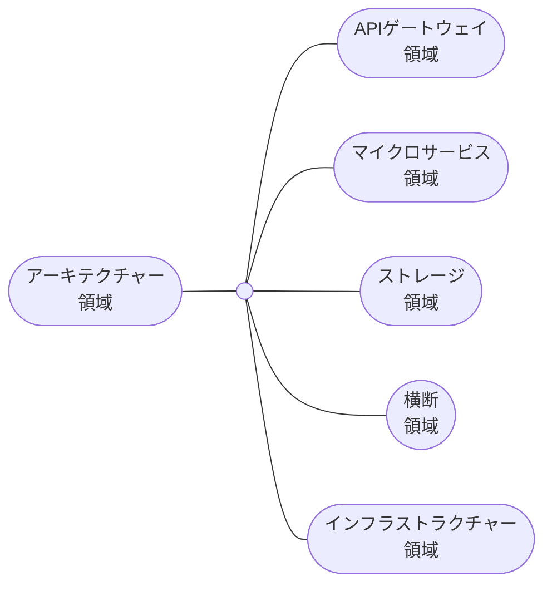
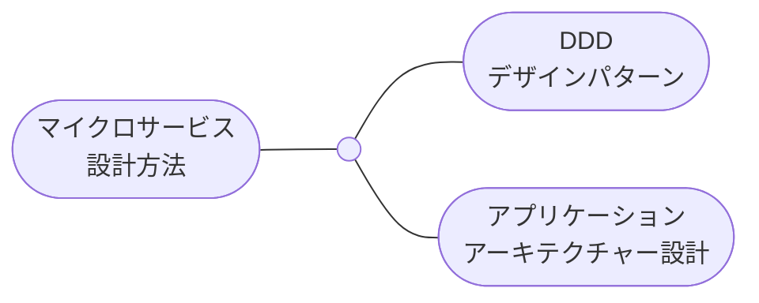

# 補章 クラウドネイティブ技術とマイクロサービスアーキテクチャーのつながり

## 1 はじめに

著者のMauricio Salatino氏はマイクロサービスアーキテクチャーのアプリケーションを稼働させるクラウドネイティブ技術に着目し、その実践方法を解説してくれました。

クラウドネイティブ技術とマイクロサービスアーキテクチャーは相互に影響を与えながら進歩してきた分野です。

CNCFはクラウドネイティブ技術を次のように定義づけており、この技術がマイクロサービスアーキテクチャーの構築と実行に適していることがわかります \*1 。

> クラウドネイティブ技術は、パブリッククラウド、プライベートクラウド、ハイブリッドクラウドなどの近代的でダイナミックな環境において、スケーラブルなアプリケーションを構築および実行するための能力を組織にもたらします。

このアプローチの代表例に、コンテナ、サービスメッシュ、マイクロサービス、イミュータブルインフラストラクチャー、および宣言型APIがあります。

本書の各章では、以下のように言及しています。

- 1〜2章：マイクロサービスアーキテクチャーのアプリケーションの特徴
- 3〜4章：CI/CDによるアプリケーションのユーザー提供
- 5～6章：インフラストラクチャーとプラットフォームの作成
- 7章：APIによるプラットフォーム機能の開発者提供
- 8章：さまざまなリリース戦略の活用
- 9章：パフォーマンスの測定

補章では、マイクロサービスアーキテクチャーをさらに深掘りし、マイクロサービスアーキテクチャーとクラウドネイティブとの関係性を重点的に取り上げます。

まずは、マイクロサービスアーキテクチャーのデザインパターンを取り上げます。

そして、各デザインパターンがどのようなクラウドネイティブ技術で代替できるのかを概説します。

私が現場で見てきた実際のマイクロサービスアーキテクチャーの設計、関連書籍、本書のウォーキングスケルトン（1〜2章）などに基づいて、クラウドネイティブ技術を使用したマイクロサービスアーキテクチャーの設計例を図で示します。

---

\*1 https://github.com/cncf/toc/blob/main/DEFINITION.md

## 2 歴史

### 2.1 クラウドネイティブ技術

CNCFの定義のとおり、クラウドネイティブ技術はパブリッククラウド、プライベートクラウド、ハイブリッドクラウドなどでスケーラブルなアプリケーションを実現します。

これまでにAWSなどのパブリッククラウド、Kubernetes、そしてKubernetesを基盤としたクラウドネイティブ技術が登場しました \*1 。

表1で代表的なクラウドネイティブ技術の歴史を整理します。

2024年の執筆時点で約20分野のクラウドネイティブ技術が登場しており、今後も増え続けていくでしょう。

表1　クラウドネイティブ技術に関連する歴史

| 年代       | 技術                             | 説明                                                                                                                                                           |
| ---------- | -------------------------------- | -------------------------------------------------------------------------------------------------------------------------------------------------------------- |
| 2004-2006  | AWS                              | AmazonはクラウドサービスとしてSQSを公開した。その後、AWSはS3やEC2の提供も始めた \*2 。                                                                         |
| 2008       | Google Cloud                     | GoogleはクラウドサービスとしてApp Engineを公開した \*3 。                                                                                                      |
| 2009       | Heroku                           | HerokuはPaaSとしてHerokuを公開した \*4 。                                                                                                                      |
| 2010       | Azure、OpenStack                 | MicrosoftはクラウドサービスとしてWindows Azureを公開した *5 。また、Rackspace HostingとNASAはユーザー独自のIaaSを構築できるOpenStackを公開した *6 。           |
| 2011       | Cloud Foundry                    | VMwareはユーザー独自のPaaSを構築できるCloud Foundryを公開した \*7 。                                                                                           |
| 2013       | Docker                           | dotCloudは仮想化技術としてコンテナを公開した \*8 。                                                                                                            |
| 2014〜2015 | Kubernetes                       | GoogleはコンテナオーケストレーションツールとしてKubernetesを発表した。またKubernetes v1.0のリリースに合わせて、GoogleとLinux FoundationがCNCFを設立した \*9 。 |
| 2014〜     | 約20分野のクラウドネイティブ技術 | CNCFでは約20分野に渡るクラウドネイティブ技術が登場した \*10 。                                                                                                 |

---

\*2 CNCF Overview 2024（https://docs.google.com/presentation/d/1UGewu4MMYZobunfKr5sOGXsspcLOH_5XeCLyOHKh9LU/edit#slide=id.gc98d72cd14_1_2266）

\*3 https://en.wikipedia.org/wiki/Amazon_Web_Services

\*4 https://en.wikipedia.org/wiki/Google_Cloud_Platform

\*5 https://en.wikipedia.org/wiki/Heroku

\*6 https://en.wikipedia.org/wiki/Microsoft_Azure

\*7 https://en.wikipedia.org/wiki/OpenStack

\*8 https://en.wikipedia.org/wiki/Cloud_Foundry

\*9 [https://en.wikipedia.org/wiki/Docker\_(software）](<https://en.wikipedia.org/wiki/Docker_(software)>)

\*10 https://en.wikipedia.org/wiki/Kubernetes

\*11 分野の種類は補章3節の表3で取り上げています。

最新の分野はCNCF Landscape（https://landscape.cncf.io/）を参照してください。

### 2.2 マイクロサービスアーキテクチャー

マイクロサービスアーキテクチャーに関連するアーキテクチャースタイルがいくつかあります \*11 。

表2でマイクロサービスアーキテクチャーに関連するアーキテクチャースタイルの歴史を整理します。

マイクロサービスアーキテクチャーの登場前に、これの前身となるサービス指向アーキテクチャーや後にマイクロサービスアーキテクチャーに貢献するDDD（ドメイン駆動設計）が登場しました。

また、マイクロサービスアーキテクチャー以降にはモジュラーモノリスアーキテクチャーなどが登場しました。

マイクロサービスアーキテクチャー特有の課題を解決するために、さまざまなデザインパターンが提唱されています。

表2. マイクロサービスアーキテクチャーに関連する歴史

| 年代                       | アーキテクチャースタイル           | 説明                                                                                                                                                                                                                                                                                                                                                                                                                                                                                            |
| -------------------------- | ---------------------------------- | ----------------------------------------------------------------------------------------------------------------------------------------------------------------------------------------------------------------------------------------------------------------------------------------------------------------------------------------------------------------------------------------------------------------------------------------------------------------------------------------------- |
| 1999年                     | モノリスアーキテクチャー           | バックエンドのアーキテクチャーとしてモノリスアーキテクチャーが台頭していた \*12 。                                                                                                                                                                                                                                                                                                                                                                                                              |
|                            |                                    |                                                                                                                                                                                                                                                                                                                                                                                                                                                                                                 |
| 1900年後半〜<br>2000年前半 | サービス指向アーキテクチャー       | Michael BellやThomas Erlらが、アプリケーションを機能の粒度で分割するアーキテクチャーを提唱した *13 。ただ『機能』という粒度に分割の指針がなかった *14 。さまざまな課題があったため、概念としては提唱されていても実装方法の確立にまでは至らなかった。                                                                                                                                                                                                                                            |
| 2003年                     | DDD（ドメイン駆動設計）            | Eric EvansはDDDを提唱した \*15 。DDDは、オブジェクト指向分析設計から派生した分析設計の方法の一種である。とくに機能要件を解決するアプリケーションに有効である。オブジェクト指向分析設計のベタープラクティスを集め、より強化することにつながった。                                                                                                                                                                                                                                                |
| 2014年                     | マイクロサービスアーキテクチャー   | Simon Brownは、モノリスアーキテクチャーは時間経過とともに無秩序でつぎはぎだらけになり得ることを指摘した *16 。Martin FowlerとJames Lewisは、サービス指向アーキテクチャーとDDDを統合し、アプリケーションを独立したマイクロサービスの集まりに分割するアーキテクチャーを提唱した *17 。サービス指向アーキテクチャーにDDDの高凝集／低結合の考え方を取り入れることで、サービス指向アーキテクチャーを実装可能な理論に昇華させた。一方で、マイクロサービスの大きさには十分に注意を払う必要がある ※18。 |
| 2015年                     | モジュラーモノリスアーキテクチャー | Martin Flowlerはモジュラーモノリスアーキテクチャーを提唱した \*19 。モジュラモノリスでは、マイクロサービスアーキテクチャーとモノリスアーキテクチャーの間をとった粒度で、アプリケーションを細かいモジュールに分割する。最初にモジュラーモノリスアーキテクチャーとして設計し、マイクロサービスアーキテクチャーに移行していくという選択肢もある。                                                                                                                                                  |

---

\*12 Richards, M., & Ford, N. (2020). Fundamentals of software Architecture: An Engineering Approach. O’Reilly Media.

\*13 Wikipedia contributors. (2024). Monolithic application. Wikipedia. https://en.wikipedia.org/wiki/Monolithic_application

\*14 Wikipedia contributors. (2024a). Service-oriented architecture. Wikipedia. https://en.wikipedia.org/wiki/Service-oriented_architecture

\*15 Newman, S. (2021). Building microservices. O’Reilly Media, Inc.

\*16 Evans, E. (2004). Domain-driven design: Tackling Complexity in the Heart of Software. Addison-Wesley Professional.

\*17 Lewis, J. (n.d.). Microservices. http://martinfowler.com/. https://martinfowler.com/articles/microservices.html

\*18 Fowler, M. (n.d.). bliki: Brown, S. (2014). Distributed big balls of mud. http://dzone.com/. https://dzone.com/articles/distributed-big-balls-mud

19 Brown, S. (2014). Fowler, M. (n.d.). bliki: Monolith First. http://martinfowler.com/. https://martinfowler.com/bliki/ MonolithFirst.html

## 3 マイクロサービスアーキテクチャーに関連のあるクラウドネイティブ技術

CNCFでは、オープンソースやクラウドプロバイダーのクラウドネイティブ技術をさまざまな分野に分類しています \*20 。

各分野には、マイクロサービスアーキテクチャーに関連のあるクラウドネイティブ技術が多くあります。

表3でそれらを一覧で示します \*21 。

表ではCNCF Landscapeにある定義を参考して、各分野のマイクロサービスとの関連性を説明します。

1.1節では、クラウドプロバイダーの使用に言及しています。

ここではクラウドプロバイダーのマネージドサービスを使用することにより、ビジネスアジリティの向上、低レイヤーの運用コストの軽減などの利点があると主張しています。

補章では、2024年の執筆時点で特に人気の高いクラウドプロバイダーのAWSを主な例に挙げ、これのマネージドサービスを取り上げます。

表3　マイクロサービスアーキテクチャーに関連のあるクラウドネイティブ技術例の一覧

| 分野                                                                       | マイクロサービスとの関連性                                                                                                                       | 代表的なオープンソース                                                                                                                                     | 代表的なマネージドサービス                             |
| -------------------------------------------------------------------------- | ------------------------------------------------------------------------------------------------------------------------------------------------ | ---------------------------------------------------------------------------------------------------------------------------------------------------------- | ------------------------------------------------------ |
| API Gateway （APIゲートウェイ）                                            | マイクロサービスのAPIのコールに必要な汎用的機能を集中管理する。                                                                                  | ・Kong Gateway                                                                                                                                             | ・AWS（API Gateway）                                   |
| Application Definition & Image Build（アプリケーション定義とイメージ構築） | コンテナイメージからマイクロサービスを構築し、またデプロイする。                                                                                 | ・Docker Compose <br> ・Helm<br>・OpenAPI<br>・Packer                                                                                                      |                                                        |
| Automation & Configuration（自動化と設定）                                 | マイクロサービスのインフラストラクチャーのプロビジョニングを自動化する。                                                                         | ・Ansible<br>・Temporal<br>・Terraform                                                                                                                     | ・AWS（CloudFormation）                                |
| Chaos Engineering（カオスエンジニアリング）                                | システムの全体や一部に障害を注入し、システムの回復力をテストする。                                                                               | ・ChaosMesh<br>・Istio                                                                                                                                     | ・AWS（Fault Injection Simulator）                     |
| Cloud Native Network（クラウドネイティブネットワーク）                     | マイクロサービスがほかと通信するためのネットワークを作成する。                                                                                   | ・Cilium CNI                                                                                                                                               | ・AWS（VPC CNI）                                       |
| Cloud Native Storage（クラウドネイティブストレージ）                       | ファイルストレージ、オブジェクトストレージ、ブロックストレージなどとして各種データを保管する。                                                   | ・Ceph<br>・Longhorn                                                                                                                                       | ・AWS（EBS、S3）                                       |
| Coordination & Service Discovery（調整とサービス検出）                     | 各マイクロサービスがお互いに場所を特定できるようにする。                                                                                         | ・CoreDNS<br>・Etcd                                                                                                                                        | ・AWS（ECS Service Connect）                           |
| Container Registry（コンテナレジストリー）                                 | コンテナイメージの保管や提供などを集中管理する。                                                                                                 | ・Harbor                                                                                                                                                   | ・AWS（ECR）<br>・Docker Hub                           |
| Container Runtime（コンテナランタイム）                                    | コンテナ内のアプリケーションを実行し、またハードウェアリソース（例えばCPU、ストレージ、メモリなど）を提供する。                                  | ・Containerd                                                                                                                                               |                                                        |
| Continuous Integration & Delivery（継続的インテグレーションとデリバリー）  | マイクロサービスの構築からデプロイまでに必要なタスクを自動化する。                                                                               | ・ArgoCD<br>・Dagger<br>・Flux<br>・Tekton                                                                                                                 | ・GitHub Actions                                       |
| Continuous Optimization（継続的最適化）                                    | CNCFに定義の記載なし。                                                                                                                           | ・Karpenter<br>・OpenCost                                                                                                                                  | ・AWS（Cost Explorer）                                 |
| Database（データベース）                                                   | RDBやNo SQL DBとしてマイクロサービスがデータを保管し、また取得できるようにする。                                                                 | ・MySQL<bt>・Redis                                                                                                                                         | ・AWS（Aurora MySQL、ElastiCache）                     |
| Feature Flagging（機能フラグ）                                             | CNCF Landscapeに定義の記載なし。                                                                                                                 | ・OpenFeature                                                                                                                                              | ・AWS（AppConfig）                                     |
| Key Management（キー管理）                                                 | 暗号化キーの作成、保管、そしてローテションを集中管理する。                                                                                       | ・Spire                                                                                                                                                    | ・AWS（KMS）                                           |
| Observability（オブザーバビリティー）                                      | さまざまなテレメトリーデータの作成、収集、保管、分析、可視化を実施する。                                                                         | ・Fluentd／FluentBit<br>・Grafana（Grafana、Loki、Mimir、Tempo）<br>・Kiali<br>・OpenTelemetry（クライアントSDK、OpenTelemetry Collector）<br>・Prometheus | ・AWS（CloudWatch Logs、CloudWatch Metrics、X-Ray）    |
| Platform（プラットフォーム）                                               | クラウドネイティブの各分野のツールを一括で提供する。                                                                                             | ・KinD<bt>・Minikube<br>・Rancher                                                                                                                          | ・AWS（EKS、Lambda）                                   |
| Remote Procedure Call（リモートプロシージャコール）                        | マイクロサービスがほかのマイクロサービスにリクエストを送信できるようにする。                                                                     | ・gRPC                                                                                                                                                     |                                                        |
| Scheduling & Orchestration（スケジューリングとオーケストレーション）       | クラスター全体でコンテナを実行し、また管理する。                                                                                                 | ・Knative<br>・Kubernetes                                                                                                                                  | ・AWS（ECS）                                           |
| Security & Compliance（セキュリティとコンプライアンス）                    | 脆弱性を監視して脆弱性を検出する。また、マイクロサービスの認証認可を強化する。                                                                   | ・Cert Manager<br>・Falco<br>・Keycloak<br>・OAuth2 Proxy<br>・SOPS                                                                                        | ・AWS（Certificate Manager、Cognito、Secrets Manager） |
| Service Mesh（サービスメッシュ）                                           | 各マイクロサービスのロジックを変更することなく、マイクロサービス間の通信に信頼性、オブザーバビリティー、セキュリティ機能などを一律的に追加する。 | ・Istio<br>・Linkerd                                                                                                                                       | ・AWS（VPC Lattice）                                   |
| Service Proxy（サービスプロキシ） \*22                                     | マイクロサービスからの送信されたリクエストを仲介し、ほかのマイクロサービスに転送する。                                                           | ・Envoy<br>・Nginx                                                                                                                                         | ・AWS（ALB）                                           |
| Streaming & Messaging（ストリーミングとメッセージング）                    | パブリッシャーから送信されたメッセージを仲介し、他のサブスクライバーに転送する。                                                                 | ・Apache Kafka<br>・CloudEvents<br>・RabbitMQ                                                                                                              | ・AWS（Kinesis、SQS）                                  |

---

\*20 CNCFはクラウドネイティブ技術の属する分類をしばしば変更します。最新の分類はCNCF Landscape（https://landscape.cncf.io/）を参照してください。

\*21 クラウドネイティブ技術には、人気があってもCNCF未登録または分野未分類なものがあります。今回、登録済や分類済の技術を、便宜上、競合技術と同じ分野に記載しています。

\*22 Service Proxy分野のツールは設定次第でAPI Gateway分野のツールと同等に使用できます。

## 4 マイクロサービスアーキテクチャーの構成領域

まず、マイクロサービスアーキテクチャーはどのような領域からなるのでしょうか？　図1と表3でモノリスアーキテクチャー、プレゼンテーションドメイン分離（過渡的なアーキテクチャー） \*23 、マイクロサービスアーキテクチャーの例を示しそれぞれの領域を簡単に比較します。

モノリスアーキテクチャーからマイクロサービスアーキテクチャーに至るまでに、領域が細分化されていきます。

図1. マイクロサービスアーキテクチャーに至るまでのアーキテクチャーの変遷


表4. マイクロサービスアーキテクチャーに至るまでのアーキテクチャー間の比較

|                | モノリスアーキテクチャー                                                                                                 | プレゼンテーションドメイン分離                                                                                                           | マイクロサービスアーキテクチャー                                                                                                                                                                           |
| -------------- | ------------------------------------------------------------------------------------------------------------------------ | ---------------------------------------------------------------------------------------------------------------------------------------- | ---------------------------------------------------------------------------------------------------------------------------------------------------------------------------------------------------------- |
| 領域の種類     | ・フロントエンド<br/>・バックエンド<br/>・各種ストレージ（データベースなど）                                             | ・フロントエンド<br/>・バックエンド<br/>・各種ストレージ（データベースなど）                                                             | ・フロントエンド<br/>・APIゲートウェイ<br/>・マイクロサービス<br/>・各種ストレージ（データベースなど）                                                                                                     |
|                |                                                                                                                          |                                                                                                                                          |                                                                                                                                                                                                            |
|                |                                                                                                                          |                                                                                                                                          |                                                                                                                                                                                                            |
|                |                                                                                                                          |                                                                                                                                          |                                                                                                                                                                                                            |
|                |                                                                                                                          |                                                                                                                                          |                                                                                                                                                                                                            |
|                |                                                                                                                          |                                                                                                                                          |                                                                                                                                                                                                            |
|                |                                                                                                                          |                                                                                                                                          |                                                                                                                                                                                                            |
|                |                                                                                                                          |                                                                                                                                          |                                                                                                                                                                                                            |
| 領域の役割     | アプリケーションは、フロントエンド領域とバックエンド領域の領域からなる。アプリケーションが両方の領域の役割を担っている。 | アプリケーションは、フロントエンドアプリケーションとバックエンドアプリケーションからなる。両アプリケーションは各領域の役割を担っている。 | アプリケーションは、独立したAPIを持つ複数のフロントエンド領域とマイクロサービス領域アプリケーションからなる。両アプリケーションは各領域の役割を担っている。これらの領域の間に、APIゲートウェイ領域がある。 |
| 領域間の結合度 | フロントエンド領域とバックエンド領域の領域は密結合になっている。各領域は同じプロセスで稼働する。                         | フロントエンド領域とバックエンド領域の領域は疎結合になっている。各領域は異なるプロセスで稼働する。                                       | フロントエンド、各マイクロサービス、APIゲートウェイの領域は疎結合になっている。各領域は異なるプロセスで稼働する。                                                                                          |

---

\*23 Fowler, M. (n.d.). bliki: Presentation Domain Separation. http://martinfowler.com/. https://martinfowler.com/bliki/PresentationDomainSeparation.html

## 5 マイクロサービスアーキテクチャーのデザインパターン

### 5.1 デザインパターンとクラウドネイティブ技術

マイクロサービスアーキテクチャーでは技術的で組織的な特有の問題が起こります。

これを解決するために、マイクロサービスアーキテクチャーの各領域でさまざまなデザインパターンが提唱されています *23~*27 。

各領域のデザインパターンは、そのすべてや一部をクラウドネイティブ技術で代替できます \*28 。

図2でマイクロサービスアーキテクチャーの領域とクラウドネイティブ技術の関連性を示します。

色が濃いほど関連性が強く、クラウドネイティブ技術で代替できることを表しています。

アプリケーションの領域では機能的なロジックは関連性が低い一方で、非機能的なものほど関連性が強いです。

そしてインフラストラクチャーは全般的に関連性が強いです。

図2. マイクロサービスアーキテクチャーの領域とクラウドネイティブ技術の関連性

![DDDとクラウドネイティブによるマイクロサービスアーキテクチャー設計の概説-クラウドネイティブの代替領域.drawio](%E8%A3%9C%E7%AB%A0%20%E3%82%AF%E3%83%A9%E3%82%A6%E3%83%88%E3%82%99%E3%83%8D%E3%82%A4%E3%83%86%E3%82%A3%E3%83%95%E3%82%99%E6%8A%80%E8%A1%93%E3%81%A8%E3%83%9E%E3%82%A4%E3%82%AF%E3%83%AD%E3%82%B5%E3%83%BC%E3%83%92%E3%82%99%E3%82%B9%E3%82%A2%E3%83%BC%E3%82%AD%E3%83%86%E3%82%AF%E3%83%81%E3%83%A3%E3%83%BC%E3%81%AE%E3%81%A4%E3%81%AA%E3%81%8B%E3%82%99%E3%82%8A%206b9608ce651748bf9377d5e949916ec4/DDD%25E3%2581%25A8%25E3%2582%25AF%25E3%2583%25A9%25E3%2582%25A6%25E3%2583%2588%25E3%2582%2599%25E3%2583%258D%25E3%2582%25A4%25E3%2583%2586%25E3%2582%25A3%25E3%2583%2595%25E3%2582%2599%25E3%2581%25AB%25E3%2582%2588%25E3%2582%258B%25E3%2583%259E%25E3%2582%25A4%25E3%2582%25AF%25E3%2583%25AD%25E3%2582%25B5%25E3%2583%25BC%25E3%2583%2592%25E3%2582%2599%25E3%2582%25B9%25E3%2582%25A2%25E3%2583%25BC%25E3%2582%25AD%25E3%2583%2586%25E3%2582%25AF%25E3%2583%2581%25E3%2583%25A3%25E8%25A8%25AD%25E8%25A8%2588%25E3%2581%25AE%25E6%25A6%2582%25E8%25AA%25AC-%25E3%2582%25AF%25E3%2583%25A9%25E3%2582%25A6%25E3%2583%2588%25E3%2582%2599%25E3%2583%258D%25E3%2582%25A4%25E3%2583%2586%25E3%2582%25A3%25E3%2583%2595%25E3%2582%2599%25E3%2581%25AE%25E4%25BB%25A3%25E6%259B%25BF%25E9%25A0%2598%25E5%259F%259F.drawio.png)

補章では、各領域でのさまざまなデザインパターンと具体的にいずれのクラウドネイティブ技術がデザインパターンに関連しているのかを概説します。

表3のオープンソースまたはマネージドサービス（主にAWS）を組み合わせ、マイクロサービスアーキテクチャーの設計例を図で示します。

AWSの設計については、AWS Well-Architected Framework \*29 を合わせて読んでいただくことをお奨めします。

なお、マイクロサービスアーキテクチャーで安易にマネージドなクラウドネイティブ技術を使用するべきではないと私は考えています。

なぜなら1つ目の理由として、マネージドサービスによってはオープンソースと比べてユーザーの設定できるオプションが少ないことを挙げます。

機能または非機能によらず拡張性の求められる場合には、オプションの少なさが拡張性の足かせになります。

2つ目の理由として、マネージドサービスによってはアプリケーション領域とインフラストラクチャー領域の境界が曖昧なことを挙げます。

大きな開発組織になるほど、領域の境界の曖昧さによって開発組織で分業しにくくなっていきます。

これは結果的にビジネスのアジリティを低下させる可能性があります。

これらの理由からマイクロサービスアーキテクチャーでは、マネージドサービスをオープンソースの代わりにどこまで使用すれば恩恵をより良く受けられるのか、を見極める必要があります。

例えば、前述の2つの理由で、マイクロサービスのデプロイ方法（表5を参照）はFaaSやPaaSといったサーバーレスではなく、コンテナ（もっと具体的に言うとKubernetes）がより適切であるという考えが私にはあります。

---

注釈

\*24 A pattern language for microservices. (n.d.). http://microservices.io/. https://microservices.io/patterns/index.html

\*25 Richardson, C. (2018). Microservices patterns: With examples in Java. Simon and Schuster.

\*26 Newman, S. (2021). Building microservices. O’Reilly Media, Inc.

\*27 Mezzalira, L. (2021). Building Micro-Frontends. O’Reilly Media, Inc.

\*28 Siriwardena, P., & Dias, N. (2020). Microservices Security in action. Manning Publications.

\*29 Ibryam, B., & Huss, R. (2023). Kubernetes patterns. O’Reilly Media, Inc.

\*30 AWS Well-Architected Framework - AWS Well-Architected Framework. (n.d.). https://docs.aws.amazon.com/wellarchitected/latest/framework/welcome.html

### 5.2 補章で取り上げるデザインパターングループ

補章では、さまざまな書籍 *31~*34 を参考にし、デザインパターンの分類を図式化しました。

前提として、対照的なデザインパターンをまとめたグループを『デザインパターングループ』と呼ぶことにします。

図3のように、マイクロサービスアーキテクチャーを便宜上５つの領域に分け、その中にあるデザインパターングループとデザインパターンを取り上げます。

図3. 補章で取り上げるアーキテクチャーの領域


<div hidden>



</div>

デザインパターングループは他にも多くあります。

表5で、取り上げられなかったデザインパターングループの例を簡単に示します。

都合上、これらのデザインパターングループを取り上げられませんでした。

なお図2で示したように、非機能なロジックほどクラウドネイティブ技術と関連性が強く、クラウドネイティブ技術を使用して代替できます。

デザインパターングループを網羅的に学びたい読者はMicroservices.ioサイト *30 、Microservices patterns本 *31 、Building Microservices本 *32 、そしてBuilding Micro-Frontends本 *33 を読んでいただくことをお薦めします。

表5　取り上げられたなかったデザインパターン

| 領域                   | デザインパターングループ名           | デザインパターンの例                                                                                                                       |
| ---------------------- | ------------------------------------ | ------------------------------------------------------------------------------------------------------------------------------------------ |
| フロントエンド         | フロントエンド分割方法               | モノリスフロントエンド／マイクロフロントエンド                                                                                             |
|                        | フロントエンドレンダリング方法       | CSR／SSR／SSG／ISR                                                                                                                         |
| 横断                   | Microservice chassis                 | ・開発環境の設定<br/>・API仕様<br/>・CI/CDの設定<br/>・IaCの設定<br/>・アプリケーション計装パッケージ<br/>・サービスメッシュ代替パッケージ |
|                        | 各種インスタンスの回復管理方法       | ・リトライ<br/>・タイムアウト<br/>・サーキットブレイカー<br/>・ヘルスチェック                                                              |
|                        | 各種インスタンスのスケーリング方法   | ・垂直スケーリング<br/>・水平スケーリング<br/>・インスタンスの希望数維持                                                                   |
|                        | デプロイ方法                         | Serverless platforms／Multiple services instance per host／Service instance per VM／Service instance per container                         |
|                        | リリース方法                         | インプレースデプロイメント／ローリングデプロイメント／カナリアリリース／ブルーグリーンデプロイメント                                       |
|                        | CI/CD                                | CIOps／GitOps                                                                                                                              |
|                        | リポジトリー構成方法                 | 中央集中／分散モノレポ／ポリレポ                                                                                                           |
|                        | 組織構成方法                         | Collective ownership／Strong ownership                                                                                                     |
| インフラストラクチャー | ログ／メトリクス／トレースの監視方法 | 中央集中／分散                                                                                                                             |
|                        | インシデント対処方法                 | 中央集中／分散                                                                                                                             |
| テスト                 | ホワイトボックステスト               | ・ユニットテスト<br/>・サービステスト<br/>・コントラクトテスト<br/>・E2Eテスト                                                             |
|                        | ブラックボックステスト               | ・ロードテスト（負荷テスト）<br/>・回帰テスト<br/>・フォールトインジェクションを含むカオスエンジニアリング                                 |

---

注釈

\*31 A pattern language for microservices. (n.d.). http://microservices.io/. https://microservices.io/patterns/index.html

\*32 Richardson, C. (2018). Microservices patterns: With examples in Java. Simon and Schuster.

\*33 Newman, S. (2021). Building microservices. O’Reilly Media, Inc.

\*34 Mezzalira, L. (2021). Building Micro-Frontends. O’Reilly Media, Inc.

### 5.3 凡例

図4で5章以降のデザインパターンの図の凡例を示します。

各図では丸ボックスをデザインパターングループ、四角ボックスをデザインパターンとして区別しています。

図4. デザインパターンの図の凡例


<div hidden>


</div>

## 6 APIゲートウェイ領域

APIゲートウェイ領域にはAPIゲートウェイを配置します。

マイクロサービスアーキテクチャーでは、すべてのマイクロサービスのAPIをネットワークに公開する必要はありません。

APIゲートウェイを配置することにより、必要なマイクロサービスのAPIのみを公開して受信したリクエストを適切なマイクロサービスのAPIにルーティングできます。

図5で、APIゲートウェイ領域のデザインパターングループの種類を示します。

代表的なものにはAPIゲートウェイ分割方法があります。

図5　APIゲートウェイ領域のデザインパターングループの種類


<div hidden>


</div>

### 6.1 APIゲートウェイ分割方法

APIゲートウェイを適切な結合度と凝集度で分割することにより、開発を分業しやすくしAPIゲートウェイの拡張性や生産性を高められます。

図6で、APIゲートウェイ分割方法のデザインパターンの種類を示します。

代表的なものには中央集約ゲートウェイとBFFがあります。

図6. APIゲートウェイ分割方法のデザインパターンの種類


<div hidden>


</div>

APIゲートウェイをクラウドネイティブ技術で代替できます。

表6でAPIゲートウェイ分割方法とクラウドネイティブ技術の関連性を整理します。

ここでは、技術用語のAPIゲートウェイとCNCFのAPI Gateway分野を区別しています。

表6　APIゲートウェイ分割方法とクラウドネイティブ技術の関連性

| パターン名                       | 中央集約ゲートウェイ                                                                                                                               | BFF                                                                                                                                        |
| -------------------------------- | -------------------------------------------------------------------------------------------------------------------------------------------------- | ------------------------------------------------------------------------------------------------------------------------------------------ |
| 説明                             | 各クライアントで共有するAPIゲートウェイを配置する。APIゲートウェイには、各クライアントからのすべてのリクエストを想定したエンドポイントを実装する。 | クライアント別のAPIゲートウェイを配置する。APIゲートウェイには、特定のクライアントからのリクエストを想定したエンドポイントだけを実装する。 |
| クラウドネイティブ技術との関連性 | 中央集約ゲートウェイとしてService Proxy、Service Mesh、API Gateway分野のツールを使用できる。                                                       | BFFとしてService Proxy、Service Mesh、API Gateway分野のツールを使用できる。                                                                |
| 技術例                           | ・Service Proxy（Nginx）<br>・Service Mesh（Istio）                                                                                                | ・Service Proxy（Nginx）<br/>・Service Mesh（Istio）                                                                                       |

図7でBFFの配置例を示します。

BFFとしてService Proxy、Service Mesh、API Gateway分野のツールを使用できます。

例えば、NginxはAPIゲートウェイとして動作します \*34 。

クライアント別（PCブラウザSPA、スマホSPA、外部APIなど）にNginxを配置します。

各クライアントは対応するNginx（PCブラウザ用、スマホブラウザ用BFF、外部API用BFFなど）にリクエストを送信し、各Nginxは適切なマイクロサービスのAPIにこれをルーティングします。

APIゲートウェイとして使用できるツールはNginx以外にも非常に多くあります。

ただ、その中でもNginxは環境構築や設定の方法が簡単で扱いやすく、またこれらの情報をインターネットや書籍から見つけやすいため、私の好みのツールです。

なお、GraphQLサーバーをBFFとして使用するフルスクラッチな設計方法もあります。

この場合、フロントエンドや外部APIはGraphQLクライアントとして設計する必要があります。

図7　BFFの配置例


図8でAWS EKS上でのBFFの設計例を示します。

マイクロサービスアーキテクチャーのAPIゲートウェイ領域には、図7と同様にクライアント別のNginxを配置します。

もしNginxでBFFとしての要件を満たせなくとも、Istioと組み合わせることにより足りない機能を補完できます。

なお、Istioの提供するIstio IngressGatewayとIstio EgressGatewayはメッシュゲートウェイと呼ばれ、APIゲートウェイと似た名前をもちます。

ただ、APIゲートウェイとは異なる役割を持ちます \*35 。

図8　AWS EKS上でのBFFの設計例


---

注釈

\*35 DeJonghe, D. (2022). NGINX Cookbook. O’Reilly Media, Inc.

\*36 Gough, J., Bryant, D., & Auburn, M. (2021). Mastering API architecture. O’Reilly Media, Inc.

## 7 マイクロサービス領域

マイクロサービス領域には、適切に分割された複数のバックエンドアプリケーション（マイクロサービス）を配置します。

図9で、マイクロサービス領域のデザインパターングループの種類を示します。

代表的なものにはマイクロサービス間通信方法、マイクロサービス分割方法、マイクロサービス設計方法、ドメインモデリング方法、トランザクション管理方法、設定管理方法、認証認可があります。

図9　マイクロサービス領域のデザインパターングループの種類


<div hidden>


</div>

### 7.1 マイクロサービス間通信方法

マイクロサービス間を適切な方法で通信することにより、効率的で障害を解決しやすいマイクロサービスアーキテクチャーを実現できます。

図10で、マイクロサービス間通信方法のデザインパターンの種類を示します。

代表的なものには、リクエスト／レスポンス、パブリッシュ／サブスクライブ、共有データ経由があります。

図10　マイクロサービス間通信方法のデザインパターンの種類


<div hidden>


</div>

リクエスト／レスポンスにはRESTful-APIとRPC-APIがあります。

パブリッシュ／サブスクライブにはプルベースとプッシュベースがあります \*36 。

そして共有データ経由があります。

各マイクロサービスをどのようにモデリングしているか（例えば、ステートソーシングやイベントソーシング）に応じて、リクエスト／レスポンスとパブリッシュ／サブスクライブのいずれが適しているかが異なります。

これらのパターンのロジックはクラウドネイティブ技術で代替できます。

表7で、マイクロサービス間通信方法とクラウドネイティブ技術の関連性を整理します。

表7　マイクロサービス間通信方法とクラウドネイティブ技術の関連性

| パターン名                       | リクエスト／レスポンス                                                                                                                               | パブリッシュ／サブスクライブ                                                                                                                                                                                                                                                          | 共有データ経由                                                                                                                                                                                                                                                                   |
| -------------------------------- | ---------------------------------------------------------------------------------------------------------------------------------------------------- | ------------------------------------------------------------------------------------------------------------------------------------------------------------------------------------------------------------------------------------------------------------------------------------- | -------------------------------------------------------------------------------------------------------------------------------------------------------------------------------------------------------------------------------------------------------------------------------- |
| 説明                             | 送信元マイクロサービスは宛先と同期的に通信する。通信は双方向に流れる。                                                                               | 送信元マイクロサービスはメッセージ仲介システム \*37 を介して、宛先マイクロサービスと非同期的に通信する。通信は一方向に流れる。                                                                                                                                                        | 送信元マイクロサービスは作成したデータをストレージに保管する。宛先マイクロサービスはストレージをポーリングして新しいデータが追加され次第、ストレージからこれを読み込む。通信は一方向に流れる。このパターンの例として、データレイクやデータウェアハウスを使用したシステムがある。 |
| クラウドネイティブ技術との関連性 | RESTの実装方法として、HTTP/1.1でテキストを送受信するパッケージを使用できる。一方で、RPCの実装方法にはRemote Procedure Call分野のツールを使用できる。 | メッセージ仲介システムとして、Streaming & Messaging分野のツールを使用できる。また、パブリッシュとサブスクライブの実装方法として、Streaming & Messaging分野のツールのクライアントSDKを使用できる。サブスクライブにはプルベースとプッシュベースがあり、ツールによってはこれらを選べる。 | ストレージとして、Cloud Native StorageやDatabase分野のツールを使用できる。耐障害性の観点から、これらはオープンソースよりマネージドサービスの技術を使用することをお奨めする。                                                                                                     |
| 技術例                           | ・REST（パッケージ）<br>・Remote Procedure Call（gRPC）                                                                                              | ・Streaming & Messaging（CloudEvents、RabbitMQ）                                                                                                                                                                                                                                      | ・Cloud Native Storage（AWS S3）<br>・Database（AWS Aurora MySQL）                                                                                                                                                                                                               |

図11で、マイクロサービス間のリクエスト／レスポンスによる通信の様子を示します。

ここではKubernetes Podをマイクロサービスとして表します。

送信元マイクロサービスは宛先と同期的に双方向で通信します。

図11　マイクロサービス間のリクエスト／レスポンスによる通信の様子


図12で、AWS EKS上でのリクエスト／レスポンスの設計例を示します。

ここではKubernetes Podをマイクロサービスとして表しており、関連する他のKubernetesリソースを省略しています。

リクエスト／レスポンスのクライアントとサーバーとして、HTTP/1.1でテキスト（JSONやXML）を送受信するパッケージやRemote Procedure Call分野のツールを使用できます。

例えば、マイクロサービスアーキテクチャーでgRPCを使用する場合、マイクロサービスのインフラストラクチャーレイヤーにgRPC関連の処理を配置することをお奨めします \*38 。

マイクロサービスのgRPCクライアントは宛先マイクロサービスのgRPCサーバーと通信します。

マイクロサービスではなくフロントエンドとBFFに関する通信にも言及しておきます。

フロントエンドのRESTfulクライアントはBFFのNginxのRESTfulサーバーと通信します。

NgincはgRPCサーバーまたはRESTfulサーバーと通信し、もしgRPCサーバーと通信する場合は専用のモジュールが必要です \*39 。

図12　AWS EKS上でのリクエスト／レスポンスの設計例

![DDDとクラウドネイティブによるマイクロサービスアーキテクチャー設計の概説-リクエスト _ レスポンス.drawio (2)](<%E8%A3%9C%E7%AB%A0%20%E3%82%AF%E3%83%A9%E3%82%A6%E3%83%88%E3%82%99%E3%83%8D%E3%82%A4%E3%83%86%E3%82%A3%E3%83%95%E3%82%99%E6%8A%80%E8%A1%93%E3%81%A8%E3%83%9E%E3%82%A4%E3%82%AF%E3%83%AD%E3%82%B5%E3%83%BC%E3%83%92%E3%82%99%E3%82%B9%E3%82%A2%E3%83%BC%E3%82%AD%E3%83%86%E3%82%AF%E3%83%81%E3%83%A3%E3%83%BC%E3%81%AE%E3%81%A4%E3%81%AA%E3%81%8B%E3%82%99%E3%82%8A%206b9608ce651748bf9377d5e949916ec4/DDD%25E3%2581%25A8%25E3%2582%25AF%25E3%2583%25A9%25E3%2582%25A6%25E3%2583%2588%25E3%2582%2599%25E3%2583%258D%25E3%2582%25A4%25E3%2583%2586%25E3%2582%25A3%25E3%2583%2595%25E3%2582%2599%25E3%2581%25AB%25E3%2582%2588%25E3%2582%258B%25E3%2583%259E%25E3%2582%25A4%25E3%2582%25AF%25E3%2583%25AD%25E3%2582%25B5%25E3%2583%25BC%25E3%2583%2592%25E3%2582%2599%25E3%2582%25B9%25E3%2582%25A2%25E3%2583%25BC%25E3%2582%25AD%25E3%2583%2586%25E3%2582%25AF%25E3%2583%2581%25E3%2583%25A3%25E8%25A8%25AD%25E8%25A8%2588%25E3%2581%25AE%25E6%25A6%2582%25E8%25AA%25AC-%25E3%2583%25AA%25E3%2582%25AF%25E3%2582%25A8%25E3%2582%25B9%25E3%2583%2588___%25E3%2583%25AC%25E3%2582%25B9%25E3%2583%259B%25E3%2582%259A%25E3%2583%25B3%25E3%2582%25B9.drawio_(2).png>)

---

注釈

\*37 Richardson, C. (2018). Microservices patterns: With examples in Java. Simon and Schuster.

\*38 メッセージ仲介システムの種類として、メッセージブローカー、メッセージキュー、およびイベントバスがあります。

\*39 Vandeperre, M. (2023b, October 18). Implementing clean architecture solutions: A practical example | Red Hat Developer. Red Hat Developer. https://developers.redhat.com/articles/2023/08/08/implementing-clean-architecture-solutions-practical-example

\*40 Module ngx_http_grpc_module. (n.d.). https://nginx.org/en/docs/http/ngx_http_grpc_module.html

### 7.2 マイクロサービス分割方法

マイクロサービスの分割はマイクロサービスアーキテクチャーの設計の中で最重要な課題であり、技術的な難易度も非常に高いです。

分割のための境界を見つけるためには各マイクロサービスの凝集度、結合度、そして情報隠蔽度に着目するべきです \*40 。

図13で、マイクロサービス分割方法のデザインパターンの種類を示します。

代表的なものには、DDDに基づく境界と永続データの機密性があります。

また、DDDに基づく境界には境界づけられたコンテキストと1つ以上の集約 \*41 があります。

図13　マイクロサービス分割方法のデザインパターンの種類


<div hidden>


</div>

図14で、DDDに基づく境界のパターンの関係性を示します。

DDDの考え方をマイクロサービスアーキテクチャーに取り入れることにより、適切な凝集度と結合度をもつマイクロサービスに分割できます。

マイクロサービスの大きさは1つの集約より大きく、境界づけられたコンテキストより小さくするべきでしょう *40 *42 。

これらの方法はクラウドネイティブ技術では代替できません。

DDDはマイクロサービスアーキテクチャーの文脈とは関係なく、非常に刺激的で興味深い分野です。

今回、ドメインの解決領域からいくつかの境界づけられたコンテキストや集約を切り離していく方法や、DDDの戦略的設計から戦術的設計にかけた手順例などを補章で取り上げられませんでした。

そこで、ここでは関連書籍を少しだけ紹介します。

Learning Domain-Driven design本 *42 は、DDDの代表的な書籍であるDomain-Driven design本 *43 やImplementing Domain-Driven design本 \*44 をわかりやすく解説しており、さらにマイクロサービス分割方法へのDDDの適用についても言及しています。

補章で登場したDDDの用語やデザインパターンは、Domain-Driven Design reference本 \*45 で整理されています。

図14　DDDに基づくマイクロサービスの適切な大きさ

![DDDとクラウドネイティブによるマイクロサービスアーキテクチャー設計の概説-マイクロサービス分割の関係性.drawio (4)](<%E8%A3%9C%E7%AB%A0%20%E3%82%AF%E3%83%A9%E3%82%A6%E3%83%88%E3%82%99%E3%83%8D%E3%82%A4%E3%83%86%E3%82%A3%E3%83%95%E3%82%99%E6%8A%80%E8%A1%93%E3%81%A8%E3%83%9E%E3%82%A4%E3%82%AF%E3%83%AD%E3%82%B5%E3%83%BC%E3%83%92%E3%82%99%E3%82%B9%E3%82%A2%E3%83%BC%E3%82%AD%E3%83%86%E3%82%AF%E3%83%81%E3%83%A3%E3%83%BC%E3%81%AE%E3%81%A4%E3%81%AA%E3%81%8B%E3%82%99%E3%82%8A%206b9608ce651748bf9377d5e949916ec4/DDD%25E3%2581%25A8%25E3%2582%25AF%25E3%2583%25A9%25E3%2582%25A6%25E3%2583%2588%25E3%2582%2599%25E3%2583%258D%25E3%2582%25A4%25E3%2583%2586%25E3%2582%25A3%25E3%2583%2595%25E3%2582%2599%25E3%2581%25AB%25E3%2582%2588%25E3%2582%258B%25E3%2583%259E%25E3%2582%25A4%25E3%2582%25AF%25E3%2583%25AD%25E3%2582%25B5%25E3%2583%25BC%25E3%2583%2592%25E3%2582%2599%25E3%2582%25B9%25E3%2582%25A2%25E3%2583%25BC%25E3%2582%25AD%25E3%2583%2586%25E3%2582%25AF%25E3%2583%2581%25E3%2583%25A3%25E8%25A8%25AD%25E8%25A8%2588%25E3%2581%25AE%25E6%25A6%2582%25E8%25AA%25AC-%25E3%2583%259E%25E3%2582%25A4%25E3%2582%25AF%25E3%2583%25AD%25E3%2582%25B5%25E3%2583%25BC%25E3%2583%2592%25E3%2582%2599%25E3%2582%25B9%25E5%2588%2586%25E5%2589%25B2%25E3%2581%25AE%25E9%2596%25A2%25E4%25BF%2582%25E6%2580%25A7.drawio_(4).png>)

---

注釈

\*41 Newman, S. (2021). Building microservices. O’Reilly Media, Inc.

\*42 マイクロサービスを1つの集約よりも小さく分割するべきではありません。小さすぎるマイクロサービスから構成されるマイクロサービスアーキテクチャーは分散した大きな泥団子と言われており、アンチパターンです。例えば、エンティティー単位で分割してしまうエンティティーサービスというアンチパターンがあります。The entity Service Antipattern - wide awake developers. (2017, December 5). https://www.michaelnygard.com/blog/2017/12/the-entity-service-antipattern/

\*43 Khononov, V. (2021) Learning Domain-Driven design: Aligning Software Architecture and Business Strategy. O’Reilly Media.

\*44 Evans, E. (2003) Domain-Driven design: Tackling Complexity in the Heart of Software. Addison-Wesley.

\*45 Vernon, V. (2013) Implementing Domain-Driven design. Addison-Wesley.

\*46 Evans, E. (2014) Domain-Driven Design reference: Definitions and Pattern Summaries. Dog Ear Publishing.

### 7.3 ドメインモデリング

マイクロサービスのドメインモデリングは分割に次いで重要な課題です。

図15で、マイクロサービスで採用しうるドメインモデリングのパターンの種類を示します。

代表的なものにはステートソーシングとイベントソーシングがあります。

ドメインモデリング方法の選定はマイクロサービス間通信方法に影響します。

図15　メインモデリングのデザインパターンの種類


<div hidden>


</div>

図16で、ドメインモデリングとマイクロサービス間通信方法の関係性を示します。

例えば、ステートソーシングでドメインモデリングしたマイクロサービス間では、リクエスト／レスポンスとパブリッシュ／サブスクライブのいずれかの通信方法を使用できます。

一方でイベントソーシングの場合、マイクロサービス間ではパブリッシュ／サブスクライブの通信方法が適切です *46 *47 。

ステートソーシングとイベントソーシングはモデリング時の着眼点が異なるため、ドメインモデルの適切な分析手法やデータベーステーブルの構造なども異なります。

多くの読者にとって、より馴染みのあるドメインモデリングはおそらくステートソーシングでしょう。

図16. ドメインモデリングとマイクロサービス間通信方法の関係性

![DDDとクラウドネイティブによるマイクロサービスアーキテクチャ設計の概説-ステートソーシング 、イベントソーシング.drawio (2)](<%E8%A3%9C%E7%AB%A0%20%E3%82%AF%E3%83%A9%E3%82%A6%E3%83%88%E3%82%99%E3%83%8D%E3%82%A4%E3%83%86%E3%82%A3%E3%83%95%E3%82%99%E6%8A%80%E8%A1%93%E3%81%A8%E3%83%9E%E3%82%A4%E3%82%AF%E3%83%AD%E3%82%B5%E3%83%BC%E3%83%92%E3%82%99%E3%82%B9%E3%82%A2%E3%83%BC%E3%82%AD%E3%83%86%E3%82%AF%E3%83%81%E3%83%A3%E3%83%BC%E3%81%AE%E3%81%A4%E3%81%AA%E3%81%8B%E3%82%99%E3%82%8A%206b9608ce651748bf9377d5e949916ec4/DDD%25E3%2581%25A8%25E3%2582%25AF%25E3%2583%25A9%25E3%2582%25A6%25E3%2583%2588%25E3%2582%2599%25E3%2583%258D%25E3%2582%25A4%25E3%2583%2586%25E3%2582%25A3%25E3%2583%2595%25E3%2582%2599%25E3%2581%25AB%25E3%2582%2588%25E3%2582%258B%25E3%2583%259E%25E3%2582%25A4%25E3%2582%25AF%25E3%2583%25AD%25E3%2582%25B5%25E3%2583%25BC%25E3%2583%2592%25E3%2582%2599%25E3%2582%25B9%25E3%2582%25A2%25E3%2583%25BC%25E3%2582%25AD%25E3%2583%2586%25E3%2582%25AF%25E3%2583%2581%25E3%2583%25A3%25E8%25A8%25AD%25E8%25A8%2588%25E3%2581%25AE%25E6%25A6%2582%25E8%25AA%25AC-%25E3%2582%25B9%25E3%2583%2586%25E3%2583%25BC%25E3%2583%2588%25E3%2582%25BD%25E3%2583%25BC%25E3%2582%25B7%25E3%2583%25B3%25E3%2582%25AF%25E3%2582%2599_%25E3%2580%2581%25E3%2582%25A4%25E3%2583%2598%25E3%2582%2599%25E3%2583%25B3%25E3%2583%2588%25E3%2582%25BD%25E3%2583%25BC%25E3%2582%25B7%25E3%2583%25B3%25E3%2582%25AF%25E3%2582%2599.drawio_(2).png>)

---

注釈

\*47 Richardson, C. (2018). Microservices patterns: With examples in Java. Simon and Schuster.

\*48 Newman, S. (2021). Building microservices. O’Reilly Media, Inc.

### 7.4 マイクロサービス設計方法

マイクロサービスを適切な結合度と凝集度で分割することにより、開発を分業しやすくして機能的なロジックの拡張性や生産性を高められます。

粒度が大き過ぎればモノリスアーキテクチャーとなり、小さ過ぎれば分散した大きな泥団子になってしまいます \*48 。

図17で、マイクロサービス設計方法のデザインパターングループの種類を示します。

代表的なものには、DDDデザインパターン設計とアプリケーションアーキテクチャー設計があります。

図17　マイクロサービス設計方法のデザインパターンの種類


<div hidden>



</div>

まず、DDDデザインパターン設計です。

DDDのドメインモデリング手順では、ドメインエキスパートからビジネスルールや振る舞いをヒアリングします。

これらに基づいてユースケース図、ドメインオブジェクト図、ドメインモデル図などを作成して実装を落とし込んでいきます。

よりよく実装に落とし込むための手法がDDDデザインパターンです。

図18で、DDDデザインパターンの種類を示します。

代表的なものにはエンティティーや値オブジェクトがあり、ほかに取り上げしきれないほどパターンがあります \*49 。

ドメインロジックは機能的であり、クラウドネイティブ技術で代替できません。

図18. DDDデザインパターンの種類


<div hidden>


</div>

次にアプリケーションアーキテクチャー設計です。

図19で、アプリケーションアーキテクチャー設計のデザインパターンを示します。

代表的なものにはレイヤードアーキテクチャー、ヘキサゴナルアーキテクチャー、オニオンアーキテクチャー、クリーンアーキテクチャーがあります \*50 。

これらはDDDデザインパターンを適切な層に実装するため、またドメインロジックを持つパターンを隔離するための方法です。

図19. アプリケーションアーキテクチャーのデザインパターンの種類


<div hidden>


</div>

表8で、アプリケーションアーキテクチャーとクラウドネイティブ技術の関連性を整理します。

アプリケーションの中でも非機能的なロジックは、クラウドネイティブ技術で代替できます。

マイクロサービス間通信方法にリクエスト／レスポンスを使用している場合、アクセストークン検証ロジックはService Mesh分野のツールで代替できます（補章の認証認可を参照）。

例えば、SSO時のアクセストークン検証のために、IstioによるサイドカーコンテナはリクエストをIDプロバイダーに送信します。

IstioなどのService Mesh分野のツールを使用しない場合、マイクロサービスがこれを担う必要があります。

一方で、マイクロサービス間通信方法にパブリッシュ／サブスクライブを使用している場合、ドメインロジックとメッセージ仲介システムのクライアントSDKの仲介として、Streaming & Messaging分野のツールを使用できます。

例えば、CloudEventsとCloudEvents SDKはドメインロジックのイベントをメッセージ仲介システムに送信します ※52 。

表8. アプリケーションアーキテクチャーとクラウドネイティブ技術の関連性

| パターン名                       | レイヤード、ヘキサゴナル、オニオン、クリーン                                                                                                                                                        |
| -------------------------------- | --------------------------------------------------------------------------------------------------------------------------------------------------------------------------------------------------- |
| 説明                             | デザインパターンを適切な層に実装するため、またドメインロジックを持つパターンを隔離するためにアーキテクチャーを使用する。DDDではいずれのアプリケーションアーキテクチャーを使用するかは重要ではない。 |
| クラウドネイティブ技術との関連性 | 非機能的なロジックの実装方法として、Service MeshやStreaming & Messaging分野のツールを使用できる。                                                                                                   |
| 技術例                           | ・Service Mesh（Istio）<br>・Streaming & Messaging（CloudEvents、RabbitMQ）                                                                                                                         |

---

注釈

\*49 Brown, S. (2014, August 4). Distributed big balls of mud. http://dzone.com/. https://dzone.com/articles/distributed-big-balls-mud

\*50 Evans, E. (2014). Domain-Driven Design reference: Definitions and Pattern Summaries. Dog Ear Publishing.

\*51 Martin, R. C. (2017). Clean architecture: A Craftsman’s Guide to Software Structure and Design. Prentice Hall.

\*52 Salatino, M. (2022, January 29). Event-Driven applications with CloudEvents on Kubernetes – Salaboy (Open Source Knowledge). Salaboy. https://www.salaboy.com/2022/01/29/event-driven-applications-with-cloudevents-on-kubernetes/

### 7.5 トランザクション管理方法

マイクロサービスアーキテクチャーでは、とくに永続データ管理方法にDB per serviceを使用している場合に課題があります。

各マイクロサービスの永続化の間に依存関係がある場合（例えば、ECサイトで受注データの永続化が配送データや決済データに依存している）に各マイクロサービスの連続的な永続化を調整する必要があります。

この課題を解決するパターンとしてSagaや2フェーズコミットがあります。

永続データ管理方法の1つであるShared DBやDB per serviceの課題解決パターンの2フェーズコミットは、一般的に非推奨なパターンとされています。

図20で、トランザクション管理方法のデザインパターンの種類を示します。

Sagaにはオーケストレーションベースとコレオグラフィベースがあります。

図20. トランザクション管理方法のデザインパターンの種類


<div hidden>


</div>

オーケストレーションベースまたはコレオグラフィベースのSagaは、一部のロジックをクラウドネイティブ技術で代替できます。

表9で、Sagaとクラウドネイティブ技術の関連性を整理します。

表9　トランザクション管理方法とクラウドネイティブ技術の関連性

| パターン名                       | オーケストレーションベースSaga                                                                                                                                                                                                                                                              | コレオグラフィベースSaga                                                                                                                                                                                                                                                                    |
| -------------------------------- | ------------------------------------------------------------------------------------------------------------------------------------------------------------------------------------------------------------------------------------------------------------------------------------------- | ------------------------------------------------------------------------------------------------------------------------------------------------------------------------------------------------------------------------------------------------------------------------------------------- |
| 説明                             | Sagaのデザインの1つである。中央集権的なSagaオーケストレーターはメッセージ仲介システムを介して、各マイクロサービスを順番にコールする。各マイクロサービスはローカルトランザクションを実行する。また、Sagaオーケストレーターはローカルトランザクションの進捗度を占有データベースに永続化する。 | Sagaのデザインの1つである。特定のマイクロサービスが他のマイクロサービスを操作する。送信元マイクロサービスは、自身のローカルトランザクションを完了させた後に、メッセージ仲介システムを介して宛先マイクロサービスをコールする。宛先のマイクロサービスは、ローカルトランザクションを実行する。 |
| クラウドネイティブ技術との関連性 | Sagaオーケストレーターとして、Automation & Configuration分野のツールを使用できる。このツールによっては、メッセージ仲介システムがツール内部に組み込まれている。                                                                                                                              | メッセージ仲介システムやこれのクライアントSDKとして、Streaming & Messaging分野のツールを使用できる。また、マイクロサービス間通信方法のパブリッシュ／サブスクライブの実装方法として、Streaming & Messaging分野のツールのクライアントSDKを使用できる。                                        |
| 技術例                           | ・Automation & Configuration（Temporal）                                                                                                                                                                                                                                                    | ・Streaming & Messaging（CloudEvents、RabbitMQ）                                                                                                                                                                                                                                            |

図21で、AWS EKS上でのオーケストレーションベースSagaの設計例を示します。

オーケストレーションベースSagaとして、Automation & Configuration分野のツールを使用できます。

オーケストレーションベースSagaのデザインパターンには、Sagaオーケストレーターがメッセージ仲介システムを介して各マイクロサービスと通信するパターンと、これらの間でメッセージ仲介システムなしに通信するパターンがあります \*52 。

例えば、Temporalはメッセージ仲介システムのあるオーケストレーションベースSagaとして動作します *53 *54 。

Temporalクライアント（Sagaオーケストレーター）は、Temporalサーバー（Temporalの組み込みのメッセージ仲介システム）にワークフローの開始を要求します。

Temporalサーバーはワークフローの進捗度（Sagaログ）を占有データベースに永続化します。

Temporalワーカー（ローカルトランザクション実行マイクロサービス）は自身が実行するべきタスクをTemporalサーバーから取得し、タスクの実行後にその成否を送信します。

いずれかのローカルトランザクションが失敗した場合、Temporalは補償トランザクションのためのオーケストレーションも実施できます \*55 。

Temporalはプログラミング言語でワークフローを定義できるため、複雑なビジネスロジックに対応できます。

また、Kubernetes上でコンテナとして動かせるため、アプリケーション領域とインフラストラクチャー領域の境界が明確になり、それぞれの領域を分業しやすいです。

これらの理由から、TemporalはオーケストレーションベースSagaの代替に適している技術であると私は考えています。

なお、より良いオーケストレーションベースSagaにはステータスチェッカーが必要になるでしょう。

ステータスチェッカーはトランザクションIDを使用してワークフローの進捗度を取得し、これをクライアントに返却します *56 *57 。

図21. AWS EKS上でのオーケストレーションベースSagaの設計例

![DDDとクラウドネイティブによるマイクロサービスアーキテクチャ設計の概説-オーケストレーションベースSaga (概要).drawio (6)](<%E8%A3%9C%E7%AB%A0%20%E3%82%AF%E3%83%A9%E3%82%A6%E3%83%88%E3%82%99%E3%83%8D%E3%82%A4%E3%83%86%E3%82%A3%E3%83%95%E3%82%99%E6%8A%80%E8%A1%93%E3%81%A8%E3%83%9E%E3%82%A4%E3%82%AF%E3%83%AD%E3%82%B5%E3%83%BC%E3%83%92%E3%82%99%E3%82%B9%E3%82%A2%E3%83%BC%E3%82%AD%E3%83%86%E3%82%AF%E3%83%81%E3%83%A3%E3%83%BC%E3%81%AE%E3%81%A4%E3%81%AA%E3%81%8B%E3%82%99%E3%82%8A%206b9608ce651748bf9377d5e949916ec4/DDD%25E3%2581%25A8%25E3%2582%25AF%25E3%2583%25A9%25E3%2582%25A6%25E3%2583%2588%25E3%2582%2599%25E3%2583%258D%25E3%2582%25A4%25E3%2583%2586%25E3%2582%25A3%25E3%2583%2595%25E3%2582%2599%25E3%2581%25AB%25E3%2582%2588%25E3%2582%258B%25E3%2583%259E%25E3%2582%25A4%25E3%2582%25AF%25E3%2583%25AD%25E3%2582%25B5%25E3%2583%25BC%25E3%2583%2592%25E3%2582%2599%25E3%2582%25B9%25E3%2582%25A2%25E3%2583%25BC%25E3%2582%25AD%25E3%2583%2586%25E3%2582%25AF%25E3%2583%2581%25E3%2583%25A3%25E8%25A8%25AD%25E8%25A8%2588%25E3%2581%25AE%25E6%25A6%2582%25E8%25AA%25AC-%25E3%2582%25AA%25E3%2583%25BC%25E3%2582%25B1%25E3%2582%25B9%25E3%2583%2588%25E3%2583%25AC%25E3%2583%25BC%25E3%2582%25B7%25E3%2583%25A7%25E3%2583%25B3%25E3%2583%2598%25E3%2582%2599%25E3%2583%25BC%25E3%2582%25B9Saga_(%25E6%25A6%2582%25E8%25A6%2581).drawio_(6).png>)

---

注釈

\*53 Bellemare, A. (2020b). Building Event-Driven microservices. O’Reilly Media, Inc.

\*54 Temporal. (2024, May 31). Saga Pattern Simplified: Building Sagas with Temporal [Video]. YouTube. https://www.youtube.com/watch?v=uHDQMfOMFD4

\*55 Saga Pattern Made Easy: Trip planning with sagas but without the baggage. (n.d.). Temporal Technologies. https://temporal.io/blog/saga-pattern-made-easy

\*56 Build a trip booking system with PHP | Learn Temporal. (2021, October 1). https://learn.temporal.io/tutorials/php/build_a_trip_booking_app/

\*57 Richardson, C. (2018). Microservices patterns: With examples in Java. Simon and Schuster.

\*58 Azure-Samples. (n.d.). saga-orchestration-serverless/docs/architecture/components.md at main · Azure-Samples/saga-orchestration-serverless. GitHub. https://github.com/Azure-Samples/saga-orchestration-serverless/blob/main/docs/architecture/components.md

### 7.6 認証

マイクロサービスアーキテクチャーでは認証を適切に開始し、認証成功後にマイクロサービス間で認証情報を伝播する必要があります。

また、認証情報が有効かどうかを各マイクロサービスの実行時に検証しなければ、不正なリクエストを処理しかねません。

適切な認証認可や認証情報の伝播により、課題を単純に解決できます。

まずは認証です。

図22で、認証のデザインパターンの種類を示します。

代表的なものにはセッションベースとトークンベースがあります。

図22　認証のデザインパターンの種類


<div hidden>


</div>

セッションベースは、セッションを使用してマイクロサービス間で認証情報を伝播します。

トークンベースにはSSOやJWTとAPIゲートウェイの組み合わせがあり、トークンを使用してマイクロサービス間で認証情報を伝播します。

いずれの方法にもメリットデメリットがあり、要件に応じて選ばなければなりません \*58 。

ここではSSOを概説します。

SSOでは、IDプロバイダーやこれへのリクエストはクラウドネイティブ技術で代替できます。

表10で、認証とクラウドネイティブ技術の関連性を整理します。

表10　認証とクラウドネイティブ技術の関連性

| パターン名                       | SSO                                                                                                                                                                                                                                   |
| -------------------------------- | ------------------------------------------------------------------------------------------------------------------------------------------------------------------------------------------------------------------------------------- |
| 説明                             | SSOで認証する。認証サービスをIDプロバイダーとして使用し、これは認証データ永続化やアクセストークン発行などを実施する。この認証サービスは認証情報を永続化するためのデータベースを持ち、有効期限が切れればアクセストークンを無効化する。 |
| クラウドネイティブ技術との関連性 | IDプロバイダーとしてSecurity & Compliance分野のツールを使用できる。また、IDプロバイダーへのトークン送信方法として、Service Mesh分野のツールを使用できる。                                                                             |
| 技術例                           | ・Security & Compliance（Keycloak）<br>・Service Mesh（Istio）                                                                                                                                                                        |

図23で、AWS EKS上でのOIDC認可コードフローの設計例を示します。

IDプロバイダーとしてSecurity & Compliance分野のツールを使用できます。

例えば、KeycloakはIDプロバイダーとして認証データを永続化し、アカウントを証明するアクセストークンを発行します。

またKeycloakは検証エンドポイントを公開し、受信したリクエストのAuthorizationヘッダーにあるアクセストークンの有効性を検証します \*59 。

この時、任意の認証パッケージやIstioを使用してアクセストークン検証のリクエストをKeycloakに送信できます。

Istioの場合、Istioリソースを定義することにより無効なアカウントからのリクエストをサイドカーコンテナで阻止（401や403レスポンスを返信）できます \*60 。

このようにKeycloakとIstioを組み合わせることにより、マイクロサービスアーキテクチャーでOIDC認可コードフローを実現できます。

図23　AWS EKS上でのOIDC認可コードフローの設計例


---

注釈

\*59 He, X., & Yang, X. (2017). Authentication and authorization of end user in microservice architecture. Journal of Physics Conference Series, 910, 012060. https://doi.org/10.1088/1742-6596/910/1/012060

\*60 Thorgersen, S., & Silva, P. I. (2023) KeyCloak - Identity and access management for modern applications: Harness the power of Keycloak, OpenID Connect, and OAuth 2.0 to secure applications. Packt Publishing Ltd.

\*61 田畑. (n.d). コンテナ上のマイクロサービスの認証強化 ～IstioとKeyCloak～. Think IT（シンクイット）. https://thinkit.co.jp/article/18023

### 7.7 認可

伝播された認証情報を使用して各マイクロサービスは認可処理を実行する必要があります。

図24で、認可のデザインパターンの種類を示します。

代表的なものには中央集中と分散があります。

図24. 認可のデザインパターンの種類


<div hidden>


</div>

認可ロジックはドメインロジックに依存しています。

そのため、各マイクロサービスに認可ロジックを実装する分散パターンの方がより良いと私は考えています。

ただし、認可ロジックを中央集中的に実装できます。

この時、中央集中的な認可サービスはクラウドネイティブ技術で代替できます。

表11で、認可とクラウドネイティブ技術の関連性を整理します。

認可サービスとして、Security & Compliance分野のツールを使用できます。

例えば、Open Policy Agentは`rego`ファイルのロジックで認可スコープを定義しており、各マイクロサービスはOpen Policy Agentから認可の真偽値を取得します \*61 。

この時、値が偽の場合に各マイクロサービスは403ステータスを返信します 。

表11　認可とクラウドネイティブ技術の関連性

| パターン名                       | 中央集中                                                                   | 分散                                     |
| -------------------------------- | -------------------------------------------------------------------------- | ---------------------------------------- |
| 説明                             | 認可サービスを配置し、これがすべてのマイクロサービスの認可ロジックを担う。 | 各マイクロサービスが認可ロジックを担う。 |
| クラウドネイティブ技術との関連性 | 認可サービスとしてSecurity & Compliance分野のツールを使用できる。          | 該当なし                                 |
| 技術例                           | ・Security & Compliance（Open Policy Agent）                               | 該当なし                                 |

---

注釈

\*62 Introduction. (n.d.). Open Policy Agent. https://www.openpolicyagent.org/docs/latest/

## 8 ストレージ領域

ストレージ領域には、データの特徴に応じたストレージを配置します。

図25で、ストレージ領域のデザインパターンを整理します。

代表的なデザインパターングループには、永続データ方法、静的ファイル管理方法、そして一時データ管理方法があります。

この時、必要に応じてストレージを分割し、また暗号化します。

図25. ストレージ領域のデザインパターングループの種類


<div hidden>


</div>

図26で、AWS EKS上でデータ管理の設計例を示します。

例えば、AWS Aurora MySQLは永続データを管理し、AWS KMSでデータを暗号化できます。

AWS S3は静的ファイルを管理し、暗号化にAWS S3マネージド暗号化キーなどを使用できます。

Kubernetes NodeにアタッチされたAWS EBSやKubernetes Volumeは一時データを管理し、AWS EBS上のデータの暗号化にAWS KMSを使用できます。

図26　AWS EKS上でのデータ管理の設計例

![DDDとクラウドネイティブによるマイクロサービスアーキテクチャー設計の概説-データ管理.drawio](%E8%A3%9C%E7%AB%A0%20%E3%82%AF%E3%83%A9%E3%82%A6%E3%83%88%E3%82%99%E3%83%8D%E3%82%A4%E3%83%86%E3%82%A3%E3%83%95%E3%82%99%E6%8A%80%E8%A1%93%E3%81%A8%E3%83%9E%E3%82%A4%E3%82%AF%E3%83%AD%E3%82%B5%E3%83%BC%E3%83%92%E3%82%99%E3%82%B9%E3%82%A2%E3%83%BC%E3%82%AD%E3%83%86%E3%82%AF%E3%83%81%E3%83%A3%E3%83%BC%E3%81%AE%E3%81%A4%E3%81%AA%E3%81%8B%E3%82%99%E3%82%8A%206b9608ce651748bf9377d5e949916ec4/DDD%25E3%2581%25A8%25E3%2582%25AF%25E3%2583%25A9%25E3%2582%25A6%25E3%2583%2588%25E3%2582%2599%25E3%2583%258D%25E3%2582%25A4%25E3%2583%2586%25E3%2582%25A3%25E3%2583%2595%25E3%2582%2599%25E3%2581%25AB%25E3%2582%2588%25E3%2582%258B%25E3%2583%259E%25E3%2582%25A4%25E3%2582%25AF%25E3%2583%25AD%25E3%2582%25B5%25E3%2583%25BC%25E3%2583%2592%25E3%2582%2599%25E3%2582%25B9%25E3%2582%25A2%25E3%2583%25BC%25E3%2582%25AD%25E3%2583%2586%25E3%2582%25AF%25E3%2583%2581%25E3%2583%25A3%25E8%25A8%25AD%25E8%25A8%2588%25E3%2581%25AE%25E6%25A6%2582%25E8%25AA%25AC-%25E3%2583%2586%25E3%2582%2599%25E3%2583%25BC%25E3%2582%25BF%25E7%25AE%25A1%25E7%2590%2586.drawio.png)

### 8.1 永続データ管理方法

図27で、マイクロサービスアーキテクチャーにおける永続データ管理方法のデザインパターンの種類を示します。

代表的なものにはDB per serviceとShared DBがあります。

図27　永続データ管理方法のデザインパターンの種類


<div hidden>


</div>

DB per serviceでは、各マイクロサービスが占有するデータベースを配置します。

Shared DBでは、各マイクロサービス間で共有するデータベースを配置し、共有データベースのテーブルをマイクロサービス用に分割します。

Shared DBは一般的に非推奨なパターンとされているため、ここでは省略します。

表12で、永続データ管理方法とクラウドネイティブ技術の関連性を整理します。

表12　永続データ管理方法とクラウドネイティブ技術の関連性

| パターン名                       | DB per service                                                                                                                               | Shared DB                  |
| -------------------------------- | -------------------------------------------------------------------------------------------------------------------------------------------- | -------------------------- |
| 説明                             | マイクロサービスで占有するデータベースを配置する。各マイクロサービスが独立したトランザクションを実行できる。                                 | 非推奨なパターンなため省略 |
| クラウドネイティブ技術との関連性 | Database分野のツールを使用できる。耐障害性の観点から、データベースはオープンソースよりもマネージドサービスの技術を使用することをお奨めする。 | 同上                       |
| 技術例                           | ・Database（AWS Aurora MySQL）                                                                                                               | 同上                       |

図28で、AWS EKS上でAWS EKS上でのDB per serviceの設計例を示します。

データベースとしてはDatabase分野のツールを使用できます。

例えば、マネージドなAWS Aurora MySQLはMySQL互換であるため、アプリケーションはMySQLのSQLの実装を変更する必要がありません。

また、AWS Aurora MySQLは高い耐障害性や性能を提供します \*62 。

データベースの文脈にはスキーマという概念があり、MySQLではこれがデータベースに相当します。

つまり、データベーススキーマを分割することになります \*63 。

例えば、AWS Aurora MySQLであれば、マイクロサービス単位でデータベーススキーマを定義します。

ほかの方法としてマイクロサービス単位でAWS Aurora MySQLクラスターを作成してもよいですが、クラウドの金銭的コスト面から私は好みではありません。

図28. AWS EKS上でのDB per serviceの設計例


---

注釈

\*63 What is Amazon Aurora? - Amazon Aurora. (n.d.). https://docs.aws.amazon.com/AmazonRDS/latest/AuroraUserGuide/CHAP_AuroraOverview.html

\*64 Newman, S. (2019) Monolith to microservices: Evolutionary Patterns to Transform Your Monolith. O’Reilly Media, Inc.

## 9 横断領域

横断領域には、他の領域に汎用的なロジックを横断的に提供するツールを配置します。

図29に、横断領域のデザインパターングループの種類を示します。

代表的なものにはExternalized configuration、CI/CDパイプライン、サービスメッシュ、そしてMicroservice chassisがあります。

補章では、これらのうちでExternalized configurationとサービスメッシュを概説します。

図29. 横断領域のデザインパターングループの種類


<div hidden>


</div>

### 9.1 Externalized configuration

マイクロサービスの実行環境には開発環境と本番環境を設け、開発環境で動作検証が済めば本番環境にデプロイします。

実行環境ごとに固有の設定をマイクロサービスに適用する必要があります。

設定をマイクロサービスから切り分け、各実行環境で設定を切り替えます。

これにより、マイクロサービスをさまざまな実行環境で簡単に稼働させられるようになります。

図30で、Externalized configurationのデザインパターンの種類を示します。

Externalized configurationにはプルベースとプッシュベースの方法があります。

図30. Externalized configurationのデザインパターンの種類


<div hidden>


</div>

プルベースとプッシュベースはクラウドネイティブ技術で代替できます。

表13で、Externalized configurationとクラウドネイティブ技術の関連性を整理します。

表13　Externalized configurationとクラウドネイティブ技術の関連性

| パターン名                       | プルベース                                                                                    | プッシュベース                                                                                                               |
| -------------------------------- | --------------------------------------------------------------------------------------------- | ---------------------------------------------------------------------------------------------------------------------------- |
| 説明                             | マイクロサービスが設定管理先から設定を取得し、自身でこれを組み込む。                          | マイクロサービスのインフラストラクチャーがマイクロサービスに設定を組み込む。                                                 |
| クラウドネイティブ技術との関連性 | 設定管理先や暗号化キーとして、Security & ComplianceとKey Management分野のツールを使用できる。 | 設定管理先や暗号化キーとしてKubernetesの標準機能、Security & Compliance、Key Management分野のツールを使用できる。            |
| 技術例                           | ・Security & Compliance（SOPS）<br>・Key Management（AWS KMS）                                | ・Kubernetes標準機能（ConfigMap、Secret）<br/>・Security & Compliance（AWS Secrets Manager）<br/>・Key Management（AWS KMS） |

図31で、AWS EKS上でのExternalized configurationの設計例を示します。

設定管理先と暗号化キーはKubernetes標準機能、Security & Compliance、Key Management分野のツールを使用できます。

例えば、Kubernetes ConfigMapやSecretはマイクロサービスに外部から環境変数やファイルなどの設定を動的に組み込みます \*64 。

この時、SOPSを使用することによりHelmのマニフェスト展開前に、Secretの元データを暗号化して管理できます \*65 。

AWS Secrets Managerはクラウドリソースなどに外部から設定を動的に組み込みます。

AWS Aurora MySQLを使用する場合、データベースに関する機密情報はAWS Secrets Managerで管理することをお奨めます。

Kubernetes ConfigMap、Secret、AWS Secrets Managerの暗号化キーは管理の簡単さ観点から、オープンソースよりもマネージドサービスの技術を使用することをお奨めます。

図31　AWS EKS上でのExternalized configurationの設計例


---

注釈

\*65 Updating configuration via a ConfigMap. (2024, July 17). Kubernetes. https://kubernetes.io/docs/tutorials/configuration/updating-configuration-via-a-configmap/

\*66 Getsops. (n.d.). GitHub - getsops/sops: Simple and flexible tool for managing secrets. GitHub. https://github.com/getsops/sops

### 9.2 サービスメッシュ

マイクロサービス間通信方法にリクエスト／レスポンスを使用する場合 \*66 、各マイクロサービスに実装するべきロジックには重複があります。

例えばトラフィック管理、証明書管理、テレメトリー作成、認証、回復管理などです。

各マイクロサービスの開発チームが重複ロジックを実装することは、車輪の再発明と言えます。

サービスメッシュの仕組みでは重複ロジックをサイドカーコンテナやホストマシン上のエージェントとして切り分け、各マイクロサービスに横断的に提供します \*67 。

図32で、サービスメッシュのデザインパターンの種類を示します。

代表的なものにはサイドカーとサイドカーレスがあります。

図32. サービスメッシュのデザインパターンの種類


<div hidden>


</div>

サービスメッシュはクラウドネイティブ技術で代替できます。

表14で、サービスメッシュとクラウドネイティブ技術の関連性を整理します。

ここでは、技術用語のサービスメッシュとCNCFのService Mesh分野を区別しています。

表14　サービスメッシュの概説

| パターン名                       | サイドカーサービスメッシュ                                                                                                                                                     | サイドカーレスサービスメッシュ                                                                                                                     |
| -------------------------------- | ------------------------------------------------------------------------------------------------------------------------------------------------------------------------------ | -------------------------------------------------------------------------------------------------------------------------------------------------- |
| 説明                             | 各マイクロサービスの重複ロジックをサイドカーコンテナに切り分け、各マイクロサービスに横断的に提供する。また、サービスメッシュを公開するサービスメッシュゲートウェイを配置する。 | 各マイクロサービスの重複ロジックをホストマシン上のエージェント（コンテナあるいはカーネル機能）などに切り分け、マイクロサービスに横断的に提供する。 |
| クラウドネイティブ技術との関連性 | サービスメッシュゲートウェイとサイドカーコンテナの提供方法としてService Mesh分野のツールを使用できる。                                                                         | エージェントの提供方法としてService MeshやCloud Native Network分野のツールを使用できる。                                                           |
| 技術例                           | ・Service Mesh（Istio）                                                                                                                                                        | ・Service Mesh（Istio）<br>・Cloud Native Network（Cilium）                                                                                        |

図33で、AWS EKS上でのサイドカーサービスメッシュの設計例を示します。

サービスメッシュとしてService Mesh分野のツールを使用できます。

例えば、コントロールプレーンとデータプレーンからなるIstioは、Envoyの設定を抽象化することによりサービスメッシュを実現します \*68 。

IstioのサイドカーサービスメッシュではIstioはデータプレーンにサービスメッシュゲートウェイ（Istio IngressGatewayとIstio EgressGateway）を配置し、またマイクロサービス内にサイドカーコンテナ（istio-proxy）をインジェクションします。

サービスメッシュゲートウェイはサービスメッシュ内外を接続する役割を持ち、マイクロサービスを公開するためのAPIゲートウェイとはその役割が異なります \*65 。

Istioによるサイドカーコンテナは、さまざまな汎用ロジックをアプリケーションコンテナに提供します。

サイドカーコンテナ内ではpilot-agentプロセスとenvoyプロセスが稼働しています。

envoyプロセスはコントロールプレーンとpilot-agentを介して双方向ストリーミングRPCを実施し、コントロールプレーンのAPIからEnvoyの設定を動的に取得します \*69 。

Istioにより、マイクロサービスとしてのKubernetes Podは他のPodと直接通信できるようになります。

一方で、Istioを使用しない場合、Kubernetes PodはKubernetes Serviceを介して他のPodと通信します。

図33. AWS EKS上でのサイドカーサービスメッシュの設計例

![DDDとクラウドネイティブによるマイクロサービスアーキテクチャー設計の概説-サービスメッシュ.drawio](%E8%A3%9C%E7%AB%A0%20%E3%82%AF%E3%83%A9%E3%82%A6%E3%83%88%E3%82%99%E3%83%8D%E3%82%A4%E3%83%86%E3%82%A3%E3%83%95%E3%82%99%E6%8A%80%E8%A1%93%E3%81%A8%E3%83%9E%E3%82%A4%E3%82%AF%E3%83%AD%E3%82%B5%E3%83%BC%E3%83%92%E3%82%99%E3%82%B9%E3%82%A2%E3%83%BC%E3%82%AD%E3%83%86%E3%82%AF%E3%83%81%E3%83%A3%E3%83%BC%E3%81%AE%E3%81%A4%E3%81%AA%E3%81%8B%E3%82%99%E3%82%8A%206b9608ce651748bf9377d5e949916ec4/DDD%25E3%2581%25A8%25E3%2582%25AF%25E3%2583%25A9%25E3%2582%25A6%25E3%2583%2588%25E3%2582%2599%25E3%2583%258D%25E3%2582%25A4%25E3%2583%2586%25E3%2582%25A3%25E3%2583%2595%25E3%2582%2599%25E3%2581%25AB%25E3%2582%2588%25E3%2582%258B%25E3%2583%259E%25E3%2582%25A4%25E3%2582%25AF%25E3%2583%25AD%25E3%2582%25B5%25E3%2583%25BC%25E3%2583%2592%25E3%2582%2599%25E3%2582%25B9%25E3%2582%25A2%25E3%2583%25BC%25E3%2582%25AD%25E3%2583%2586%25E3%2582%25AF%25E3%2583%2581%25E3%2583%25A3%25E8%25A8%25AD%25E8%25A8%2588%25E3%2581%25AE%25E6%25A6%2582%25E8%25AA%25AC-%25E3%2582%25B5%25E3%2583%25BC%25E3%2583%2592%25E3%2582%2599%25E3%2582%25B9%25E3%2583%25A1%25E3%2583%2583%25E3%2582%25B7%25E3%2583%25A5.drawio.png)

---

注釈

\*67 マイクロサービス間通信方法にパブリッシュ／サブスクライブを使用する場合、『イベントメッシュ』という仕組みが適切です。これは、イベント仲介システムなどを各マイクロサービスに横断的に提供できます。これは、Knativeで代替できます（https://knative.dev/docs/eventing/event-mesh/）。

\*68 Gough, J., Bryant, D., & Auburn, M. (2021) Mastering API architecture. O’Reilly Media, Inc.

\*69 Sidecar or ambient? (n.d.). Istio. https://istio.io/latest/docs/overview/dataplane-modes/

\*70 Posta, C., & Maloku, R. (2022) Istio in action. Manning Publications.

## 10 インフラストラクチャー領域

インフラストラクチャー領域にはネットワーク、セキュリティ、オブザーバビリティーに関するツールを配置します。

図34で、インフラストラクチャー領域のデザインパターングループの種類を示します。

代表的なデザインパターングループにはL4/L7トラフィック管理方法、証明書管理方法、オブザーバビリティーがあります。

図34. インフラストラクチャー領域のデザインパターングループの種類


<div hidden>


</div>

### 10.1 L3管理方法

マイクロサービスのインスタンス間が通信するためには、各マイクロサービスのインスタンスに対するIPアドレスの割当と解放を管理する必要があります。

これはCloud Native Network分野の技術で代替できます。

図35で、AWS EKS上でL3管理の設計例を示します。

例えば、AWSであればAWS VPCがL3（ネットワーク層）を提供します \*70 。

また、マネージドなAWS VPC CNIアドオンはkubelet、ENI、AWS EKSコントロールプレーンと連携し、AWS VPC上にクラスターネットワークを作成します。

これはAWS EKSクラスター内のIPアドレスを制御し、マイクロサービスがAWS EKSのクラスターネットワークに参加できるようにします \*71 。

図35. AWS EKS上でのL3管理の設計例


---

注釈

\*71 ほかに例えば、L2を作成するCNIがあり、CNIによって提供する層はさまざまです。

いずれのプラットフォーム（補章であれば、AWS EKS）を選ぶかによって、適切なCNIが異なります。

\*72 Amazon VPC CNI - EKS Best Practices Guides. (n.d.). https://aws.github.io/aws-eks-best-practices/networking/vpc-cni/

### 10.2 L4/L7トラフィック管理方法

L4/L7のプロトコル（TCP、HTTP、HTTPSなど）を使用してマイクロサービスのインスタンス間が通信する時、トラフィック管理の仕組みが必要です。

図36で、デザインパターングループの種類を示します。

代表的なものにはサービス検出とロードバランシングがあります。

図36　L4/L7トラフィック管理方法のデザインパターングループの種類


<div hidden>

```mermaid
flowchart LR

  L4-/-L7トラフィック管理方法([L4/L7トラフィック<br>管理方法]) --- L4-/-L7トラフィック管理方法の基点(( ))
  L4-/-L7トラフィック管理方法の基点 --- サービス検出([サービス検出])
  L4-/-L7トラフィック管理方法の基点 --- ロードバランシング([ロードバランシング])

```

</div>

まずはサービス検出です。

マイクロサービスアーキテクチャーではマイクロサービスのインスタンスがスケーリングで増減するたびに、ネットワーク上の宛先を変化させます。

この時、宛先と継続的に通信できるような仕組みが必要です。

サービス検出により、リクエストの送信元マイクロサービスが宛先の場所IPアドレス、ポート番号、完全修飾ドメイン名などを動的に検出し、通信できるようになります。

図37で、サービス検出のデザインパターンを示します。

図37　宛先検出と宛先登録のデザインパターンの種類


<div hidden>

```mermaid
flowchart LR

  サービス検出([サービス検出]) --- サービス検出の基点(( ))
  サービス検出の基点 --- 宛先検出([宛先検出])
  宛先検出 --- サーバーサイド
  宛先検出 --- クライアントサイド
  サービス検出の基点 --- 宛先登録([宛先登録])
  宛先登録 --- セルフ
  宛先登録 --- サードパーティー
```

</div>

宛先検出にはサーバーサイドサービス検出とクライアントサイドサービス検出があります。

送信元または宛先マイクロサービス、ロードバランサー、サービスレジストリが組み合わさって宛先検出を実施します。

これらの仕組みはクラウドネイティブ技術で代替できます。

表15で、宛先検出とクラウドネイティブ技術の関連性を整理します。

静的ファイルストレージとして使用できる。

表15　宛先検出とクラウドネイティブ技術の関連性

| パターン名                       | サーバーサイド                                                                                                                                                                                                                                                                           | クライアントサイド                                                                                                                 |
| -------------------------------- | ---------------------------------------------------------------------------------------------------------------------------------------------------------------------------------------------------------------------------------------------------------------------------------------- | ---------------------------------------------------------------------------------------------------------------------------------- |
| 説明                             | 送信元マイクロサービスから問い合わせとロードバランシングの責務が切り離されている。送信元マイクロサービスはロードバランサーにリクエストを送信する。ロードバランサーは宛先マイクロサービスの場所をサービスレジストリに問い合わせ、またリクエストをロードバランシングする責務を担っている。 | 通信の送信元マイクロサービスは宛先マイクロサービスの場所をサービスレジストリに問い合わせ、さらにロードバランシングする責務を担う。 |
| クラウドネイティブ技術との関連性 | ロードバランサーとしてService Mesh、Coordination & Service Discovery分野のツールを使用できる。                                                                                                                                                                                           | 送信元マイクロサービスのロードバランシング処理の実装方法として、Kubernetes標準機能を使用できる。                                   |
| 技術例                           | ・Service Mesh（Istio）                                                                                                                                                                                                                                                                  | ・Kubernetes標準機能　（Kubernetes Service、kube-proxy）<br>・Coordination & Service Discovery（CoreDNS）                          |

図38で、AWS EKS上でのサービスメッシュ内のL4/L7トラフィック管理の設計例を示します。

サービスメッシュ内ではL4/L7ロードバランサーとしてService Mesh分野のツールを使用できます。

例えば、Istioによるサイドカーコンテナはサービスメッシュ内のKubernetesリソースやIstioリソースの情報に基づいて、サーバーサイドサービス検出を実施します \*72 。

IstioコントロールプレーンはAWS EKSコントロールプレーンからサービス検出に必要なリソースの情報を収集し、インメモリで保管します。

図38　AWS EKS上でのサービスメッシュ内のL4/L7トラフィック管理の設計例


図39で、AWS EKS上でのサービスメッシュ外のL7トラフィック管理の設計例を示します。

サービスメッシュ外では、L7ロードバランサーとしてKubernetes標準機能とCoordination & Service Discovery分野のツールを使用できます。

例えば、CoreDNSはKubernetes Serviceとkube-proxyと連携し、サーバーサイドサービス検出を実施します *73 *74 。

送信元Podは、宛先Podへのリクエスト前にCoreDNSから宛先Podのドメインを正引きします。

この時、AWS EKSを使用する場合、マネージドなAWS kube-proxyアドオンとAWS CoreDNSアドオンを使用できます。

図39　AWS EKS上でのサービスメッシュ外のL7トラフィック管理の設計例


図40で、AWS EKS上でのサービスメッシュ外のL4トラフィック管理の設計例を示します。

L4ロードバランサーとしてKubernetes標準機能を使用できます。

例えば、Kubernetes Serviceとkube-proxyはデフォルトでiptablesと連携し、クライアントサイドサービス検出を実施します \*75 。

kube-proxyは新しいPodのIPアドレスをiptablesに追加し、またKubernetes Serviceはiptablesに基づいてリクエストをPodにロードバランシングします。

前述のとおり、AWSはマネージドなkube-proxyアドオンを提供します。

図40　AWS EKS上でのサービスメッシュ外のL4トラフィック管理の設計例


宛先登録にはセルフ登録とサードパーティー登録があります。

これらの仕組みはクラウドネイティブ技術で代替できます。

表16で、宛先登録パターンとクラウドネイティブ技術の関連性を整理します。

サービスレジストリとして、Coordination & Service Discovery分野のツールを使用できます。

例えば、Kubernetes上のさまざまなサービスレジストラーは収集した宛先情報をEtcdに保管します。

AWS EKSを使用する場合、Etcdはマネージドなコントロールプレーン上にあります \*76 。

表16　宛先登録とクラウドネイティブ技術の関連性

| パターン名                       | セルフ登録                                                                                             | サードパーティー登録                                                                                                                                                                     |
| -------------------------------- | ------------------------------------------------------------------------------------------------------ | ---------------------------------------------------------------------------------------------------------------------------------------------------------------------------------------- |
| 説明                             | サービス検出時に起動した送信元マイクロサービスはサービスレジストリに自身の宛先情報を送信し、登録する。 | サービス検出時にサービスレジストラーは起動した送信元マイクロサービスを収集し、サービスレジストリに宛先情報を登録する。多くのサービス検出ツールでサードパーティーパターンを使用している。 |
| クラウドネイティブ技術との関連性 | サービスレジストリとしてCoordination & Service Discovery分野のツールを使用できる。                     | サービスレジストリとしてCoordination & Service Discovery分野のツールを使用できる。                                                                                                       |
| 技術例                           | ・Coordination & Service Discovery（Etcd）                                                             | ・Coordination & Service Discovery（Etcd）                                                                                                                                               |

次に、ロードバランシングのデザインパターンです。

マイクロサービスのインスタンスに適切に負荷を分散させることにより、マイクロサービスアーキテクチャーのシステム全体の可用性を高められます。

図41で、ロードバランシングのデザインパターンの種類を示します。

代表的なものには静的方式と動的方式があります。

図41　ロードバランシングのデザインパターンの種類


<div hidden>

```mermaid
flowchart LR

  ロードバランシング([ロードバランシング]) --- ロードバランシングの基点(( ))
  ロードバランシングの基点 --- 静的方式
  ロードバランシングの基点 --- 動的方式
```

</div>

静的方式にはラウンドロビン、重み付きラウンドロビン、IPハッシュなどに基づくロードバランシングがあります。

これらは宛先の負荷を考慮しない方式です。

一方で動的方式には最小コネクション数、重み付きコネクション数、最小レスポンス時間などに基づくロードバランシングがあります。

これらは宛先の負荷をリアルタイムに考慮する方式です。

ロードバランシングの各方式はクラウドネイティブ技術で代替できます。

表16で、ロードバランシングとクラウドネイティブ技術の関連性を整理します。

例えば、Istioによるサイドカーコンテナはラウンドロビンや最小コネクション時間に基づいて、通信を宛先マイクロサービスにロードバランシングします \*77 。

表17. ロードバランシングとクラウドネイティブ技術の関連性

| パターン名                       | 静的ロードバランシング                                                                     | 動的ロードバランシング                                                                                   |
| -------------------------------- | ------------------------------------------------------------------------------------------ | -------------------------------------------------------------------------------------------------------- |
| 説明                             | 宛先の負荷を考慮せずにロードバランシングする。                                             | 宛先の負荷をリアルタイムに考慮してロードバランシングする。                                               |
| クラウドネイティブ技術との関連性 | 静的方式のロードバランサーとしてKubernetes標準機能とService Mesh分野のツールを使用できる。 | 動的方式のロードバランサーとしてService MeshとCoordination & Service Discovery分野のツールを使用できる。 |
| 技術例                           | ・Kubernetes標準機能（Kubernetes Service、kube-proxy）<br/>・Service Mesh（Istio）         | ・Kubernetes標準機能（Kubernetes Service、kube-proxy）<br/>・Service Mesh（Istio）                       |

---

注釈

\*73 Mesh, A. (2020, August 12). Debugging Your Debugging Tools: What to do When Your Service Mesh Goes Down [Slide show]. SlideShare. https://www.slideshare.net/slideshow/debugging-your-debugging-tools-what-to-do-when-your-service-mesh-goes-down/237797183

\*74 Belamaric, J., & Liu, C. (2019) Learning CoreDNS: Configuring DNS for Cloud Native Environments. O’Reilly Media, Inc.

\*75 Virtual IPs and service proxies. (2024, October 7). Kubernetes. https://kubernetes.io/docs/reference/networking/virtual-ips/

\*76 Service. (2024, June 25). Kubernetes. https://kubernetes.io/docs/concepts/services-networking/service/#proxy-mode-iptables

\*77 Control Plane - EKS Best Practices Guides. (n.d.). https://aws.github.io/aws-eks-best-practices/reliability/docs/controlplane/

\*78 Traffic management. (n.d.). Istio. https://istio.io/latest/docs/concepts/traffic-management/

### 10.3 証明書管理方法

マイクロサービスアーキテクチャーでは、システム内で非常に多くのパケット通信が起こります。

パケットのアプリケーションデータを暗号化しなければ、これを第三者に攻撃されかねません。

TLSプロトコルを使用してアプリケーションデータを暗号化することにより、攻撃から防御できます。

証明書を使用して通信を暗号化できます \*78 。

図42で、証明書管理方法のデザインパターンの種類を示します。

代表的なものにはサイドカー、アプリケーション、クラウドリソースの証明書管理があります。

図42　証明書管理方法のデザインパターンの種類


<div hidden>

```mermaid
flowchart LR

  証書管理方法([証書<br>管理方法]) --- 証明書管理方法の基点(( ))
  証明書管理方法の基点 --- サイドカーの証明書管理[サイドカーの<br>証明書管理]
  証明書管理方法の基点 --- アプリケーションの証明書管理[アプリケーションの<br>証明書管理]
  証明書管理方法の基点 --- クラウドリソースの証明書管理[クラウドリソースの<br>証明書管理]

```

</div>

証明書管理はクラウドネイティブ技術で代替できます。

表18で、証明書管理とクラウドネイティブ技術の関連性を整理します。

ここでは、技術用語のサービスメッシュとCNCFのService Mesh分野を区別しています。

表18　証明書管理とクラウドネイティブ技術の関連性

| パターン名                       | サイドカーの証明書管理                                                                                                                                                                                                        | アプリケーションの証明書管理                                                                                                          | クラウドリソースの証明書管理                                                          |
| -------------------------------- | ----------------------------------------------------------------------------------------------------------------------------------------------------------------------------------------------------------------------------- | ------------------------------------------------------------------------------------------------------------------------------------- | ------------------------------------------------------------------------------------- |
| 説明                             | サービスメッシュを使用した場合にマイクロサービスのサイドカーコンテナに証明書を組み込み、管理する。送信元と宛先のサイドカーコンテナ間の通信をTLS化できる。この場合、アプリケーションコンテナで証明書を管理する必要がなくなる。 | マイクロサービスのアプリケーションコンテナに証明書を組み込み、管理する。送信元と宛先のアプリケーションコンテナ間の通信をTLS化できる。 | クラウドリソースに証明書を組み込み、管理する。クラウドリソースへの通信をTLS化できる。 |
| クラウドネイティブ技術との関連性 | 組み込む証明書としてService Mesh分野のツールを使用できる。                                                                                                                                                                    | 組み込む証明書としてSecurity & Compliance分野のツールを使用できる。                                                                   | 組み込む証明書としてSecurity & Compliance分野のツールを使用できる。                   |
| 技術例                           | ・Service Mesh（Istio）                                                                                                                                                                                                       | ・Security & Compliance（Cert Manager）                                                                                               | ・Security & Compliance（AWS Certificate Manager）                                    |

図43で、AWS EKS上での証明書管理の設計例を示します。

マイクロサービスのサイドカーコンテナの証明書管理にはService Mesh分野のツールを使用できます。

例えば、Istioは署名された証明書をサイドカーコンテナに組み込み、定期的にこれを更新します \*79 。

Istioコントロールプレーンは自己を署名し、ルート認証局としてサイドカーコンテナのクライアント／SSL証明書を署名します。

さらにIstioコントロールプレーンはサイドカーコンテナに証明書を組み込み、証明書が失効すれば自動的に更新します。

この仕組みにより、サイドカーコンテナ間で相互TLSを継続的に実施できるようになります \*80 。

一方でIstioを使用しない場合、Security & Compliance分野のツールを使用してアプリケーションコンテナに証明書を組み込み、これを管理する必要があります。

クラウドリソースの証明書管理にはSecurity & Compliance分野のツールを使用できます。

例えば、AWS Certificate Managerは中間認証局のAmazon CAからSSL証明書を取得し、AWSリソースへの組み込みと定期更新を管理します。

図43　AWS EKS上での証明書管理の設計例


---

注釈

\*79 Siriwardena, P., & Dias, N. (2020) Microservices Security in action. Manning Publications.

\*80 Plug in CA certificates. (n.d.). Istio. https://istio.io/latest/docs/tasks/security/cert-management/plugin-ca-cert/

\*81 Security. (n.d.). Istio. https://istio.io/latest/docs/concepts/security/

## 11 おわりに

補章としてマイクロサービスアーキテクチャーのデザインパターンを取り上げ、どのようなクラウドネイティブ技術で代替できるのかを概説しました。

クラウドネイティブ技術とマイクロサービスアーキテクチャーのつながりの理解を深めることはできたでしょうか？　既存のクラウドネイティブ技術の課題を解消した新しいクラウドネイティブ技術が次々と登場しています。

この時、その技術はマイクロサービスアーキテクチャーのどのデザインパターンに結びつき、またすべてや一部のロジックを代替できるのだろうかという視点も重要です。

クラウドネイティブ技術の役割を複数の観点から知ると、システム全体の中でその技術が担う役割をより理解できるようになります。

そして、その知識をさまざまなシステムにパズルのように応用できるようになります。

たとえ類似の新技術が登場しても、振り回されることなく使用の是非を判断し、既存の知識に基づいてすぐに適用できるようになります。

補章が本書全体やクラウドネイティブ技術の理解度を高め、さまざまなシステムへの適用のきっかけになれば嬉しいです。
