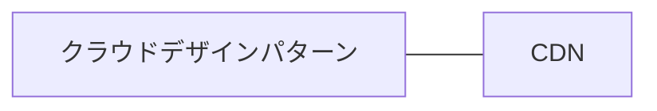
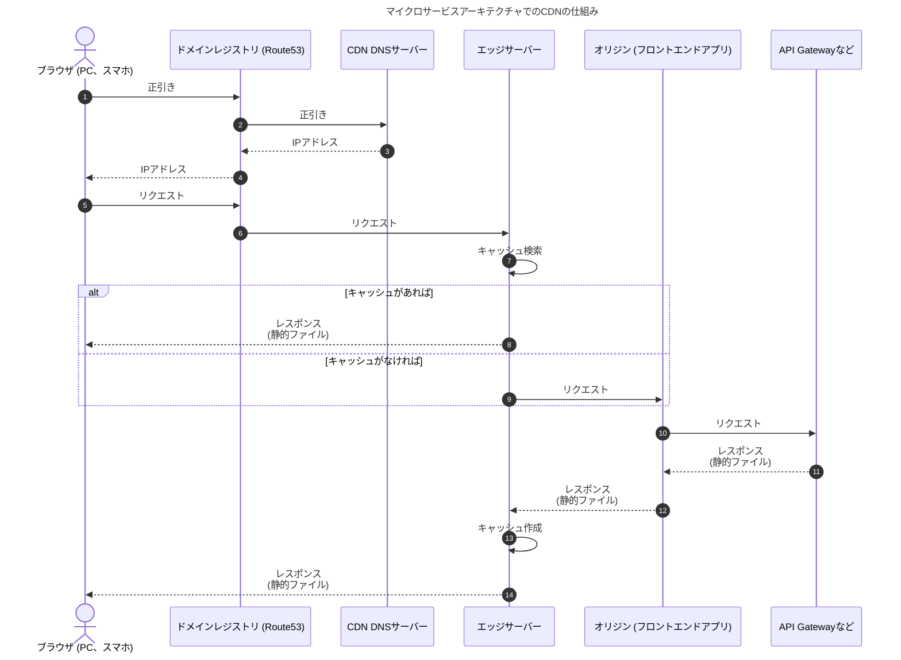

# キャッシュ＠マイクロサービスアーキテクチャ

## はじめに

本サイトにつきまして、以下をご認識のほど宜しくお願いいたします。

> - https://hiroki-it.github.io/tech-notebook/

 

## フロントエンド

### CDN パターン

CDN パターンは、クラウドアーキテクチャで採用できるパターンです。

CDN パターンでは、物理的に世界の様々な場所にあるエッジサーバーがキャッシュサーバーとして機能します。

CDN パターンはマイクロサービスアーキテクチャとは直接的な関連性が低いです。

ただ、マイクロサービスアーキテクチャでこれを採用すると仕組みが複雑になるため、概説します。

[Cloud Architecture Patterns](https://www.oreilly.com/library/view/cloud-architecture-patterns/9781449357979/ch14.html)

#### ▼ キャッシュ返却処理のシーケンス

CDN の仕組みでは、オリジン (フロントエンドアプリ) のダウンストリームに、CDN DNS サーバーとエッジサーバーを配置します。

エッジサーバーのデータセンターは様々な場所にあります。

ブラウザ (PC、スマホ) の送信元からもっとも近いデータセンターにあるエッジサーバーが、静的ファイルのキャッシュを作成し、レスポンスします。

以下のシーケンス図では、マイクロサービスアーキテクチャでの CDN の仕組みを解説しています。

[How CloudFront delivers content - Amazon CloudFront](https://docs.aws.amazon.com/AmazonCloudFront/latest/DeveloperGuide/HowCloudFrontWorks.html#HowCloudFrontWorksContentDelivery)

 

## バックエンド

### Cache-Aside

#### ▼ Cache-Asideとは

一度、Read処理したデータをDBとは別のキャッシュストレージに保存しておく。

#### ▼ AWSの場合

1. Redisを読む
2. ミスしたらAuroraのトランザクションで読む
3. Amazon AuroraのトランザクションをCOMMIT
4. 読み取った結果をRedisへ保存
5. 呼び出し元へ返す

 

### Read-Through

キャッシュストレージの裏側にDBをおいておく。

まずはキャッシュストレージからデータを取得し、もしキャッシュがなければキャッシュストレージがDBからデータを取得する。

 
