# クラウドネイティブ技術を使用したマイクロサービスアーキテクチャの設計例

この文章は、『Kubernetes で実践する Platform Engineering』の補章 (クラウドネイティブ技術とマイクロサービスアーキテクチャのつながり) を個人的に改訂したものです！

> - https://www.amazon.co.jp/dp/4798188379

 

## 1 はじめに

著者の Mauricio Salatino 氏はマイクロサービスアーキテクチャのアプリケーションを稼働させるクラウドネイティブ技術に着目し、その実践方法を解説してくれました。

クラウドネイティブ技術とマイクロサービスアーキテクチャは相互に影響を与えながら進歩してきた分野です。

CNCF はクラウドネイティブ技術を次のように定義づけており、この技術がマイクロサービスアーキテクチャの構築と実行に適していることがわかります \*1 。

> クラウドネイティブ技術は、パブリッククラウド、プライベートクラウド、ハイブリッドクラウドなどの近代的でダイナミックな環境において、スケーラブルなアプリケーションを構築および実行するための能力を組織にもたらします。

このアプローチの代表例に、コンテナ、サービスメッシュ、マイクロサービス、イミュータブルインフラストラクチャー、および宣言型 API があります。

本書の各章では、以下のように言及しています。

- 1〜2 章：マイクロサービスアーキテクチャのアプリケーションの特徴
- 3〜4 章：CI/CD によるアプリケーションのユーザー提供
- 5～6 章：インフラストラクチャーとプラットフォームの作成
- 7 章：API によるプラットフォーム機能の開発者提供
- 8 章：さまざまなリリース戦略の活用
- 9 章：パフォーマンスの測定

補章では、マイクロサービスアーキテクチャをさらに深掘りし、マイクロサービスアーキテクチャとクラウドネイティブとの関係性を重点的に取り上げます。

まずは、マイクロサービスアーキテクチャのデザインパターンを取り上げます。

そして、各デザインパターンがどのようなクラウドネイティブ技術で代替できるのかを概説します。

私が現場で見てきた実際のマイクロサービスアーキテクチャの設計、関連書籍、本書のウォーキングスケルトン (1〜2 章) などに基づいて、クラウドネイティブ技術を使用したマイクロサービスアーキテクチャの設計例を図で示します。

---

注釈

\*1 https://github.com/cncf/toc/blob/main/DEFINITION.md

 

## 2 歴史

### 2.1 クラウドネイティブ技術

CNCF の定義のとおり、クラウドネイティブ技術はパブリッククラウド、プライベートクラウド、ハイブリッドクラウドなどでスケーラブルなアプリケーションを実現します。

これまでに AWS などのパブリッククラウド、Kubernetes、そして Kubernetes を基盤としたクラウドネイティブ技術が登場しました \*1 。

表 1 で代表的なクラウドネイティブ技術の歴史を整理します。

2024 年の執筆時点で約 20 分野のクラウドネイティブ技術が登場しており、今後も増え続けていくでしょう。

 

表 1. クラウドネイティブ技術に関連する歴史

| 年代       | 技術                             | 説明                                                                                                                                                           |
| ---------- | -------------------------------- | -------------------------------------------------------------------------------------------------------------------------------------------------------------- |
| 2004-2006  | AWS                              | AmazonはクラウドサービスとしてSQSを公開した。その後、AWSはS3やEC2の提供も始めた \*2 。                                                                         |
| 2008       | Google Cloud                     | GoogleはクラウドサービスとしてApp Engineを公開した \*3 。                                                                                                      |
| 2009       | Heroku                           | HerokuはPaaSとしてHerokuを公開した \*4 。                                                                                                                      |
| 2010       | Azure、OpenStack                 | MicrosoftはクラウドサービスとしてWindows Azureを公開した *5 。また、Rackspace HostingとNASAはユーザー独自のIaaSを構築できるOpenStackを公開した *6 。           |
| 2011       | Cloud Foundry                    | VMwareはユーザー独自のPaaSを構築できるCloud Foundryを公開した \*7 。                                                                                           |
| 2013       | Docker                           | dotCloudは仮想化技術としてコンテナを公開した \*8 。                                                                                                            |
| 2014〜2015 | Kubernetes                       | GoogleはコンテナオーケストレーションツールとしてKubernetesを発表した。またKubernetes v1.0のリリースに合わせて、GoogleとLinux FoundationがCNCFを設立した \*9 。 |
| 2014〜     | 約20分野のクラウドネイティブ技術 | CNCFでは約20分野に渡るクラウドネイティブ技術が登場した \*10 。                                                                                                 |

---

注釈

\*2 CNCF Overview 2024 (https://docs.google.com/presentation/d/1UGewu4MMYZobunfKr5sOGXsspcLOH_5XeCLyOHKh9LU/edit#slide=id.gc98d72cd14_1_2266)

\*3 https://en.wikipedia.org/wiki/Amazon_Web_Services

\*4 https://en.wikipedia.org/wiki/Google_Cloud_Platform

\*5 https://en.wikipedia.org/wiki/Heroku

\*6 https://en.wikipedia.org/wiki/Microsoft_Azure

\*7 https://en.wikipedia.org/wiki/OpenStack

\*8 https://en.wikipedia.org/wiki/Cloud_Foundry

\*9 [https://en.wikipedia.org/wiki/Docker\_(software) ](<https://en.wikipedia.org/wiki/Docker_(software)>)

\*10 https://en.wikipedia.org/wiki/Kubernetes

\*11 分野の種類は補章 3 節の表 3 で取り上げています。最新の分野は CNCF Landscape (https://landscape.cncf.io/) を参照してください。

 

### 2.2 マイクロサービスアーキテクチャ

マイクロサービスアーキテクチャは、アプリケーションのビジネスロジックを複数の独立したサービスに分割し、アプリケーション全体をサービスの集合体として動作させる設計手法です。

マイクロサービスアーキテクチャに関連するアーキテクチャスタイルがいくつかあります \*11 。

表 2 でマイクロサービスアーキテクチャに関連するアーキテクチャスタイルの歴史を整理します。

マイクロサービスアーキテクチャの登場前に、これの前身となるサービス指向アーキテクチャが登場した。さらに、マイクロサービスアーキテクチャに貢献するドメイン駆動設計 (ドメイン駆動設計) も登場した。

また、マイクロサービスアーキテクチャ以降にはモジュラーモノリスアーキテクチャなどが登場しました。

マイクロサービスアーキテクチャ特有の問題を解決するために、さまざまなデザインパターンが提唱されています。

 

### 2.2 マイクロサービスアーキテクチャの歴史

#### 関連アーキテクチャの歴史

マイクロサービスアーキテクチャはどのような経緯で登場したのでしょうか。マイクロサービスアーキテクチャの歴史とサービスメッシュの登場時期を次のとおりに図解しました。

図 1. 関連アーキテクチャの歴史

2014 年にマイクロサービスアーキテクチャが登場するまでに、いくつかのアーキテクチャスタイルが登場しました。のちに解説するサービスメッシュはマイクロサービスアーキテクチャの課題を解決する概念として 2016 年に登場しました。

表 2. マイクロサービスアーキテクチャに関連する歴史

| 登場年                         | アーキテクチャスタイル           | 提唱者（アルファベット順）   | 概要                                                                                           |
| ------------------------------ | -------------------------------- | ---------------------------- | ---------------------------------------------------------------------------------------------- |
| 1999                           | モノリスアーキテクチャ           | 自然発生的                   | アプリケーションのすべてのロジックを単一のプロセスで稼働させ、また全体をリリースする。         |
| 1990年代後半〜 2000年代前半 | サービス指向アーキテクチャ       | Michael Bell、Thomas Erlなど | アプリケーションを『機能』の粒度で分割する。                                                   |
| 2003                           | ドメイン駆動設計                 | Eric Evans                   | オブジェクト指向分析設計のベタープラクティスを集め、機能ロジックのモデリングを強化する。       |
| 2003                           | プレゼンテーション・ドメイン分離 | Martin Fowler                | フロントエンド領域をバックエンド領域の機能ロジックから切り離す。                               |
| 2014                           | マイクロサービスアーキテクチャ   | James Lewis、Martin Fowler   | アプリケーションをドメイン駆動設計の『集約』や『境界づけられたコンテキスト』の粒度で分割する。 |

#### ◼︎ 1999年：モノリスアーキテクチャ

マイクロサービスアーキテクチャの登場前、1999 年頃、アプリケーションはモノリスアーキテクチャで設計することが一般的でした \*20 。

モノリスアーキテクチャでは、アプリケーションのすべてのロジックを単一のプロセスで稼働させ、また全体をリリースします。開発組織や対象ドメインが成長初期で小さい場合、機能ロジック追加やリリースは容易です。しかし、開発組織や対象ドメインが成長して大きくなると、機能ロジック追加やリリースによる影響範囲の大きさ、分業のしにくさ、技術スタックの部分最適化のしにくさなどの課題が生じ始めました。のちに提唱されるプレゼンテーション・ドメイン分離やマイクロサービスアーキテクチャでは、機能／非機能ロジックを細分化することを目指します。

#### ◼︎ 1990年代後半〜2000年代前半：サービス指向アーキテクチャ

1900 年代後半から 2000 年代前半頃、Michael Bell や Thomas Erl らがサービス指向アーキテクチャを提唱しました \*21 。

サービス指向アーキテクチャでは、アプリケーションを『機能』の粒度で分割することで、モノリスアーキテクチャの課題を解決することを試みました。

ただ『機能』という粒度に明確な指針がありませんでした \*22 。

そのため、概念としては提唱されていても一般化までには至りませんでした。

#### ◼︎ 2003年：ドメイン駆動設計

2003 年頃、Eric Evans はドメイン駆動設計を提唱しました \*23 。ドメイン駆動設計はオブジェクト指向分析設計から派生した分析設計の方法の一種であり、オブジェクト指向分析設計のベタープラクティスを集めることで、機能ロジックのモデリングを強化しました。

#### ◼︎ 2003年：プレゼンテーション・ドメイン分離

サービス指向アーキテクチャと同じ頃、Martin Fowler はプレゼンテーション・ドメイン分離を提唱しました \*24 。

プレゼンテーション・ドメイン分離では、ビジネスへの影響を抑えるため、バックエンド領域の機能ロジックから、ロジックの変更頻度の高いフロントエンドアプリケーションを切り離します。

#### ◼︎ 2014年：マイクロサービスアーキテクチャ

2014 年頃、Simon Brown は、モノリスアーキテクチャは時間経過とともに無秩序でつぎはぎだらけな『大きな泥団子』になり得ることを指摘しました \*25 。

それと同じ頃、Martin Fowler と James Lewis はマイクロサービスアーキテクチャを提唱しました \*26 。

マイクロサービスアーキテクチャでは、サービス指向アーキテクチャにドメイン駆動設計の考え方を取り入れます。

ドメイン駆動設計には、集約や境界づけられたコンテキストといった高凝集と低結合の考え方があります。

これらをマイクロサービスの粒度として捉えることで、サービス指向アーキテクチャをより実践的な理論に昇華させました。

---

注釈

\*12 Richards, M., & Ford, N. (2020). Fundamentals of software Architecture: An Engineering Approach. O’Reilly Media.

\*13 Wikipedia contributors. (2024). Monolithic application. Wikipedia. https://en.wikipedia.org/wiki/Monolithic_application

\*14 Wikipedia contributors. (2024a). Service-oriented architecture. Wikipedia. https://en.wikipedia.org/wiki/Service-oriented_architecture

\*15 Newman, S. (2021). Building microservices. O’Reilly Media, Inc.

\*16 Evans, E. (2004). Domain-driven design: Tackling Complexity in the Heart of Software. Addison-Wesley Professional.

\*17 Lewis, J. (n.d.). Microservices. http://martinfowler.com/. https://martinfowler.com/articles/microservices.html

\*18 Fowler, M. (n.d.). bliki: Brown, S. (2014). Distributed big balls of mud. http://dzone.com/. https://dzone.com/articles/distributed-big-balls-mud

\*19 Brown, S. (2014). Fowler, M. (n.d.). bliki: Monolith First. http://martinfowler.com/. https://martinfowler.com/bliki/ MonolithFirst.html

\*20 Richards, M., & Ford, N. (2020). 『Fundamentals of software Architecture: An Engineering Approach』 O'Reilly Media.

\*21 Wikipedia contributors. (2024). Monolithic application. Wikipedia. https://en.wikipedia.org/wiki/Monolithic_application

\*22 Wikipedia contributors. (2024a). Service-oriented architecture. Wikipedia. https://en.wikipedia.org/wiki/Service-oriented_architecture

\*23 Newman, S. (2021). 『Building microservices』 O'Reilly Media, Inc.

\*24 Evans, E. (2004). 『Domain-driven design: Tackling Complexity in the Heart of Software』 Addison-Wesley Professional.

\*25 Fowler, M. (n.d.). _bliki: Presentation Domain Separation_. martinfowler.com. https://martinfowler.com/bliki/PresentationDomainSeparation.html

\*26 Lewis, J. (n.d.). Microservices. http://martinfowler.com/. https://martinfowler.com/articles/microservices.html

 

## 3 マイクロサービスアーキテクチャに関連のあるクラウドネイティブ技術

CNCF では、オープンソースやクラウドプロバイダーのクラウドネイティブ技術をさまざまな分野に分類しています \*27 。

各分野には、マイクロサービスアーキテクチャに関連のあるクラウドネイティブ技術が多くあります。

表 3 でそれらを一覧で示します \*28 。

表では CNCF Landscape にある定義を参考して、各分野のマイクロサービスとの関連性を説明します。

1.1 節では、クラウドプロバイダーの使用に言及しています。

ここではクラウドプロバイダーのマネージドサービスを使用することにより、ビジネスアジリティの向上、低レイヤーの運用コストの軽減などの利点があると主張しています。

補章では、2024 年の執筆時点で特に人気の高いクラウドプロバイダーの AWS を主な例に挙げ、これのマネージドサービスを取り上げます。

 

表 3. マイクロサービスアーキテクチャに関連のあるクラウドネイティブ技術例の一覧

| 分野                                                                      | マイクロサービスとの関連性                                                                                                                       | 代表的なオープンソース                                                                                                                                     | 代表的なマネージドサービス                            |
| ------------------------------------------------------------------------- | ------------------------------------------------------------------------------------------------------------------------------------------------ | ---------------------------------------------------------------------------------------------------------------------------------------------------------- | ----------------------------------------------------- |
| API Gateway (APIゲートウェイ)                                             | マイクロサービスのAPIのコールに必要な汎用的機能を集中管理する。                                                                                  | ・Kong Gateway                                                                                                                                             | ・AWS (API Gateway)                                   |
| Application Definition & Image Build (アプリケーション定義とイメージ構築) | コンテナイメージからマイクロサービスを構築し、またデプロイする。                                                                                 | ・Docker Compose   ・Helm ・OpenAPI ・Packer                                                                                                      |                                                       |
| Automation & Configuration (自動化と設定)                                 | マイクロサービスのインフラストラクチャーのプロビジョニングを自動化する。                                                                         | ・Ansible ・Temporal ・Terraform                                                                                                                     | ・AWS (CloudFormation)                                |
| Chaos Engineering (カオスエンジニアリング)                                | システムの全体や一部に障害を注入し、システムの回復力をテストする。                                                                               | ・ChaosMesh ・Istio                                                                                                                                     | ・AWS (Fault Injection Simulator)                     |
| Cloud Native Network (クラウドネイティブネットワーク)                     | マイクロサービスがほかと通信するためのネットワークを作成する。                                                                                   | ・Cilium CNI                                                                                                                                               | ・AWS (VPC CNI)                                       |
| Cloud Native Storage (クラウドネイティブストレージ)                       | ファイルストレージ、オブジェクトストレージ、ブロックストレージなどとして各種データを保管する。                                                   | ・Ceph ・Longhorn                                                                                                                                       | ・AWS (EBS、S3)                                       |
| Coordination & Service Discovery (調整とサービス検出)                     | 各マイクロサービスがお互いに場所を特定できるようにする。                                                                                         | ・CoreDNS ・Etcd                                                                                                                                        | ・AWS (ECS Service Connect)                           |
| Container Registry (コンテナレジストリー)                                 | コンテナイメージの保管や提供などを集中管理する。                                                                                                 | ・Harbor                                                                                                                                                   | ・AWS (ECR)  ・Docker Hub                          |
| Container Runtime (コンテナランタイム)                                    | コンテナ内のアプリケーションを実行し、またハードウェアリソース (例えばCPU、ストレージ、メモリなど) を提供する。                                  | ・Containerd                                                                                                                                               |                                                       |
| Continuous Integration & Delivery (継続的インテグレーションとデリバリー)  | マイクロサービスの構築からデプロイまでに必要なタスクを自動化する。                                                                               | ・ArgoCD ・Dagger ・Flux ・Tekton                                                                                                                 | ・GitHub Actions                                      |
| Continuous Optimization (継続的最適化)                                    | CNCFに定義の記載なし。                                                                                                                           | ・Karpenter ・OpenCost                                                                                                                                  | ・AWS (Cost Explorer)                                 |
| Database (データベース)                                                   | RDBやNo SQL DBとしてマイクロサービスがデータを保管し、また取得できるようにする。                                                                 | ・MySQL<bt>・Redis                                                                                                                                         | ・AWS (Aurora MySQL、ElastiCache)                     |
| Feature Flagging (機能フラグ)                                             | CNCF Landscapeに定義の記載なし。                                                                                                                 | ・OpenFeature                                                                                                                                              | ・AWS (AppConfig)                                     |
| Key Management (キー管理)                                                 | 暗号化キーの作成、保管、そしてローテションを集中管理する。                                                                                       | ・Spire                                                                                                                                                    | ・AWS (KMS)                                           |
| Observability (オブザーバビリティー)                                      | さまざまなテレメトリーデータの作成、収集、保管、分析、可視化を実施する。                                                                         | ・Fluentd／FluentBit ・Grafana (Grafana、Loki、Mimir、Tempo)  ・Kiali ・OpenTelemetry (クライアントSDK、OpenTelemetry Collector)  ・Prometheus | ・AWS (CloudWatch Logs、CloudWatch Metrics、X-Ray)    |
| Platform (プラットフォーム)                                               | クラウドネイティブの各分野のツールを一括で提供する。                                                                                             | ・KinD<bt>・Minikube ・Rancher                                                                                                                          | ・AWS (EKS、Lambda)                                   |
| Remote Procedure Call (リモートプロシージャコール)                        | マイクロサービスがほかのマイクロサービスにリクエストを送信できるようにする。                                                                     | ・gRPC                                                                                                                                                     |                                                       |
| Scheduling & Orchestration (スケジューリングとオーケストレーション)       | クラスター全体でコンテナを実行し、また管理する。                                                                                                 | ・Knative ・Kubernetes                                                                                                                                  | ・AWS (ECS)                                           |
| Security & Compliance (セキュリティとコンプライアンス)                    | 脆弱性を監視して脆弱性を検出する。また、マイクロサービスの認証認可を強化する。                                                                   | ・Cert Manager ・Falco ・Keycloak ・OAuth2 Proxy ・SOPS                                                                                        | ・AWS (Certificate Manager、Cognito、Secrets Manager) |
| Service Mesh (サービスメッシュ)                                           | 各マイクロサービスのロジックを変更することなく、マイクロサービス間の通信に信頼性、オブザーバビリティー、セキュリティ機能などを一律的に追加する。 | ・Istio ・Linkerd                                                                                                                                       | ・AWS (VPC Lattice、ECS Service Connect)              |
| Service Proxy (サービスプロキシ) \*29                                     | マイクロサービスからの送信されたリクエストを中継し、ほかのマイクロサービスにフォワーディングする。                                               | ・Envoy ・Nginx                                                                                                                                         | ・AWS (ALB)                                           |
| Streaming & Messaging (ストリーミングとメッセージング)                    | パブリッシャーから送信されたメッセージを中継し、他のサブスクライバーにフォワーディングする。                                                     | ・Apache Kafka ・CloudEvents ・RabbitMQ                                                                                                              | ・AWS (Kinesis、SQS)                                  |

---

注釈

\*27 CNCF はクラウドネイティブ技術の属する分類をしばしば変更します。最新の分類は CNCF Landscape (https://landscape.cncf.io/) を参照してください。

\*28 クラウドネイティブ技術には、人気があっても CNCF 未登録または分野未分類なものがあります。今回、登録済や分類済の技術を、便宜上、競合技術と同じ分野に記載しています。

\*29 Service Proxy 分野のツールは設定次第で API Gateway 分野のツールと同等に使用できます。

 

## 4 マイクロサービスアーキテクチャの構成領域

### 4.1 マイクロサービスアーキテクチャとは

まず、マイクロサービスアーキテクチャはどのような領域からなるのでしょうか？

図 1 と表 3 でモノリスアーキテクチャ、プレゼンテーション・ドメイン分離 (過渡的なアーキテクチャ) \*30 、マイクロサービスアーキテクチャの例を示しそれぞれの領域を簡単に比較します。

モノリスアーキテクチャからマイクロサービスアーキテクチャに至るまでに、領域が細分化されていきます。

図 2. マイクロサービスアーキテクチャに至るまでのアーキテクチャの変遷

 

### 4.2 関連アーキテクチャの構成領域の比較

サンプルアプリケーションはマイクロサービスアーキテクチャのため、ここでマイクロサービスアーキテクチャの構成領域を解説します。

モノリスアーキテクチャ、プレゼンテーション・ドメイン分離、マイクロサービスアーキテクチャを簡単に比較します。

いずれのアーキテクチャも、アプリケーションと各種ストレージ（ブロックストレージ、キーバリューストレージ、オブジェクトストレージ、ファイルストレージ）で構成されています。

データベースとしての RDB はブロックストレージに属しています。モノリスアーキテクチャ、プレゼンテーション・ドメイン分離、マイクロサービスアーキテクチャの比較を次の表のとおりに整理しました。

表 4. マイクロサービスアーキテクチャに至るまでのアーキテクチャ間の比較

|                                | モノリスアーキテクチャ                     | プレゼンテーション・ドメイン分離                                                       | マイクロサービスアーキテクチャ                                                                          |
| ------------------------------ | ------------------------------------------ | -------------------------------------------------------------------------------------- | ------------------------------------------------------------------------------------------------------- |
| **プロセスの単位**             | ・アプリケーション全体 ・各種ストレージ | ・フロントエンドアプリケーション ・バックエンドアプリケーション ・各種ストレージ | ・フロントエンドアプリケーション ・APIゲートウェイ（任意） ・マイクロサービス ・各種ストレージ |
| **機能ロジックリリースの単位** | アプリケーション全体                       | バックエンドアプリケーション                                                           | 各マイクロサービス                                                                                      |
| **各種ストレージの単位**       | アプリケーション全体に１つずつ             | アプリケーション全体に１つずつ                                                         | 各マイクロサービスに１つずつ、またはアプリケーション全体に１つずつ                                      |

 

### 4.3 モノリスアーキテクチャ

モノリスアーキテクチャでは、アプリケーションはフロントエンド領域とバックエンド領域で構成されています。

フロントエンド領域とバックエンド領域の領域は密結合になっており、両方は同じプロセスで稼働します。

そのため、モノリスアーキテクチャのアプリケーションのバックエンド領域の一部に機能ロジックを変更する場合、アプリケーション全体をリリースする必要があります。

 

### 4.4 プレゼンテーション・ドメイン分離

次にプレゼンテーション・ドメイン分離では、アプリケーションはフロントエンドアプリケーションとバックエンドアプリケーションで構成されています。

モノリスアーキテクチャと比較して、アプリケーションがフロントエンドアプリケーションとバックエンドアプリケーションに分割されており、両方は異なるプロセスで稼働します。

担当者は、これらを独立してリリースできます。ただし、プレゼンテーション・ドメイン分離のアプリケーションに機能ロジックを変更する場合、担当者はバックエンドアプリケーション全体をリリースする必要があります。

 

### 4.5 マイクロサービスアーキテクチャ

最後にマイクロサービスアーキテクチャでは、アプリケーションはフロントエンドアプリケーション、API ゲートウェイ（任意）、マイクロサービスで構成されています。

プレゼンテーション・ドメイン分離と比較して、　バックエンドがマイクロサービスに分割されており、バックエンドから API ゲートウェイを切り離す場合があるかもしれません。

そして、これらはすべて異なるプロセスで稼働する。

マイクロサービスの粒度には、ドメイン駆動設計の高凝集と低結合な粒度（例：集約、境界づけられたコンテキスト）を取り入れることが適切です。

機能ロジックを変更する場合、マイクロサービス担当者はその機能ロジックをもつマイクロサービスだけをリリースします。

---

注釈

\*30 Fowler, M. (n.d.). bliki: Presentation Domain Separation. http://martinfowler.com/. https://martinfowler.com/bliki/PresentationDomainSeparation.html

 

## 5 マイクロサービスアーキテクチャのデザインパターン

### 5.1 デザインパターンとクラウドネイティブ技術

マイクロサービスアーキテクチャでは技術的で組織的な特有の問題が起こります。

これを解決するために、マイクロサービスアーキテクチャの各領域でさまざまなデザインパターンが提唱されています *23~*28 。

各領域のデザインパターンは、そのすべてや一部をクラウドネイティブ技術で代替できます。

図 2 でマイクロサービスアーキテクチャの領域とクラウドネイティブ技術の関連性を示します。

色が濃いほど関連性が強く、クラウドネイティブ技術で代替できることを表しています。

アプリケーションの領域では機能的なロジックは関連性が低い一方で、非機能的なものほど関連性が強いです。

そしてインフラストラクチャーは全般的に関連性が強いです。

 

図 3. マイクロサービスアーキテクチャの領域とクラウドネイティブ技術の関連性

 

補章では、各領域でのさまざまなデザインパターンと具体的にいずれのクラウドネイティブ技術がデザインパターンに関連しているのかを概説します。

表 3 のオープンソースまたはマネージドサービス (主に AWS) を組み合わせ、マイクロサービスアーキテクチャの設計例を図で示します。

AWS の設計については、AWS Well-Architected Framework \*29 を合わせて読んでいただくことをお奨めします。

なお、マイクロサービスアーキテクチャで安易にマネージドなクラウドネイティブ技術を使用するべきではないと私は考えています。

なぜなら 1 つ目の理由として、マネージドサービスによってはオープンソースと比べてユーザーの設定できるオプションが少ないことを挙げます。

機能または非機能によらず拡張性の求められる場合には、オプションの少なさが拡張性の足かせになります。

2 つ目の理由として、マネージドサービスによってはアプリケーション領域とインフラストラクチャー領域の境界が曖昧なことを挙げます。

大きな開発組織になるほど、領域の境界の曖昧さによって開発組織で分業しにくくなっていきます。

これは結果的にビジネスのアジリティを低下させる可能性があります。

これらの理由からマイクロサービスアーキテクチャでは、マネージドサービスをオープンソースの代わりにどこまで使用すれば恩恵をよりよく受けられるのかを見極める必要があります。

例えば、前述の 2 つの理由で、マイクロサービスのデプロイ方法 (表 5 を参照) は FaaS や PaaS といったサーバーレスではなく、コンテナ (もっと具体的に言うと Kubernetes) がより適切であるという考えが私にはあります。

---

注釈

\*31 A pattern language for microservices. (n.d.). http://microservices.io/. https://microservices.io/patterns/index.html

\*32 Richardson, C. (2018). Microservices patterns: With examples in Java. Simon and Schuster.

\*33 Newman, S. (2021). Building microservices. O’Reilly Media, Inc.

\*34 Mezzalira, L. (2021). Building Micro-Frontends. O’Reilly Media, Inc.

\*35 Siriwardena, P., & Dias, N. (2020). Microservices Security in action. Manning Publications.

\*36 Ibryam, B., & Huss, R. (2023). Kubernetes patterns. O’Reilly Media, Inc.

\*37 AWS Well-Architected Framework - AWS Well-Architected Framework. (n.d.). https://docs.aws.amazon.com/wellarchitected/latest/framework/welcome.html

 

### 5.2 補章で取り上げるデザインパターングループ

補章では、さまざまな書籍 *31~*34 を参考にし、デザインパターンの分類を図式化しました。

前提として、対照的なデザインパターンをまとめたグループを『デザインパターングループ』と呼ぶことにします。

図 3 のように、マイクロサービスアーキテクチャを便宜上５つの問題領域に分け、そのなかにあるデザインパターングループとデザインパターンを取り上げます。

 

図 4. 補章で取り上げるアーキテクチャの問題領域

 

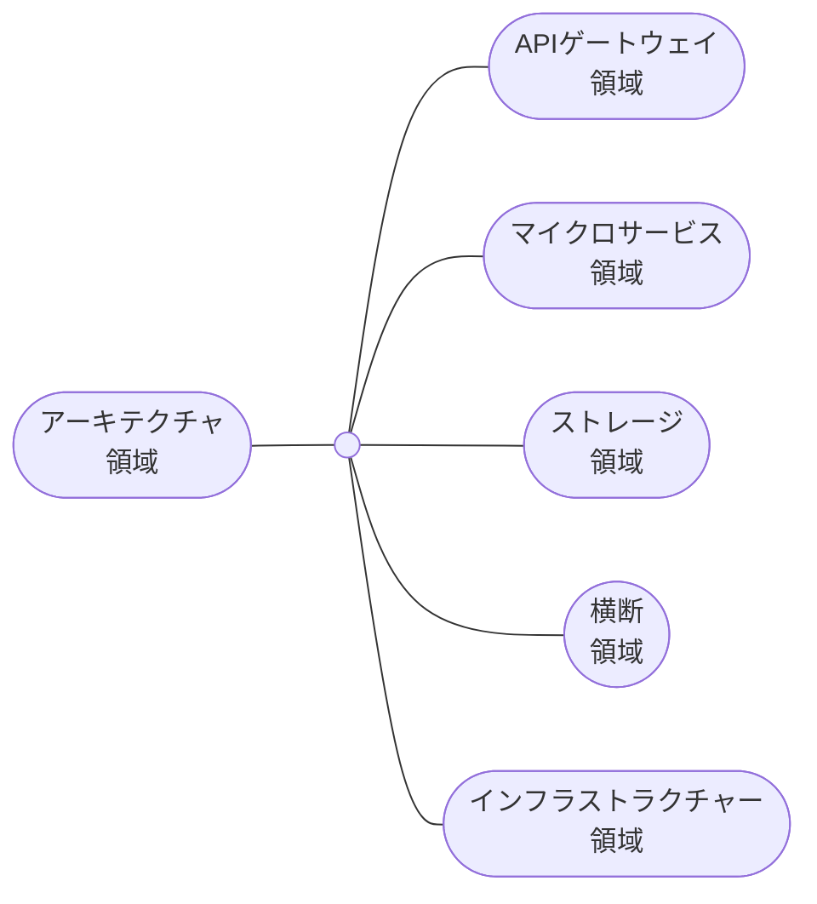
```mermaid
flowchart LR

  アーキテクチャ領域([アーキテクチャ<br>領域]) --- 基点(( ))
  基点 --- APIゲートウェイ領域([APIゲートウェイ<br>領域])
  基点 --- マイクロサービス領域([マイクロサービス<br>領域])
  基点 --- ストレージ領域([ストレージ<br>領域])
  基点 --- 横断領域([横断<br>領域])
  基点 --- インフラストラクチャー領域([インフラストラクチャー<br>領域])
```

デザインパターングループは他にも多くあります。

表 5 で、取り上げられなかったデザインパターングループを含むすべてのパターンを簡単に示します。

なお図 2 で示したように、非機能なロジックほどクラウドネイティブ技術と関連性が強く、クラウドネイティブ技術を使用して代替できます。

デザインパターングループを網羅的に学びたい読者は Microservices.io サイト *30 、Microservices patterns 本 *31 、Building Microservices 本 *32 、そして Building Micro-Frontends 本 *33 を読んでいただくことをお薦めします。

表 5. すべてのデザインパターンの一覧

| 問題領域         | 目的                           | デザインパターン名 ・：共存関係 ／：競合関係                                                                                                                                                                                                                                                                                                        |
| ---------------- | ------------------------------ | --------------------------------------------------------------------------------------------------------------------------------------------------------------------------------------------------------------------------------------------------------------------------------------------------------------------------------------------------------- |
| フロントエンド   | フロントエンドの分割           | モノリスフロントエンド／マイクロフロントエンド                                                                                                                                                                                                                                                                                                            |
|                  | UIレンダリングパターン         | CSR／SSR／SSG／ISR                                                                                                                                                                                                                                                                                                                                        |
| APIゲートウェイ  | APIゲートウェイの分割          | 中央集約ゲートウェイ／BFF                                                                                                                                                                                                                                                                                                                                 |
| マイクロサービス | マイクロサービス間の通信       | ・リクエスト／レスポンス方式 ・パブリッシュ／サブスクライブ方式 ・ストリーミング方式 ・データ共有方式                                                                                                                                                                                                                                            |
|                  | マイクロサービスの分割         | ・ドメイン駆動設計に基づく境界 ・認証マイクロサービス ・認可マイクロサービス ・オーケストレーションマイクロサービス ・外部API接続サービス ・非同期処理に特化した機能サービス (例：メール／プッシュ通知の機能)  ・リアルタイム処理に特化した機能サービス ・永続データの機密度 (例：換金性の高い情報)  ・永続データの所有組織の差異 |
|                  | マイクロサービスの設計         | ・エンティティや値オブジェクトなどのドメイン駆動設計デザインパターン ・レイヤードアーキテクチャやクリーンアーキテクチャなどのアプリケーションアーキテクチャ                                                                                                                                                                                            |
|                  | ドメインモデリング             | ステートソーシング／イベントソーシング                                                                                                                                                                                                                                                                                                                    |
|                  | トランザクションの管理         | オーケストレーションサーガ／コレオグラフィサーガ／２フェーズコミット                                                                                                                                                                                                                                                                                      |
|                  | 認証                           | セッション／SSO／JWTとAPIゲートウェイの組み合わせ                                                                                                                                                                                                                                                                                                         |
|                  | 認可                           | 中央集中管理／分散管理                                                                                                                                                                                                                                                                                                                                    |
| ストレージ       | 永続データの分割管理           | ・DB per service／Shared DB ・Polyglot Persistence／Multi-model DB                                                                                                                                                                                                                                                                                     |
|                  | 揮発性データの分割管理         | 中央集中管理／分散管理                                                                                                                                                                                                                                                                                                                                    |
|                  | 静的ファイルの分割管理         | 中央集中管理／分散管理                                                                                                                                                                                                                                                                                                                                    |
|                  | 分析用加工済データの分割管理   | 中央集中管理／分散管理                                                                                                                                                                                                                                                                                                                                    |
| ネットワーク     | L4/L7トラフィックの管理        | ・サービス検出 ・ロードバランシング                                                                                                                                                                                                                                                                                                                    |
|                  | 証明書の認証方式               | ・非TLS (平文)  ・サーバー認証 ・クライアント認証 ・相互TLS認証                                                                                                                                                                                                                                                                                  |
| テスト           | ホワイトボックステスト         | ・ユニットテスト ・サービステスト ・コントラクトテスト ・E2Eテスト                                                                                                                                                                                                                                                                               |
|                  | ブラックボックステスト         | ・ロードテスト (負荷テスト)  ・回帰テスト ・フォールトインジェクションを含むカオスエンジニアリング                                                                                                                                                                                                                                                  |
| 信頼性管理       | 各種インスタンスの回復         | ・ヘルスチェック ・リトライ ・タイムアウト ・バルクヘッド ・サーキットブレイカー ・レートリミット                                                                                                                                                                                                                                          |
|                  | 各種インスタンスのスケーリング | ・垂直スケーリング ・水平スケーリング ・インスタンスの希望数維持                                                                                                                                                                                                                                                                                    |
| デプロイメント   | マイクロサービス実行環境       | Serverless platforms／Multiple services instance per host／Service instance per VM／Service instance per container                                                                                                                                                                                                                                        |
|                  | リリース                       | ・インプレースデプロイメント ・ローリングデプロイメント ・カナリアリリース ・ブルー/グリーンデプロイメント                                                                                                                                                                                                                                       |
|                  | CI/CD                          | CIOps／GitOps                                                                                                                                                                                                                                                                                                                                             |
|                  | 汎用的なロジックの配布         | ・Externalized configuration ・Microservice chassis ・サービステンプレート ・サービスメッシュ                                                                                                                                                                                                                                                    |
| 監視             | テレメトリーの監視             | 中央集中管理／分散管理                                                                                                                                                                                                                                                                                                                                    |
|                  | インシデントの対処             | 中央集中管理／分散管理                                                                                                                                                                                                                                                                                                                                    |
| 開発体制         | 開発組織の編成                 | Collective ownership／Strong ownership                                                                                                                                                                                                                                                                                                                    |
|                  | リポジトリの編成               | モノレポ／ポリレポ                                                                                                                                                                                                                                                                                                                                        |

---

注釈

\*38 A pattern language for microservices. (n.d.). http://microservices.io/. https://microservices.io/patterns/index.html

\*39 Richardson, C. (2018). Microservices patterns: With examples in Java. Simon and Schuster.

\*40 Newman, S. (2021). Building microservices. O’Reilly Media, Inc.

\*41 Mezzalira, L. (2021). Building Micro-Frontends. O’Reilly Media, Inc.

 

### 5.3 凡例

図 4 で 5 章以降のデザインパターンの図の凡例を示します。

各図では丸ボックスをデザインパターングループ、四角ボックスをデザインパターンとして区別しています。

 

図 5. デザインパターンの図の凡例

 

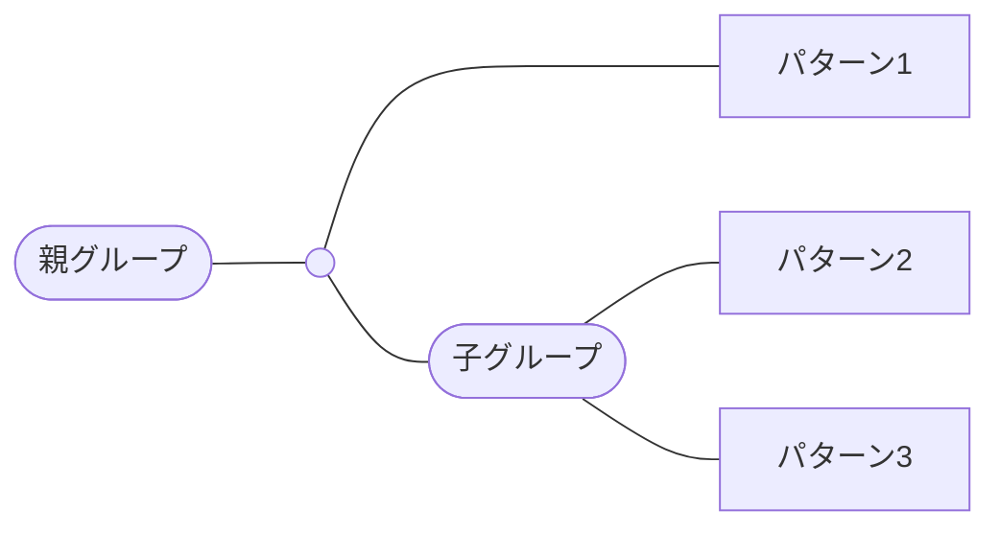
```mermaid
flowchart LR

  親グループ([親グループ]) --- 起点(( ))
  起点 ---- パターン1
  起点 --- 子グループ([子グループ])
  子グループ --- パターン2
  子グループ --- パターン3

```

## 6 APIゲートウェイ領域

API ゲートウェイ領域には API ゲートウェイを配置します。

マイクロサービスアーキテクチャでは、すべてのマイクロサービスの API をネットワークに公開する必要はありません。

API ゲートウェイを配置することにより、必要なマイクロサービスの API のみを公開して受信したリクエストを適切なマイクロサービスの API にルーティングできます。

図 5 で、API ゲートウェイ領域のデザインパターングループの種類を示します。

代表的なものには API ゲートウェイ分割方法があります。

 

図 6. API ゲートウェイ領域のデザインパターングループの種類

 

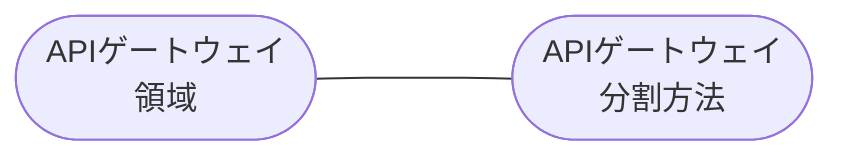
```mermaid
flowchart LR

  APIゲートウェイ領域([APIゲートウェイ<br>領域]) ---- APIゲートウェイ分割方法([APIゲートウェイ<br>分割方法])

```

### 6.1 APIゲートウェイ分割方法

API ゲートウェイを適切な結合度と凝集度で分割することにより、開発を分業しやすくし API ゲートウェイの拡張性や生産性を高められます。

図 6 で、API ゲートウェイ分割方法のデザインパターンの種類を示します。

代表的なものには中央集約ゲートウェイと BFF があります。

 

図 7. API ゲートウェイ分割方法のデザインパターンの種類

 

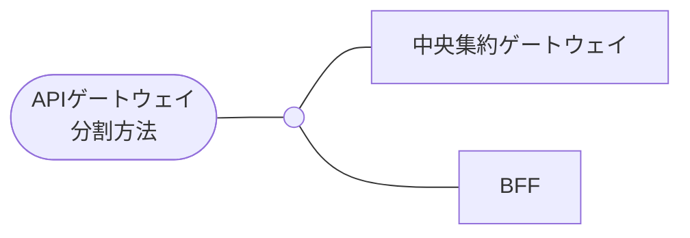
```mermaid
flowchart LR

  APIゲートウェイ分割方法([APIゲートウェイ<br>分割方法]) --- APIゲートウェイ分割方法の基点(( ))
  APIゲートウェイ分割方法の基点 --- 共有APIゲートウェイ[中央集約ゲートウェイ]
  APIゲートウェイ分割方法の基点 --- BFF


```

API ゲートウェイをクラウドネイティブ技術で代替できます。

表 6 で API ゲートウェイ分割方法とクラウドネイティブ技術の関連性を整理します。

ここでは、技術用語の API ゲートウェイと CNCF の API Gateway 分野を区別しています。

 

表 6. API ゲートウェイ分割方法とクラウドネイティブ技術の関連性

| パターン名                       | 中央集約ゲートウェイ                                                                                                                               | BFF                                                                                                                                        |
| -------------------------------- | -------------------------------------------------------------------------------------------------------------------------------------------------- | ------------------------------------------------------------------------------------------------------------------------------------------ |
| 説明                             | 各クライアントで共有するAPIゲートウェイを配置する。APIゲートウェイには、各クライアントからのすべてのリクエストを想定したエンドポイントを実装する。 | クライアント別のAPIゲートウェイを配置する。APIゲートウェイには、特定のクライアントからのリクエストを想定したエンドポイントだけを実装する。 |
| クラウドネイティブ技術との関連性 | 中央集約ゲートウェイとしてService Proxy、Service Mesh、API Gateway分野のツールを使用できる。                                                       | BFFとしてService Proxy、Service Mesh、API Gateway分野のツールを使用できる。                                                                |
| 技術例                           | ・Service Proxy (Nginx)  ・Service Mesh (Istio)                                                                                                 | ・Service Proxy (Nginx)  ・Service Mesh (Istio)                                                                                         |

 
図7でBFFの配置例を示します。

BFF として Service Proxy、Service Mesh、API Gateway 分野のツールを使用できます。

例えば、Nginx は API ゲートウェイとして動作します \*41 。

クライアント別 (PC ブラウザ SPA、スマホ SPA、外部 API など) に Nginx を配置します。

各クライアントは対応する Nginx (PC ブラウザ用、スマホブラウザ用 BFF、外部 API 用 BFF など) にリクエストを送信し、各 Nginx は適切なマイクロサービスの API にこれをルーティングします。

API ゲートウェイとして使用できるツールは Nginx 以外にも非常に多くあります。

ただ、そのなかでも Nginx は環境構築や設定の方法が簡単で扱いやすく、またこれらの情報をインターネットや書籍から見つけやすいため、私の好みのツールです。

なお、GraphQL サーバーを BFF として使用する設計方法もあります。

この場合、フロントエンドや外部 API は GraphQL クライアントとして設計する必要があります。

 

図 8. BFF の配置例

 

図 8 で Amazon EKS 上での BFF の設計例を示します。

マイクロサービスアーキテクチャの API ゲートウェイ領域には、図 7 と同様にクライアント別の Nginx を配置します。

もし Nginx で BFF としての要件を満たせなくとも、Istio と組み合わせることにより足りない機能を補完できます。

なお、Istio の提供する Istio Ingress Gateway と Istio Egress Gateway はメッシュゲートウェイと呼ばれ、API ゲートウェイと似た名前をもちます。

ただ、API ゲートウェイとは異なる役割を持ちます \*42 。

 

図 9. Amazon EKS 上での BFF の設計例

 

---

注釈

\*42 DeJonghe, D. (2022). NGINX Cookbook. O’Reilly Media, Inc.

\*43 Gough, J., Bryant, D., & Auburn, M. (2021). Mastering API architecture. O’Reilly Media, Inc.

 

## 7 マイクロサービス領域

マイクロサービス領域には、適切に分割された複数のバックエンドアプリケーション (マイクロサービス) を配置します。

図 9 で、マイクロサービス領域のデザインパターングループの種類を示します。

代表的なものにはマイクロサービス間通信方法、マイクロサービス分割方法、マイクロサービス設計方法、ドメインモデリング方法、トランザクション管理方法、認証認可があります。

 

図 10. マイクロサービス領域のデザインパターングループの種類

 

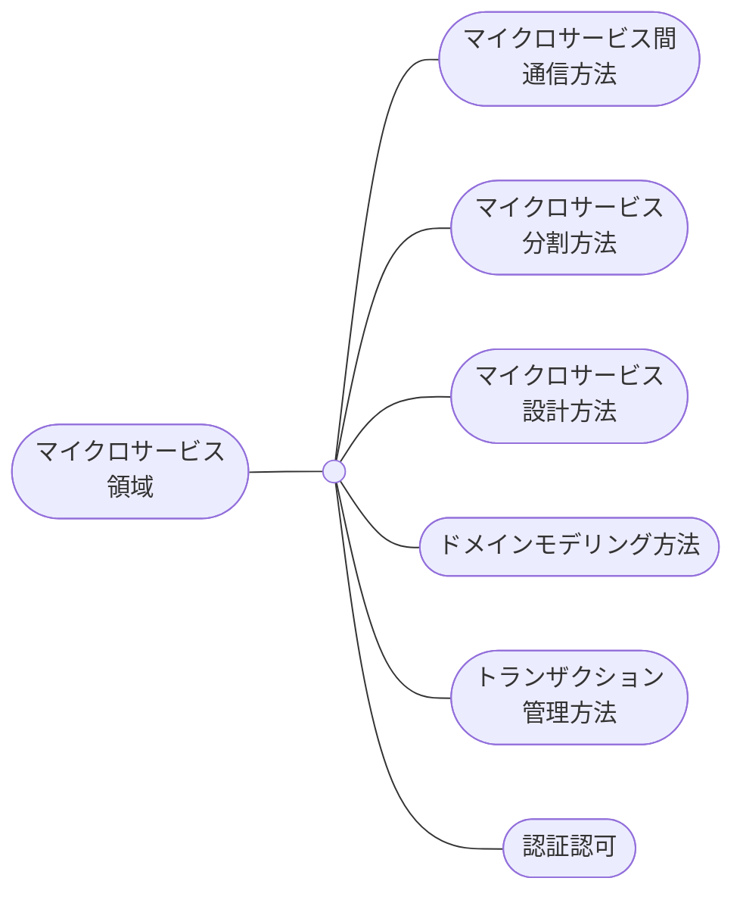
```mermaid
flowchart LR

  マイクロサービス領域([マイクロサービス<br>領域]) --- マイクロサービス領域の基点(( ))
  マイクロサービス領域の基点 --- マイクロサービス間通信方法([マイクロサービス間<br>通信方法])
  マイクロサービス領域の基点 --- マイクロサービス分割方法([マイクロサービス<br>分割方法])
  マイクロサービス領域の基点 --- マイクロサービス設計方法([マイクロサービス<br>設計方法])
  マイクロサービス領域の基点 --- ドメインモデリング方法([ドメインモデリング方法])
  マイクロサービス領域の基点 --- トランザクション管理方法([トランザクション<br>管理方法])
  マイクロサービス領域の基点 --- 認証認可([認証認可])

```

### 7.1 マイクロサービス間通信方法

マイクロサービス間を適切な方法で通信することにより、効率的で障害を解決しやすいマイクロサービスアーキテクチャを実現できます。

図 10 で、マイクロサービス間通信方法のデザインパターンの種類を示します。

代表的なものには、リクエスト／レスポンス方式、パブリッシュ／サブスクライブ方式、ストリーミング、データ共有方式があります。

 

図 11. マイクロサービス間通信方法のデザインパターンの種類

 

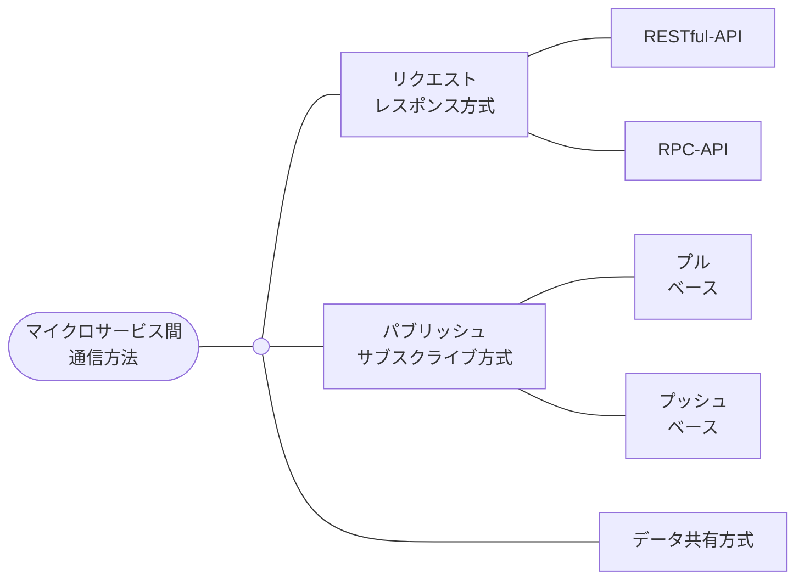
```mermaid
flowchart LR

  マイクロサービス間通信方法([マイクロサービス間<br>通信方法]) --- マイクロサービス間通信方法の基点(( ))
マイクロサービス間通信方法の基点 --- リクエストレスポンス方式[リクエスト<br>レスポンス方式]
リクエストレスポンス方式 --- RESTful-API
リクエストレスポンス方式 --- RPC-API
  マイクロサービス間通信方法の基点 --- パブリッシュサブスクライブ[パブリッシュ<br>サブスクライブ方式]
  パブリッシュサブスクライブ --- プル型[プル<br>ベース]
  パブリッシュサブスクライブ --- プッシュ型[プッシュ<br>ベース]
  マイクロサービス間通信方法の基点 ---- データ共有方式[データ共有方式]

```

リクエスト／レスポンス方式には RESTful-API と RPC-API があります。

パブリッシュ／サブスクライブ方式にはプル型とプッシュ型があります \*43 。

そしてデータ共有方式があります。

各マイクロサービスをどのようにモデリングしているか (例えば、ステートソーシングやイベントソーシング)
に応じて、リクエスト／レスポンス方式とパブリッシュ／サブスクライブ方式のいずれが適しているかが異なります。

これらのパターンのロジックはクラウドネイティブ技術で代替できます。

表 7 で、マイクロサービス間通信方法とクラウドネイティブ技術の関連性を整理します。

 

表 7. マイクロサービス間通信方法とクラウドネイティブ技術の関連性

| パターン名                       | リクエスト／レスポンス方式                                                                                                                           | パブリッシュ／サブスクライブ方式                                                                                                                                                                                                                                              | ストリーミング方式 | データ共有方式                                                                                                                                                                                                                                                                   |
| -------------------------------- | ---------------------------------------------------------------------------------------------------------------------------------------------------- | ----------------------------------------------------------------------------------------------------------------------------------------------------------------------------------------------------------------------------------------------------------------------------- | ------------------ | -------------------------------------------------------------------------------------------------------------------------------------------------------------------------------------------------------------------------------------------------------------------------------- |
| 説明                             | 送信元マイクロサービスは宛先と同期的に通信する。通信は双方向に流れる。                                                                               | 送信元マイクロサービスはメッセージ中継システム \*44 を介して、宛先マイクロサービスと非同期的に通信する。通信は単方向に流れる。                                                                                                                                                |                    | 送信元マイクロサービスは作成したデータをストレージに保管する。宛先マイクロサービスはストレージをポーリングして新しいデータが追加され次第、ストレージからこれを読み込む。通信は単方向に流れる。このパターンの例として、データレイクやデータウェアハウスを使用したシステムがある。 |
| クラウドネイティブ技術との関連性 | RESTの実装方法として、HTTP/1.1でテキストを送受信するパッケージを使用できる。一方で、RPCの実装方法にはRemote Procedure Call分野のツールを使用できる。 | メッセージ中継システムとして、Streaming & Messaging分野のツールを使用できる。また、パブリッシュとサブスクライブの実装方法として、Streaming & Messaging分野のツールのクライアントSDKを使用できる。サブスクライブにはプル型とプッシュ型があり、ツールによってはこれらを選べる。 |                    | ストレージとして、Cloud Native StorageやDatabase分野のツールを使用できる。耐障害性の観点から、これらはオープンソースよりマネージドサービスの技術を使用することをお奨めする。                                                                                                     |
| 技術例                           | ・REST (パッケージ)  ・Remote Procedure Call (gRPC)                                                                                               | ・Streaming & Messaging (CloudEvents、RabbitMQ)                                                                                                                                                                                                                               |                    | ・Cloud Native Storage (Amazon S3)  ・Database (Amazon Aurora MySQL)                                                                                                                                                                                                          |

 
図11で、マイクロサービス間のリクエスト／レスポンス方式による通信の様子を示します。

ここでは Kubernetes Pod をマイクロサービスとして表します。

送信元マイクロサービスは宛先と同期的に双方向で通信します。

 

図 12. マイクロサービス間のリクエスト／レスポンス方式による通信の様子

 

図 12 で、Amazon EKS 上でのリクエスト／レスポンス方式の設計例を示します。

ここでは Kubernetes Pod をマイクロサービスとして表しており、関連するほかの Kubernetes リソースを省略しています。

リクエスト／レスポンス方式のクライアントとサーバーとして、HTTP/1.1 でテキスト (JSON、XML) を送受信するパッケージや Remote
Procedure Call 分野のツールを使用できます。

例えば、マイクロサービスアーキテクチャで gRPC を使用する場合、マイクロサービスのインフラストラクチャーレイヤーに gRPC 関連の処理を配置することをお奨めします \*45 。

マイクロサービスの gRPC クライアントは宛先マイクロサービスの gRPC サーバーと通信します。

マイクロサービスではなくフロントエンドと BFF に関する通信にも言及しておきます。

フロントエンドの RESTful クライアントは BFF の Nginx の RESTful サーバーと通信します。

Nginc は gRPC サーバーまたは RESTful サーバーと通信し、もし gRPC サーバーと通信する場合は専用のモジュールが必要です \*46 。

 

図 13. Amazon EKS 上でのリクエスト／レスポンス方式の設計例

 

---

注釈

\*44 Richardson, C. (2018). Microservices patterns: With examples in Java. Simon and Schuster.

\*45 メッセージ中継システムの種類として、メッセージブローカー、メッセージキュー、およびイベントバスがあります。

\*46 Vandeperre, M. (2023b, October 18). Implementing clean architecture solutions: A practical example | Red Hat Developer. Red Hat Developer. https://developers.redhat.com/articles/2023/08/08/implementing-clean-architecture-solutions-practical-example

\*47 Module ngx_http_grpc_module. (n.d.). https://nginx.org/en/docs/http/ngx_http_grpc_module.html

 

### 7.2 マイクロサービス分割方法

マイクロサービスの分割はマイクロサービスアーキテクチャの設計のなかで最重要な問題であり、技術的な難易度も非常に高いです。

分割のための境界を見つけるためには各マイクロサービスの凝集度、結合度、そして情報隠蔽度に着目するべきです \*47 。

図 13 で、マイクロサービス分割方法のデザインパターンの種類を示します。

代表的なものには、ドメイン駆動設計に基づく境界、認証マイクロサービス、認可マイクロサービス、オーケストレーションマイクロサービス、外部 API 接続サービス、非同期処理に特化した機能サービス (例：メール／プッシュ通知機能など) 、リアルタイム処理に特化した機能サービス、永続データの機密度 (例：換金性の高い情報) 、永続データの所有組織があります。

また、ドメイン駆動設計に基づく境界には境界づけられたコンテキストと 1 つ以上の集約 \*48 があります。

 

図 14. マイクロサービス分割方法のデザインパターンの種類

 

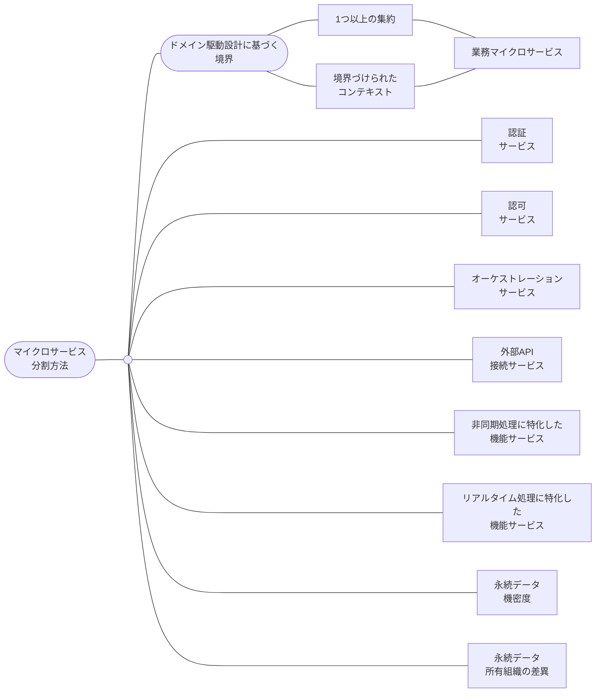
```mermaid
flowchart LR
  マイクロサービス分割方法([マイクロサービス<br>分割方法]) --- マイクロサービス分割方法の基点(( ))
  マイクロサービス分割方法の基点 --- ドメイン駆動設計に基づく境界([ドメイン駆動設計に基づく<br>境界])
  ドメイン駆動設計に基づく境界 --- 境界づけられたコンテキスト[境界づけられた<br>コンテキスト]
  ドメイン駆動設計に基づく境界 --- 1つ以上のルートエンティティ群[1つ以上の集約]
  1つ以上のルートエンティティ群 --- 業務マイクロサービス
  境界づけられたコンテキスト --- 業務マイクロサービス
  マイクロサービス分割方法の基点 ----- 認証マイクロサービス[認証<br>サービス]
  マイクロサービス分割方法の基点 ----- 認可マイクロサービス[認可<br>サービス]
  マイクロサービス分割方法の基点 ----- オーケストレーションマイクロサービス[オーケストレーション<br>サービス]
  マイクロサービス分割方法の基点 ----- 外部API接続サービス[外部API<br>接続サービス]
  マイクロサービス分割方法の基点 ----- 非同期処理に特化した機能サービス[非同期処理に特化した<br>機能サービス]
  マイクロサービス分割方法の基点 ----- リアルタイム処理に特化した機能サービス[リアルタイム処理に特化した<br>機能サービス]
  マイクロサービス分割方法の基点 ----- 永続データの機密度[永続データ<br>機密度<br>]
  マイクロサービス分割方法の基点 ----- 永続データの所有組織の差異[永続データ<br>所有組織の差異]
```

図 14 で、ドメイン駆動設計に基づく境界のパターンの関係性を示します。

ドメイン駆動設計の考え方をマイクロサービスアーキテクチャに取り入れることにより、適切な凝集度と結合度を持つマイクロサービスに分割できます。

マイクロサービスの大きさは 1 つの集約より大きく、境界づけられたコンテキストより小さくするべきでしょう *40 *42 。

これらの方法はクラウドネイティブ技術では代替できません。

ドメイン駆動設計はマイクロサービスアーキテクチャの文脈とは関係なく、非常に刺激的で興味深い分野です。

今回、ドメインの解決領域からいくつかの境界づけられたコンテキストや集約を切り離していく方法や、ドメイン駆動設計の戦略的設計から戦術的設計にかけた手順例などを補章で取り上げられませんでした。

そこで、ここでは関連書籍を少しだけ紹介します。

Learning Domain-Driven design 本 *42 は、ドメイン駆動設計の代表的な書籍である Domain-Driven design 本 *43 や Implementing Domain-Driven design 本 \*51 をわかりやすく解説しており、さらにマイクロサービス分割方法へのドメイン駆動設計の適用についても言及しています。

補章で登場したドメイン駆動設計の用語やデザインパターンは、Domain-Driven Design reference 本 \*52 で整理されています。

 

図 15. ドメイン駆動設計に基づくマイクロサービスの適切な大きさ

 

---

注釈

\*48 Newman, S. (2021). Building microservices. O’Reilly Media, Inc.

\*49 マイクロサービスを 1 つの集約よりも小さく分割するべきではありません。小さすぎるマイクロサービスから構成されるマイクロサービスアーキテクチャは分散した大きな泥団子と言われており、アンチパターンです。例えば、エンティティー単位で分割してしまうエンティティーサービスというアンチパターンがあります。The entity Service Antipattern - wide awake developers. (2017, December 5). https://www.michaelnygard.com/blog/2017/12/the-entity-service-antipattern/

\*50 Khononov, V. (2021) Learning Domain-Driven design: Aligning Software Architecture and Business Strategy. O’Reilly Media.

\*51 Evans, E. (2003) Domain-Driven design: Tackling Complexity in the Heart of Software. Addison-Wesley.

\*52 Vernon, V. (2013) Implementing Domain-Driven design. Addison-Wesley.

\*53 Evans, E. (2014) Domain-Driven Design reference: Definitions and Pattern Summaries. Dog Ear Publishing.

 

### 7.3 ドメインモデリング

マイクロサービスのドメインモデリングは分割に次いで重要な問題です。

図 15 で、マイクロサービスで採用しうるドメインモデリングのパターンの種類を示します。

代表的なものにはステートソーシングとイベントソーシングがあります。

ドメインモデリング方法の選定はマイクロサービス間通信方法に影響します。

 

図 16. メインモデリングのデザインパターンの種類

 

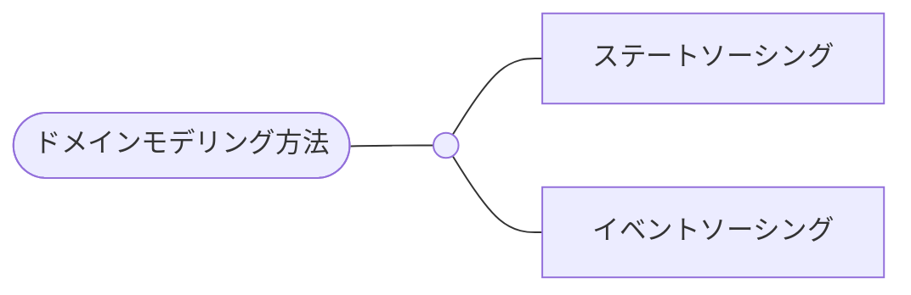
```mermaid
flowchart LR

  ドメインモデリング方法([ドメインモデリング方法]) --- ドメインモデリング方法の基点(( ))

  ドメインモデリング方法の基点 --- ステートソーシング
  ドメインモデリング方法の基点 --- イベントソーシング
```

図 16 で、ドメインモデリングとマイクロサービス間通信方法の関係性を示します。

例えば、ステートソーシングでドメインモデリングしたマイクロサービス間では、リクエスト／レスポンス方式とパブリッシュ／サブスクライブ方式のいずれかの通信方法を使用できます。

一方でイベントソーシングの場合、マイクロサービス間ではパブリッシュ／サブスクライブ方式の通信方法が適切です *46 *47 。

ステートソーシングとイベントソーシングはモデリング時の着眼点が異なるため、ドメインモデルの適切な分析手法やデータベーステーブルの構造なども異なります。

多くの読者にとって、より馴染みのあるドメインモデリングはおそらくステートソーシングでしょう。

 

図 17. ドメインモデリングとマイクロサービス間通信方法の関係性

 

---

注釈

\*54 Richardson, C. (2018). Microservices patterns: With examples in Java. Simon and Schuster.

\*55 Newman, S. (2021). Building microservices. O’Reilly Media, Inc.

 

### 7.4 マイクロサービス設計方法

マイクロサービスを適切な結合度と凝集度で分割することにより、開発を分業しやすくして機能的なロジックの拡張性や生産性を高められます。

粒度が大き過ぎればモノリスアーキテクチャとなり、小さ過ぎれば分散した大きな泥団子になってしまいます \*55 。

図 17 で、マイクロサービス設計方法のデザインパターングループの種類を示します。

代表的なものには、ドメイン駆動設計デザインパターン設計とアプリケーションアーキテクチャ設計があります。

 

図 18. マイクロサービス設計方法のデザインパターンの種類

 

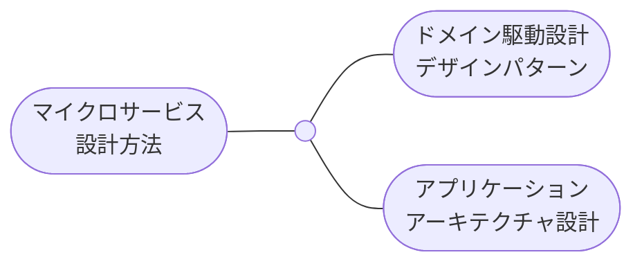
```mermaid
flowchart LR

  マイクロサービス設計方法([マイクロサービス<br>設計方法]) --- マイクロサービス設計方法の基点(( ))

  マイクロサービス設計方法の基点 --- ドメイン駆動設計デザインパターン([ドメイン駆動設計<br>デザインパターン])
  マイクロサービス設計方法の基点 --- アプリケーションアーキテクチャ設計([アプリケーション<br>アーキテクチャ設計])

```

まず、ドメイン駆動設計デザインパターン設計です。

ドメイン駆動設計のドメインモデリング手順では、ドメインエキスパートからドメインルールや振る舞いをヒアリングします。

これらに基づいてユースケース図、ドメインオブジェクト図、ドメインモデル図などを作成して実装を落とし込んでいきます。

よりよく実装に落とし込むための手法がドメイン駆動設計デザインパターンです。

図 18 で、ドメイン駆動設計デザインパターンの種類を示します。

代表的なものにはエンティティーや値オブジェクトがあり、ほかに取り上げしきれないほどパターンがあります \*56 。

ドメインロジックは機能的であり、クラウドネイティブ技術で代替できません。

 

図 19. ドメイン駆動設計デザインパターンの種類

 

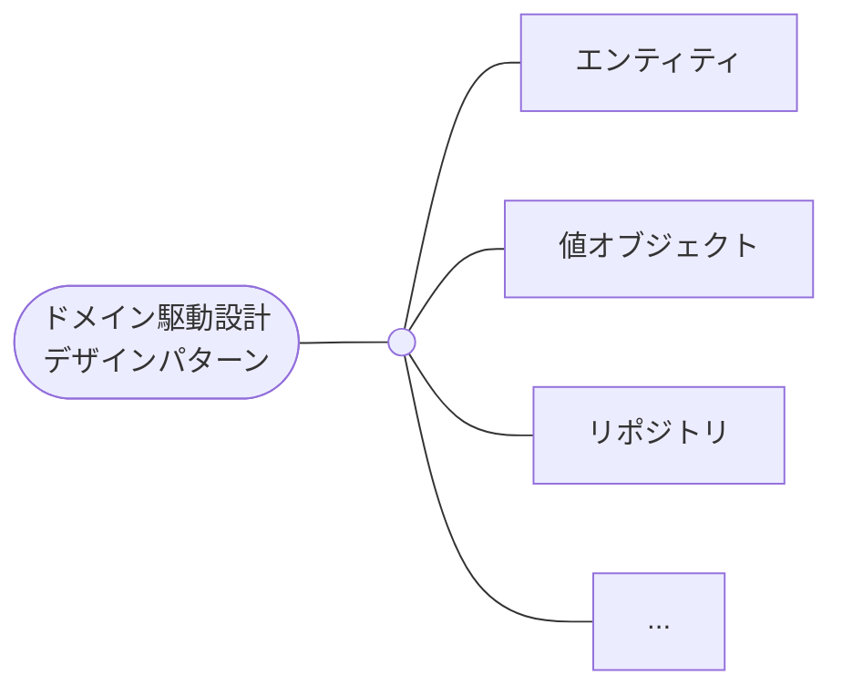
```mermaid
flowchart LR

  ドメイン駆動設計デザインパターン([ドメイン駆動設計<br>デザインパターン]) --- ドメイン駆動設計デザインパターンの基点(( ))
  ドメイン駆動設計デザインパターンの基点 --- エンティティ
  ドメイン駆動設計デザインパターンの基点 --- 値オブジェクト
  ドメイン駆動設計デザインパターンの基点 --- リポジトリ
  ドメイン駆動設計デザインパターンの基点 --- ...

```

次にアプリケーションアーキテクチャ設計です。

図 19 で、アプリケーションアーキテクチャ設計のデザインパターンを示します。

代表的なものにはレイヤードアーキテクチャ、ヘキサゴナルアーキテクチャ、オニオンアーキテクチャ、クリーンアーキテクチャがあります \*57 。

これらはドメイン駆動設計デザインパターンを適切な層に実装するため、またドメインロジックを持つパターンを隔離するための方法です。

 

図 20. アプリケーションアーキテクチャのデザインパターンの種類

 

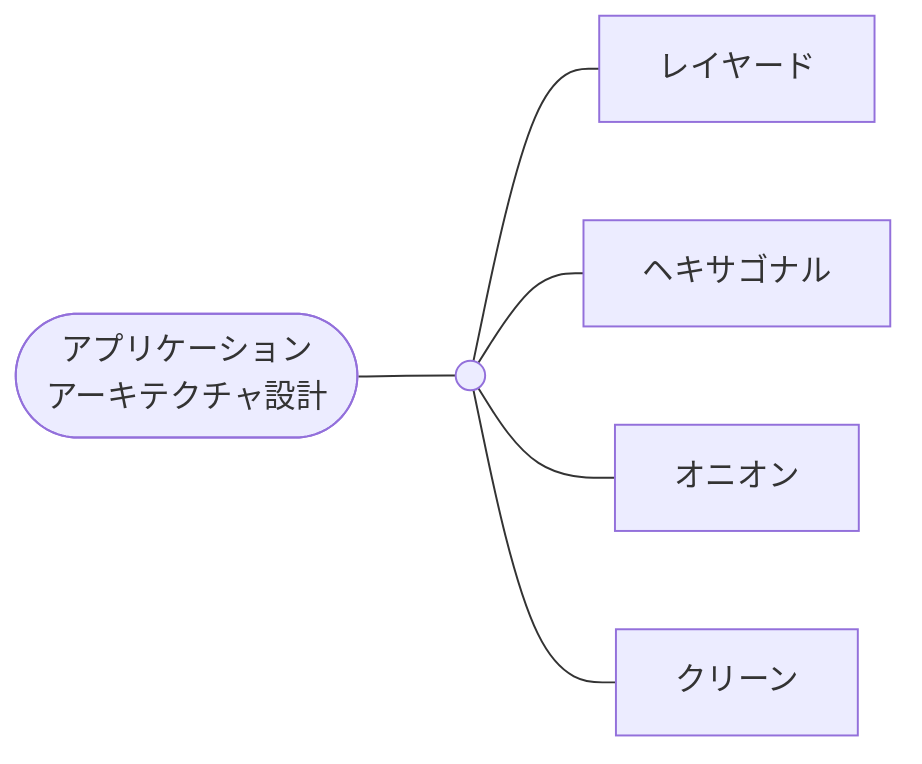
```mermaid
flowchart LR

  アプリケーションアーキテクチャ設計([アプリケーション<br>アーキテクチャ設計]) --- アプリケーションアーキテクチャ設計の基点(( ))
  アプリケーションアーキテクチャ設計の基点 --- レイヤード
  アプリケーションアーキテクチャ設計の基点 --- ヘキサゴナル
  アプリケーションアーキテクチャ設計の基点 --- オニオン
  アプリケーションアーキテクチャ設計の基点 --- クリーン

```

表 8 で、アプリケーションアーキテクチャとクラウドネイティブ技術の関連性を整理します。

アプリケーションのなかでも非機能的なロジックは、クラウドネイティブ技術で代替できます。

マイクロサービス間通信方法にリクエスト／レスポンス方式を使用している場合、アクセストークン署名検証ロジックは Service
Mesh 分野のツールで代替できます (補章の認証認可を参照) 。

例えば、SSO 時のアクセストークン署名検証のために、Istio によるサイドカーコンテナはリクエストを ID プロバイダーに送信します。

Istio などの Service Mesh 分野のツールを使用しない場合、マイクロサービスがこれを担う必要があります。

一方で、マイクロサービス間通信方法にパブリッシュ／サブスクライブ方式を使用している場合、ドメインロジックとメッセージ中継システムのクライアント SDK の仲介として、Streaming &
Messaging 分野のツールを使用できます。

例えば、CloudEvents と CloudEvents SDK はドメインロジックのイベントをメッセージ中継システムに送信します \*59 。

表 8. アプリケーションアーキテクチャとクラウドネイティブ技術の関連性

| パターン名                       | レイヤード、ヘキサゴナル、オニオン、クリーン                                                                                                                                                                 |
| -------------------------------- | ------------------------------------------------------------------------------------------------------------------------------------------------------------------------------------------------------------ |
| 説明                             | デザインパターンを適切な層に実装するため、またドメインロジックを持つパターンを隔離するためにアーキテクチャを使用する。ドメイン駆動設計ではいずれのアプリケーションアーキテクチャを使用するかは重要ではない。 |
| クラウドネイティブ技術との関連性 | 非機能的なロジックの実装方法として、Service MeshやStreaming & Messaging分野のツールを使用できる。                                                                                                            |
| 技術例                           | ・Service Mesh (Istio)  ・Streaming & Messaging (CloudEvents、RabbitMQ)                                                                                                                                   |

---

注釈

\*56 Brown, S. (2014, August 4). Distributed big balls of mud. http://dzone.com/. https://dzone.com/articles/distributed-big-balls-mud

\*57 Evans, E. (2014). Domain-Driven Design reference: Definitions and Pattern Summaries. Dog Ear Publishing.

\*58 Martin, R. C. (2017). Clean architecture: A Craftsman’s Guide to Software Structure and Design. Prentice Hall.

\*59 Salatino, M. (2022, January 29). Event-Driven applications with CloudEvents on Kubernetes – Salaboy (Open Source Knowledge). Salaboy. https://www.salaboy.com/2022/01/29/event-driven-applications-with-cloudevents-on-kubernetes/

 

### 7.5 トランザクション管理方法

マイクロサービスアーキテクチャでは、とくに永続データ管理方法に DB per service を使用している場合に問題があります。

各マイクロサービスの永続化の間に依存関係がある場合 (例えば、EC サイトで受注データの永続化が配送データや決済データに依存している) に各マイクロサービスの連続的な永続化を調整する必要があります。

この問題を解決するパターンとして Saga や 2 フェーズコミットがあります。

永続データ管理方法の 1 つである Shared DB や DB per service の問題解決パターンの 2 フェーズコミットは、一般的に非推奨なパターンとされています。

図 20 で、トランザクション管理方法のデザインパターンの種類を示します。

Saga にはオーケストレーションベースとコレオグラフィベースがあります。

 

図 21. トランザクション管理方法のデザインパターンの種類

 

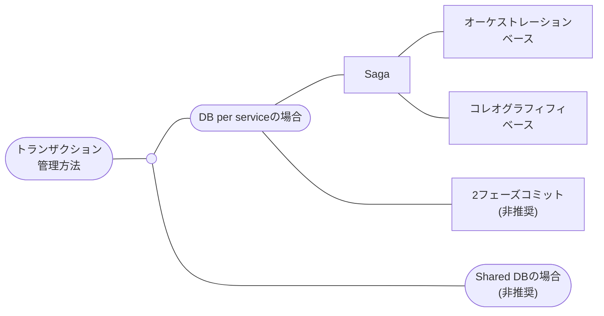
```mermaid
flowchart LR

  トランザクション管理方法([トランザクション<br>管理方法]) --- トランザクション管理方法の基点(( ))
  トランザクション管理方法の基点 --- DB-per-serviceの場合([DB per serviceの場合])
  DB-per-serviceの場合 --- Saga
  トランザクション管理方法の基点 ----- Shared-DBの場合(["Shared DBの場合<br>(非推奨)"])
  Saga --- オーケストレーションベース[オーケストレーション<br>ベース]
  Saga --- コレオグラフィフィベース[コレオグラフィフィ<br>ベース]
  DB-per-serviceの場合 ---- 2フェーズコミット["2フェーズコミット<br>(非推奨)"]

```

オーケストレーションベースまたはコレオグラフィベースの Saga は、一部のロジックをクラウドネイティブ技術で代替できます。

表 9 で、Saga とクラウドネイティブ技術の関連性を整理します。

 

表 9. トランザクション管理方法とクラウドネイティブ技術の関連性

| パターン名                       | オーケストレーションベースSaga                                                                                                                                                                                                                                                                  | コレオグラフィベースSaga                                                                                                                                                                                                                                                                            |
| -------------------------------- | ----------------------------------------------------------------------------------------------------------------------------------------------------------------------------------------------------------------------------------------------------------------------------------------------- | --------------------------------------------------------------------------------------------------------------------------------------------------------------------------------------------------------------------------------------------------------------------------------------------------- |
| 説明                             | Sagaのデザインの1つである。中央集権的なSagaオーケストレーターはメッセージ中継システムを介して、各マイクロサービスを順番にコールする。各マイクロサービスはローカルトランザクション処理を実行する。また、Sagaオーケストレーターはローカルトランザクションの進捗度を占有データベースに永続化する。 | Sagaのデザインの1つである。特定のマイクロサービスが他のマイクロサービスを操作する。送信元マイクロサービスは、自身のローカルトランザクション処理を完了させた後に、メッセージ中継システムを介して宛先マイクロサービスをコールする。宛先のマイクロサービスは、ローカルトランザクション処理を実行する。 |
| クラウドネイティブ技術との関連性 | Sagaオーケストレーターとして、Automation & Configuration分野のツールを使用できる。このツールによっては、メッセージ中継システムがツール内部に組み込まれている。                                                                                                                                  | メッセージ中継システムやこれのクライアントSDKとして、Streaming & Messaging分野のツールを使用できる。また、マイクロサービス間通信方法のパブリッシュ／サブスクライブ方式の実装方法として、Streaming & Messaging分野のツールのクライアントSDKを使用できる。                                            |
| 技術例                           | ・Automation & Configuration (Temporal)                                                                                                                                                                                                                                                         | ・Streaming & Messaging (CloudEvents、RabbitMQ)                                                                                                                                                                                                                                                     |

 
図21で、Amazon EKS上でのオーケストレーションベースSagaの設計例を示します。

オーケストレーションベース Saga として、Automation & Configuration 分野のツールを使用できます。

オーケストレーションベース Saga のデザインパターンには、Saga オーケストレーターがメッセージ中継システムを介して各マイクロサービスと通信するパターンと、これらの間でメッセージ中継システムなしに通信するパターンがあります \*59 。

例えば、Temporal はメッセージ中継システムのあるオーケストレーションベース Saga として動作します *53 *54 。

Temporal クライアント (Saga オーケストレーター) は、Temporal サーバー (Temporal の組み込みのメッセージ中継システム) にワークフローの開始を要求します。

Temporal サーバーはワークフローの進捗度 (Saga ログ) を占有データベースに永続化します。

Temporal ワーカー (ローカルトランザクション実行マイクロサービス) は自身が実行するべきタスクを Temporal サーバーから取得し、タスクの実行後にその成否を送信します。

いずれかのローカルトランザクションが失敗した場合、Temporal は補償トランザクションのためのオーケストレーションも実施できます \*62 。

Temporal はプログラミング言語でワークフローを定義できるため、複雑なビジネスロジックに対応できます。

また、Kubernetes 上でコンテナとして動かせるため、アプリケーション領域とインフラストラクチャー領域の境界が明確になり、それぞれの領域を分業しやすいです。

これらの理由から、Temporal はオーケストレーションベース Saga の代替に適している技術であると私は考えています。

なお、よりよいオーケストレーションベース Saga にはステータスチェッカーが必要になるでしょう。

ステータスチェッカーはトランザクション ID を使用してワークフローの進捗度を取得し、これをクライアントに返却します *56 *57 。

 

図 22. Amazon EKS 上でのオーケストレーションベース Saga の設計例

 

---

注釈

\*60 Bellemare, A. (2020b). Building Event-Driven microservices. O’Reilly Media, Inc.

\*61 Temporal. (2024, May 31). Saga Pattern Simplified: Building Sagas with Temporal [Video]. YouTube. https://www.youtube.com/watch?v=uHDQMfOMFD4

\*62 Saga Pattern Made Easy: Trip planning with sagas but without the baggage. (n.d.). Temporal Technologies. https://temporal.io/blog/saga-pattern-made-easy

\*63 Build a trip booking system with PHP | Learn Temporal. (2021, October 1). https://learn.temporal.io/tutorials/php/build_a_trip_booking_app/

\*64 Richardson, C. (2018). Microservices patterns: With examples in Java. Simon and Schuster.

\*65 Azure-Samples. (n.d.). saga-orchestration-serverless/docs/architecture/components.md at main · Azure-Samples/saga-orchestration-serverless. GitHub. https://github.com/Azure-Samples/saga-orchestration-serverless/blob/main/docs/architecture/components.md

 

### 7.6 認証

マイクロサービスアーキテクチャでは認証を適切に開始し、認証成功後にマイクロサービス間で認証アーティファクトを伝播する必要があります。

また、認証アークティファクト (例：セッション ID、トークン) が有効かどうかを各マイクロサービスの実行時に検証しなければ、不正なリクエストを処理しかねません。

適切な認証認可や認証アーティファクトの伝播により、問題を単純に解決できます。

まずは認証です。

図 22 で、認証のデザインパターンの種類を示します。

代表的なものにはセッションベースとトークンベースがあります。

 

図 23. 認証のデザインパターンの種類

 

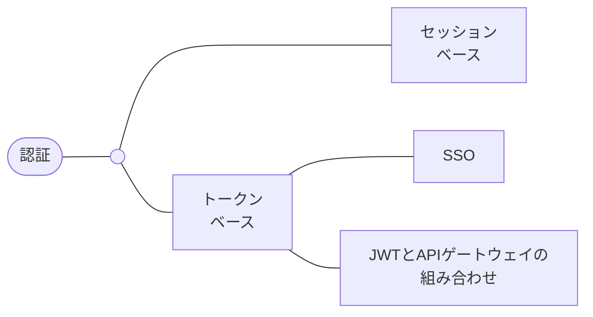
```mermaid
flowchart LR

  認証([認証]) --- 認証の基点(( ))
  認証の基点 ---- セッションベース[セッション<br>ベース]
  認証の基点 --- トークンベース[トークン<br>ベース]
  トークンベース --- SSO
  トークンベース --- JWT-+-APIゲートウェイJWT[JWTとAPIゲートウェイの<br>組み合わせ]
```

セッションベースは、セッションを使用してマイクロサービス間で認証アーティファクトを伝播します。

トークンベースには SSO や JWT と API ゲートウェイの組み合わせがあり、トークンを使用してマイクロサービス間で認証アーティファクトを伝播します。

いずれの方法にもメリットデメリットがあり、要件に応じて選ばなければなりません \*65 。

ここでは SSO を概説します。

SSO では、ID プロバイダーやこれへのリクエストはクラウドネイティブ技術で代替できます。

表 10 で、認証とクラウドネイティブ技術の関連性を整理します。

 

表 10. 認証とクラウドネイティブ技術の関連性

| パターン名                       | SSO                                                                                                                                                                                                                                                         |
| -------------------------------- | ----------------------------------------------------------------------------------------------------------------------------------------------------------------------------------------------------------------------------------------------------------- |
| 説明                             | SSOで認証する。認証マイクロサービスをIDプロバイダーとして使用し、これはアカウントデータ永続化やアクセストークン発行などを実施する。この認証マイクロサービスは資格情報を永続化するためのデータベースを持ち、有効期限が切れればアクセストークンを無効化する。 |
| クラウドネイティブ技術との関連性 | IDプロバイダーとしてSecurity & Compliance分野のツールを使用できる。また、IDプロバイダーへのトークン送信方法として、Service Mesh分野のツールを使用できる。                                                                                                   |
| 技術例                           | ・Security & Compliance (Keycloak)  ・Service Mesh (Istio)                                                                                                                                                                                               |

 
図23で、Amazon EKS上でのOIDC認可コードフローの設計例を示します。

ID プロバイダーとして Security & Compliance 分野のツールを使用できます。

例えば、Keycloak は ID プロバイダーとしてアカウントデータを永続化し、アカウントを証明するアクセストークンを発行します。

また Keycloak は検証エンドポイントを公開し、受信したリクエストの Authorization ヘッダーにあるアクセストークンの署名を検証します \*66 。

このとき、任意の認証パッケージや Istio を使用してアクセストークン署名検証のリクエストを Keycloak に送信できます。

Istio の場合、Istio リソースを定義することにより無効なアカウントからのリクエストをサイドカーコンテナで阻止 (401 や 403 レスポンスを返信) できます \*67 。

このように Keycloak と Istio を組み合わせることにより、マイクロサービスアーキテクチャで OIDC 認可コードフローを実現できます。

 

図 24. Amazon EKS 上での OIDC 認可コードフローの設計例

 

---

注釈

\*66 He, X., & Yang, X. (2017). Authentication and authorization of end user in microservice architecture. Journal of Physics Conference Series, 910, 012060. https://doi.org/10.1088/1742-6596/910/1/012060

\*67 Thorgersen, S., & Silva, P. I. (2023) KeyCloak - Identity and access management for modern applications: Harness the power of Keycloak, OpenID Connect, and OAuth 2.0 to secure applications. Packt Publishing Ltd.

\*68 田畑. (n.d). コンテナ上のマイクロサービスの認証強化 ～Istio と KeyCloak～. Think IT (シンクイット) . https://thinkit.co.jp/article/18023

 

### 7.7 認可

伝播した認証アーティファクトを使用して各マイクロサービスは認可処理を実行する必要があります。

図 24 で、認可のデザインパターンの種類を示します。

代表的なものには中央集中と分散があります。

 

図 25. 認可のデザインパターンの種類

 

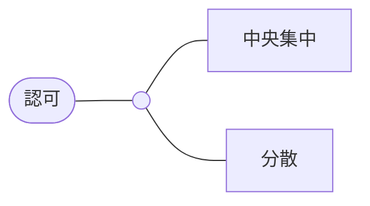
```mermaid

  flowchart LR
  認可([認可]) --- 認可の基点(( ))
  認可の基点 --- 認可中央集中[中央集中]
  認可の基点 --- 認可分散[分散]
```

認可ロジックはドメインロジックに依存しています。

そのため、各マイクロサービスに認可ロジックを実装する分散パターンのほうがよりよいと私は考えています。

ただし、認可ロジックを中央集中的に実装できます。

このとき、中央集中的な認可マイクロサービスはクラウドネイティブ技術で代替できます。

表 11 で、認可とクラウドネイティブ技術の関連性を整理します。

認可マイクロサービスとして、Security & Compliance 分野のツールを使用できます。

例えば、Open Policy Agent は `rego` ファイルのロジックで認可スコープを定義しており、各マイクロサービスは Open Policy Agent から認可の真偽値を取得します \*68 。

このとき、値が偽の場合に各マイクロサービスは 403 ステータスを返信します 。

 

表 11. 認可とクラウドネイティブ技術の関連性

| パターン名                       | 中央集中                                                                           | 分散                                     |
| -------------------------------- | ---------------------------------------------------------------------------------- | ---------------------------------------- |
| 説明                             | 認可マイクロサービスを配置し、これがすべてのマイクロサービスの認可ロジックを担う。 | 各マイクロサービスが認可ロジックを担う。 |
| クラウドネイティブ技術との関連性 | 認可マイクロサービスとしてSecurity & Compliance分野のツールを使用できる。          | 該当なし                                 |
| 技術例                           | ・Security & Compliance (Open Policy Agent)                                        | 該当なし                                 |

---

注釈

\*69 Introduction. (n.d.). Open Policy Agent. https://www.openpolicyagent.org/docs/latest/

 

## 8 ストレージ領域

ストレージ領域には、データの特徴に応じたストレージを配置します。

図 25 で、ストレージ領域のデザインパターンを整理します。

代表的なデザインパターングループには、永続データ方法、静的ファイル管理方法、揮発性データ管理方法、そして分析用加工済データ管理方法があります。

このとき、必要に応じてストレージを分割し、また暗号化します。

 

図 26. ストレージ領域のデザインパターングループの種類

 

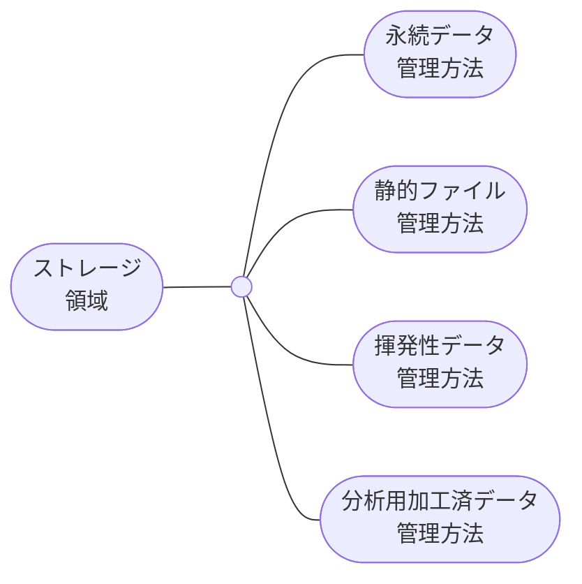
```mermaid
flowchart LR

  ストレージ領域([ストレージ<br>領域]) --- ストレージ領域の基点(( ))
  ストレージ領域の基点 --- 永続データ管理方法([永続データ<br>管理方法])
  ストレージ領域の基点 --- 静的ファイル管理方法([静的ファイル<br>管理方法])
  ストレージ領域の基点 --- 揮発性データ管理方法([揮発性データ<br>管理方法])
  ストレージ領域の基点 --- 分析用加工済データ管理方法([分析用加工済データ<br>管理方法])
```

図 26 で、Amazon EKS 上でデータ管理の設計例を示します。

例えば、Amazon Aurora MySQL は永続データを管理し、AWS KMS でデータを暗号化できます。

Amazon S3 は静的ファイルを管理し、暗号化に Amazon S3 マネージド暗号化キーなどを使用できます。

Kubernetes Node にアタッチされた AWS EBS や Kubernetes Volume は揮発性データを管理し、AWS EBS 上のデータの暗号化に AWS KMS を使用できます。

 

図 27. Amazon EKS 上でのデータ管理の設計例

 

 

### 8.1 永続データ管理方法

図 27 で、マイクロサービスアーキテクチャにおける永続データ管理方法のデザインパターンの種類を示します。

代表的なものには DB per service と Shared DB があります。

 

図 28. 永続データ管理方法のデザインパターンの種類

 

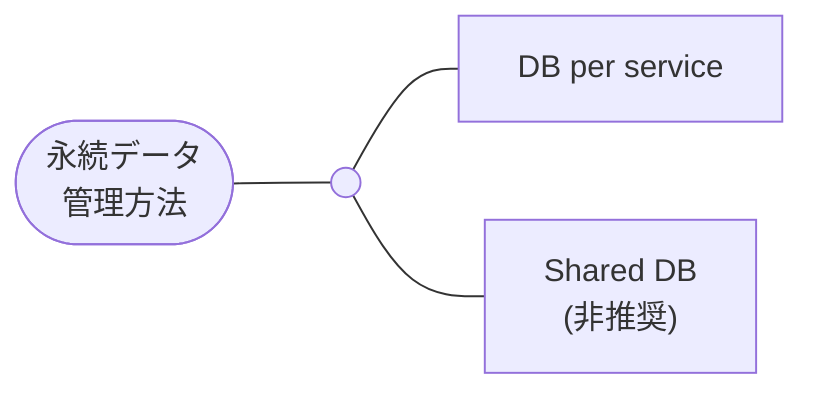
```mermaid
flowchart LR
  永続データ管理方法([永続データ<br>管理方法]) --- 永続データ管理方法の基点(( ))
  永続データ管理方法の基点 --- DB-per-service[DB per service]
  永続データ管理方法の基点 --- Shared-DB["Shared DB<br>(非推奨)"]
```

DB per service では、各マイクロサービスが占有するデータベースを配置します。

Shared DB では、各マイクロサービス間で共有するデータベースを配置し、共有データベースのテーブルをマイクロサービス用に分割します。

Shared DB は一般的に非推奨なパターンとされているため、ここでは省略します。

表 12 で、永続データ管理方法とクラウドネイティブ技術の関連性を整理します。

 

表 12. 永続データ管理方法とクラウドネイティブ技術の関連性

| パターン名                       | DB per service                                                                                                                               | Shared DB                  |
| -------------------------------- | -------------------------------------------------------------------------------------------------------------------------------------------- | -------------------------- |
| 説明                             | マイクロサービスで占有するデータベースを配置する。各マイクロサービスが独立したトランザクション処理を実行できる。                             | 非推奨なパターンなため省略 |
| クラウドネイティブ技術との関連性 | Database分野のツールを使用できる。耐障害性の観点から、データベースはオープンソースよりもマネージドサービスの技術を使用することをお奨めする。 | 同上                       |
| 技術例                           | ・Database (Amazon Aurora MySQL)                                                                                                             | 同上                       |

 
図28で、Amazon EKS上でAmazon EKS上でのDB per serviceの設計例を示します。

データベースとしては Database 分野のツールを使用できます。

例えば、マネージドな Amazon Aurora MySQL は MySQL 互換であるため、アプリケーションは MySQL の SQL の実装を変更する必要がありません。

また、Amazon Aurora MySQL は高い耐障害性や性能を提供します \*69 。

データベースの文脈にはスキーマという概念があり、MySQL ではこれがデータベースに相当します。

つまり、DB スキーマを分割することになります \*70 。

例えば、Amazon Aurora MySQL であれば、マイクロサービス単位で DB スキーマを定義します。

ほかの方法としてマイクロサービス単位で Amazon Aurora MySQL クラスターを作成してもよいですが、クラウドの金銭的コスト面から私は好みではありません。

 

図 29. Amazon EKS 上での DB per service の設計例

 

---

注釈

\*70 What is Amazon Aurora? - Amazon Aurora. (n.d.). https://docs.aws.amazon.com/AmazonRDS/latest/AuroraUserGuide/CHAP_AuroraOverview.html

\*71 Newman, S. (2019) Monolith to microservices: Evolutionary Patterns to Transform Your Monolith. O’Reilly Media, Inc.

 

## 9 横断領域

横断領域には、他の領域に汎用的なロジックを横断的に提供するツールを配置します。

図 29 に、横断領域のデザインパターングループの種類を示します。

代表的なものには Externalized configuration、CI/CD パイプライン、サービスメッシュ、そして Microservice chassis があります。

補章では、これらのうちで Externalized configuration とサービスメッシュを概説します。

 

図 30. 横断領域のデザインパターングループの種類

 

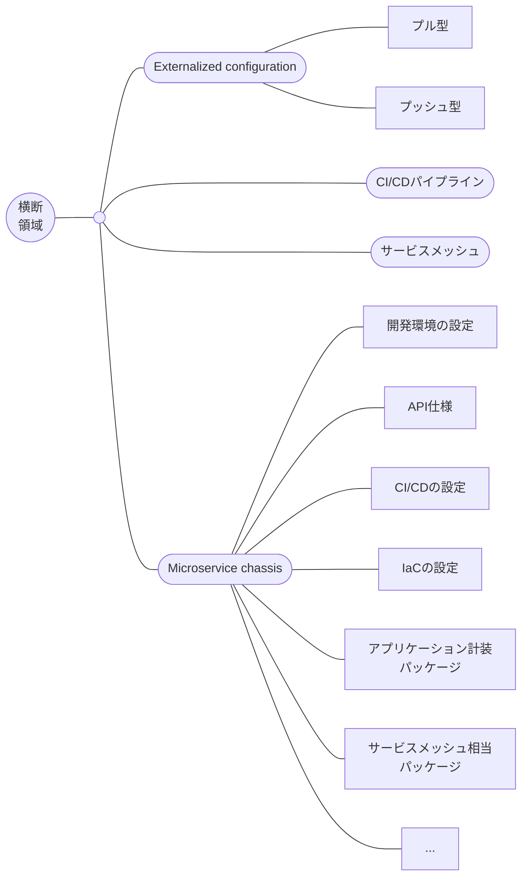
```mermaid
flowchart LR

  横断([横断<br>領域]) --- 横断の基点(( ))
  横断の基点 --- Externalized-configuration(["Externalized configuration"])
  横断の基点 ---- CI/CDパイプライン([CI/CDパイプライン])
  横断の基点 ---- サービスメッシュ([サービスメッシュ])
  横断の基点 --- Microservice-chassis(["Microservice chassis"])
  Externalized-configuration --- プル型
  Externalized-configuration --- プッシュ型
  Microservice-chassis --- 開発環境の設定
  Microservice-chassis --- API仕様
  Microservice-chassis --- CI/CDの設定
  Microservice-chassis --- IaCの設定
  Microservice-chassis --- アプリケーション計装パッケージ[アプリケーション計装<br>パッケージ]
  Microservice-chassis --- サービスメッシュ相当パッケージ[サービスメッシュ相当<br>パッケージ]
  Microservice-chassis --- ...[...]
```

### 9.1 Externalized configuration

マイクロサービスの実行環境には開発環境と本番環境を設け、開発環境で動作検証が済めば本番環境にデプロイします。

実行環境ごとに固有の設定をマイクロサービスに適用する必要があります。

設定をマイクロサービスから切り分け、各実行環境で設定を切り替えます。

これにより、マイクロサービスをさまざまな実行環境で簡単に稼働させられるようになります。

図 30 で、Externalized configuration のデザインパターンの種類を示します。

Externalized configuration にはプル型とプッシュ型の方法があります。

 

図 31. Externalized configuration のデザインパターンの種類

 

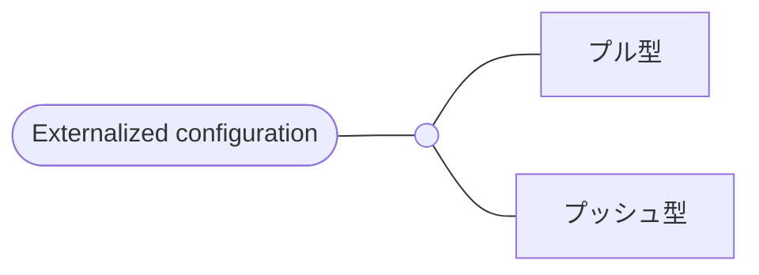
```mermaid
flowchart LR

  Externalized-configuration(["Externalized configuration"]) --- Externalized-configurationの基点(( ))
  Externalized-configurationの基点 --- プル型
  Externalized-configurationの基点 --- プッシュ型

```

プル型とプッシュ型はクラウドネイティブ技術で代替できます。

表 13 で、Externalized configuration とクラウドネイティブ技術の関連性を整理します。

 

表 13. Externalized configuration とクラウドネイティブ技術の関連性

| パターン名                       | プル型                                                                                        | プッシュ型                                                                                                                |
| -------------------------------- | --------------------------------------------------------------------------------------------- | ------------------------------------------------------------------------------------------------------------------------- |
| 説明                             | マイクロサービスが設定管理先から設定を取得し、自身でこれを組み込む。                          | マイクロサービスのインフラストラクチャーがマイクロサービスに設定を組み込む。                                              |
| クラウドネイティブ技術との関連性 | 設定管理先や暗号化キーとして、Security & ComplianceとKey Management分野のツールを使用できる。 | 設定管理先や暗号化キーとしてKubernetesの標準機能、Security & Compliance、Key Management分野のツールを使用できる。         |
| 技術例                           | ・Security & Compliance (SOPS)  ・Key Management (AWS KMS)                                 | ・Kubernetes標準機能 (ConfigMap、Secret)  ・Security & Compliance (AWS Secrets Manager)  ・Key Management (AWS KMS) |

 

図 31 で、Amazon EKS 上での Externalized configuration の設計例を示します。

設定管理先と暗号化キーは Kubernetes 標準機能、Security & Compliance、Key Management 分野のツールを使用できます。

例えば、Kubernetes ConfigMap や Secret はマイクロサービスに外部から環境変数やファイルなどの設定を動的に組み込みます \*71 。

このとき、SOPS を使用することにより Helm のマニフェスト展開前に、Secret の元データを暗号化して管理できます \*72 。

AWS Secrets Manager はクラウドリソースなどに外部から設定を動的に組み込みます。

Amazon Aurora MySQL を使用する場合、データベースに関する機密情報は AWS Secrets Manager で管理することをお奨めます。

Kubernetes ConfigMap、Secret、AWS Secrets Manager の暗号化キーは管理の簡単さ観点から、オープンソースよりもマネージドサービスの技術を使用することをお奨めます。

 

図 32. Amazon EKS 上での Externalized configuration の設計例

 

---

注釈

\*72 Updating configuration via a ConfigMap. (2024, July 17). Kubernetes. https://kubernetes.io/docs/tutorials/configuration/updating-configuration-via-a-configmap/

\*73 Getsops. (n.d.). GitHub - getsops/sops: Simple and flexible tool for managing secrets. GitHub. https://github.com/getsops/sops

 

### 9.2 サービスメッシュ

マイクロサービス間通信方法にリクエスト／レスポンス方式を使用する場合 \*73 、各マイクロサービスに実装するべきロジックには重複があります。

例えばトラフィック管理、証明書管理、テレメトリー作成、認証、回復管理などです。

各マイクロサービスの開発チームが重複ロジックを実装することは、車輪の再発明と言えます。

サービスメッシュの仕組みでは重複ロジックをサイドカーコンテナやホストマシン上のエージェントとして切り分け、各マイクロサービスに横断的に提供します \*74 。

図 32 で、サービスメッシュのデザインパターンの種類を示します。

代表的なものにはサイドカーとサイドカーレスがあります。

 

図 33. サービスメッシュのデザインパターンの種類

 

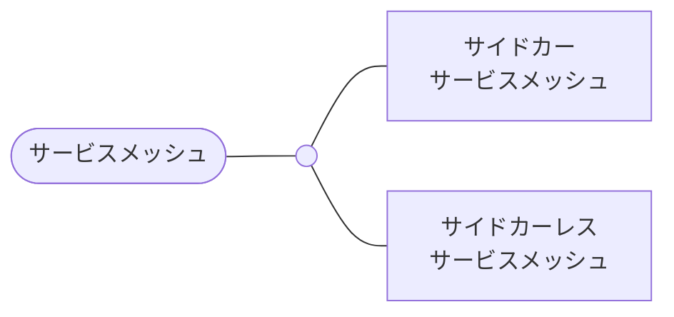
```mermaid
flowchart LR

  サービスメッシュ(["サービスメッシュ"]) --- サービスメッシュの基点(( ))
  サービスメッシュの基点 --- サイドカーサービスメッシュ[サイドカー<br>サービスメッシュ]
  サービスメッシュの基点 --- サイドカーレスサービスメッシュ[サイドカーレス<br>サービスメッシュ]

```

サービスメッシュはクラウドネイティブ技術で代替できます。

表 14 で、サービスメッシュとクラウドネイティブ技術の関連性を整理します。

ここでは、技術用語のサービスメッシュと CNCF の Service Mesh 分野を区別しています。

 

表 14. サービスメッシュの概説

| パターン名                       | サイドカーサービスメッシュ                                                                                                                                                     | サイドカーレスサービスメッシュ                                                                                                                     |
| -------------------------------- | ------------------------------------------------------------------------------------------------------------------------------------------------------------------------------ | -------------------------------------------------------------------------------------------------------------------------------------------------- |
| 説明                             | 各マイクロサービスの重複ロジックをサイドカーコンテナに切り分け、各マイクロサービスに横断的に提供する。また、サービスメッシュを公開するサービスメッシュゲートウェイを配置する。 | 各マイクロサービスの重複ロジックをホストマシン上のエージェント (コンテナあるいはカーネル機能) などに切り分け、マイクロサービスに横断的に提供する。 |
| クラウドネイティブ技術との関連性 | サービスメッシュゲートウェイとサイドカーコンテナの提供方法としてService Mesh分野のツールを使用できる。                                                                         | エージェントの提供方法としてService MeshやCloud Native Network分野のツールを使用できる。                                                           |
| 技術例                           | ・Service Mesh (Istio)                                                                                                                                                         | ・Service Mesh (Istio)  ・Cloud Native Network (Cilium)                                                                                         |

 
図33で、Amazon EKS上でのサイドカーサービスメッシュの設計例を示します。

サービスメッシュとして Service Mesh 分野のツールを使用できます。

例えば、コントロールプレーンとデータプレーンからなる Istio は、Envoy の設定を抽象化することによりサービスメッシュを実現します \*75 。

Istio のサイドカーサービスメッシュでは Istio はデータプレーンにサービスメッシュゲートウェイ (Istio Ingress Gateway と Istio Egress Gateway) を配置し、またマイクロサービス内にサイドカーコンテナ (istio-proxy) をインジェクションします。

サービスメッシュゲートウェイはサービスメッシュ内外を接続する役割を持ち、マイクロサービスを公開するための API ゲートウェイとはその役割が異なります \*72 。

Istio によるサイドカーコンテナは、さまざまな汎用ロジックをアプリケーションコンテナに提供します。

サイドカーコンテナ内では pilot-agent プロセスと envoy プロセスが稼働しています。

envoy プロセスはコントロールプレーンと pilot-agent を介して双方向ストリーミング RPC を実施し、コントロールプレーンの API から Envoy の設定を動的に取得します \*76 。

Istio により、マイクロサービスとしての Kubernetes Pod は他の Pod と直接通信できるようになります。

一方で、Istio を使用しない場合、Kubernetes Pod は Kubernetes Service を介して他の Pod と通信します。

 

図 34. Amazon EKS 上でのサイドカーサービスメッシュの設計例

 

---

注釈

\*74
マイクロサービス間通信方法にパブリッシュ／サブスクライブ方式を使用する場合、『イベントメッシュ』という仕組みが適切です。これは、イベント中継システムなどを各マイクロサービスに横断的に提供できます。これは、Knative で代替できます (https://knative.dev/docs/eventing/event-mesh/) 。

\*75 Gough, J., Bryant, D., & Auburn, M. (2021) Mastering API architecture. O’Reilly Media, Inc.

\*76 Sidecar or ambient? (n.d.). Istio. https://istio.io/latest/docs/overview/dataplane-modes/

\*77 Posta, C., & Maloku, R. (2022) Istio in action. Manning Publications.

 

## 10 インフラストラクチャー領域

インフラストラクチャー領域にはネットワーク、セキュリティ、オブザーバビリティーに関するツールを配置します。

図 34 で、インフラストラクチャー領域のデザインパターングループの種類を示します。

代表的なデザインパターングループには L4/L7 トラフィック管理方法、証明書管理方法、オブザーバビリティーがあります。

 

図 35. インフラストラクチャー領域のデザインパターングループの種類

 

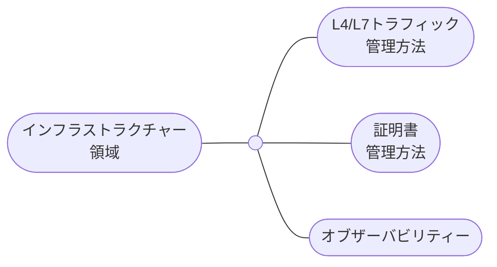
```mermaid
flowchart LR

  インフラストラクチャー領域([インフラストラクチャー<br>領域]) --- インフラストラクチャー領域の基点(( ))
  インフラストラクチャー領域の基点 --- L4-/-L7トラフィック管理方法([L4/L7トラフィック<br>管理方法])
  インフラストラクチャー領域の基点 --- 証明書管理方法([証明書<br>管理方法])
  インフラストラクチャー領域の基点 --- オブザーバビリティー([オブザーバビリティー])


```

### 10.1 L3管理方法

マイクロサービスのインスタンス間が通信するためには、各マイクロサービスのインスタンスに対する IP アドレスの割当と解放を管理する必要があります。

これは Cloud Native Network 分野の技術で代替できます。

図 35 で、Amazon EKS 上で L3 管理の設計例を示します。

例えば、AWS であれば Amazon VPC が L3 (ネットワーク層) を提供します \*77 。

また、マネージドな Amazon VPC CNI アドオンは kubelet、ENI、Amazon EKS コントロールプレーンと連携し、Amazon VPC 上にクラスターネットワークを作成します。

これは Amazon EKS クラスター内の IP アドレスを制御し、マイクロサービスが Amazon EKS のクラスターネットワークへ参加できるようにする \*78 。

 

図 36. Amazon EKS 上での L3 管理の設計例

 

---

注釈

\*78 ほかに例えば、L2 を作成する CNI があり、CNI によって提供する層はさまざまです。

いずれのプラットフォーム (補章であれば、Amazon EKS) を選ぶかによって、適切な CNI が異なります。

\*79 Amazon VPC CNI - EKS Best Practices Guides. (n.d.). https://aws.github.io/aws-eks-best-practices/networking/vpc-cni/

 

### 10.2 L4/L7トラフィック管理方法

L4/L7 のプロトコル (TCP、HTTP、HTTPS など) を使用してマイクロサービスのインスタンス間が通信するとき、トラフィック管理の仕組みが必要です。

図 36 で、デザインパターングループの種類を示します。

代表的なものにはサービス検出とロードバランシングがあります。

 

図 37. L4/L7 トラフィック管理方法のデザインパターングループの種類

 

```mermaid
flowchart LR

  L4-/-L7トラフィック管理方法([L4/L7トラフィック<br>管理方法]) --- L4-/-L7トラフィック管理方法の基点(( ))
  L4-/-L7トラフィック管理方法の基点 --- サービス検出([サービス検出])
  L4-/-L7トラフィック管理方法の基点 --- ロードバランシング([ロードバランシング])

```

まずはサービス検出です。

マイクロサービスアーキテクチャではマイクロサービスのインスタンスがスケーリングで増減するたびに、ネットワーク上の宛先を変化させます。

このとき、宛先と継続的に通信できるような仕組みが必要です。

サービス検出により、リクエストの送信元マイクロサービスが宛先の場所 IP アドレス、ポート番号、完全修飾ドメイン名などを動的に検出し、通信できるようになります。

図 37 で、サービス検出のデザインパターンを示します。

 

図 38. 宛先検出と宛先登録のデザインパターンの種類

 

```mermaid
flowchart LR

  サービス検出([サービス検出]) --- サービス検出の基点(( ))
  サービス検出の基点 --- 宛先検出([宛先検出])
  宛先検出 --- サーバーサイド
  宛先検出 --- クライアントサイド
  サービス検出の基点 --- 宛先登録([宛先登録])
  宛先登録 --- セルフ
  宛先登録 --- サードパーティー
```

宛先検出にはサーバーサイドサービス検出とクライアントサイドサービス検出があります。

送信元または宛先マイクロサービス、ロードバランサー、サービスレジストリが組み合わさって宛先検出を実施します。

これらの仕組みはクラウドネイティブ技術で代替できます。

表 15 で、宛先検出とクラウドネイティブ技術の関連性を整理します。

静的ファイルストレージとして使用できる。

 

表 15. 宛先検出とクラウドネイティブ技術の関連性

| パターン名                       | サーバーサイド                                                                                                                                                                                                                                                                           | クライアントサイド                                                                                                                 |
| -------------------------------- | ---------------------------------------------------------------------------------------------------------------------------------------------------------------------------------------------------------------------------------------------------------------------------------------- | ---------------------------------------------------------------------------------------------------------------------------------- |
| 説明                             | 送信元マイクロサービスから問い合わせとロードバランシングの責務が切り離されている。送信元マイクロサービスはロードバランサーにリクエストを送信する。ロードバランサーは宛先マイクロサービスの場所をサービスレジストリに問い合わせ、またリクエストをロードバランシングする責務を担っている。 | 通信の送信元マイクロサービスは宛先マイクロサービスの場所をサービスレジストリに問い合わせ、さらにロードバランシングする責務を担う。 |
| クラウドネイティブ技術との関連性 | ロードバランサーとしてService Mesh、Coordination & Service Discovery分野のツールを使用できる。                                                                                                                                                                                           | 送信元マイクロサービスのロードバランシング処理の実装方法として、Kubernetes標準機能を使用できる。                                   |
| 技術例                           | ・Service Mesh (Istio)                                                                                                                                                                                                                                                                   | ・Kubernetes標準機能 (Kubernetes Service、kube-proxy)  ・Coordination & Service Discovery (CoreDNS)                             |

 
図38で、Amazon EKS上でのサービスメッシュ内のL4/L7トラフィック管理の設計例を示します。

サービスメッシュ内では L4/L7 ロードバランサーとして Service Mesh 分野のツールを使用できます。

例えば、Istio によるサイドカーコンテナはサービスメッシュ内の Kubernetes リソースや Istio リソースの情報に基づいて、サーバーサイドサービス検出を実施します \*79 。

Istio コントロールプレーンは Amazon EKS コントロールプレーンからサービス検出に必要なリソースの情報を収集し、インメモリで保管します。

 

図 39. Amazon EKS 上でのサービスメッシュ内の L4/L7 トラフィック管

 

図 39 で、Amazon EKS 上でのサービスメッシュ外の L7 トラフィック管理の設計例を示します。

サービスメッシュ外では、L7 ロードバランサーとして Kubernetes 標準機能と Coordination & Service Discovery 分野のツールを使用できます。

例えば、CoreDNS は Kubernetes Service と kube-proxy と連携し、サーバーサイドサービス検出を実施します *73 *74 。

送信元 Pod は、宛先 Pod へのリクエスト前に CoreDNS から宛先 Pod のドメインを正引きします。

このとき、Amazon EKS を使用する場合、マネージドな AWS kube-proxy アドオンと AWS CoreDNS アドオンを使用できます。

 

図 40. Amazon EKS 上でのサービスメッシュ外の L7 トラフィック管理の設計例

 

図 40 で、Amazon EKS 上でのサービスメッシュ外の L4 トラフィック管理の設計例を示します。

L4 ロードバランサーとして Kubernetes 標準機能を使用できます。

例えば、Kubernetes Service と kube-proxy はデフォルトで iptables と連携し、クライアントサイドサービス検出を実施します \*82 。

kube-proxy は新しい Pod の IP アドレスを iptables に追加し、また Kubernetes Service は iptables に基づいてリクエストを Pod にロードバランシングします。

前述のとおり、AWS はマネージドな kube-proxy アドオンを提供します。

 

図 41. Amazon EKS 上でのサービスメッシュ外の L4 トラフィック管理の設計例

 

宛先登録にはセルフ登録とサードパーティー登録があります。

これらの仕組みはクラウドネイティブ技術で代替できます。

表 16 で、宛先登録パターンとクラウドネイティブ技術の関連性を整理します。

サービスレジストリとして、Coordination & Service Discovery 分野のツールを使用できます。

例えば、Kubernetes 上のさまざまなサービスレジストラーは収集した宛先情報を Etcd に保管します。

Amazon EKS を使用する場合、Etcd はマネージドなコントロールプレーン上にあります \*83 。

 

表 16. 宛先登録とクラウドネイティブ技術の関連性

| パターン名                       | セルフ登録                                                                                             | サードパーティー登録                                                                                                                                                                     |
| -------------------------------- | ------------------------------------------------------------------------------------------------------ | ---------------------------------------------------------------------------------------------------------------------------------------------------------------------------------------- |
| 説明                             | サービス検出時に起動した送信元マイクロサービスはサービスレジストリに自身の宛先情報を送信し、登録する。 | サービス検出時にサービスレジストラーは起動した送信元マイクロサービスを収集し、サービスレジストリに宛先情報を登録する。多くのサービス検出ツールでサードパーティーパターンを使用している。 |
| クラウドネイティブ技術との関連性 | サービスレジストリとしてCoordination & Service Discovery分野のツールを使用できる。                     | サービスレジストリとしてCoordination & Service Discovery分野のツールを使用できる。                                                                                                       |
| 技術例                           | ・Coordination & Service Discovery (Etcd)                                                              | ・Coordination & Service Discovery (Etcd)                                                                                                                                                |

 
次に、ロードバランシングのデザインパターンです。

マイクロサービスのインスタンスに適切に負荷を分散させることにより、マイクロサービスアーキテクチャのシステム全体の可用性を高められます。

図 41 で、ロードバランシングのデザインパターンの種類を示します。

代表的なものには静的方式と動的方式があります。

 

図 42. ロードバランシングのデザインパターンの種類

 

```mermaid
flowchart LR

  ロードバランシング([ロードバランシング]) --- ロードバランシングの基点(( ))
  ロードバランシングの基点 --- 静的方式
  ロードバランシングの基点 --- 動的方式
```

静的方式にはラウンドロビン、重み付きラウンドロビン、IP ハッシュなどに基づくロードバランシングがあります。

これらは宛先の負荷を考慮しない方式です。

一方で動的方式には最小接続数、重み付き接続数、最小レスポンス時間などに基づくロードバランシングがあります。

これらは宛先の負荷をリアルタイムに考慮する方式です。

ロードバランシングの各方式はクラウドネイティブ技術で代替できます。

表 16 で、ロードバランシングとクラウドネイティブ技術の関連性を整理します。

例えば、Istio によるサイドカーコンテナはラウンドロビンや最小接続時間に基づいて、通信を宛先マイクロサービスにロードバランシングします \*84 。

 

表 17. ロードバランシングとクラウドネイティブ技術の関連性

| パターン名                       | 静的ロードバランシング                                                                     | 動的ロードバランシング                                                                                   |
| -------------------------------- | ------------------------------------------------------------------------------------------ | -------------------------------------------------------------------------------------------------------- |
| 説明                             | 宛先の負荷を考慮せずにロードバランシングする。                                             | 宛先の負荷をリアルタイムに考慮してロードバランシングする。                                               |
| クラウドネイティブ技術との関連性 | 静的方式のロードバランサーとしてKubernetes標準機能とService Mesh分野のツールを使用できる。 | 動的方式のロードバランサーとしてService MeshとCoordination & Service Discovery分野のツールを使用できる。 |
| 技術例                           | ・Kubernetes標準機能 (Kubernetes Service、kube-proxy)  ・Service Mesh (Istio)           | ・Kubernetes標準機能 (Kubernetes Service、kube-proxy)  ・Service Mesh (Istio)                         |

---

注釈

\*80 Mesh, A. (2020, August 12). Debugging Your Debugging Tools: What to do When Your Service Mesh Goes Down [Slide show]. SlideShare. https://www.slideshare.net/slideshow/debugging-your-debugging-tools-what-to-do-when-your-service-mesh-goes-down/237797183

\*81 Belamaric, J., & Liu, C. (2019) Learning CoreDNS: Configuring DNS for Cloud Native Environments. O’Reilly Media, Inc.

\*82 Virtual IPs and service proxies. (2024, October 7). Kubernetes. https://kubernetes.io/docs/reference/networking/virtual-ips/

\*83 Service. (2024, June 25). Kubernetes. https://kubernetes.io/docs/concepts/services-networking/service/#proxy-mode-iptables

\*84 Control Plane - EKS Best Practices Guides. (n.d.). https://aws.github.io/aws-eks-best-practices/reliability/docs/controlplane/

\*85 Traffic management. (n.d.). Istio. https://istio.io/latest/docs/concepts/traffic-management/

 

### 10.3 アプリケーションデータの暗号化

マイクロサービスアーキテクチャでは、システム内で非常に多くのパケット通信が起こります。

パケットのアプリケーションデータを暗号化しなければ、これを第三者に攻撃されかねません。

TLS プロトコルを使用してアプリケーションデータを暗号化することにより、攻撃から防御できます。

証明書を使用して通信を暗号化できます \*85 。

図 42 で、証明書管理方法のデザインパターンの種類を示します。

代表的なものにはサイドカー、アプリケーション、クラウドリソースの証明書管理があります。

 

図 43. 証明書管理方法のデザインパターンの種類

 

```mermaid
flowchart LR

  証書管理方法([証書<br>管理方法]) --- 証明書管理方法の基点(( ))
  証明書管理方法の基点 --- マイクロサービスの証明書管理[マイクロサービスの<br>証明書管理]
  マイクロサービスの証明書管理 --- サービスメッシュを使用する場合
  マイクロサービスの証明書管理 --- サービスメッシュを使用しない場合
  証明書管理方法の基点 ---- クラウドリソースの証明書管理[クラウドリソースの<br>証明書管理]

```

証明書管理はクラウドネイティブ技術で代替できます。

表 18 で、証明書管理とクラウドネイティブ技術の関連性を整理します。

ここでは、技術用語のサービスメッシュと CNCF の Service Mesh 分野を区別しています。

 

表 18. 証明書管理とクラウドネイティブ技術の関連性

| パターン名                       | マイクロサービスの証明書管理 (サービスメッシュを使用する場合)                                                                                                                                                                              | マイクロサービスの証明書管理 (サービスメッシュを使用しない場合)                                                                                                                      | クラウドリソースの証明書管理                                                                       |
| -------------------------------- | ------------------------------------------------------------------------------------------------------------------------------------------------------------------------------------------------------------------------------------------ | ------------------------------------------------------------------------------------------------------------------------------------------------------------------------------------ | -------------------------------------------------------------------------------------------------- |
| 説明                             | サービスメッシュを使用する場合、マイクロサービスのサイドカーコンテナに証明書を組み込み、管理する。送信元と宛先のサイドカーコンテナ間の通信でサーバー認証を実施できる。この場合、アプリケーションコンテナで証明書を管理する必要がなくなる。 | サービスメッシュを使用しない場合、マイクロサービスのアプリケーションコンテナに証明書を組み込み、管理する。送信元と宛先のアプリケーションコンテナ間の通信でサーバー認証を実施できる。 | クラウドリソースに証明書を組み込み、管理する。クラウドリソースへの通信でサーバー認証を実施できる。 |
| クラウドネイティブ技術との関連性 | 組み込む証明書としてService Mesh分野のツールを使用できる。                                                                                                                                                                                 | 組み込む証明書としてSecurity & Compliance分野のツールを使用できる。                                                                                                                  | 組み込む証明書としてSecurity & Compliance分野のツールを使用できる。                                |
| 技術例                           | ・Service Mesh (Istio)                                                                                                                                                                                                                     | ・Security & Compliance (Cert Manager)                                                                                                                                               | ・Security & Compliance (AWS Certificate Manager)                                                  |

 
図43で、Amazon EKS上での証明書管理の設計例を示します。

マイクロサービスのサイドカーコンテナの証明書管理には Service Mesh 分野のツールを使用できます。

例えば、Istio は署名済みの証明書をサイドカーコンテナに組み込み、定期的にこれを更新します \*86 。

Istio コントロールプレーンは自己を署名し、ルート認証局としてサイドカーコンテナのクライアント／サーバー証明書を署名します。

さらに Istio コントロールプレーンはサイドカーコンテナに証明書を組み込み、証明書が失効すれば自動的に更新します。

この仕組みにより、サイドカーコンテナ間で相互 TLS 認証を継続的に実施できるようになります \*87 。

一方で Istio を使用しない場合、Security & Compliance 分野のツールを使用してアプリケーションコンテナに証明書を組み込み、これを管理する必要があります。

クラウドリソースの証明書管理には Security & Compliance 分野のツールを使用できます。

例えば、AWS Certificate Manager は中間認証局の Amazon CA からサーバー証明書を取得し、AWS リソースへの組み込みと定期更新を管理します。

 

図 44. Amazon EKS 上での証明書管理の設計例

 

---

注釈

\*86 Siriwardena, P., & Dias, N. (2020) Microservices Security in action. Manning Publications.

\*87 Plug in CA certificates. (n.d.). Istio. https://istio.io/latest/docs/tasks/security/cert-management/plugin-ca-cert/

\*88 Security. (n.d.). Istio. https://istio.io/latest/docs/concepts/security/

 

## 11 おわりに

補章としてマイクロサービスアーキテクチャのデザインパターンを取り上げ、どのようなクラウドネイティブ技術で代替できるのかを概説しました。

クラウドネイティブ技術とマイクロサービスアーキテクチャのつながりの理解を深めることはできたでしょうか？

既存のクラウドネイティブ技術の問題を解消した新しいクラウドネイティブ技術が次々と登場しています。

このとき、その技術はマイクロサービスアーキテクチャのどのデザインパターンに結びつき、またすべてや一部のロジックを代替できるのだろうかという視点も重要です。

クラウドネイティブ技術の役割を複数の観点から知ると、システム全体のなかでその技術が担う役割をより理解できるようになります。

そして、その知識をさまざまなシステムにパズルのように応用できるようになります。

たとえ類似の新技術が登場しても、振り回されることなく使用の是非を判断し、既存の知識に基づいてすぐに適用できるようになります。

補章が本書全体やクラウドネイティブ技術の理解度を高め、さまざまなシステムへの適用のきっかけになれば嬉しいです。

 
