# 【アプリ領域】DDDとクラウドネイティブによるマイクロサービスアーキテクチャ設計の概説

# 本記事について

[【導入】DDDとクラウドネイティブによるマイクロサービスアーキテクチャ設計の概説](https://example.com) の記事のアプリ領域です。

以下の関連パターンがあります。

フロントエンド領域のデザインパターンです。

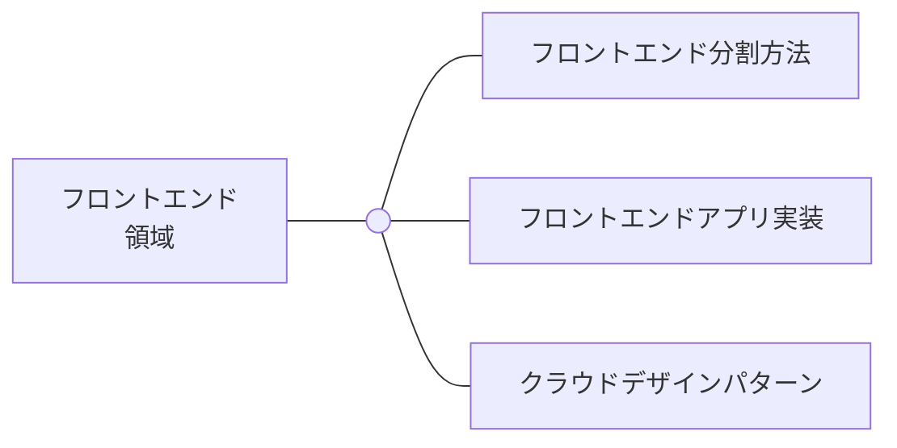

API Gateway領域のデザインパターンです。

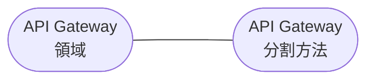

マイクロサービス領域のデザインパターンです。

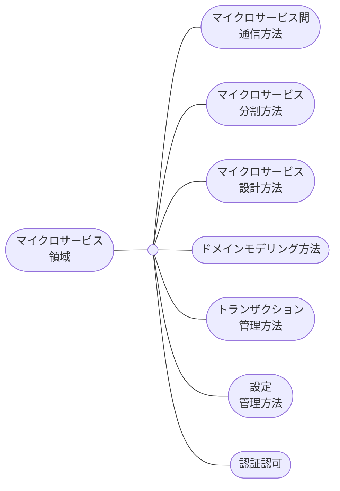

# 01-04. 導入を参照

[【導入】DDDとクラウドネイティブによるマイクロサービスアーキテクチャ設計の概説](https://example.com)

# 05. 関連するアーキテクチャスタイル

まず、モノリスアーキテクチャとマイクロサービスアーキテクチャがどのように違うのかを概説します。

## マイクロサービスアーキテクチャに至るまで

モノリスアーキテクチャ、マイクロサービスアーキテクチャ、過渡的なアーキテクチャスタイルがあります。

アーキテクチャスタイルによって、アプリアーキテクチャ領域の種類が異なります。

Dockerやクラウドが広まって以降、プレゼンテーション・ドメイン分離やAPI Gateway配置のアーキテクチャスタイルを採用することが、当然のようになってきた印象です。

.png).png)

以下の表で、各アーキテクチャスタイルの責務と結合度に関して概説しました。

|            | モノリスアーキテクチャ                                                                       | プレゼンテーション・ドメイン分離                                                                 | API Gateway採用                                                                                                                                   | マイクロサービスアーキテクチャ                                                                                                                                   |
| ---------- | -------------------------------------------------------------------------------------------- | ------------------------------------------------------------------------------------------------ | ------------------------------------------------------------------------------------------------------------------------------------------------- | ---------------------------------------------------------------------------------------------------------------------------------------------------------------- |
| 領域の種類 | フロントエンド、バックエンド、各種ストレージ（DBなど）                                       | フロントエンド、バックエンド、各種ストレージ（DBなど）                                           | フロントエンド、API Gateway、マイクロサービス、各種ストレージ（DBなど）                                                                           | フロントエンド、API Gateway、マイクロサービス、DB                                                                                                                |
| 責務       | アプリは、フロントエンドとバックエンドの領域からなる。アプリが両方の領域の責務を担っている。 | アプリは、フロントエンドアプリとバックエンドアプリからなる。両アプリは各領域の責務を担っている。 | アプリは、フロントエンドアプリとバックエンドアプリからなる。両アプリは各領域の責務を担っている。また、これらの領域の間に、API Gateway領域がある。 | アプリは、独立したAPIを持つ複数のマイクロサービスとフロントエンドアプリからなる。両アプリは各領域の責務を担っている。これらの領域の間に、API Gateway領域がある。 |
| 結合度     | フロントエンドとバックエンドの領域は密結合になっている。各領域は同じプロセスで稼働する。     | フロントエンドとバックエンドの領域は疎結合になっている。各領域は異なるプロセスで稼働する。       | フロントエンド、バックエンド、API Gatewayの領域は疎結合になっている。各領域は異なるプロセスで稼働する。                                           | フロントエンド、各マイクロサービス、API Gatewayの領域は疎結合になっている。各領域は、異なるプロセスで稼働する。                                                  |

## 振り返り

ここで、もう一度、マイクロサービスアーキテクチャを概説します。

マイクロサービスアーキテクチャは、以下のアプリアーキテクチャ領域からなります。

- フロントエンド領域
- API Gateway領域
- マイクロサービス領域
- ストレージ領域 (DB)

# 05. フロントエンドアプリケーションのアーキテクチャ

フロントエンドアプリケーションのアーキテクチャはマイクロサービスアーキテクチャに依らないため、課題に合わせて適切なものを採用できます。

各アーキテクチャのアプリケーションの稼働方法は異なります。

なお、本記事では、CSRで作成したシングルページアプリを採用します。

- CSR (SPA: シングルページアプリを作成する)
- SSR (サーバーサイドフロントエンドアプリを作成する)
- SSG (静的アプリを作成する)
- ISR (静的アプリとサーバーサイドフロントエンドアプリケーションのハイブリッドを作成する)
- …

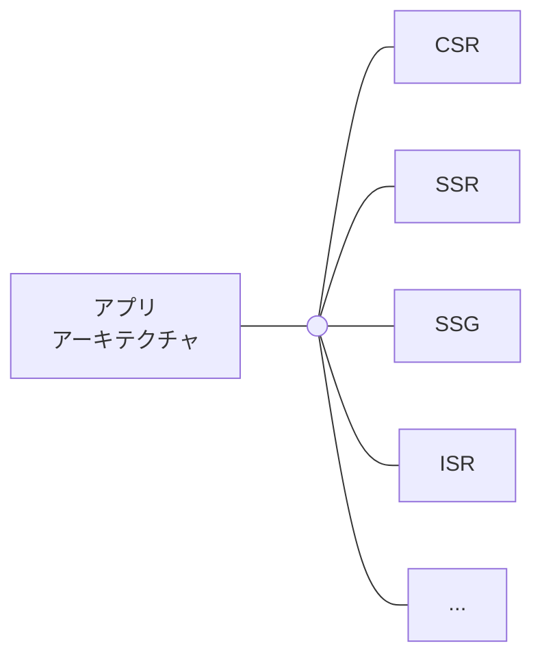

# 06. フロントエンドアプリ分割

マイクロサービスアーキテクチャのフロントエンド領域には、フロントエンドアプリを配置します。

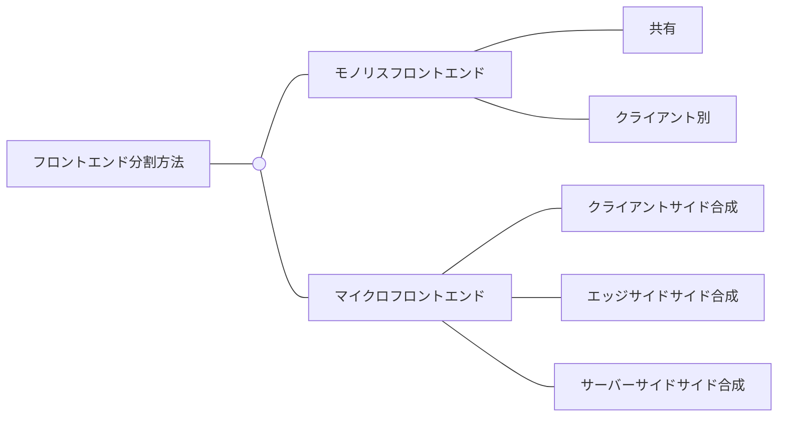

## モノリスフロントエンド

### 共有パターン

各クライアント (PC、スマホ) が共有するモノリスなフロントエンドを配置します。

アプリアーキテクチャでは、例えば、CSRを採用します。

フレームワークによっては、レスポンシブという機能があります。

レスポンシブ機能では、クライアントの種類によらず、レンダリングできる静的ファイルを作成できる。

開発言語として、JavascriptやTypescriptがあります。

レスポンシブ機能を持つフレームワークとして、ReactやVue.jsがあります。

以下の表で、メリットデメリットを概説しました。

他にもたくさんあると思います。

|        | メリット                                                         | デメリット                                                                                                       |
| ------ | ---------------------------------------------------------------- | ---------------------------------------------------------------------------------------------------------------- |
| 保守性 | 短期的には、PCブラウザとスマホブラウザを両方を一度に保守できる。 | 長期的には、変更の影響範囲が大きい。また、PCブラウザとスマホブラウザの条件分岐が増えていく。                     |
| 性能   | -                                                                | 長期的には、ソースコードが多くなるため、アプリケーションのビルド時間が長くなる。                                 |
| 拡張性 | 短期的には、PCブラウザとスマホブラウザを同時に拡張できる。       | 長期的には、一方のブラウザだけに対応するロジックを実装していくと、条件分岐が複雑になり、拡張しにくくなっていく。 |

[Building Microservices, 2nd Edition](https://www.oreilly.com/library/view/building-microservices-2nd/9781492034018/ch14.html)

### クライアント別パターン

クライアント別のモノリスなフロントエンドを配置します。

アプリアーキテクチャでは、例えば、CSRを採用します。

開発言語として、PCブラウザではJavascriptやTypescript、スマホブラウザではSwiftやKotlinがあります。

なお、本記事では、クライアント別パターンを採用します。

以下の表で、メリットデメリットを概説しました。

他にもたくさんあると思います。

|        | メリット                                                                                           | デメリット                                                                             |
| ------ | -------------------------------------------------------------------------------------------------- | -------------------------------------------------------------------------------------- |
| 保守性 | 長期的には、PCブラウザとスマホブラウザの責務を分離できるため、影響範囲が小さく保守しやすくなる。   | -                                                                                      |
| 性能   | 長期的には、ソースコードが少なくなるため、アプリケーションのビルド時間を短縮できる。               | -                                                                                      |
| 拡張性 | 長期的には、PCブラウザとスマホブラウザの責務を分離できるため、一方のブラウザの機能を拡張しやすい。 | 短期的には、PCブラウザとスマホブラウザの両方を開発しないといけず、拡張の速度が落ちる。 |

[Building Microservices, 2nd Edition](https://www.oreilly.com/library/view/building-microservices-2nd/9781492034018/ch14.html)

## マイクロフロントエンド

マイクロフロントエンドでは、マイクロサービスの粒度に合わせて、フロントエンドアプリを分割します。

各フロントエンドアプリが作成した静的ファイルを結合し、レンダリングします。

[Micro Frontends](https://martinfowler.com/articles/micro-frontends.html)

[Building Micro-Frontends](https://www.oreilly.com/library/view/building-micro-frontends/9781492082989/ch01.html)

### 静的ファイル結合パターン

静的ファイルをどの領域で結合するのかの観点で、パターンがあります。

[Building Micro-Frontends](https://www.oreilly.com/library/view/building-micro-frontends/9781492082989/ch03.html)

[Microservices Pattern: Pattern: Server-side page fragment composition](https://microservices.io/patterns/ui/server-side-page-fragment-composition.html)

[Microservices Pattern: Pattern: Client-side UI composition](https://microservices.io/patterns/ui/client-side-ui-composition.html)

## 振り返り

ここで、もう一度、マイクロサービスアーキテクチャを概説します。

マイクロサービスアーキテクチャのフロントエンド領域で、クライアント別フロントエンドを組み込んでいます。

- PCブラウザフロントエンド
- スマホブラウザフロントエンド

# 06-02. フロントエンドの関連パターン

## CDNパターン

CDNパターンは、クラウドアーキテクチャで採用できるパターンです。

CDNパターンでは、物理的に世界の様々な場所にあるエッジサーバーがキャッシュサーバーとして機能します。

CDNパターンはマイクロサービスアーキテクチャとは直接的な関連性が低いです。

ただ、マイクロサービスアーキテクチャでこれを採用すると仕組みが複雑になるため、概説します。

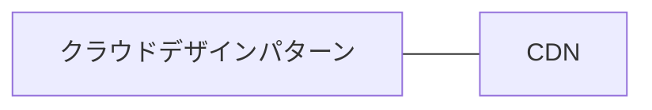

[Cloud Architecture Patterns](https://www.oreilly.com/library/view/cloud-architecture-patterns/9781449357979/ch14.html)

### キャッシュ返却処理のシーケンス

CDNの仕組みでは、オリジン (フロントエンドアプリ) のダウンストリームに、CDN DNSサーバーとエッジサーバーを配置します。

エッジサーバーのデータセンターは様々な場所にあります。

ブラウザ (PC、スマホ) の送信元からもっとも近いデータセンターにあるエッジサーバーが、静的ファイルのキャッシュを作成し、またレスポンスします。

以下のシーケンス図では、マイクロサービスアーキテクチャでのCDNの仕組みを解説しています。

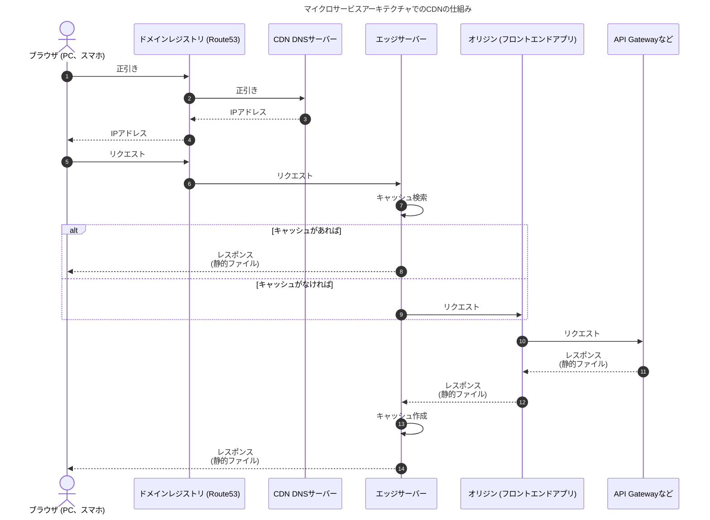

[How CloudFront delivers content - Amazon CloudFront](https://docs.aws.amazon.com/AmazonCloudFront/latest/DeveloperGuide/HowCloudFrontWorks.html#HowCloudFrontWorksContentDelivery)

# 07. API Gateway分割方法

マイクロサービスアーキテクチャのAPI Gateway領域には、マイクロサービスを公開するAPI Gatewayを配置します。

API Gatewayの主要な機能として、受信した通信を適切なマイクロサービスのAPIにルーティングします。

認証やL7ロードバランシングの責務を持たせられますが、必須ではありません。

クライアントとして、PCブラウザフロントエンド、スマホブラウザフロントエンド、外部APIがあると仮定します。

ここでは、分割方法をいくつか概説します。

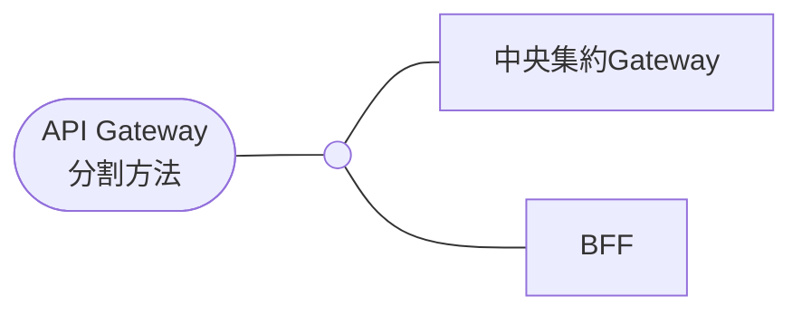

> 💡 API Gatewayとして、Nginxを採用します。
>
> API Gatewayで、APIへのルーティングの責務の他に、認証やレートリミットなどの責務が必要な場合があります。
>
> NginxはAPI Gatewayに特化したツールではないため、API Gatewayに必要な責務を網羅しきれないです。
>
> その場合、Nginxのサイドカーとして配置するistio-proxyで、不足する責務を補完します。

## 中央集約Gatewayパターン

各クライアントで共有するAPI Gatewayを配置します。

API Gatewayには、各クライアントからの全てのリクエストを想定したエンドポイントを実装します。

クライアントとして、PCブラウザフロントエンド、スマホブラウザフロントエンド、外部APIがあると仮定しています。

そのため、共有のAPI Gatewayには、全てのクライアントに対応するエンドポイントが必要です。

メリデメは以下の通りです。

他にもたくさんあると思います。

|        | メリット                                                                         | デメリット                                                                                                       |
| ------ | -------------------------------------------------------------------------------- | ---------------------------------------------------------------------------------------------------------------- |
| 保守性 | 短期的には、PCブラウザとスマホブラウザの両方のエンドポイントを一度に保守できる。 | 長期的には、変更の影響範囲が大きい。また、PCブラウザとスマホブラウザの条件分岐が増えていく。                     |
| 性能   | -                                                                                | 長期的には、ソースコードが多くなるため、API Gatewayのビルド時間が長くなる。                                      |
| 拡張性 | 短期的には、PCブラウザとスマホブラウザのエンドポイントを同時に拡張できる。       | 長期的には、一方のブラウザだけに対応するロジックを実装していくと、条件分岐が複雑になり、拡張しにくくなっていく。 |

[Microservices Pattern: Pattern: API Gateway / Backends for Frontends](https://microservices.io/patterns/apigateway.html)

## BFFパターン：Backends for frontends

クライアント別のAPI Gatewayを配置します。

API Gatewayには、特定のクライアントからのリクエストを想定したエンドポイントだけを実装します。

クライアントとして、PCブラウザフロントエンド、スマホブラウザフロントエンド、外部APIがあると仮定しています。

そのため、各API Gatewayには、特定のクライアントに対応するエンドポイントが必要です。

メリデメは以下の通りです。

他にもたくさんあると思います。

|        | メリット                                                                                                               | デメリット                                                                                             |
| ------ | ---------------------------------------------------------------------------------------------------------------------- | ------------------------------------------------------------------------------------------------------ |
| 保守性 | 長期的には、PCブラウザとスマホブラウザの責務を分離できるため、影響範囲が小さく保守しやすくなる。                       | -                                                                                                      |
| 性能   | 長期的には、ソースコードが少なくなるため、API Gatewayのビルド時間を短縮できる。                                        | -                                                                                                      |
| 拡張性 | 長期的には、PCブラウザとスマホブラウザの責務を分離できるため、一方のブラウザのためだけのエンドポイントを拡張しやすい。 | 短期的には、PCブラウザとスマホブラウザの両方のエンドポイントを開発しないといけず、拡張の速度が落ちる。 |

> 💡 BFFとしてGraphQL-APIを採用することは個人的に非推奨です。
> BFFはフロントエンドチームとバックエンドチームの両方の責任範囲と考えています
> フロントエンドとバックエンドの領域と疎結合にするために、両方の領域に依存しない技術 (例えば、今回ようにNginx) を使用したいです。
> GraphQL-APIのエンドポイントには、GraphQLクライアントでリクエストを送信しなければなりません。
> そのため、BFFでGraphQL-APIを採用すると、フロントエンドとBFFの責務の結合度が上がってしまいます。
> ただ、BFFを特にフロントエンドチームの責任範囲として捉える場合は、BFFをGraphQL-APIを持つコンテナとして実装しても良いかもしれません。

[Microservices Pattern: Pattern: API Gateway / Backends for Frontends](https://microservices.io/patterns/apigateway.html)

## 振り返り

ここで、もう一度、マイクロサービスアーキテクチャを概説します。

マイクロサービスアーキテクチャのAPI Gateway領域で、API GatewayとしてのNginxを組み込んでいます。

- フロントエンド領域
- API Gateway領域 (API GatewayとしてのNginx)
- マイクロサービス領域
- ストレージ領域 (DB)

# 08. データ管理方法

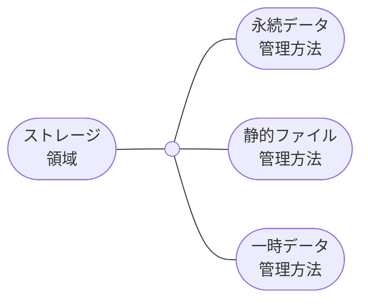

## データの種類に応じた管理方法

### AWSリソースとKubernetesによるデータ管理

| 管理場所                       | データの種類                                                        | 暗号化キー                                             | 説明                                                                                                                                                                                                                                       |
| ------------------------------ | ------------------------------------------------------------------- | ------------------------------------------------------ | ------------------------------------------------------------------------------------------------------------------------------------------------------------------------------------------------------------------------------------------ |
| AWS Aurora                     | 永続データ                                                          | AWS KMS                                                | Nodeのストレージで永続データを管理する場合、Nodeの障害がデータに影響を与える可能性がある。Nodeに永続データを持たせずに、外部のサーバー (例：AWS Aurora) を使用する。                                                                       |
| AWS EBS                        | 一時データ (インメモリキャッシュ、メモリやファイル上バッファリング) | AWS KMS                                                | Nodeのメモリやファイル上バッファでデータを管理する場合、Nodeの障害がデータに影響を与える可能性がある。ただし、定期的に外部に送信するデータ (例：ログ) やキャッシュのような一時データであれば、メモリやファイル上バッファで管理してもよい。 |
| AWS S3                         | 静的ファイル (例：画像、メール、動画)                               | クライアントサイド暗号化のためのS3マネージド暗号化キー | フロントエンドアプリケーションのために、静的ファイルを管理しておく。                                                                                                                                                                       |
| Kubernetes Pod EmptyDir Volume | 一時データ (インメモリキャッシュ、メモリやファイル上バッファリング) | なし                                                   |                                                                                                                                                                                                                                            |

## 振り返り

ここで、もう一度、マイクロサービスアーキテクチャを概説します。

設定の管理場所として、以下を組み込んでいます。

- AWS Aurora
- AWS EBS
- AWS S3
- AWS Systems Manager
- Kubernetes Secret (図では省略)

暗号化キーとして、以下を組み込んでいます。

- AWS KMS
- クライアントサイド暗号化のためのS3マネージド暗号化キー (図では省略)
- Kubernetesリポジトリ内のSOPS (図では省略)

.png).png)

# 08-02. 永続データ管理

## DB分割

### Shared DBパターン

マイクロサービスで共有するDBを配置します。

また、このDB内で、各マイクロサービスが占有するテーブルを分割する。

後述していますが、境界づけられたコンテキストを単位として、マイクロサービスを分割することが良いとされています。

「特定のドメインモデルを他のドメインモデルと区別して定義できる境界のこと」が境界づけられたコンテキストです。

これらのことから、様々なドメインモデルを同じテーブルに永続化し、それを各マイクロサービスが共有することになり、DBが肥大化していくことを想像できます。

[Microservices Pattern: Pattern: Shared database](https://microservices.io/patterns/data/shared-database.html)

[🐾 Does your microservice deserve its own database?](https://dev.to/lbelkind/does-your-microservice-deserve-its-own-database-np2)

### DB per serviceパターン

マイクロサービスで占有するDBを配置します。

もちろん、テーブルも占有です。

本記事では、マイクロサービス占有DBパターンを採用とします。

[Microservices Pattern: Pattern: Database per service](https://microservices.io/patterns/data/database-per-service.html)

[🐾 Does your microservice deserve its own database?](https://dev.to/lbelkind/does-your-microservice-deserve-its-own-database-np2)

## 振り返り

ここで、もう一度、マイクロサービスアーキテクチャを概説します。

マイクロサービスアーキテクチャのストレージ領域 (DB)で、占有DBを組み込んでいます。

なお、MySQLではDBスキーマを分割することがDBの分割に相当します。

- フロントエンド領域
- API Gateway領域
- マイクロサービス領域
- ストレージ領域 (DB) (MySQLの占有DB)

# 09. マイクロサービス間通信方法

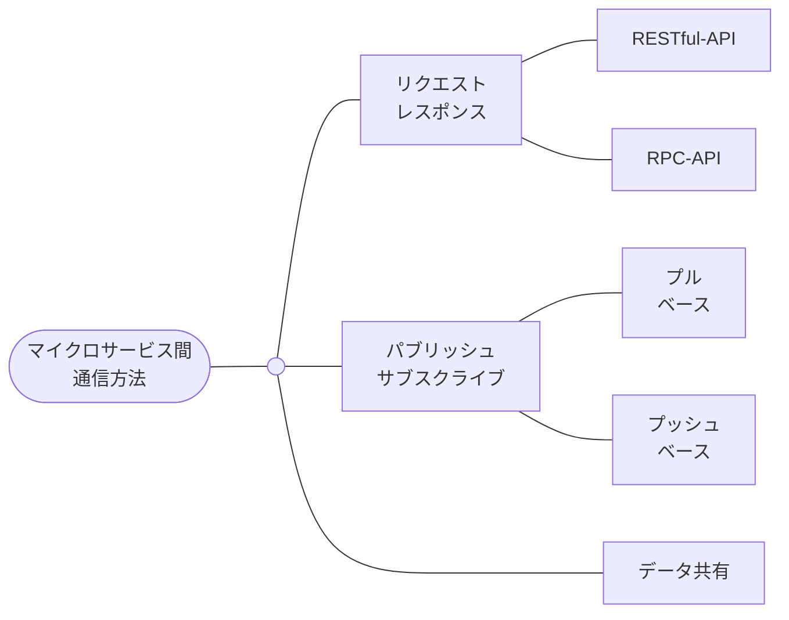

## リクエスト / レスポンス方式

### ステートソーシングに適する

マイクロサービスのドメインモデリング方法がステートソーシングの場合、リクエスト / レスポンス方式が適します。

リクエスト / レスポンス方式では、各マイクロサービスは同期的に通信します。

また、宛先マイクロサービスが非同期にリクエストを受信したい場合、メッセージブローカーまたはメッセージキューを介して非同期的に通信してもよいです。

これらの通信は双方向に流れます。

送信元マイクロサービスはリクエストを送信し、宛先マイクロサービスは同期的にレスポンスを返信します。

本記事では、リクエスト / レスポンス方式を採用とします。

[Microservices Pattern: Pattern: Remote Procedure Invocation (RPI)](https://microservices.io/patterns/communication-style/rpi.html)

### アプリアーキテクチャの通信処理層

通信方式にリクエスト / レスポンス方式を採用する場合、アプリアーキテクチャ領域 (フロントエンド領域、API Gateway領域、マイクロサービス領域、ストレージ領域 (DB)) 間にはクライアントとAPIの関係性があります。

| アプリアーキテクチャ領域 | 説明                                                                                                                                                                                                                                                                                                                                                     |
| ------------------------ | -------------------------------------------------------------------------------------------------------------------------------------------------------------------------------------------------------------------------------------------------------------------------------------------------------------------------------------------------------- |
| フロントエンド領域       | フロントエンドアプリは、AWS EKSクラスター外からのリクエストをRESTful-APIで待ち受けます。API GatewayのRESTful-APIにリクエストを送信します。                                                                                                                                                                                                               |
| API Gateway領域          | Nginxは、フロントエンドからのリクエストをRESTful-APIで待ち受けます。マイクロサービスのRPC-APIやRESTful-APIにリクエストを送信するように設定できます。RPC-APIにgRPCでリクエストを送信する場合、`ngx_http_grpc_module` が必要です。                                                                                                                         |
| マイクロサービス領域     | マイクロサービスのインフラストラクチャ層にRPC-APIやRESTful-APIを実装し、ダウンストリームからのリクエストを待ち受ける。一方で、インフラストラクチャ層にRPC-APIやRESTful-APIのクライアントを実装し、アップストリームにリクエストを送信する。MySQLへの永続化する責務を持つマイクロサービスでは、インフラストラクチャ層にMySQLクライアントが必要になります。 |
| ストレージ領域 (DB)      | 占有DBのMySQLサーバーは、MySQLクライアントが送信したクエリを待ち受けます。                                                                                                                                                                                                                                                                               |

## パブリッシュ / サブスクライブ方式

### イベントソーシングに適する

マイクロサービスのドメインモデリング方法がイベントソーシングの場合、パブリッシュ / サブスクライブ方式が適します。

パブリッシュ / サブスクライブ方式では、各マイクロサービスはメッセージブローカーまたはメッセージキューを介して、非同期的に通信します。

通信は一方向に流れます。

送信元マイクロサービスはメッセージブローカーまたはメッセージキューにイベントをパブリッシュします。

メッセージブローカーやメッセージキューによるプッシュ、または宛先マイクロサービスによるプルに基づいて、宛先マイクロサービスにメッセージをサブスクライブします。

[Microservices Pattern: Pattern: Messaging](https://microservices.io/patterns/communication-style/messaging)

## データ共有方式

送信元マイクロサービスは作成したデータをストレージに保管します。

宛先マイクロサービスはストレージをポーリングし、新しいデータが追加され次第、ストレージからこれを読み込みます。

.png).png)

## 振り返り

ここで、もう一度、マイクロサービスアーキテクチャを概説します。

マイクロサービスアーキテクチャのマイクロサービス領域で、いくつかのマイクロサービスを稼働させています。

この図では、分割単位や通信方式にまで言及していませんが、”境界づけられたコンテキスト” と “リクエスト / レスポンス方式” を採用していることを想像してください。

- フロントエンド領域
- API Gateway領域
- マイクロサービス領域 (境界づけられたコンテキスト、リクエスト / レスポンス方式)
- ストレージ領域 (DB)

# 10. マイクロサービス分割方法

マイクロサービスアーキテクチャのマイクロサービス領域です。

マイクロサービス領域には、ドメインの問題を解決する複数のバックエンドアプリを配置します。

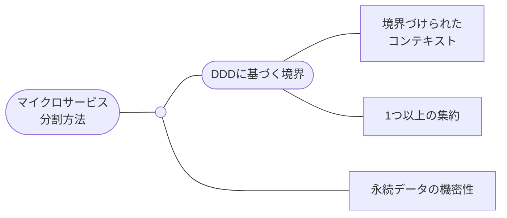

## DDDに基づく分割

### 境界づけられたコンテキスト

境界づけられたコンテキストを単位として、マイクロサービスを分割します。

本記事では、境界づけられたコンテキストパターンを採用とします。

境界づけられたコンテキストについては後述します。

### 1つ以上の集約

1つ以上の集約を単位として、マイクロサービスを分割します。

集約については後述します。

> 💡
>
> 集約よりさらに小さな個別のエンティティを単位として、マイクロサービスを分割することは、アンチパターンです。
>
> なぜなら、分割の単位が細かすぎるためです。
>
> [Entity Services is an Antipattern](https://www.infoq.com/news/2017/12/entity-services-antipattern/)

## 永続データの機密性

特定の永続データの機密性が高い場合、そのデータのみを隔離されたDBで管理したくなるでしょう。

異なるDBで管理するのであれば、マイクロサービスも分割するべきである。

# 10-02. ドメインモデリング方法

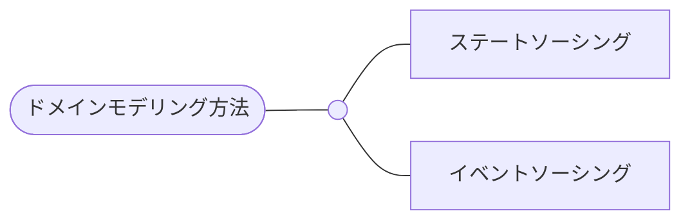

## ステートソーシングパターン

### モデリング対象

ドメインモデルの状態を表現するようにモデリングします。

ステートソーシングによるドメインモデルは、DBには最新の状態だけを永続化します。

ドメインモデルの過去の状態はDBに残ります。

モデリングフレームワークに以下があります。

- SUDOモデリング (システム関連図、ユースケース図、ドメインモデル図、オブジェクト図)
- RDRA
- ユースケース駆動

など

### 通信方式

ステートソーシングで採用できるマイクロサービス間通信方式は、リクエスト / レスポンス方式とパブリッシュ / サブスクライブ方式です。

## イベントソーシングパターン

### モデリング対象

ドメインモデルの状態を変更したイベントを表現するようにモデリングします。

イベントソーシングによるドメインモデルは、DBにはイベントの履歴を永続化します。

イベントの過去の状態が全て残ります。

例えば、ドメインモデルを以下のようなテーブル構造で永続化します。

event_entity_idカラムを使えば、特定のドメインモデル (event_entityカラム) の履歴を追跡できます。

| id  | event_name    | event_entity | event_entity_id | event_data                                    |
| --- | ------------- | ------------ | --------------- | --------------------------------------------- |
| 1   | OrderCreated  | Order        | 1               | OrderCreatedオブジェクトをJSONに変換したやつ  |
| 2   | OrderUpdated  | Order        | 1               | OrderUpdatedオブジェクトをJSONに変換したやつ  |
| 3   | OrderCreated  | Order        | 2               | OrderCreatedオブジェクトをJSONに変換したやつ  |
| 4   | OrderCanceled | Order        | 1               | OrderCanceledオブジェクトをJSONに変換したやつ |
| 5   | OrderCreated  | Order        | 3               | OrderCreatedオブジェクトをJSONに変換したやつ  |
| …   | …             | …            | …               | …                                             |

モデリングフレームワークに以下があります。

- イベントストーミング

など

[マイクロサービスでイベントソーシングを利用したくなる理由とその動作原理を学ぼう](https://youtu.be/Jtcp9ry8ZcE?t=1066)

[Microservices Pattern: Pattern: Event sourcing](https://microservices.io/patterns/data/event-sourcing.html)

### 通信方式

イベントソーシングで採用できるマイクロサービス間通信方式は、パブリッシュサブスクライブ方式です。

# 10-03. DDDの用語

## 問題領域

| 用語                | 説明                                                                                                                                                                                                                                                                                         | 例                                   |
| ------------------- | -------------------------------------------------------------------------------------------------------------------------------------------------------------------------------------------------------------------------------------------------------------------------------------------- | ------------------------------------ |
| ドメイン (問題領域) | ビジネス全体で見たときに、システム化の対象となるビジネス業務的な領域のこと。                                                                                                                                                                                                                 | Amazonのような小売業ビジネス         |
| コアドメイン        | ドメインの構成要素である。ドメインの中でも、重要度のより高い領域のこと。ビジネスの成長に伴って変化する。ビジネスを制御しやすいように、コアドメインの内製化が最優先である。                                                                                                                   | 小売業務フローの中でも、受注管理業務 |
| サブドメイン        | ドメインの構成要素である。ドメインの中では、重要度のより低い領域のこと。ビジネスの成長に伴って変化する。コアドメインとは異なり、内製化は最優先ではない。将来的には内製化するとして、SaaS (例：経理SaaSのマネーフォワード、総務人事SaaSのサイボウズなど) にビジネスロジックを委譲してもよい。 | 小売業務フローの中でも、決済管理業務 |

## 解決領域

| 用語                       |                                                                                                                                        | 例             |
| -------------------------- | -------------------------------------------------------------------------------------------------------------------------------------- | -------------- |
| 解決領域                   | ドメインを技術的方法でモデリングし、その結果得られるドメインモデルの集合である。                                                       | ECシステム全体 |
| 境界づけられたコンテキスト | 解決領域の構成要素である。特定のドメインモデルを他のドメインモデルと明確に区別して定義できる領域のこと。組織の分業度に伴って変化する。 | 受注管理業務   |
| 集約                       | 境界づけられたコンテキストの構成要素である。まとめて永続化するべきドメインモデルの集合である。                                         | 受注           |
| ルートエンティティ         | 集約内の中心的なドメインモデルであり、ドメインモデルの変更の起点になる。                                                               |                |

## 問題領域と解決領域の関係

システム化の対象となる問題領域があります。

[実践DDD](https://www.amazon.co.jp/dp/479813161X)

[ドメイン駆動設計をはじめよう ―ソフトウェアの実装と事業戦略を結びつける実践技法](https://www.amazon.co.jp/dp/481440073X)

# 10-04. ステートソーシングパターンに基づくDDD

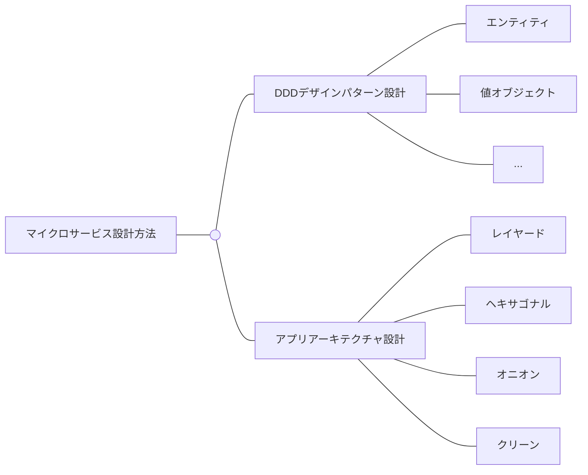

## ドメインモデリングの手順

ステートソーシングパターンの場合、DDDに基づくドメインモデリングの流れは以下の通りです。

既存のモノリスアーキテクチャから特定の境界づけられたコンテキストを切り離します。

例えば、Amazonのような小売業のEC業務システムを考えます。

1. 既存のモノリスアーキテクチャのシステム関連図 (受注管理業務システムを取り巻く周辺システムの様子) を作成する。これにより、ドメイン全体と既存システム全体の対応関係を理解できる。
2. システムに関して、ドメインエキスパート (受注管理業務のプロ) にビジネスルールや振る舞いをヒアリングする。
3. ビジネスルールと振る舞いに基づいて、ユースケース図 (受注管理業務の具体的な作業の様子) を作成する。ユースケース図により、システムがどのように振る舞い、ドメインの課題を解決するのかがわかる。
4. ユースケース図の名詞に基づき、ドメインオブジェクト図 (ドメインモデルを具体化する) とドメインモデル図 (ドメインモデルを抽象化する) を作成する。
5. ドメインモデル図にて、同時に永続化することになりそうなドメインモデルをグループ化する。グループ化により、集約の範囲が決まる。
6. ドメインモデル図にて、モデル名の日本語と英語をユビキタス言語とする。境界づけられたコンテキスト間ではユビキタス言語が異なるため、境界づけられたコンテキストを明確化できる。また開発 / ビジネスメンバー間で用語を共通認識化できる。
7. ドメインオブジェクト図とドメインモデル図に基づいて、DDDのデザインパターン (例：エンティティ、値オブジェクト、ルートエンティティなど) のクラス図を作成する。各デザインパターンをアプリアーキテクチャ (例：クリーンアーキテクチャ) の適切な層に配置する。
8. 集約内のルートエンティティ (例：受注エンティティ、購入ユーザーエンティティ、決済エンティティなど) を中心に、マイクロサービス全体を設計する。

境界づけられたコンテキストの切り離しを繰り返し、複数の境界づけられたコンテキストを抽出します。

各境界づけられたコンテキストを1つのマイクロサービスとして扱います。

> 💡
>
> 新規のシステムに対してマイクロサービスアーキテクチャを適用するのではなく、モノリスアーキテクチャからマイクロサービスアーキテクチャへ移行することが一番よいです。
>
> ビジネスの拡大に伴って、ドメインが将来的にどのように成長していくのかは未知数であり、最初の時点では誤った境界づけられたコンテキストを定義してしまうかもしれないためです。
>
> ただし、荒く大きな境界づけられたコンテキストを定義し、ドメインの成長に柔軟に対応できるようにするのであれば、新規のシステムでもマイクロサービスアーキテクチャを許容できると考えています。

[DDD サンプルコード&FAQ](https://booth.pm/ja/items/3363104)

## DDDデザインパターン

ドメインモデル図を具体的な実装に落とし込むためのデザインパターンがあります。(五十音順)

ここでは、各デザインパターンの責務の概説は省略します。

- アプリケーションサービス
- イベントリスナー
- 値オブジェクト
- エンティティ
- ルートエンティティ (エンティティや値オブジェクトで集約されたエンティティ)
- 仕様パターン
- 区分オブジェクト
- リポジトリ (インターフェース)
- リポジトリ (実装)
- ドメインサービス
- …

[「実践DDD」から学ぶDDDの実装入門 CodeZine Digital First](https://www.amazon.co.jp/dp/B07S675HVM)

## アプリアーキテクチャ

### 種類

デザインパターンを適切な層へ実装するため、またドメインロジックを持つパターンを隔離するため、アーキテクチャを採用する。

DDDではいずれのアプリアーキテクチャを採用するかは重要ではありません。

どのようなアプリアーキテクチャを採用してもよいです。

以下が、DDDでよく採用されるアプリアーキテクチャです。

なお、本記事では、クリーンアーキテクチャを採用します。

- レイヤードアーキテクチャ
- レイヤードアーキテクチャ + 依存性逆転の原則
- ヘキサゴナルアーキテクチャ
- オニオンアーキテクチャ
- クリーンアーキテクチャ
- …

### クリーンアーキテクチャの概説

クリーンアーキテクチャは、４つのアプリアーキテクチャ層 (インフラストラクチャ層、インターフェース層、ユースケース層、ドメイン層)
と、各層の固有デザインパターン、からなります。

以下で、マイクロサービスでDDDとクリーンアーキテクチャを採用した場合のデザインパターンを整理しました。

ここで使用しているクリーンアーキテクチャの層名は一例で、他の名前でも問題ありません。

DDDでよく使用するデザインパターンと、クリーンアーキテクチャ固有のそれは区別するようにしてください。

| アプリアーキテクチャ層名の例 | DDDのデザインパターン                                                                        | クリーンアーキテクチャのデザインパターン                                                                               |
| ---------------------------- | -------------------------------------------------------------------------------------------- | ---------------------------------------------------------------------------------------------------------------------- |
| インフラストラクチャ層       | リポジトリ (実装) 、ファクトリー、イベントリスナー、DTOなど                                  | DBなど                                                                                                                 |
| インターフェース層           | -                                                                                            | コントローラーなど                                                                                                     |
| ユースケース層               | -                                                                                            | インプットバウンダリ (インターラクターのインターフェース) 、インターラクター、インプットデータ、アウトプットデータなど |
| ドメイン層                   | エンティティ、値オブジェクト、タイプコード、ドメインサービス、ドメインイベント、検索条件など | -                                                                                                                      |

アプリアーキテクチャ層の間の依存関係 (特定の層のデザインパターンがいずれの層のデザインパターンを使用するのか) が重要です。

マイクロサービスアーキテクチャでは、フロントエンドがバックエンドから分離される。

そのため、マイクロサービスで、フロントエンドに関するデザインパターン (例：インターフェース層のプレゼンター、ユースケース層のアウトプットバウンダリー) は不要です。

[Clean Architecture 達人に学ぶソフトウェアの構造と設計](https://www.amazon.co.jp/dp/4048930656)

[[ 技術講座 ] Domain-Driven Designのエッセンス 第1回｜オブジェクトの広場](https://www.ogis-ri.co.jp/otc/hiroba/technical/DDDEssence/chap1.html)

### マイクロサービスへの適用

各マイクロサービスでは、任意のアプリアーキテクチャを採用できます。

例えば、受注管理業務のマイクロサービスでアプリアーキテクチャ層の依存関係を意識し、クリーンアーキテクチャを設計します。

各アプリアーキテクチャ層の主要なデザインパターンを抜粋し、依存関係の簡易的に表現しました。

全てのマイクロサービスで、同様にアーキテクチャを設計します。

ここではクリーンアーキテクチャの各層に、DDDのデザインパターンを配置しています。

[DDD モデリング/実装ガイド](https://booth.pm/ja/items/1835632)

[DDD サンプルコード&FAQ](https://booth.pm/ja/items/3363104)

[DDD入門 ボトムアップでわかる！DDDの基本](https://www.amazon.co.jp/dp/B082WXZVPC)

↓ 世界でもっとも勉強になるIssueたち

[https://github.com/little-hands/ddd-q-and-a/issues](https://github.com/little-hands/ddd-q-and-a/issues)

# 11. トランザクション管理方法

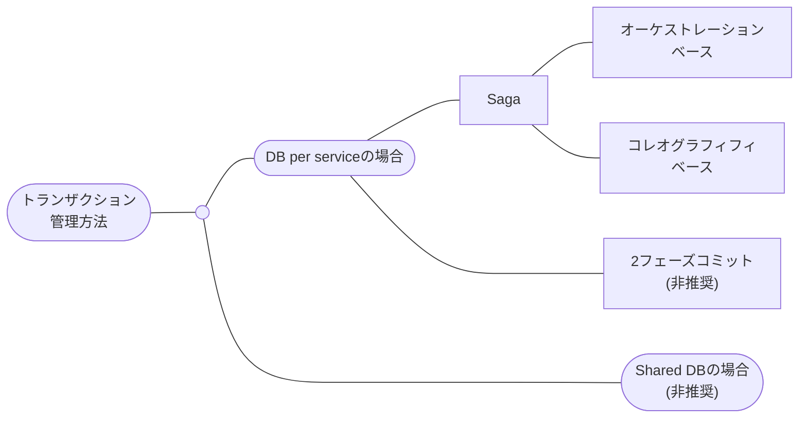

## Sagaパターン

DB per service下でのトランザクション管理方法の1つです。

マイクロサービスの永続化の間に依存関係がある場合 (例：受注データの永続化には、配送データや決済データの永続化の結果が必要) に、これらのマイクロサービスの永続化を調整する必要があります。

占有DBを持つマイクロサービスを調整するときに、ACID属性のうち特にC (整合性) の担保が課題になります。

クライアントの1つの操作が複数のマイクロサービスにまたがる場合、各マイクロサービスのトランザクション (以降、ローカルトランザクションとする) を連続的に実行することになる。

この時に、いずれかのローカルトランザクションの成功または失敗に関わらず、データ全体として整合性を満たさなければなりません。

Sagaパターンは、この課題を解決するためのパターンです。

[Microservices Pattern: Pattern: Saga](https://microservices.io/patterns/data/saga.html)

[複数サービス間でのデータの整合性維持に向けたSagaの実装 - NTT Communications Engineers' Blog](https://engineers.ntt.com/entry/2023/12/12/095337)

## ２フェーズコミット (二相コミットパターン)

Sagaパターンと同様に、DB per service下でのトランザクション管理方法の1つです。

> 💡 余裕があったら書くぜ！

[分散トランザクションに挑戦しよう！](https://www.ogis-ri.co.jp/otc/hiroba/technical/DTP/step2/)

# 11-02. Sagaパターン

## オーケストレーションベース

オーケストレーションベースは、Sagaパターンのデザインパターンの1つです。

Sagaオーケストレーターを配置し、Sagaパターンを実装します。

Sagaオーケストレーターは中央集中的に各マイクロサービスを操作し、それぞれにローカルトランザクションを実行させます。

また、Sagaオーケストレーターはローカルトランザクションの進捗度を占有DBで永続化します。

いずれかのマイクロサービスでローカルトランザクションが失敗した場合、補償トランザクションを実行し、擬似的にデータをロールバックします。

Sagaオーケストレーター以外にも、Sagaオーケストレーターを実行するクライアントや、処理結果をクライアントに返却するステータスチェッカーが必要になるでしょう。

各マイクロサービス間の通信方式は、リクエスト/レスポンス方式またはパブリッシュ/サブスクライブ方式のどちらでもよいです。

[Microservices Pattern: Pattern: Saga](https://microservices.io/patterns/data/saga.html)

[https://github.com/Azure-Samples/saga-orchestration-serverless/blob/main/docs/architecture/workflows.md](https://github.com/Azure-Samples/saga-orchestration-serverless/blob/main/docs/architecture/workflows.md)

### Temporalによるオーケストレーションベース

ここでは、Temporalを採用し、オーケストレーションベースのSagaパターンを実装します

フロントエンドアプリが同期リクエストを送信し、Sagaオーケストレーションを実行します。

さらにその後、非同期リクエストで処理結果を取得し、クライアントに返却します。

.drawio.png>)

| 図中のコンポーネント                        | 説明                                                                                                                                                                                                                                                                                                                                                   |
| ------------------------------------------- | ------------------------------------------------------------------------------------------------------------------------------------------------------------------------------------------------------------------------------------------------------------------------------------------------------------------------------------------------------ |
| マイクロサービス (Temporalクライアント)     | ワークフローをタスクキューに登録する。タスクキューからワークフローを取得し、これを実行する。ワークフローを調整し、ローカルトランザクションを実行する。この時、いずれかのローカルトランザクションが失敗した場合は、ローカルトランザクションを元に戻すトランザクションを逆順で実行する。この擬似的なロールバックの仕組みを、補償トランザクションという。 |
| ワークフローステータスチェッカー            | Temporalサーバーからワークフローのステータスを定期的に取得する。                                                                                                                                                                                                                                                                                       |
| タスクキュー (Temporalサーバー)             | Sagaオーケストレーターやメッセージキューとして機能する。ワークフローの進捗度を占有DBに永続化する。APIを持ち、Temporal SDKで操作できる。ワークフローのステータスをSagaログとして占有DBに永続化する。                                                                                                                                                    |
| 依存対象マイクロサービス (Temporalワーカー) | 自身が実行すべきアクティビティをTemporalサーバーに登録する。Temporalサーバーからアクティビティタスクを取得し、これを実行する。アクティビティタスクが完了すれば、タスクキューに結果を送信する。ローカルトランザクションのエンドポイントとは別に、補償トランザクションを実行できるエントポイントも持つ。                                                 |

### アプリアーキテクチャの適用

各コンポーネントにアプリアーキテクチャを適用します。

共通の説明として、Temporal SDKはTemporalサーバーのAPIをコールするクライアントに相当するため、ロジックをインフラストラクチャ層に実装するとよいでしょう。

.drawio.png>)

| 図中のコンポーネント                        | 責務                                                                                                                                                                                                                                                                  |
| ------------------------------------------- | --------------------------------------------------------------------------------------------------------------------------------------------------------------------------------------------------------------------------------------------------------------------- |
| マイクロサービス (Temporalクライアント)     | ドメイン層には、ワークフローの定義ロジックを実装する。インフラストラクチャ層に、クライアントからの同期リクエストを受信するためのAPIとTemporal SDKクライアントを実装する。                                                                                             |
| ワークフローステータスチェッカー            | ドメイン層には、取得するワークフローステータスのロジックを実装する。インフラストラクチャ層にTemporal SDKのロジックを実装する。インフラストラクチャ層に、クライアントからの非同期リクエスト (ポーリング処理) を受信するためのAPIとTemporal SDKクライアントを実装する。 |
| タスクキュー (Temporalサーバー)             | ユーザーが独自のロジックを実装する必要はなく、専用の設定ファイルを定義する。                                                                                                                                                                                          |
| 依存対象マイクロサービス (Temporalワーカー) | インフラストラクチャ層にTemporal SDKのロジックを実装する。                                                                                                                                                                                                            |

[Fault Tolerant Distributed Microservices Orchestration with Temporal - Maxim & Tihomir @ TheDevConf](https://www.youtube.com/watch?v=6T6zVZHU7_Q&t=1559s)

[https://github.com/guntenbein/temporal_microservices](https://github.com/guntenbein/temporal_microservices)

[Designing A Workflow Engine from First Principles](https://temporal.io/blog/workflow-engine-principles)

## コレオグラフィベース

コレオグラフィベースは、Sagaパターンのデザインパターンの1つです。

オーケストレーションベースのような中央集中的な操作ではなく、特定のマイクロサービスが他のマイクロサービスを操作する方式である。

特定のマイクロサービスは、自身のローカルトランザクションを完了させた後に、後続のマイクロサービスをコールし、ローカルトランザクションを完了させます。

各マイクロサービス間の通信方式は、パブリッシュ/サブスクライブ方式にする必要があります。

> 💡 余裕があったら書くぜ！

[Microservices Pattern: Pattern: Saga](https://microservices.io/patterns/data/saga.html)

[saga パターン - Azure Design Patterns](https://learn.microsoft.com/ja-jp/azure/architecture/reference-architectures/saga/saga)

## 振り返り

ここで、もう一度、マイクロサービスアーキテクチャを概説します。

マイクロサービスアーキテクチャのマイクロサービス領域で、SagaオーケストレーターとしてTemporalを組み込んでいます。

- フロントエンド領域
- API Gateway領域
- マイクロサービス領域 (SagaオーケストレーターとしてのTemporal)
- ストレージ領域 (DB)

# 13. 認証

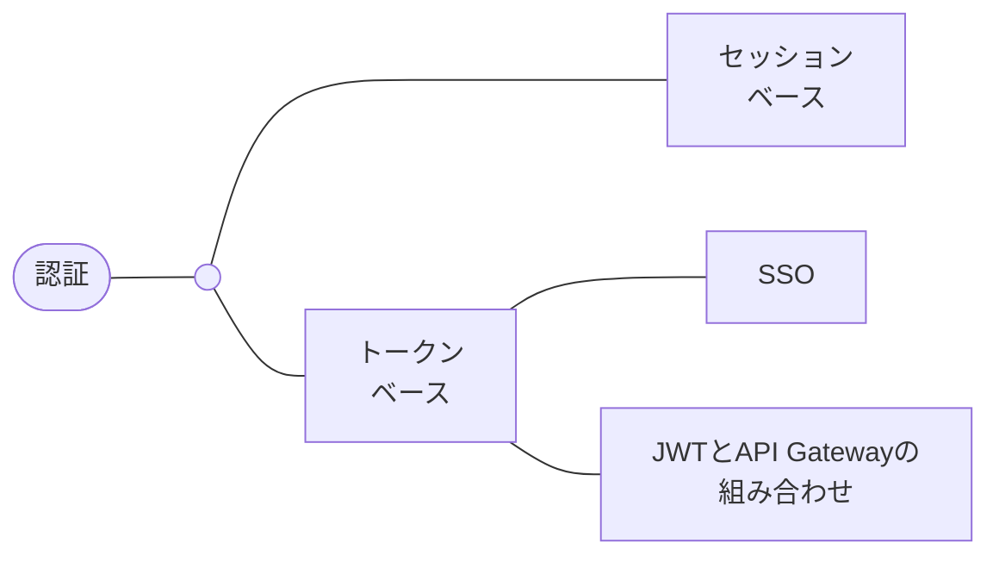

## セッションベース

セッションを使用して、マイクロサービス間で認証情報を伝播します。

## トークンベース

トークンを使用して、マイクロサービス間で認証情報を伝播します。

### SSO

SSOで各マイクロサービスを認証します。

認証マイクロサービスをIDプロバイダーとして使用し、これはアクセストークンの発行から検証までを実施します。

ここでは、SSOの中でもOIDC (認可コードフロー) の仕組みを概説します。

[iopscience.iop.org](https://iopscience.iop.org/article/10.1088/1742-6596/910/1/012060/pdf#page=6)

### JWT + API Gateway

> 💡
>
> 余裕があったら書くぜ！

# 13-02. OIDCによるSSO

## KeycloakとIstioによるSSO

.drawio.png>)

1. ユーザーはログインする。ブラウザは、AWS Route53にリクエストを送信する。
2. ALBは、リクエストをIstio IngressGatewayにL7ロードバランシングする。
3. Istio IngressGatewayは、リクエストをフロントエンドアプリ (SPA) にL7ロードバランシングする。
4. フロントエンドアプリ (SPA) は、任意の認証パッケージを使用して認証を開始する。メールアドレスでログインする場合はKeycloakが、Googleアカウントの場合はGoogleが、IDプロバイダーになる。これらに認証フェーズを委譲する。
5. GoogleまたはKeycloakは、DBからユーザー情報を取得し、レスポンスを返信する。
6. フロントエンドアプリ (SPA) は、API Gateway (Nginx) にアクセストークンを含むリクエストを送信する。
7. API Gateway (Nginx) は、Istioリソースを使用して、Keycloakにアクセストークン検証リクエストを送信する。アクセストークンの検証が成功する。
8. API Gateway (Nginx) は、マイクロサービスにアクセストークンを含むリクエストを送信する。
9. マイクロサービス領域では、マイクロサービスはAPI Gatewayからアクセストークンを含むリクエストを受信し、また他のマイクロサービスに同様のリクエストを送信する。
10. マイクロサービスは、任意の認証パッケージやIstioリソースを使用して、Keycloakにアクセストークン検証リクエストを送信する。アクセストークンの検証が成功する。マイクロサービスはブラウザにレスポンスを返信する。
11. ブラウザはホーム画面を表示する。また、アクセストークンをLocalStorageに保管する。
12. 任意のデータを取得するために、アクセストークンを再利用する。ブラウザは、AWS Route53にアクセストークンを含むリクエストを送信する。
13. ALBは、リクエストをIstio IngressGatewayにL7ロードバランシングする。
14. マイクロサービスは、ドメイン層の認可をする。認可スコープに応じたCRUDをDBに対して実行する。
15. 外部APIは認証済APIキーを所有しており、AWS Route53にAPIキーを含むリクエストを送信する。
16. ALBは、リクエストをIstio IngressGatewayにL7ロードバランシングする。
17. Istio IngressGatewayは、リクエストをAPI Gateway (Nginx) にL7ロードバランシングする。
18. API Gateway (Nginx) は、マイクロサービスにアクセストークンを含むリクエストを送信する。

## ログイン処理のシーケンス

ここでは、OIDCのPCブラウザのログイン処理をシーケンス図にしました。

PCブラウザフロントエンド (SPA) とIDプロバイダー (Keycloak、Google) の間のリクエスト送受信は、特に複雑です。

アクセストークン再利用以降の仕組みは、次節であらためて概説します。

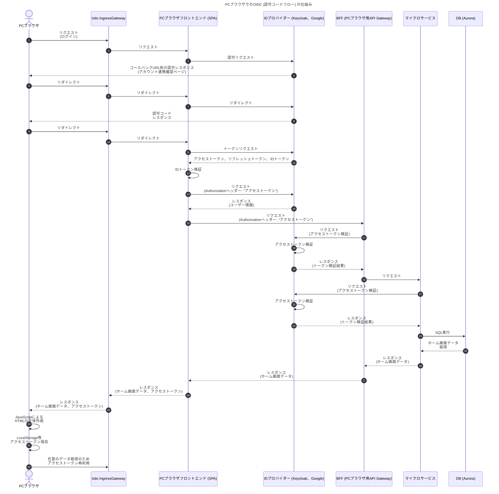

[SPA and Rest API Application friendly Oauth 2.0/Oidc login flow](https://ysyau.medium.com/spa-and-rest-api-application-friendly-oauth-2-0-oidc-login-flow-80ba927ff47d)

## KeycloakとIstioによるアクセストークン検証

Istioを使用して、クライアントが認証済みかどうかをアクセストークンでその都度検証できます。

ブラウザは、LocalStorageに管理したアクセストークンを再利用します。

AWS EKSクラスター内では、リクエストのAuthorizationヘッダーにアクセストークンを設定し、Pod間でアクセストークンを伝播する必要があります。

Istioのカスタムリソース (RequestAuthentication、AutorizationPolicy) を使用すると、従来はアプリに実装していた認証やアクセストークン検証の責務をistio-proxyに切り分けられます。

API Gatewayとして使用しているNginxのように、認証やアクセストークン検証が拡張機能のように扱われているようなツールでは、これが特に役立ちます。

一方でアプリに関しては、任意の認証パッケージまたはIstioリソースのいずれの方法で、認証やアクセストークン検証の責務を実装してもよいです。

.drawio.png>)

| 図中の登場キャラクター            | 説明                                                                                                                                                                                                                                                                                                                                           |
| --------------------------------- | ---------------------------------------------------------------------------------------------------------------------------------------------------------------------------------------------------------------------------------------------------------------------------------------------------------------------------------------------- |
| Istio AuthorizationPolicy         | 紐付けたPodのistio-proxyにアクセストークンの検証処理を実装する。istio-proxyは、IDプロバイダーにアクセストークン検証のリクエストを送信する。アクセストークンが無い場合に、ダウンストリームに `403` ステータスを返信する。失効 / 不正のアクセストークンを含むリクエストを検証せずに許可してしまうため、RequestAuthenticationも実装すべきである。 |
| Istio RequestAuthentication       | 紐付けたPodのistio-proxyにアクセストークンの検証処理を実装する。istio-proxyは、IDプロバイダーにアクセストークン検証のリクエストを送信する。アクセストークンが失効 / 不正だった場合に、ダウンストリームに `401` ステータスを返信する。アクセストークンが無いリクエストを検証せずに許可してしまうため、AuthorizationPolicyも実装すべきである。   |
| Istioデータプレーン (istio-proxy) | Keycloakにアクセストークンの検証リクエストを送信する。                                                                                                                                                                                                                                                                                         |
| Keycloak                          | アクセストークンを発行する。また、検証リクエストに応じて、アクセストークンが正しいかどうかを検証する。                                                                                                                                                                                                                                         |

概念図では仕組みを概説しきれないため、PCブラウザだけに関するアクセストークン検証の仕組みをシーケンス図にしました。

前節で概説した “PCブラウザでのOIDC (認可コードフロー) の仕組み” の続きに相当します。

このシーケンス図では、アクセストークン検証処理で任意の認証パッケージまたはIstioリソースのいずれの方法を採用するか、に関しては言及していません。

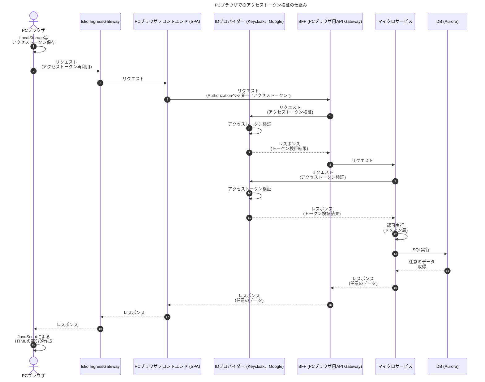

[Microservices Pattern: Pattern: Access token](https://microservices.io/patterns/security/access-token.html)

[Security](https://istio.io/latest/docs/concepts/security/#authentication-architecture)

[Security](https://istio.io/latest/docs/concepts/security/#authorization-architecture)

## ログアウト処理のシーケンス

> 💡
>
> 余裕があったら書くぜ！

# 14. 認可

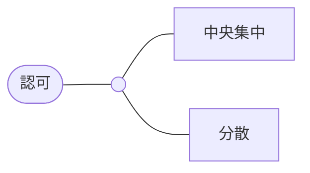

## 中央集中

認可マイクロサービスが、全てのマイクロサービスの認可処理を担います。

今回は概説を省略します。

## 分散

各マイクロサービスが認可処理を担います。

認可ロジックはドメイン層と似たような責務を持つため、分散パターンとして各マイクロサービスで実装するとよいです。

> 💡
>
> ここにポンチ絵を描く。

# 15-22. インフラ領域を参照

[【インフラ領域】DDDとクラウドネイティブによるマイクロサービスアーキテクチャ設計の概説](https://example.com)

# 24-29. 横断領域を参照

[【横断領域】DDDとクラウドネイティブによるマイクロサービスアーキテクチャ設計の概説](https://example.com)
