# 【横断領域】DDDとクラウドネイティブによるマイクロサービスアーキテクチャ設計の概説

# 本記事について

[【導入】DDDとクラウドネイティブによるマイクロサービスアーキテクチャ設計の概説](https://example.com) の記事のインフラ領域です。

横断領域のデザインパターンです。

# 01-04. 導入を参照

[【導入】DDDとクラウドネイティブによるマイクロサービスアーキテクチャ設計の概説](https://example.com)

# 05-14. アプリ領域を参照

[【アプリ領域】DDDとクラウドネイティブによるマイクロサービスアーキテクチャ設計の概説](https://example.com)

# 15-19. インフラ領域を参照

[【インフラ領域】DDDとクラウドネイティブによるマイクロサービスアーキテクチャ設計の概説](https://example.com)

# 20. 汎用的ロジック共有化方法

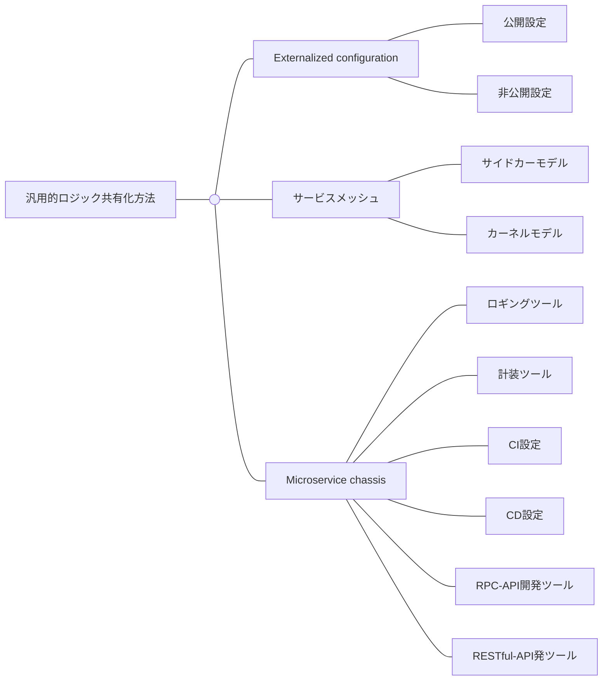

## **Externalized configurationパターン**

マイクロサービスの設定をマイクロサービスの外で保管します。

必要に応じて、これらを暗号化します。

[Microservices Pattern: Pattern: Externalized configuration](https://microservices.io/patterns/externalized-configuration.html)

### AWSリソースとKubernetesによる設定管理

| 管理場所             | データの種類                                                  | 暗号化キー                   | 説明                                                                                                                                                               |
| -------------------- | ------------------------------------------------------------- | ---------------------------- | ------------------------------------------------------------------------------------------------------------------------------------------------------------------ |
| AWS Systems Manager  | AWSリソースの非公開設定 (例：DBの認証情報)                    | AWS KMS                      | Terraformの使用時に、AWSリソースを構築する機密な設定を管理しておく。                                                                                               |
| Kubernetes ConfigMap | コンテナが使用する公開設定 (例：タイムアウト値、タイムゾーン) | なし                         | ファイルや環境変数として、設定をコンテナに渡せる。設定を平文で管理する。                                                                                           |
| Kubernetes Secret    | コンテナが使用する非公開設定 (例：DB認証情報)                 | Kubernetesリポジトリ内のSOPS | ファイルや環境変数として、コンテナに設定を渡せる。設定をbase64方式エンコードし、管理する。機密な設定を平文で管理することは危険であり、Secretで管理するほうが良い。 |

[Microservices Pattern: Pattern: Externalized configuration](https://microservices.io/patterns/externalized-configuration.html)

## サービスメッシュパターン

マイクロサービスの持つ汎用的なロジックを共有化し、これを各マイクロサービスに横断的に提供します。

[Microservices Pattern: Pattern: Service mesh](https://microservices.io/patterns/deployment/service-mesh.html)

### サイドカーパターン

共有化したロジックをマイクロサービスのサイドカーとして提供します。

[Microservices Pattern: Pattern: Sidecar](https://microservices.io/patterns/deployment/sidecar.html)

### サイドカーレスパターン

共有化したロジックをホストマシンのエージェントやカーネル機能として提供します。

[https://speakerdeck.com/tgraf/cilium-service-mesh-servicemeshcon-europe-2022?slide=14](https://speakerdeck.com/tgraf/cilium-service-mesh-servicemeshcon-europe-2022?slide=14)

## Microservice chassisパターン

アプリケーションの中でも非機能に近いロジックは、マイクロサービスに依らず、同じような実装になりがちである。

各マイクロサービスへ横断的に提供できるよう、共有リポジトリに切り分ける。

[Microservices Pattern: Pattern: Microservice chassis](https://microservices.io/patterns/microservice-chassis.html)

### ロギングツール

ロギングツールのコードは、マイクロサービス間で統一するために、共有リポジトリに配置しましょう。

ログの構造や属性 (メッセージ、トレースID、重要度、タイムスタンプ、 ログステータス、ユーザーエージェントなど) はマイクロサービス間で共有化するとよいです。

ログの構造や属性が各マイクロサービスで同じであると、ログクエリのロジックを統一できるため、マイクロサービス単位での分析可視化やアラート検知がしやすくなります。

そこで、ロギングツールは共有リポジトリで提供し、各リポジトリが使用 (例：Goならimport) できるようにします。

### 計装ツール

計装ツールのコードは、マイクロサービス間で統一するために、共有リポジトリに配置しましょう。

計装ツールのセットアップ処理や付与する属性 (マイクロサービス名、DB名、実行環境名など) はマイクロサービス間で共有化するとよいです。

セットアップ処理はやや煩雑な一方で、実装がマイクロサービスに依らないため、共有化できます。

また特にトレーシングでは、スパンに付与すべき属性を統一すると、トレーシングによるトラブルシューティングが効率的になります。

そこで、計装ツールは共有リポジトリで提供し、各リポジトリが使用 (例：Goならimport) できるようにします。

### CI設定

CI設定のコードは、マイクロサービス間で統一するために、共有リポジトリに配置しましょう。

CIの設定ファイルは、実装がマイクロサービスに依らないため、共有化できます。

各リポジトリが使用 (例：Goならimport) できるようにします。

### CD設定

CD設定のコードは、マイクロサービス間で統一するために、共有リポジトリに配置しましょう。

ArgoCDを採用している場合、ArgoCDのルートApplicationをプラットフォームリポジトリ、各チームの親Applicationを共有リポジトに配置します。

.png).png)

### RPC-API開発ツール

RPC-API開発ツールのコードは、マイクロサービス間で統一するために、共有リポジトリに配置しましょう。

gRPCでは、クライアントとサーバーの両方で、サービス定義ファイル (`proto` ファイル) から作成したpbファイルを使用しなければなりません。

各リポジトリでpbファイルを作成するような運用であると、サービス定義ファイルの変更時に、各リポジトリでpbファイルやAPI仕様書を作成しなければならず、管理が煩雑になります。

そこで、サービス定義ファイルは共有リポジトリで提供し、またサービス定義ファイルから必要なものを自動的に作成できるようにします。

[Protocol Buffersの一元管理方法 | MoT Lab (GO Inc. Engineering Blog)](https://lab.mo-t.com/blog/protocol-buffers)

### RESTful-API開発ツール

RESTful-API開発ツールのコードは、マイクロサービス間で統一するために、共有リポジトリに配置しましょう。

### IaC

TerraformやAnsibleのコードは、マイクロサービス間で統一するために、共有リポジトリに配置しましょう。

// ここにポンチ絵

# 21. リポジトリ分割方法

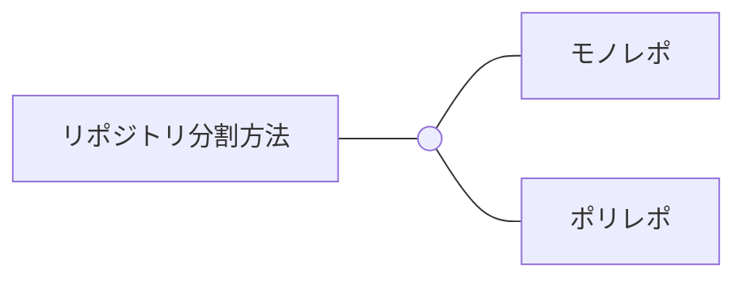

## モノレポパターン

全てのマイクロサービスを単一のリポジトリで開発します。

## ポリレポパターン

マイクロサービスごとに異なるリポジトリで開発します。

なお、本記事では、ポリレポパターンを採用します。

### アプリリポジトリ群

アプリケーションのコードは占有リポジトリに配置しましょう。

- マイクロサービス
- フロントエンドアプリ
- BFF
- 共有ロジック

### Kubernetesリポジトリ群

Kubernetesリソースのコードは占有リポジトリに配置しましょう。

- マイクロサービス
- フロントエンドアプリ
- BFF
- SREツール

### Terraformリポジトリ群

Terraformのコードは占有リポジトリに配置しましょう。

- マイクロサービス
- フロントエンドアプリ
- BFF
- SREツール

# 22. 組織構成

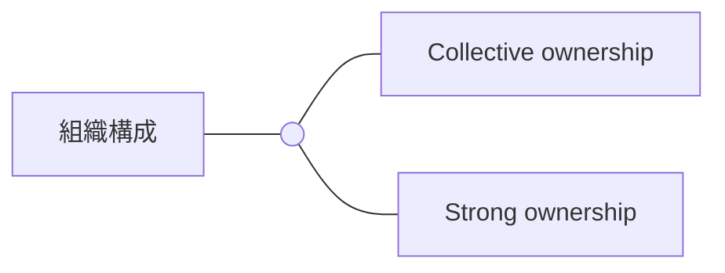

## Collective ownershipパターン

各チームは任意のコンポーネント (マイクロサービス、フロントエンドアプリ、BFF、SREツール) を共有します。

任意のコンポーネントを自由に変更できます。

## Strong ownershipパターン

1つのチームはコンポーネント (マイクロサービス、フロントエンドアプリ、BFF、SREツール) を占有します。

他チームの占有するコンポーネントを変更する場合、プルリクエストが必要です。

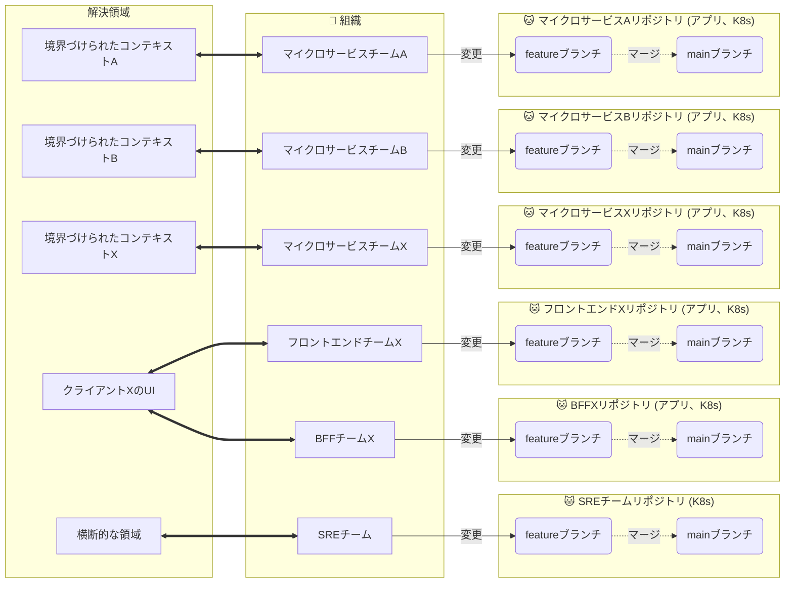

[Building Microservices, 2nd Edition](https://www.oreilly.com/library/view/building-microservices-2nd/9781492034018/ch15.html)

# 23. CI/CDパイプライン

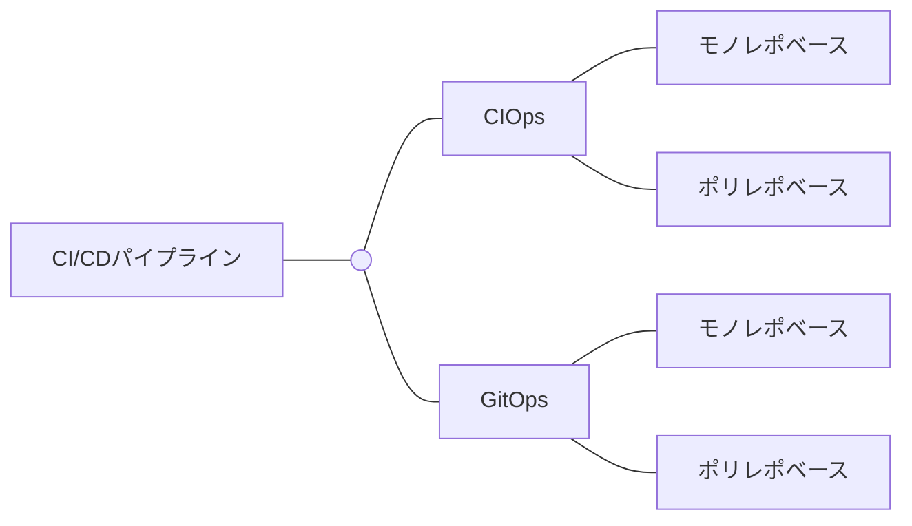

## CIOpsパターン

Kubernetesをマイクロサービスのデプロイプラットフォームとして採用する場合、CIOpsパターンのCI/CDパイプラインはアンチパターンです。

なお、ここではCIOpsパターンの説明を概説を省略します。

## GitOpsパターン

Kubernetesをマイクロサービスのデプロイプラットフォームとして採用する場合、GitOpsパターンのCI/CDパイプラインが適切です。

GitOpsでは、CIパイプラインとCDパイプラインが独立しています。

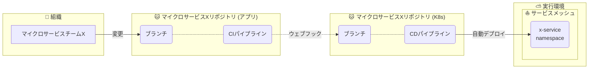

# 23-02. GitOpsパターン

GitOpsパターンは、以下の独立したCIパイプラインとCDパイプラインからなります。

- アプリリポジトリのCIパイプライン
- KubernetesリポジトリのCIパイプライン
- CDパイプライン

CI/CDパイプラインのステップは、ここでは以下とします。

ユースケースに合わせて、任意のステップを挿入できます。

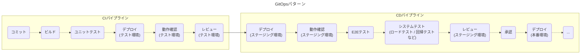

## リポジトリ種別のパイプライン

### フロントエンドアプリ

フロントエンドアプリケーションのCI/CDパイプラインは、以下の要素からなります。

- アプリリポジトリのCIパイプライン (１行目)
- KubernetesリポジトリのCIパイプライン (２行目)
- CDパイプライン (３行目)

CDNを採用している場合は、デプロイ前後で必要な静的ファイルが変わっているかもしれません。

そのため、ArgoCDによるフロントエンドアプリケーションのデプロイ後に、静的ファイルのキャッシュを削除すべきです。

また、E2Eツール (例：Playwright) を使用して、実際のユーザーを模した一連の操作を実施し、全てのコンポーネントを対象としたシステムテストを実施すべきです。

.drawio.png)

### BFF

本記事では、BFFにNginxを採用しています。

イメージビルド時に、Nginxのベースイメージにモジュール (例：計装モジュール) をインストールする必要があります。

CI/CDパイプラインは、以下の要素からなります。

.drawio.png)

### マイクロサービス

マイクロサービスのCI/CDパイプラインは、以下の要素からなります。

- アプリリポジトリのCIパイプライン (１行目)
- KubernetesリポジトリのCIパイプライン (２行目)
- CDパイプライン (３行目)

デプロイの前後で、マイクロサービスに新しいカラムへの参照ロジックを追加しているかもしれません。

そのため、ArgoCDによるマイクロサービスのデプロイ前に、DBマイグレーションを実行すべきです。

また、ロードテストツール (例：Gatling) を使用して、マイクロサービスアーキテクチャ全体のロードテスト / 回帰テスト、を実施すべきです。

 .drawio.png)

### SREツール

SREツールは、OSSとしてビルド済みイメージが提供されていることが多いです。

CI/CDパイプラインは、以下の要素からなります。

- KubernetesリポジトリのCIパイプライン (１行目)
- CDパイプライン (２行目)

 .drawio.png)

## リポジトリ分割パターンに基づくGitOpsパターン

### ポリレポベースのGitOpsパターン

ポリレポを採用した場合、各リポジトリにGitOpsパターンのCIパイプラインとCDパイプラインがあります。

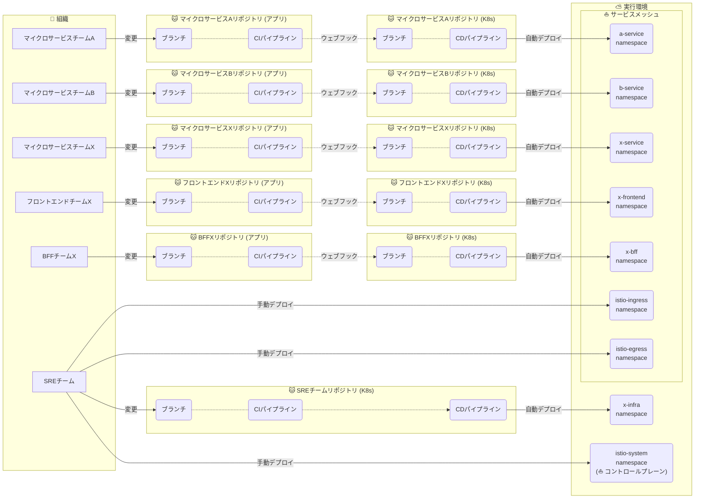

[Building Microservices, 2nd Edition](https://www.oreilly.com/library/view/building-microservices-2nd/9781492034018/ch07.html)

### 手動デプロイと自動デプロイの使い分け

GitOpsパターンのCI/CDパイプラインのうちで、デプロイに着目します。

基本的に全てのPodを自動でデプロイします (例：ArgoCD) 。

ただし、一部のツール (例：Istio) は運用のしやすさを考慮して、手動でデプロイします (例：Helmfile) 。

| 図中の登場キャラクター | 説明 |
| ---------------------- | ---- |
| 力尽きた…              |      |
|                        |      |

ArgoCDの仕組みは、以下のブログで解説しているため、5000兆回ブックマークしてくれると嬉しいです！

[【ArgoCD🐙】ArgoCDのマイクロサービスアーキテクチャと自動デプロイの仕組み - 好きな技術を布教したい 😗](https://hiroki-hasegawa.hatenablog.jp/entry/2023/05/02/145115)

# 24. マイクロサービスのデプロイ方法

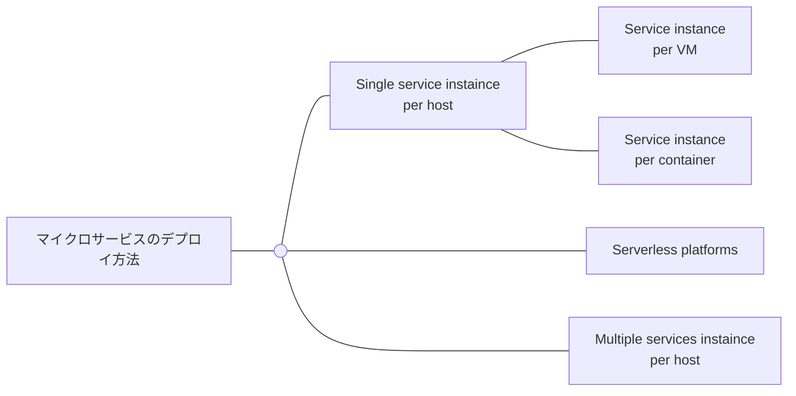

## Serverless platforms**パターン**

PaaSやFaaS (例：AWSであれば、AWS BeanstalkやAWS Lambda) を使用して、マイクロサービスをデプロイします。

是非について後述しています。

[Microservices Pattern: Pattern: Serverless deployment](https://microservices.io/patterns/deployment/serverless-deployment.html)

## Multiple services instance per hostパターン

物理マシン、仮想マシン、そしてコンテナを使用して、マイクロサービスをデプロイします。

これらの上で、複数の種類のマイクロサービスを稼働させます。

## Single service instance per hostパターン

仮想マシンまたはコンテナを使用して、マイクロサービスをデプロイします。

これらの上で、単一の種類のマイクロサービスを稼働させます。

各物理マシンで単一の種類のマイクロサービスを稼働させることはコスト的に現実的ではないため、ここでは省略します。

### Service instance per VM**パターン**

仮想マシン (例：AWSであればAWS EC2) を使用して、マイクロサービスをデプロイします。

仮想マシン上では、特定のマイクロサービスのみが稼働します。

マイクロサービスを仮想マシンのマシンイメージにあらかじめ組み込みこんでおき、仮想マシンと一緒にデプロイします。

### Service instance per containerパターン

コンテナ (例：AWSであれば、AWS ECSやAWS EKS) を使用して、マイクロサービスをデプロイします。

コンテナ上では、特定のマイクロサービスのみが稼働します。

本記事では、Single instance per containerを採用とします。

[Microservices Pattern: Pattern: Service deployment platform](https://microservices.io/patterns/deployment/service-deployment-platform.html)

# 24-02. Service instance per containerパターン

## マイクロサービス

### デプロイ

_%25E3%2581%25AE%25E3%2583%2586%25E3%2582%2599%25E3%2583%2595%25E3%2582%259A%25E3%2583%25AD%25E3%2582%25A4.drawio.png>)

| プラクティス項目      | 説明                                                                                                                                                                                                                                                                                 |
| --------------------- | ------------------------------------------------------------------------------------------------------------------------------------------------------------------------------------------------------------------------------------------------------------------------------------ |
| Kubernetes Deployment | Workload (例：Deployment、DaemonSet、StatefulSet、Jobなど) でPodを冗長化する。Rolling Update戦略では、既存のPodを稼働させながら、新しいPodをデプロイする。そのため、新旧Podが並列的に稼働するため、クライアントからのリクエストを処理しながら、ダウンタイムなくPodをデプロイできる。 |
| Kubernetes Pod        | Workload配下のPodを異なるAZにデプロイします。                                                                                                                                                                                                                                        |

## フロントエンド

### デプロイ

_%25E3%2581%25AE%25E3%2583%2586%25E3%2582%2599%25E3%2583%2595%25E3%2582%259A%25E3%2583%25AD%25E3%2582%25A4.drawio.png>)

## BFF

### デプロイ

_%25E3%2581%25AE%25E3%2583%2586%25E3%2582%2599%25E3%2583%2595%25E3%2582%259A%25E3%2583%25AD%25E3%2582%25A4.drawio.png>)

## SREツール

### デプロイ

_%25E3%2581%25AE%25E3%2583%2586%25E3%2582%2599%25E3%2583%2595%25E3%2582%259A%25E3%2583%25AD%25E3%2582%25A4.drawio.png>)

# 24-03. コンテナの作成から削除まで

## サービスメッシュ内

### kubeletによるコンテナ作成

マイクロサービスは、アプリまたはEnvoyの稼働するコンテナ群です。

kubeletがPodの開始プロセスを始めると、以下の一連のプロセスも同時並行的に始まります。

これらのプロセスはそれぞれ独立しており、ユーザーは制御できません。

1. コンテナを作成する。
2. Workload (例：Deployment、StatefulSetなど) が新しいPodを管理下に追加する。
3. Serviceとkube-proxyが古いPodの宛先情報を追加する。

.drawio.png>)

| プラクティス項目                    | 説明                                                                                                                                                                                                                                                                                                                                                                                                                             |
| ----------------------------------- | -------------------------------------------------------------------------------------------------------------------------------------------------------------------------------------------------------------------------------------------------------------------------------------------------------------------------------------------------------------------------------------------------------------------------------- |
| Kubernetes Pod Probeオプション      | StartupProbe、LivenessProbe、ReadinessProbe、を使い分け、正常性を素早く検知する。                                                                                                                                                                                                                                                                                                                                                |
| Kubernetes Pod PullPolicyオプション | コンテナ作成のたびにイメージをプルすると、イメージレジストリに負荷がかかる。そこで、`.spec.containers[*].imagePullPolicy` キーにIfNotPresentを使用し、Node上にイメージのキャッシュがない場合だけプルできるようにする。Kubernetesでは、一度プルしたコンテナイメージを基本的に削除しないため、キャッシュとして再利用できる。デフォルトでは、コンテナイメージのキャッシュがあれば、イメージをプルせずにキャッシュを使用してくれる。 |

kubeletは、コンテナをヘルスチェック (例：StartupProbe、LivenessProbe、ReadinessProbe) し、障害を防ぎます。

| 項目           | StartupProbe                                                                                                                                                                                                         | LivenessProbe                                                                                                                                             | ReadinessProbe                                                                                                                                                                                                                                                                                                                                                                                                 |
| -------------- | -------------------------------------------------------------------------------------------------------------------------------------------------------------------------------------------------------------------- | --------------------------------------------------------------------------------------------------------------------------------------------------------- | -------------------------------------------------------------------------------------------------------------------------------------------------------------------------------------------------------------------------------------------------------------------------------------------------------------------------------------------------------------------------------------------------------------- |
| 説明           | ヘルスチェックを実行することで、アプリケーションの起動が完了したかを確認する。ReadinessProbeよりも前に実行される。ReadinessProbeと違って起動時にしか実行されない。ウォームアップが必要なプロセスのチェックに役立つ。 | ヘルスチェックを実行することで、コンテナが正常に動作しているか確認する。 注意点として、LivenessProbeの間隔が短すぎると、kubeletに必要以上に負荷がかかる。 | ヘルスチェックを実行することで、コンテナがトラフィックを処理可能かを確認する。 コンテナが起動してもトラフィックを処理できるようになるまでに時間がかかる場合 (例: Nginxの最初の設定ファイル読み込み完了まで、MySQLの最初のコネクション受信準備完了まで) や問題の起きたコンテナにトラフィックを流さないようにする場合に役立つ。注意点として、ReadinessProbeの間隔が短すぎると、kubeletに必要以上に負荷がかかる。 |
| エンドポイント | ヘルスチェックエンドポイントLivenessProbeと同じエンドポイント(例：Nginxなら200を返却するだけの/healthcheckを定義する)                                                                                                | ヘルスチェックエンドポイント(例：Nginxなら200を返却するだけの/healthcheckを定義する)                                                                      | readyエンドポイント(例：Nginxなら用意してくれてる:8081/nginx-readyを使用する)                                                                                                                                                                                                                                                                                                                                  |
| 正常時         | LivenessProbeまたはReadinessProbeを実行する。                                                                                                                                                                        | HTTP リクエストの場合、コンテナのヘルスチェックエンドポイントが200から399ステータスを返却すれば正常とみなす。                                             | HTTP リクエストの場合、コンテナのヘルスチェックエンドポイントが200から399ステータスを返却すれば正常とみなす。                                                                                                                                                                                                                                                                                                  |
| 異常時         | LivenessProbeまたはReadinessProbeを実行しない。                                                                                                                                                                      | コンテナで障害 (例：デッドロック) が起こって応答しなくなると、コンテナを強制的に再起動してくれる。                                                        | コンテナのプロセスの準備が完了しない間、そのコンテナが処理できるようになるまで通信を流さないようにしてくれる。                                                                                                                                                                                                                                                                                                 |

[Microservices Pattern: Pattern: Health Check API](https://microservices.io/patterns/observability/health-check-api.html)

### kubeletによるコンテナ削除

コンテナ削除に関するプラクティスです。

kubeletがPodの終了プロセスを始めると、以下の一連のプロセスも同時並行的に始まります。

これらのプロセスはそれぞれ独立しており、ユーザーは制御できません。

Serviceとkube-proxyがPodの宛先情報を削除する前にPodが終了してしまうと、ServiceからPodへのコネクションを途中で切断することになってしまいます。

1. Workload (例：Deployment、StatefulSetなど) が古いPodを管理下から削除する。
2. Serviceとkube-proxyが古いPodの宛先情報を削除する。
3. コンテナを削除する。

.drawio.png>)

| プラクティス項目                                          | 説明                                                                                                                                                                                                                                                                                                                                                                                  |
| --------------------------------------------------------- | ------------------------------------------------------------------------------------------------------------------------------------------------------------------------------------------------------------------------------------------------------------------------------------------------------------------------------------------------------------------------------------- |
| Kubernetes Pod PreStopオプション                          | コンテナの削除後にPodを終了できるように、ユーザーがPodの `.spec.containers[*].lifecycle.preStop` キーに任意の秒数を設定する。コンテナが待機処理 (例：`sleep` コマンド) を実行できるようになる。                                                                                                                                                                                       |
| Kubernetes Pod TerminationGracefulPeriodSecondsオプション | Serviceとkube-proxyの処理後にPodを終了できるように、ユーザーがPodの `.spec.terminationGracePeriodSeconds` キーに任意の秒数を設定する。Podの削除に伴うServiceとkube-proxyの処理の完了を待機できるようになる。なお、`.spec.terminationGracePeriodSeconds` の秒数が長すぎると、Podの終了に時間がかかりすぎるようになり、Podの更新やAWS EKSクラスターのアップグレードに時間に影響が出る。 |

## サービスメッシュ外

> 💡
>
> 余裕があったら書くぜ！

# 24-04. その他のデプロイ選択肢

Service instance per containerパターンでAWS EKSを採用しました。

ここでは、その他の選択肢を考えます。

## AWS ECS

Service instance per containerパターンで、AWS ECSを使用して、マイクロサービスアーキテクチャを動かします。

この場合、マイクロサービスをAWS ECSサービスに対応させ、AWS ECSタスクでマイクロサービスを水平スケーリングすることになります。

[d1.awsstatic.com](https://d1.awsstatic.com/events/Summits/reinvent2022/CON311-R_Best-practices-for-deploying-microservices-on-Amazon-ECS.pdf#page=12)

### マイクロサービスアーキテクチャとの相性

AWS ECSは、AWS EKSよりもアプリ領域とインフラ領域の責務がより曖昧になります。

アプリ領域とインフラ領域で分業が進んでいない組織では、責務の境界が曖昧でも問題は起こりにくい。

その一方で、組織が大きくなるほどAWS ECSの管理者がボトルネックになります。

例えば、AWS ECSを管理しているのがインフラチームである一方で、アプリチームもAWS ECSにコンテナを設定しないといけないです。

この時、管理者のインフラチームに依頼することになる。しかし、インフラチームが手一杯であれば、スピード感が落ちる。

マイクロサービスアーキテクチャは組織が大きくなるほど価値を発揮するはずなのに、これでは逆に辛くなっています。

ただ、AWS EKSに至るまでの過渡的なシステムとして、AWS ECSを採用することはアリと考えています。

## AWS Lambda

Serverless platformsパターンで、AWS Lambdaを使用して、マイクロサービスアーキテクチャを動かします。

この場合、マイクロサービスはAWS Lambdaに対応することになる。

[Using AWS Lambda as a Microservice](https://medium.com/aws-serverless-microservices-with-patterns-best/using-aws-lambda-as-a-microservice-dd7d7296c74a)

### マイクロサービスアーキテクチャとの相性

AWS Lambdaは、AWS EKSやAWS ECSよりもさらにアプリ領域とインフラ領域の責務がより曖昧になります。

組織が大きくなるほどAWS Lambdaの管理者がボトルネックになり、AWS ECSよりも拡張性の問題は顕著です。

前述の通り、マイクロサービスアーキテクチャは組織が大きくなるほど価値を発揮するはずですが、AWS Lambdaがこれを相殺します。

これらのことから、AWS Lambdaでマイクロサービスアーキテクチャを採用するべきではないと考えています。

# 25. スケーリングと回復性管理

スケーリングと回復性管理には、主に3つの対象があります。

- Node
- Pod
- コンテナ

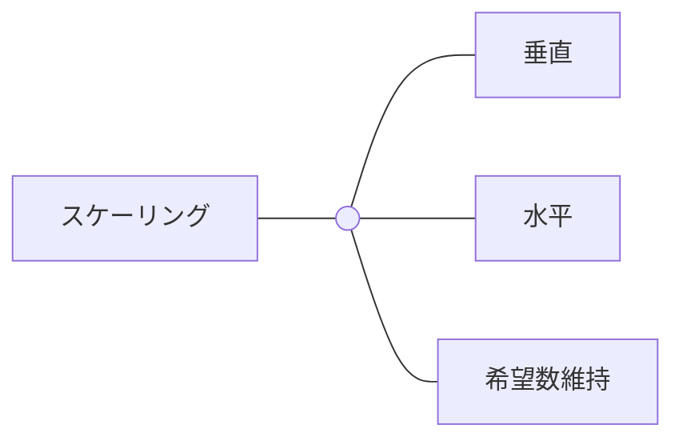

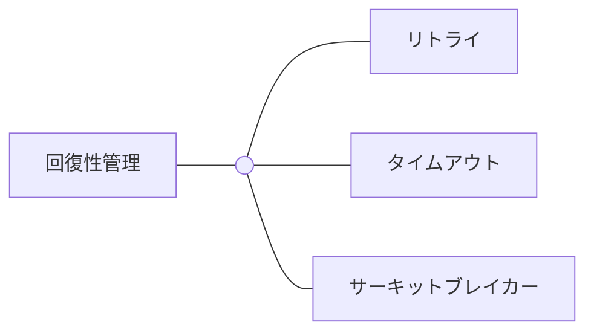

# 25-02. Nodeの垂直水平スケーリングと回復性管理

ビジネス影響の大きいマイクロサービスにのみ、専用のNodeを用意します。

それ以外のマイクロサービスは、Nodeに混合させます。

専用のNodeを実現するには、Nodeに種類を表すラベルをつける必要があります。

執筆時点では、以下のツールでラベル付きのNodeを作成できます。

- Karpenter
- AWSマネージドNodeグループNodeグループ
- セルフAWSマネージドNodeグループNodeグループ

Nodeの作成には、マシンイメージとしてAMIを採用します。

必要なソフトウェア (OS、ミドルウェア) とEBSボリュームの両方を内蔵できます。

## Karpenterによる垂直水平スケーリングと回復性管理

ここでは、Karpenterの仕組みについて解説します。

| 図中の登場キャラクター   | 説明                                                                                                                                                                                                                                                                                                                                                                                                                                                                                                                                  |
| ------------------------ | ------------------------------------------------------------------------------------------------------------------------------------------------------------------------------------------------------------------------------------------------------------------------------------------------------------------------------------------------------------------------------------------------------------------------------------------------------------------------------------------------------------------------------------- |
| AWS AMI                  | Nodeのマシンイメージである。                                                                                                                                                                                                                                                                                                                                                                                                                                                                                                          |
| Kubernetes ConfigMap     | Karpenter Controllerの各種設定を管理する。                                                                                                                                                                                                                                                                                                                                                                                                                                                                                            |
| Karpenter EC2 Node Class | Nodeの仕様を設定する。NodePoolとは異なり、AWS固有の仕様 (例：セキュリティグループ、サブネット、AMIなど) を設定できる。マシンイメージとしてAMIをプルし、Nodeを作成する。                                                                                                                                                                                                                                                                                                                                                               |
| Karpenter Controller     | Podのフェーズを監視し、PendingフェーズのままのPodが現れると、起動テンプレートとNodeを作成する。起動テンプレートは、Nodeの作成後に削除する。作成したNodeにPodをバインドし、kube-schedulerによるスケジューリングを待つ。料金最適化やハードウェア消費量最適化のために、様々なパラメーターから作成 / 削除 / 置換の対象とするNodeを計算し、Nodeの統合と垂直水平スケーリングを実行する。統合には、鳥の群れの動きをモデリングしたBoidsと似たアルゴリズムを使用している。EC2 Nodeのヘルスステータスで異常を検知すると、そのNodeを終了します。 |
| Karpenter NodePool       | Nodeの仕様を設定する。Node Classとは異なり、AWSに依らない仕様 (例：Nodeラベルなど) を設定できる。                                                                                                                                                                                                                                                                                                                                                                                                                                     |

[Karpenter vs Cluster Autoscaler ☸️](https://kubesandclouds.com/2022-01-04-karpenter/)

[https://github.com/aws/karpenter-provider-aws/blob/main/designs/consolidation.md](https://github.com/aws/karpenter-provider-aws/blob/main/designs/consolidation.md)

## AWSマネージドNodeグループNodeグループによる垂直水平スケーリングと回復性管理

> 💡
>
> 余裕があれば書くぜ！

## KarpenterとAWSマネージドNodeグループNodeグループの組み合わせ

KarpenterとAWSマネージドNodeグループNodeグループを採用し、Nodeを管理します。

複数の方法を採用する理由は、Nodeを管理するKarpenterを、自身以外の方法で管理するNode上で稼働させなければならないためである。

ここでは、KarpenterのPodをAWSマネージドNodeグループNodeグループによるNode上に、アプリ領域のPodをKarpenterによるNode上に稼働させます。

KarpenterとAWSマネージドNodeグループNodeグループの間では、機能が異なります。

.png>)

| 機能例                   | Karpenter                                                            | AWSマネージドNodeグループNodeグループ                                                                                                                                           |
| ------------------------ | -------------------------------------------------------------------- | ------------------------------------------------------------------------------------------------------------------------------------------------------------------------------- |
| Node作成                 | ラベル付きのNodeを作成する。                                         | ラベル付きのNodeを作成する。                                                                                                                                                    |
| Graceful Shutdown        | 自身の作成したNodeを削除するときに、GracefulShutdownを実行する。     | デフォルトではGraceful Shutdownを実行できない。EC2 UserDataで、`kubelet-config.json` にShutdownGracePeriodとShutdownGracePeriodCriticalPodsの設定が必要である。                 |
| 料金最適化               | Nodeの統合と垂直水平スケーリングを実行し、料金を最適化する。         | Cluster Autoscalerを併用してもしなくても、料金を最適化できない。                                                                                                                |
| ハードウェア消費量最適化 | Nodeの垂直水平スケーリングを実行し、ハードウェア消費量を最適化する。 | Cluster Autoscalerを併用しなければスケーリングを実行できず、ハードウェア消費量を最適化できない。AWSマネージドNodeグループNodeグループは、設定されたNode数を維持するだけである。 |

# 25-03. Podの垂直水平スケーリングと回復性管理

_%25E3%2581%25AE%25E9%2581%258B%25E7%2594%25A8.drawio.png>)

| プラクティス項目        | 説明                                                                                                                                                                                                                                                                                                                                                                                                          |
| ----------------------- | ------------------------------------------------------------------------------------------------------------------------------------------------------------------------------------------------------------------------------------------------------------------------------------------------------------------------------------------------------------------------------------------------------------- |
| Descheduler             | Deschedulerは、ポリシーに応じて不適切なNodeからPodを退避させる。Nodeのハードウェアリソースの消費量が動的に高まった場合に、kube-schedulerは不適切なNodeからPodを退避し、別のNodeにこれを再スケジューリングさせられない。他にNodeが障害が起こり、他のNodeにPodが退避した場合に、その後Nodeが復旧したとしても、Podが元のNodeに戻ることはない。Deschedulerを使用すれば、再スケジューリングを自動化できる。        |
| Deployment              | Pod希望数を維持する。                                                                                                                                                                                                                                                                                                                                                                                         |
| HorizontalPodAutoscaler | HorizontalPodAutoscalerでPodを水平スケーリングする。水平スケーリングは、Podの負荷が高くなるとPod数を増やし、システム全体が高負荷で機能しなくなる状況を避けられる。ただし、突発的な高負荷には弱く、Pod数の増減が間に合わないことがある。突発的な負荷のタイミングが事前に分かっているなら、事前に最小数を高めに設定しておく。                                                                                   |
| metrics-server          | HorizontalPodAutoscalerは、metrics-serverの提供するメトリクス (例：CPU使用率、メモリ使用率など) 、カスタムメトリクス、Kubernetes外のメトリクス (ロードバランサーのrps/qps値、メッセージキューの待機リクエスト数など) 、に基づいてPod数を決める。metrics-serverはデフォルトでAWS EKSクラスターに存在していないため、別途インストールしておかなければならない。                                                 |
| Pod                     | Podは、Nodeからハードウェアリソースを要求する。Podの性質に応じて、適切なQoSを設定する。上限 (`limits`) と下限 (`requests`) の設定の両方または一方を省略すると、自動的にGuaranteedになる。コンテナが一定量のハードウェアリソースを要求し続けたとしても、無制限 (Nodeの空きリソース分) にハードウェアリソースを提供し、要求に耐えられるようにする。基本的には、ほとんどのコンテナをGuaranteed QoSにすればよい。 |
| PodDisruptionBudget     | Nodeのスケールインやアップグレード時に、Nodeはドレイン処理を実行し、Podを退避させる。この時にPodDisruptionBudgeを作成しないと、DeploymentやStatefulSet配下のPodが一斉に退避し、1個でもPodを動かすことで、ダウンタイムを避けるべきである。そこで、PodDisruptionBudgeを使用すると、ドレイン中にNode上で動かしておく最小最大のPod数を設定できる。                                                                |

# 25-04. コンテナの回復性管理

## サービスメッシュ内

### Istioによるリトライ

> 💡 余裕があったら書くぜ！

### Istioによるサーキットブレイカー

> 💡
>
> 余裕があったら書くぜ！

[Microservices Pattern: Pattern: Circuit Breaker](https://microservices.io/patterns/reliability/circuit-breaker.html)

## サービスメッシュ外

### Serviceのリトライ

> 💡 余裕があったら書くぜ！

# 26. テスト方法

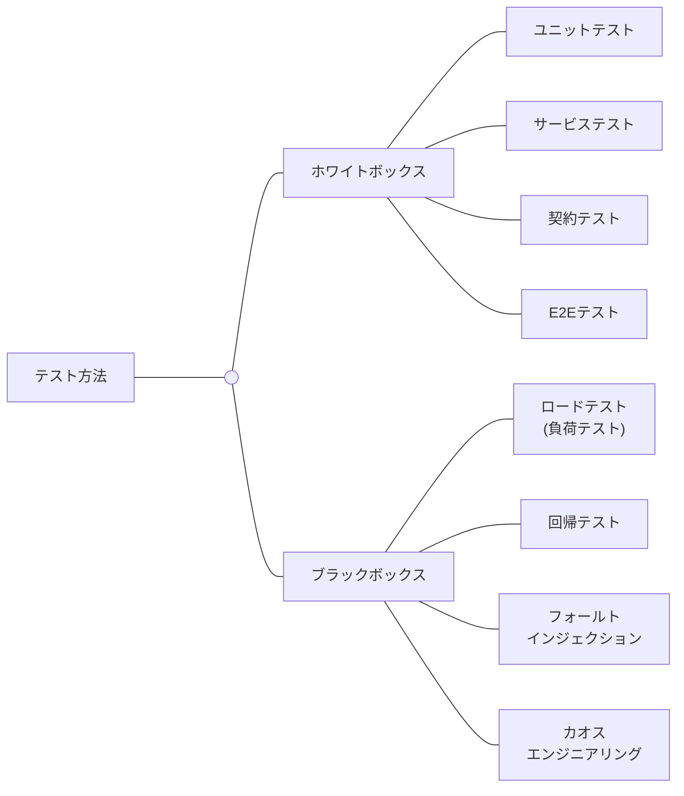

## ホワイトボックス

### ユニットテスト

ユニットテストは、マイクロサービスアーキテクチャの文脈でも、同じである。

> 💡 余裕があったら書くぜ！

### サービステスト

> 💡 余裕があったら書くぜ！

### 契約テスト

送信元マイクロサービス (コンシューマー) と宛先マイクロサービス (プロデューサー) の連携のテストを実施します。

この時、一方のマイクロサービスに他方のマイクロサービスのモックの定義するのではなく、モックの定義を『契約 (Contract) サービス』として切り分けます。

これを双方のマイクロサービス間で共有します。

契約サービス上で、双方のリクエスト / レスポンスの内容が期待値に合致するかを検証します。

Pactでは、Pact Brokerを契約サービスとして使用できます。

### E2Eテスト

> 💡 余裕があったら書くぜ！

## ブラックボックス

### ロードテスト (負荷テスト)

> 💡 余裕があったら書くぜ！

### 回帰テスト

> 💡 余裕があったら書くぜ！

### フォールトインジェクション

> 💡
>
> 余裕があったら書くぜ！
