# 【横断領域】DDD とクラウドネイティブによるマイクロサービスアーキテクチャ設計の概説

# 本記事について

[【導入】DDD とクラウドネイティブによるマイクロサービスアーキテクチャ設計の概説](https://example.com) の記事のインフラ領域です。

横断領域のデザインパターンです。

# 01-04. 導入を参照

[【導入】DDD とクラウドネイティブによるマイクロサービスアーキテクチャ設計の概説](https://example.com)

# 05-14. アプリ領域を参照

[【アプリ領域】DDD とクラウドネイティブによるマイクロサービスアーキテクチャ設計の概説](https://example.com)

# 15-19. インフラ領域を参照

[【インフラ領域】DDD とクラウドネイティブによるマイクロサービスアーキテクチャ設計の概説](https://example.com)

# 20. 汎用的ロジック共有化方法

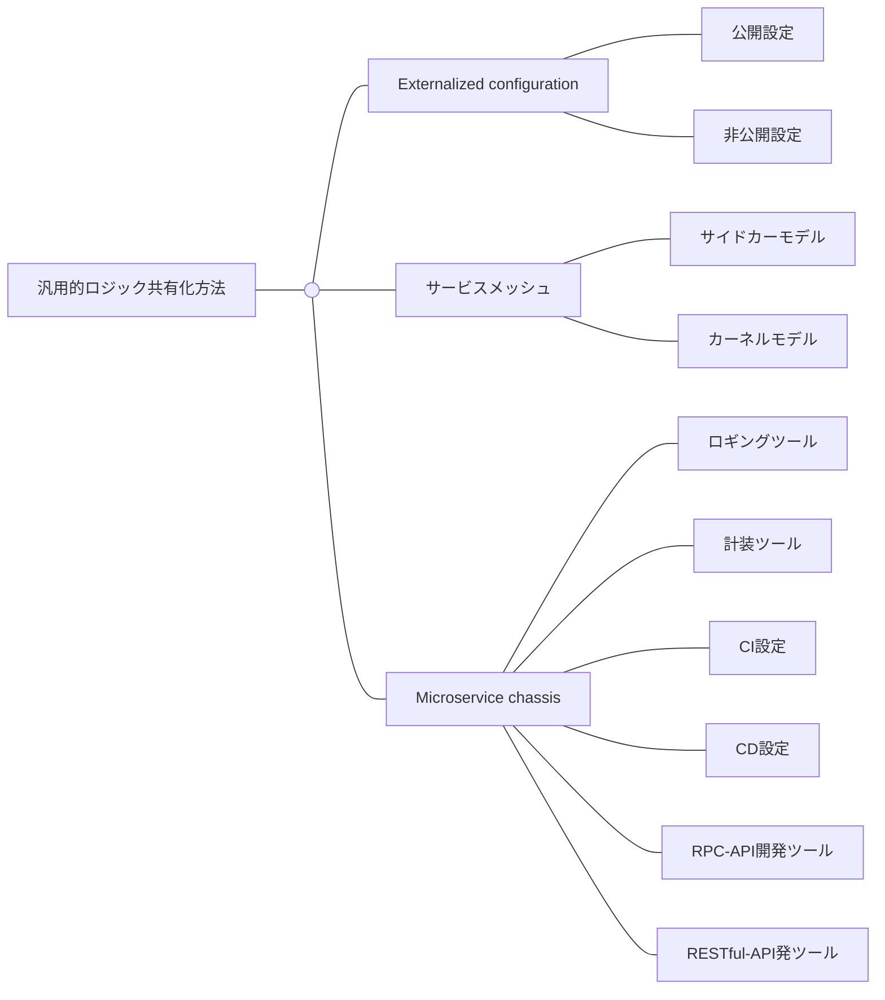
```mermaid
flowchart LR

  汎用的ロジック共有化方法 --- 汎用的ロジック共有化方法の基点((" "))
  汎用的ロジック共有化方法の基点 --- Externalized-configuration["Externalized configuration"]
  汎用的ロジック共有化方法の基点 --- サービスメッシュ
  汎用的ロジック共有化方法の基点 --- Microservice-chassis["Microservice chassis"]
  Externalized-configuration --- 公開設定
  Externalized-configuration --- 非公開設定
  サービスメッシュ --- サイドカーモデル
  サービスメッシュ --- カーネルモデル
  Microservice-chassis --- ロギングツール
  Microservice-chassis --- 計装ツール
  Microservice-chassis --- CI設定
  Microservice-chassis --- CD設定
  Microservice-chassis --- RPC-API開発ツール
  Microservice-chassis --- RESTful-API発ツール
```

## **Externalized configuration パターン**

マイクロサービスの設定をマイクロサービスの外で保管します。

必要に応じて、これらを暗号化します。

[Microservices Pattern: Pattern: Externalized configuration](https://microservices.io/patterns/externalized-configuration.html)

### AWS リソースと Kubernetes による設定管理

| 管理場所             | データの種類                                                  | 暗号化キー                     | 説明                                                                                                                                                                  |
| -------------------- | ------------------------------------------------------------- | ------------------------------ | --------------------------------------------------------------------------------------------------------------------------------------------------------------------- |
| AWS Systems Manager  | AWS リソースの非公開設定 (例：DB の認証情報)                  | AWS KMS                        | Terraform の使用時に、AWS リソースを構築する機密な設定を管理しておく。                                                                                                |
| Kubernetes ConfigMap | コンテナが使用する公開設定 (例：タイムアウト値、タイムゾーン) | なし                           | ファイルや環境変数として、設定をコンテナに渡せる。設定を平文で管理する。                                                                                              |
| Kubernetes Secret    | コンテナが使用する非公開設定 (例：DB 認証情報)                | Kubernetes リポジトリ内の SOPS | ファイルや環境変数として、コンテナに設定を渡せる。設定を base64 方式エンコードし、管理する。機密な設定を平文で管理することは危険であり、Secret で管理するほうがよい。 |

[Microservices Pattern: Pattern: Externalized configuration](https://microservices.io/patterns/externalized-configuration.html)

## サービスメッシュパターン

マイクロサービスの持つ汎用的なロジックを共有化し、これを各マイクロサービスに横断的に提供します。

[Microservices Pattern: Pattern: Service mesh](https://microservices.io/patterns/deployment/service-mesh.html)

### サイドカーパターン

共有化したロジックをマイクロサービスのサイドカーとして提供します。

[Microservices Pattern: Pattern: Sidecar](https://microservices.io/patterns/deployment/sidecar.html)

### サイドカーレスパターン

共有化したロジックをホストマシンのエージェントやカーネル機能として提供します。

[https://speakerdeck.com/tgraf/cilium-service-mesh-servicemeshcon-europe-2022?slide=14](https://speakerdeck.com/tgraf/cilium-service-mesh-servicemeshcon-europe-2022?slide=14)

## Microservice chassis パターン

アプリケーションのなかでも非機能に近いロジックは、マイクロサービスに依らず、同じような実装になりがちである。

各マイクロサービスへ横断的に提供できるよう、共有リポジトリに切り分ける。

[Microservices Pattern: Pattern: Microservice chassis](https://microservices.io/patterns/microservice-chassis.html)

### ロギングツール

ロギングツールのコードは、マイクロサービス間で統一するために、共有リポジトリに配置しましょう。

ログの構造や属性 (メッセージ、トレース ID、重要度、タイムスタンプ、 ログステータス、ユーザーエージェントなど) はマイクロサービス間で共有化するとよいです。

ログの構造や属性が各マイクロサービスで同じであると、ログクエリのロジックを統一できるため、マイクロサービス単位での分析可視化やアラート検知がしやすくなります。

そこで、ロギングツールは共有リポジトリで提供し、各リポジトリが使用 (例：Go なら import) できるようにします。

### 計装ツール

計装ツールのコードは、マイクロサービス間で統一するために、共有リポジトリに配置しましょう。

計装ツールのセットアップ処理や付与する属性 (マイクロサービス名、DB 名、実行環境名など) はマイクロサービス間で共有化するとよいです。

セットアップ処理はやや煩雑な一方で、実装がマイクロサービスに依らないため、共有化できます。

また特にトレーシングでは、スパンに付与すべき属性を統一すると、トレーシングによるトラブルシューティングが効率的になります。

そこで、計装ツールは共有リポジトリで提供し、各リポジトリが使用 (例：Go なら import) できるようにします。

### CI 設定

CI 設定のコードは、マイクロサービス間で統一するために、共有リポジトリに配置しましょう。

CI の設定ファイルは、実装がマイクロサービスに依らないため、共有化できます。

各リポジトリが使用 (例：Go なら import) できるようにします。

### CD 設定

CD 設定のコードは、マイクロサービス間で統一するために、共有リポジトリに配置しましょう。

ArgoCD を採用している場合、ArgoCD のルート Application をプラットフォームリポジトリ、各チームの親 Application を共有リポジトに配置します。

.png)

### RPC-API 開発ツール

RPC-API 開発ツールのコードは、マイクロサービス間で統一するために、共有リポジトリに配置しましょう。

gRPC では、クライアントとサーバーの両方で、サービス定義ファイル (`proto` ファイル) から作成した pb ファイルを使用しなければなりません。

各リポジトリで pb ファイルを作成するような運用であると、サービス定義ファイルの変更時に、各リポジトリで pb ファイルや API 仕様書を作成しなければならず、管理が煩雑になります。

そこで、サービス定義ファイルは共有リポジトリで提供し、またサービス定義ファイルから必要なものを自動的に作成できるようにします。

[Protocol Buffers の一元管理方法 | MoT Lab (GO Inc. Engineering Blog)](https://lab.mo-t.com/blog/protocol-buffers)

### RESTful-API 開発ツール

RESTful-API 開発ツールのコードは、マイクロサービス間で統一するために、共有リポジトリに配置しましょう。

### IaC

Terraform や Ansible のコードは、マイクロサービス間で統一するために、共有リポジトリに配置しましょう。

// ここにポンチ絵

# 21. リポジトリ分割方法

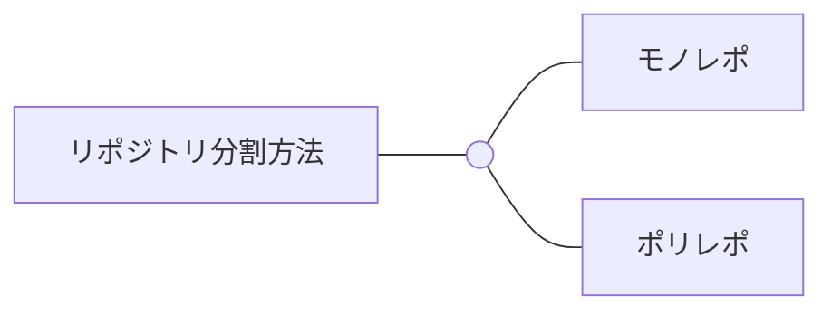
```mermaid
flowchart LR

  リポジトリ分割方法 --- リポジトリ分割方法の基点((" "))
  リポジトリ分割方法の基点 --- モノレポ
  リポジトリ分割方法の基点 --- ポリレポ


```

## モノレポパターン

すべてのマイクロサービスを単一のリポジトリで開発します。

## ポリレポパターン

マイクロサービスごとに異なるリポジトリで開発します。

なお、本記事では、ポリレポパターンを採用します。

### アプリリポジトリ群

アプリケーションのコードは占有リポジトリに配置しましょう。

- マイクロサービス
- フロントエンドアプリ
- BFF
- 共有ロジック

### Kubernetes リポジトリ群

Kubernetes リソースのコードは占有リポジトリに配置しましょう。

- マイクロサービス
- フロントエンドアプリ
- BFF
- SRE ツール

### Terraform リポジトリ群

Terraform のコードは占有リポジトリに配置しましょう。

- マイクロサービス
- フロントエンドアプリ
- BFF
- SRE ツール

# 22. 組織構成

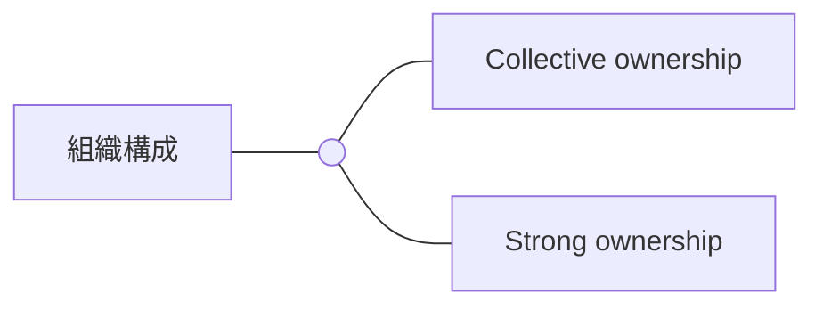
```mermaid
flowchart LR

  組織構成 --- 組織構成の基点((" "))
  組織構成の基点 --- Collective-ownership[Collective ownership]
  組織構成の基点 --- Strong-ownership[Strong ownership]


```

## Collective ownership パターン

各チームは任意のコンポーネント (マイクロサービス、フロントエンドアプリ、BFF、SRE ツール) を共有します。

任意のコンポーネントを自由に変更できます。

## Strong ownership パターン

1 つのチームはコンポーネント (マイクロサービス、フロントエンドアプリ、BFF、SRE ツール) を占有します。

他チームの占有するコンポーネントを変更する場合、プルリクエストが必要です。

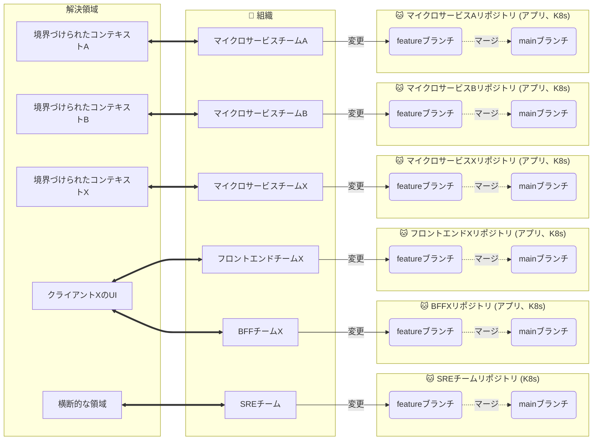
```mermaid
flowchart LR

  subgraph "👥 組織"
        SREチーム
        BFFチームX
        フロントエンドチームX
        マイクロサービスチームX
        マイクロサービスチームB
        マイクロサービスチームA
  end

  subgraph "解決領域"
        クライアントXのUI
        横断的な領域
        境界づけられたコンテキストX
        境界づけられたコンテキストB
        境界づけられたコンテキストA
  end

  subgraph "🐱 SREチームリポジトリ (K8s)"
      featureブランチSRE(featureブランチ)
      mainブランチSRE(mainブランチ)
  end

  subgraph "🐱 BFFXリポジトリ (アプリ、K8s)"
      featureブランチBFFX(featureブランチ)
      mainブランチBFFX(mainブランチ)
  end

  subgraph "🐱 フロントエンドXリポジトリ (アプリ、K8s)"
      featureブランチフロントエンドX(featureブランチ)
      mainブランチフロントエンドX(mainブランチ)
  end

  subgraph "🐱 マイクロサービスXリポジトリ (アプリ、K8s)"
      featureブランチマイクロサービスX(featureブランチ)
      mainブランチマイクロサービスX(mainブランチ)
  end

  subgraph "🐱 マイクロサービスBリポジトリ (アプリ、K8s)"
      featureブランチマイクロサービスB(featureブランチ)
      mainブランチマイクロサービスB(mainブランチ)
  end

  subgraph "🐱 マイクロサービスAリポジトリ (アプリ、K8s)"
      featureブランチマイクロサービスA(featureブランチ)
      mainブランチマイクロサービスA(mainブランチ)
  end


  横断的な領域 <==> SREチーム
  クライアントXのUI <==> BFFチームX
  クライアントXのUI <==> フロントエンドチームX
  境界づけられたコンテキストX <==> マイクロサービスチームX
  境界づけられたコンテキストB <==> マイクロサービスチームB
  境界づけられたコンテキストA <==> マイクロサービスチームA
  SREチーム --変更--> featureブランチSRE(featureブランチ) -.マージ.-> mainブランチSRE(mainブランチ)
  BFFチームX --変更--> featureブランチBFFX(featureブランチ) -.マージ.-> mainブランチBFFX(mainブランチ)
  フロントエンドチームX --変更--> featureブランチフロントエンドX(featureブランチ) -.マージ.-> mainブランチフロントエンドX(mainブランチ)
  マイクロサービスチームX --変更-->  featureブランチマイクロサービスX(featureブランチ) -.マージ.-> mainブランチマイクロサービスX(mainブランチ)
  マイクロサービスチームB --変更--> featureブランチマイクロサービスB(featureブランチ) -.マージ.-> mainブランチマイクロサービスB(mainブランチ)
  マイクロサービスチームA --変更--> featureブランチマイクロサービスA(featureブランチ) -.マージ.-> mainブランチマイクロサービスA(mainブランチ)

```

[Building Microservices, 2nd Edition](https://www.oreilly.com/library/view/building-microservices-2nd/9781492034018/ch15.html)

# 23. CI/CD パイプライン

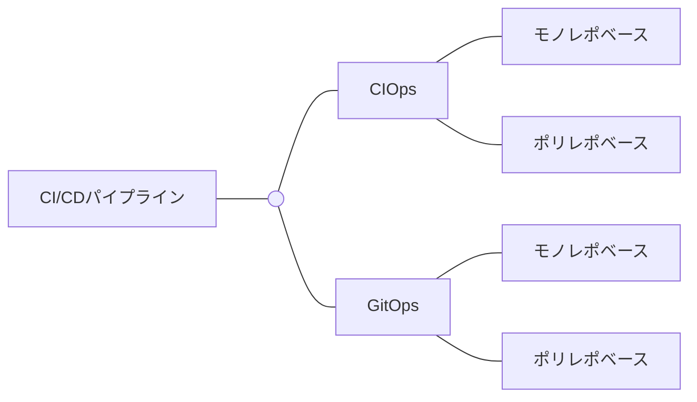
```mermaid
flowchart LR

  CI/CDパイプライン --- CI/CDパイプラインの基点((" "))
  CI/CDパイプラインの基点 --- CIOps
  CIOps --- CIOpsモノレポ[モノレポベース]
  CIOps --- CIOpsポリレポ[ポリレポベース]
  CI/CDパイプラインの基点 --- GitOps
  GitOps --- GitOpsモノレポ[モノレポベース]
  GitOps --- GitOpsポリレポ[ポリレポベース]


```

## CIOps パターン

Kubernetes をマイクロサービスのデプロイプラットフォームとして採用する場合、CIOps パターンの CI/CD パイプラインはアンチパターンです。

なお、ここでは CIOps パターンの説明を概説を省略します。

## GitOps パターン

Kubernetes をマイクロサービスのデプロイプラットフォームとして採用する場合、GitOps パターンの CI/CD パイプラインが適切です。

GitOps では、CI パイプラインと CD パイプラインが独立しています。

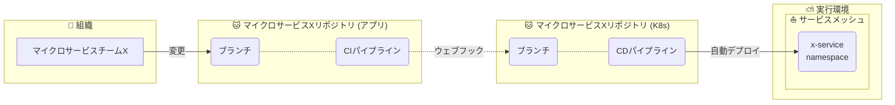
```mermaid
flowchart LR

  subgraph "👥 組織"
        マイクロサービスチームX
  end

  subgraph "🐱 マイクロサービスXリポジトリ (アプリ)"
  direction LR
      ブランチマイクロサービスX1(ブランチ)
      CIパイプラインマイクロサービスX(CIパイプライン)
  end

  subgraph "🐱 マイクロサービスXリポジトリ (K8s)"
  direction LR
      ブランチマイクロサービスX2(ブランチ)
      CDパイプラインX(CDパイプライン)
  end

  マイクロサービスチームX --変更--> ブランチマイクロサービスX1(ブランチ) -...- CIパイプラインマイクロサービスX(CIパイプライン) -.ウェブフック.-> ブランチマイクロサービスX2(ブランチ) -..- CDパイプラインX(CDパイプライン) --自動デプロイ--> マイクロサービスX実行環境(実行環境)

  subgraph "⛅️ 実行環境"
        subgraph "⛵️ サービスメッシュ"
        マイクロサービスX実行環境("x-service<br>namespace")
        end
  end
```

# 23-02. GitOps パターン

GitOps パターンは、以下の独立した CI パイプラインと CD パイプラインからなります。

- アプリリポジトリの CI パイプライン
- Kubernetes リポジトリの CI パイプライン
- CD パイプライン

CI/CD パイプラインのステップは、ここでは以下とします。

ユースケースに合わせて、任意のステップを挿入できます。

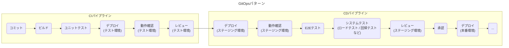
```mermaid
---
title: GitOpsパターン
---
flowchart LR

subgraph CIパイプライン
コミット(コミット)
ビルド(ビルド)
ユニットテスト(ユニットテスト)
テスト環境デプロイ("デプロイ<br>(テスト環境)")
テスト環境動作確認("動作確認<br>(テスト環境)")
テスト環境レビュー("レビュー<br>(テスト環境)")
end

subgraph CDパイプライン
ステージング環境デプロイ("デプロイ<br>(ステージング環境)")
ステージング環境動作確認("動作確認<br>(ステージング環境)")
E2Eテスト(E2Eテスト)
回帰テストロードテスト("システムテスト<br>(ロードテスト / 回帰テストなど)")
ステージング環境レビュー("レビュー<br>(ステージング環境)")
承認(承認)
本番環境デプロイ("デプロイ<br>(本番環境)")
...(...)
end

コミット(コミット) -.-> ビルド(ビルド) -.-> ユニットテスト(ユニットテスト) -.-> テスト環境デプロイ("デプロイ<br>(テスト環境)") -.-> テスト環境動作確認("動作確認<br>(テスト環境)") -.-> テスト環境レビュー("レビュー<br>(テスト環境)") --> ステージング環境デプロイ("デプロイ<br>(ステージング環境)") -.-> ステージング環境動作確認("動作確認<br>(ステージング環境)") -.-> E2Eテスト(E2Eテスト) -.-> 回帰テストロードテスト("システムテスト<br>(ロードテスト / 回帰テストなど)") -.-> ステージング環境レビュー("レビュー<br>(ステージング環境)") -.-> 承認(承認) -.-> 本番環境デプロイ("デプロイ<br>(本番環境)") -.-> ...(...)

```

## リポジトリ種別のパイプライン

### フロントエンドアプリ

フロントエンドアプリケーションの CI/CD パイプラインは、以下の要素からなります。

- アプリリポジトリの CI パイプライン (１行目)
- Kubernetes リポジトリの CI パイプライン (２行目)
- CD パイプライン (３行目)

CDN を採用している場合は、デプロイ前後で必要な静的ファイルが変わっているかもしれません。

そのため、ArgoCD によるフロントエンドアプリケーションのデプロイ後に、静的ファイルのキャッシュを削除すべきです。

また、E2E ツール (例：Playwright) を使用して、実際のユーザーを模した一連の操作を実施し、すべてのコンポーネントを対象としたシステムテストを実施すべきです。

.drawio.png)

### BFF

本記事では、BFF に Nginx を採用しています。

イメージビルド時に、Nginx のベースイメージにモジュール (例：計装モジュール) をインストールする必要があります。

CI/CD パイプラインは、以下の要素からなります。

.drawio.png)

### マイクロサービス

マイクロサービスの CI/CD パイプラインは、以下の要素からなります。

- アプリリポジトリの CI パイプライン (１行目)
- Kubernetes リポジトリの CI パイプライン (２行目)
- CD パイプライン (３行目)

デプロイの前後で、マイクロサービスに新しいカラムへの参照ロジックを追加しているかもしれません。

そのため、ArgoCD によるマイクロサービスのデプロイ前に、DB マイグレーションを実行すべきです。

また、ロードテストツール (例：Gatling) を使用して、マイクロサービスアーキテクチャ全体のロードテスト / 回帰テスト、を実施すべきです。

 .drawio.png)

### SRE ツール

SRE ツールは、OSS としてビルド済みイメージが提供されていることが多いです。

CI/CD パイプラインは、以下の要素からなります。

- Kubernetes リポジトリの CI パイプライン (１行目)
- CD パイプライン (２行目)

 .drawio.png)

## リポジトリ分割パターンに基づく GitOps パターン

### ポリレポベースの GitOps パターン

ポリレポを採用した場合、各リポジトリに GitOps パターンの CI パイプラインと CD パイプラインがあります。

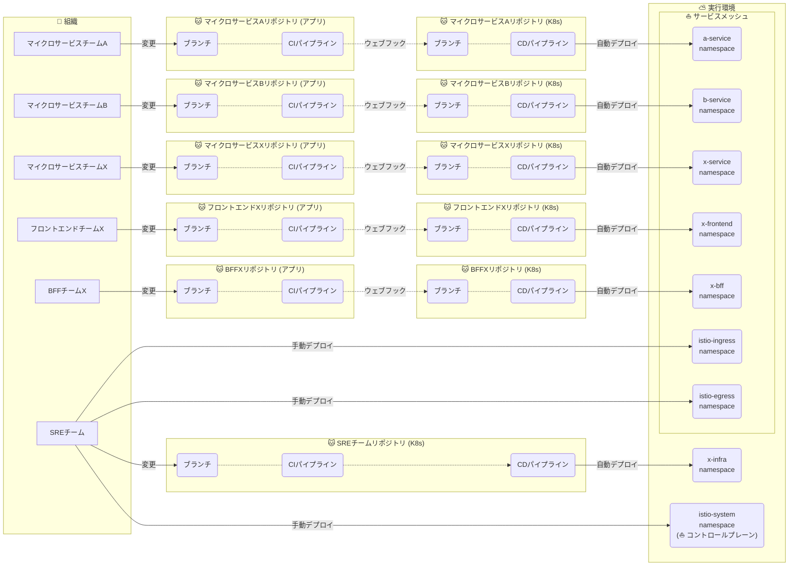
```mermaid
flowchart LR

  subgraph "👥 組織"
        マイクロサービスチームA
        マイクロサービスチームB
        マイクロサービスチームX
        フロントエンドチームX
        BFFチームX
        SREチーム
  end

  subgraph "🐱 マイクロサービスAリポジトリ (アプリ)"
  direction LR
      ブランチマイクロサービスA1(ブランチ)
      CIパイプラインマイクロサービスA(CIパイプライン)
  end

  subgraph "🐱 マイクロサービスAリポジトリ (K8s)"
  direction LR
      ブランチマイクロサービスA2(ブランチ)
      CDパイプラインA(CDパイプライン)
  end

  subgraph "🐱 マイクロサービスBリポジトリ (アプリ)"
  direction LR
      ブランチマイクロサービスB1(ブランチ)
      CIパイプラインマイクロサービスB(CIパイプライン)
  end

  subgraph "🐱 マイクロサービスBリポジトリ (K8s)"
  direction LR
      ブランチマイクロサービスB2(ブランチ)
      CDパイプラインB(CDパイプライン)
  end

  subgraph "🐱 マイクロサービスXリポジトリ (アプリ)"
  direction LR
      ブランチマイクロサービスX1(ブランチ)
      CIパイプラインマイクロサービスX(CIパイプライン)
  end

  subgraph "🐱 マイクロサービスXリポジトリ (K8s)"
  direction LR
      ブランチマイクロサービスX2(ブランチ)
      CDパイプラインX(CDパイプライン)
  end

  subgraph "🐱 フロントエンドXリポジトリ (アプリ)"
  direction LR
      ブランチフロントエンドX1(ブランチ)
      CIパイプラインフロントエンドX(CIパイプライン)
  end

  subgraph "🐱 フロントエンドXリポジトリ (K8s)"
  direction LR
      ブランチフロントエンドX2(ブランチ)
      CDパイプラインフロントエンドX(CDパイプライン)
  end

  subgraph "🐱 BFFXリポジトリ (アプリ)"
  direction LR
      ブランチBFFX1(ブランチ)
      CIパイプラインマイクロサービスBFFX(CIパイプライン)
  end

  subgraph "🐱 BFFXリポジトリ (K8s)"
  direction LR
      ブランチBFFX2(ブランチ)
      CDパイプラインBFFX(CDパイプライン)
  end

  subgraph "🐱 SREチームリポジトリ (K8s)"
  direction LR
      SREブランチ(ブランチ)
      CIパイプラインSRE(CIパイプライン)
      CDパイプラインSRE(CDパイプライン)
  end

  マイクロサービスチームA --変更--> ブランチマイクロサービスA1(ブランチ) -...- CIパイプラインマイクロサービスA(CIパイプライン) -.ウェブフック.-> ブランチマイクロサービスA2(ブランチ) -..- CDパイプラインA(CDパイプライン) --自動デプロイ--> マイクロサービスA実行環境(実行環境)
  マイクロサービスチームB --変更--> ブランチマイクロサービスB1(ブランチ) -...- CIパイプラインマイクロサービスB(CIパイプライン) -.ウェブフック.-> ブランチマイクロサービスB2(ブランチ)  -..- CDパイプラインB(CDパイプライン) --自動デプロイ--> マイクロサービスB実行環境(実行環境)
  マイクロサービスチームX --変更--> ブランチマイクロサービスX1(ブランチ) -...- CIパイプラインマイクロサービスX(CIパイプライン) -.ウェブフック.-> ブランチマイクロサービスX2(ブランチ) -..- CDパイプラインX(CDパイプライン) --自動デプロイ--> マイクロサービスX実行環境(実行環境)
  フロントエンドチームX --変更--> ブランチフロントエンドX1(ブランチ) -...- CIパイプラインフロントエンドX(CIパイプライン) -.ウェブフック.-> ブランチフロントエンドX2(ブランチ) -..- CDパイプラインフロントエンドX(CDパイプライン) --自動デプロイ--> フロントエンドX実行環境(実行環境)
  BFFチームX --変更--> ブランチBFFX1(ブランチ) -...- CIパイプラインマイクロサービスBFFX(CIパイプライン) -.ウェブフック.-> ブランチBFFX2(ブランチ) -..- CDパイプラインBFFX(CDパイプライン) --自動デプロイ--> BFFX実行環境(実行環境)
  SREチーム --変更--> SREブランチ(ブランチ) -...- CIパイプラインSRE(CIパイプライン) -...-> CDパイプラインSRE(CDパイプライン) --自動デプロイ--> サービスメッシュ外SRE実行環境(実行環境)
  SREチーム --手動デプロイ--> istio-systemSRE実行環境
  SREチーム --手動デプロイ--> istio-ingressSRE実行環境
  SREチーム --手動デプロイ--> istio-egressSRE実行環境

  subgraph "⛅️ 実行環境"
        subgraph "⛵️ サービスメッシュ"
        マイクロサービスA実行環境("a-service<br>namespace")
        マイクロサービスB実行環境("b-service<br>namespace")
        マイクロサービスX実行環境("x-service<br>namespace")
        フロントエンドX実行環境("x-frontend<br>namespace")
        BFFX実行環境("x-bff<br>namespace")
        istio-ingressSRE実行環境("istio-ingress<br>namespace")
        istio-egressSRE実行環境("istio-egress<br>namespace")
        end
        istio-systemSRE実行環境("istio-system<br>namespace<br>(⛵️ コントロールプレーン)")
        istio-ingressSRE実行環境("istio-ingress<br>namespace")
        istio-egressSRE実行環境("istio-egress<br>namespace")
        サービスメッシュ外SRE実行環境("x-infra<br>namespace")
  end
```

[Building Microservices, 2nd Edition](https://www.oreilly.com/library/view/building-microservices-2nd/9781492034018/ch07.html)

### 手動デプロイと自動デプロイの使い分け

GitOps パターンの CI/CD パイプラインのうちで、デプロイに着目します。

基本的にすべての Pod を自動でデプロイします (例：ArgoCD) 。

ただし、一部のツール (例：Istio) は運用のしやすさを考慮して、手動でデプロイします (例：Helmfile) 。

| 図中の登場キャラクター | 説明 |
| ---------------------- | ---- |
| 力尽きた…              |      |
|                        |      |

ArgoCD の仕組みは、以下のブログで解説しているため、5000 兆回ブックマークしてくれると嬉しいです！

[【ArgoCD🐙】ArgoCD のマイクロサービスアーキテクチャと自動デプロイの仕組み - 好きな技術を布教したい 😗](https://hiroki-hasegawa.hatenablog.jp/entry/2023/05/02/145115)

# 24. マイクロサービスのデプロイ方法

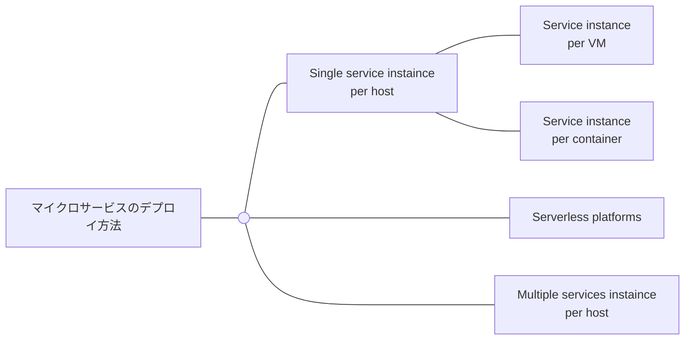
```mermaid
flowchart LR

  マイクロサービスのデプロイ方法 --- マイクロサービスのデプロイ方法の基点((" "))
  マイクロサービスのデプロイ方法の基点 --- Single-service-instaince-per-host["Single service instaince<br>per host"]
  Single-service-instaince-per-host --- Service-instance-per-VM["Service instance<br>per VM"]
  Single-service-instaince-per-host --- Service-instance-per-container["Service instance<br>per container"]
  マイクロサービスのデプロイ方法の基点 ---- Serverless-platforms["Serverless platforms"]
  マイクロサービスのデプロイ方法の基点 ---- Multiple-services-instaince-per-host["Multiple services instaince<br>per host"]


```

## Serverless platforms**パターン**

PaaS や FaaS (例：AWS であれば、AWS Beanstalk や AWS Lambda) を使用して、マイクロサービスをデプロイします。

是非について後述しています。

[Microservices Pattern: Pattern: Serverless deployment](https://microservices.io/patterns/deployment/serverless-deployment.html)

## Multiple services instance per host パターン

物理マシン、仮想マシン、そしてコンテナを使用して、マイクロサービスをデプロイします。

これらのうえで、複数の種類のマイクロサービスを稼働させます。

## Single service instance per host パターン

仮想マシンまたはコンテナを使用して、マイクロサービスをデプロイします。

これらのうえで、単一の種類のマイクロサービスを稼働させます。

各物理マシンで単一の種類のマイクロサービスを稼働させることはコスト的に現実的ではないため、ここでは省略します。

### Service instance per VM**パターン**

仮想マシン (例：AWS であれば Amazon EC2) を使用して、マイクロサービスをデプロイします。

仮想マシン上では、特定のマイクロサービスのみが稼働します。

マイクロサービスを仮想マシンのマシンイメージにあらかじめ組み込みこんでおき、仮想マシンと一緒にデプロイします。

### Service instance per container パターン

コンテナ (例：AWS であれば、Amazon ECS や Amazon EKS) を使用して、マイクロサービスをデプロイします。

コンテナ上では、特定のマイクロサービスのみが稼働します。

本記事では、Single instance per container を採用とします。

[Microservices Pattern: Pattern: Service deployment platform](https://microservices.io/patterns/deployment/service-deployment-platform.html)

# 24-02. Service instance per container パターン

## マイクロサービス

### デプロイ

_%25E3%2581%25AE%25E3%2583%2586%25E3%2582%2599%25E3%2583%2595%25E3%2582%259A%25E3%2583%25AD%25E3%2582%25A4.drawio.png>)

| プラクティス項目      | 説明                                                                                                                                                                                                                                                                                             |
| --------------------- | ------------------------------------------------------------------------------------------------------------------------------------------------------------------------------------------------------------------------------------------------------------------------------------------------ |
| Kubernetes Deployment | Workload (例：Deployment、DaemonSet、StatefulSet、Job など) で Pod を冗長化する。Rolling Update 戦略では、既存の Pod を稼働させながら、新しい Pod をデプロイする。そのため、新旧 Pod が並列的に稼働するため、クライアントからのリクエストを処理しながら、ダウンタイムなく Pod をデプロイできる。 |
| Kubernetes Pod        | Workload 配下の Pod を異なる AZ にデプロイします。                                                                                                                                                                                                                                               |

## フロントエンド

### デプロイ

_%25E3%2581%25AE%25E3%2583%2586%25E3%2582%2599%25E3%2583%2595%25E3%2582%259A%25E3%2583%25AD%25E3%2582%25A4.drawio.png>)

## BFF

### デプロイ

_%25E3%2581%25AE%25E3%2583%2586%25E3%2582%2599%25E3%2583%2595%25E3%2582%259A%25E3%2583%25AD%25E3%2582%25A4.drawio.png>)

## SRE ツール

### デプロイ

_%25E3%2581%25AE%25E3%2583%2586%25E3%2582%2599%25E3%2583%2595%25E3%2582%259A%25E3%2583%25AD%25E3%2582%25A4.drawio.png>)

# 24-03. コンテナの作成から削除まで

## サービスメッシュ内

### kubelet によるコンテナ作成

マイクロサービスは、アプリまたは Envoy の稼働するコンテナ群です。

kubelet が Pod の開始プロセスを始めると、以下の一連のプロセスも同時並行的に始まります。

これらのプロセスはそれぞれ独立しており、ユーザーは制御できません。

1. コンテナを作成する。
2. Workload (例：Deployment、StatefulSet など) が新しい Pod を管理下に追加する。
3. Service と kube-proxy が古い Pod の宛先情報を追加する。

.drawio.png>)

| プラクティス項目                     | 説明                                                                                                                                                                                                                                                                                                                                                                                                                                 |
| ------------------------------------ | ------------------------------------------------------------------------------------------------------------------------------------------------------------------------------------------------------------------------------------------------------------------------------------------------------------------------------------------------------------------------------------------------------------------------------------ |
| Kubernetes Pod Probe オプション      | StartupProbe、LivenessProbe、ReadinessProbe、を使い分け、正常性を素早く検知する。                                                                                                                                                                                                                                                                                                                                                    |
| Kubernetes Pod PullPolicy オプション | コンテナ作成のたびにイメージをプルすると、イメージレジストリに負荷がかかる。そこで、`.spec.containers[*].imagePullPolicy` キーに IfNotPresent を使用し、Node 上にイメージのキャッシュがない場合だけプルできるようにする。Kubernetes では、一度プルしたコンテナイメージを基本的に削除しないため、キャッシュとして再利用できる。デフォルトでは、コンテナイメージのキャッシュがあれば、イメージをプルせずにキャッシュを使用してくれる。 |

kubelet は、コンテナをヘルスチェック (例：StartupProbe、LivenessProbe、ReadinessProbe) し、障害を防ぎます。

| 項目           | StartupProbe                                                                                                                                                                                                           | LivenessProbe                                                                                                                                               | ReadinessProbe                                                                                                                                                                                                                                                                                                                                                                                                     |
| -------------- | ---------------------------------------------------------------------------------------------------------------------------------------------------------------------------------------------------------------------- | ----------------------------------------------------------------------------------------------------------------------------------------------------------- | ------------------------------------------------------------------------------------------------------------------------------------------------------------------------------------------------------------------------------------------------------------------------------------------------------------------------------------------------------------------------------------------------------------------ |
| 説明           | ヘルスチェックを実行することで、アプリケーションの起動が完了したかを確認する。ReadinessProbe よりも前に実行される。ReadinessProbe と違って起動時にしか実行されない。ウォームアップが必要なプロセスのチェックに役立つ。 | ヘルスチェックを実行することで、コンテナが正常に動作しているか確認する。 注意点として、LivenessProbe の間隔が短すぎると、kubelet に必要以上に負荷がかかる。 | ヘルスチェックを実行することで、コンテナがトラフィックを処理可能かを確認する。 コンテナが起動してもトラフィックを処理できるようになるまでに時間がかかる場合 (例: Nginx の最初の設定ファイル読み込み完了まで、MySQL の最初のコネクション受信準備完了まで) や問題の起きたコンテナにトラフィックを流さないようにする場合に役立つ。注意点として、ReadinessProbe の間隔が短すぎると、kubelet に必要以上に負荷がかかる。 |
| エンドポイント | ヘルスチェックエンドポイント LivenessProbe と同じエンドポイント(例：Nginx なら 200 を返却するだけの/healthcheck を定義する)                                                                                            | ヘルスチェックエンドポイント(例：Nginx なら 200 を返却するだけの/healthcheck を定義する)                                                                    | ready エンドポイント(例：Nginx なら用意してくれてる:8081/nginx-ready を使用する)                                                                                                                                                                                                                                                                                                                                   |
| 正常とき       | LivenessProbe または ReadinessProbe を実行する。                                                                                                                                                                       | HTTP リクエストの場合、コンテナのヘルスチェックエンドポイントが 200 から 399 ステータスを返却すれば正常とみなす。                                           | HTTP リクエストの場合、コンテナのヘルスチェックエンドポイントが 200 から 399 ステータスを返却すれば正常とみなす。                                                                                                                                                                                                                                                                                                  |
| 異常とき       | LivenessProbe または ReadinessProbe を実行しない。                                                                                                                                                                     | コンテナで障害 (例：デッドロック) が起こって応答しなくなると、コンテナを強制的に再起動してくれる。                                                          | コンテナのプロセスの準備が完了しない間、そのコンテナが処理できるようになるまで通信を流さないようにしてくれる。                                                                                                                                                                                                                                                                                                     |

[Microservices Pattern: Pattern: Health Check API](https://microservices.io/patterns/observability/health-check-api.html)

### kubelet によるコンテナ削除

コンテナ削除に関するプラクティスです。

kubelet が Pod の終了プロセスを始めると、以下の一連のプロセスも同時並行的に始まります。

これらのプロセスはそれぞれ独立しており、ユーザーは制御できません。

Service と kube-proxy が Pod の宛先情報を削除する前に Pod が終了してしまうと、Service から Pod へのコネクションを途中で切断することになってしまいます。

1. Workload (例：Deployment、StatefulSet など) が古い Pod を管理下から削除する。
2. Service と kube-proxy が古い Pod の宛先情報を削除する。
3. コンテナを削除する。

.drawio.png>)

| プラクティス項目                                           | 説明                                                                                                                                                                                                                                                                                                                                                                                                   |
| ---------------------------------------------------------- | ------------------------------------------------------------------------------------------------------------------------------------------------------------------------------------------------------------------------------------------------------------------------------------------------------------------------------------------------------------------------------------------------------ |
| Kubernetes Pod PreStop オプション                          | コンテナの削除後に Pod を終了できるように、ユーザーが Pod の `.spec.containers[*].lifecycle.preStop` キーに任意の秒数を設定する。コンテナが待機処理 (例：`sleep` コマンド) を実行できるようになる。                                                                                                                                                                                                    |
| Kubernetes Pod TerminationGracefulPeriodSeconds オプション | Service とkube-proxy の処理後に Pod を終了できるように、ユーザーが Pod の `.spec.terminationGracePeriodSeconds` キーに任意の秒数を設定する。Pod の削除に伴う Service とkube-proxy の処理の完了を待機できるようになる。なお、`.spec.terminationGracePeriodSeconds` の秒数が長すぎると、Pod の終了に時間がかかりすぎるようになり、Pod の更新や Amazon EKS クラスターのアップグレードに時間に影響が出る。 |

## サービスメッシュ外

> 💡
>
> 余裕があったら書くぜ！

# 24-04. その他のデプロイ選択肢

Service instance per container パターンで Amazon EKS を採用しました。

ここでは、その他の選択肢を考えます。

## Amazon ECS

Service instance per container パターンで、Amazon ECS を使用して、マイクロサービスアーキテクチャを動かします。

この場合、マイクロサービスを Amazon ECS サービスに対応させ、Amazon ECS タスクでマイクロサービスを水平スケーリングすることになります。

[d1.awsstatic.com](https://d1.awsstatic.com/events/Summits/reinvent2022/CON311-R_Best-practices-for-deploying-microservices-on-Amazon-ECS.pdf#page=12)

### マイクロサービスアーキテクチャとの相性

Amazon ECS は、Amazon EKS よりもアプリ領域とインフラ領域の責務がより曖昧になります。

アプリ領域とインフラ領域で分業が進んでいない組織では、責務の境界が曖昧でも問題は起こりにくい。

その一方で、組織が大きくなるほど Amazon ECS の管理者がボトルネックになります。

例えば、Amazon ECS を管理しているのがインフラチームである一方で、アプリチームも Amazon ECS にコンテナを設定しないといけないです。

このとき、管理者のインフラチームに依頼する。しかし、インフラチームが手一杯であれば、スピード感が落ちる。

マイクロサービスアーキテクチャは組織が大きくなるほど価値を発揮するはずなのに、これでは逆に辛くなっています。

ただ、Amazon EKS に至るまでの過渡的なシステムとして、Amazon ECS を採用することはアリと考えています。

## AWS Lambda

Serverless platforms パターンで、AWS Lambda を使用して、マイクロサービスアーキテクチャを動かします。

この場合、マイクロサービスは AWS Lambda へ対応することになる。

[Using AWS Lambda as a Microservice](https://medium.com/aws-serverless-microservices-with-patterns-best/using-aws-lambda-as-a-microservice-dd7d7296c74a)

### マイクロサービスアーキテクチャとの相性

AWS Lambda は、Amazon EKS や Amazon ECS よりもさらにアプリ領域とインフラ領域の責務がより曖昧になります。

組織が大きくなるほど AWS Lambda の管理者がボトルネックになり、Amazon ECS よりも拡張性の問題は顕著です。

前述の通り、マイクロサービスアーキテクチャは組織が大きくなるほど価値を発揮するはずですが、AWS Lambda がこれを相殺します。

これらのことから、AWS Lambda でマイクロサービスアーキテクチャを採用するべきではないと考えています。

# 25. スケーリングと回復性管理

スケーリングと回復性管理には、主に 3 つの対象があります。

- Node
- Pod
- コンテナ

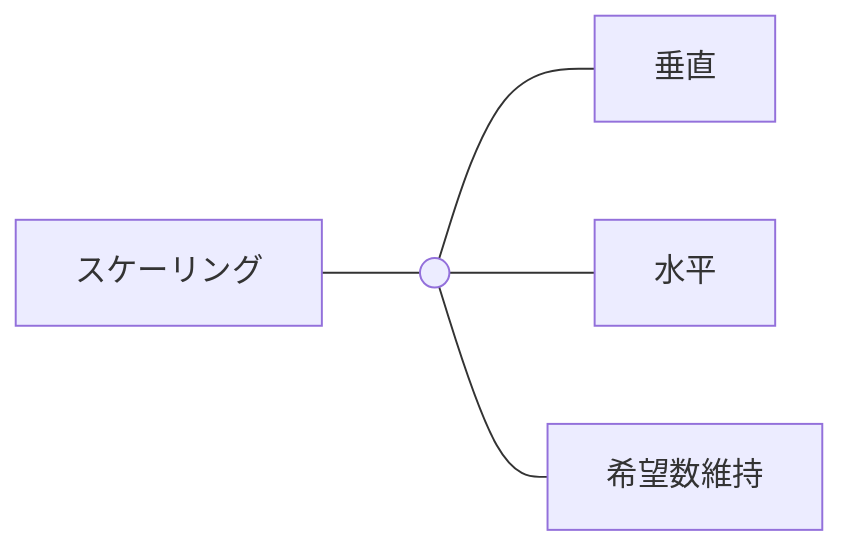
```mermaid
flowchart LR

  スケーリング --- スケーリングの基点((" "))
  スケーリングの基点 --- 垂直
  スケーリングの基点 --- 水平
  スケーリングの基点 --- 希望数維持
```

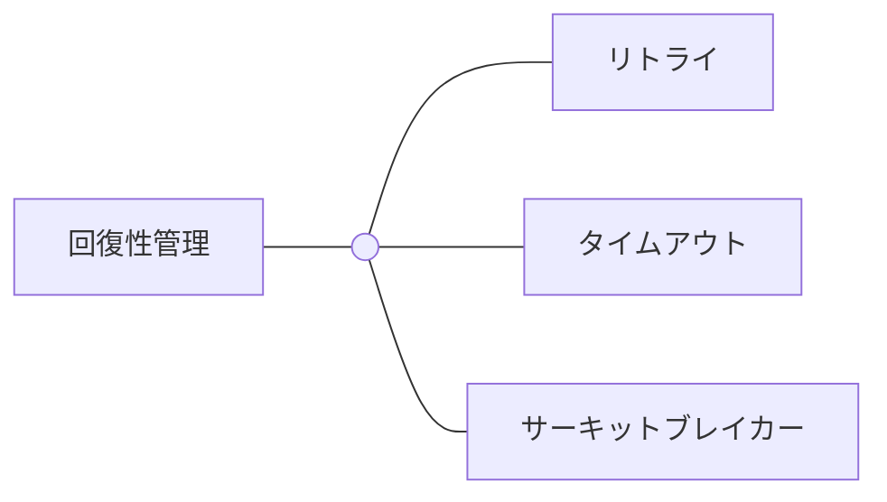
```mermaid
flowchart LR

  回復性管理 --- 回復性管理の基点((" "))
  回復性管理の基点 --- リトライ
  回復性管理の基点 --- タイムアウト
  回復性管理の基点 --- サーキットブレイカー
```

# 25-02. Node の垂直水平スケーリングと回復性管理

ビジネス影響の大きいマイクロサービスにのみ、専用の Node を用意します。

それ以外のマイクロサービスは、Node に混合させます。

専用の Node を実現するには、Node に種類を表すラベルをつける必要があります。

執筆時点では、以下のツールでラベル付きの Node を作成できます。

- Karpenter
- AWS マネージド Node グループ Node グループ
- セルフ AWS マネージド Node グループ Node グループ

Node の作成には、マシンイメージとして AMI を採用します。

必要なソフトウェア (OS、ミドルウェア) と EBS ボリュームの両方を内蔵できます。

## Karpenter による垂直水平スケーリングと回復性管理

ここでは、Karpenter の仕組みについて解説します。

| 図中の登場キャラクター   | 説明                                                                                                                                                                                                                                                                                                                                                                                                                                                                                                                                                     |
| ------------------------ | -------------------------------------------------------------------------------------------------------------------------------------------------------------------------------------------------------------------------------------------------------------------------------------------------------------------------------------------------------------------------------------------------------------------------------------------------------------------------------------------------------------------------------------------------------- |
| AWS AMI                  | Node のマシンイメージである。                                                                                                                                                                                                                                                                                                                                                                                                                                                                                                                            |
| Kubernetes ConfigMap     | Karpenter Controller の各種設定を管理する。                                                                                                                                                                                                                                                                                                                                                                                                                                                                                                              |
| Karpenter EC2 Node Class | Node の仕様を設定する。NodePool とは異なり、AWS 固有の仕様 (例：セキュリティグループ、サブネット、AMI など) を設定できる。マシンイメージとして AMI をプルし、Node を作成する。                                                                                                                                                                                                                                                                                                                                                                           |
| Karpenter Controller     | Pod のフェーズを監視し、Pending フェーズのままの Pod が現れると、起動テンプレートと Node を作成する。起動テンプレートは、Node の作成後に削除する。作成した Node にPod をバインドし、kube-scheduler によるスケジューリングを待つ。料金最適化やハードウェア消費量最適化のために、様々なパラメーターから作成 / 削除 / 置換の対象とする Node を計算し、Node の統合と垂直水平スケーリングを実行する。統合には、鳥の群れの動きをモデリングした Boids と似たアルゴリズムを使用している。EC2 Node のヘルスステータスで異常を検知すると、その Node を終了します。 |
| Karpenter NodePool       | Node の仕様を設定する。Node Class とは異なり、AWS に依らない仕様 (例：Node ラベルなど) を設定できる。                                                                                                                                                                                                                                                                                                                                                                                                                                                    |

[Karpenter vs Cluster Autoscaler ☸️](https://kubesandclouds.com/2022-01-04-karpenter/)

[https://github.com/aws/karpenter-provider-aws/blob/main/designs/consolidation.md](https://github.com/aws/karpenter-provider-aws/blob/main/designs/consolidation.md)

## AWS マネージド Node グループ Node グループによる垂直水平スケーリングと回復性管理

> 💡
>
> 余裕があれば書くぜ！

## Karpenter とAWS マネージド Node グループ Node グループの組み合わせ

Karpenter と AWS マネージド Node グループ Node グループを採用し、Node を管理します。

複数の方法を採用する理由は、Node を管理する Karpenter を、自身以外の方法で管理している Node 上で稼働させる必要があるためだ。

ここでは、Karpenter の Pod を AWS マネージド Node グループ Node グループによる Node 上に、アプリ領域の Pod を Karpenter による Node 上に稼働させます。

Karpenter と AWS マネージド Node グループ Node グループの間では、機能が異なります。

.png>)

| 機能例                   | Karpenter                                                             | AWS マネージド Node グループ Node グループ                                                                                                                                              |
| ------------------------ | --------------------------------------------------------------------- | --------------------------------------------------------------------------------------------------------------------------------------------------------------------------------------- |
| Node 作成                | ラベル付きの Node を作成する。                                        | ラベル付きの Node を作成する。                                                                                                                                                          |
| Graceful Shutdown        | 自身の作成した Node を削除するときに、GracefulShutdown を実行する。   | デフォルトでは Graceful Shutdown を実行できない。EC2 UserData で、`kubelet-config.json` に ShutdownGracePeriod とShutdownGracePeriodCriticalPods の設定が必要である。                   |
| 料金最適化               | Node の統合と垂直水平スケーリングを実行し、料金を最適化する。         | Cluster Autoscaler を併用してもしなくても、料金を最適化できない。                                                                                                                       |
| ハードウェア消費量最適化 | Node の垂直水平スケーリングを実行し、ハードウェア消費量を最適化する。 | Cluster Autoscaler を併用しなければスケーリングを実行できず、ハードウェア消費量を最適化できない。AWS マネージド Node グループ Node グループは、設定された Node 数を維持するだけである。 |

# 25-03. Pod の垂直水平スケーリングと回復性管理

_%25E3%2581%25AE%25E9%2581%258B%25E7%2594%25A8.drawio.png>)

| プラクティス項目        | 説明                                                                                                                                                                                                                                                                                                                                                                                                                           |
| ----------------------- | ------------------------------------------------------------------------------------------------------------------------------------------------------------------------------------------------------------------------------------------------------------------------------------------------------------------------------------------------------------------------------------------------------------------------------ |
| Descheduler             | Descheduler は、ポリシーに応じて不適切な Node から Pod を退避させる。Node のハードウェアリソースの消費量が動的に高まった場合に、kube-scheduler は不適切な Node から Pod を退避し、別の Node にこれを再スケジューリングさせられない。他に Node が障害が起こり、他の Node にPod が退避した場合に、その後 Node が復旧したとしても、Pod が元の Node に戻ることはない。Descheduler を使用すれば、再スケジューリングを自動化できる。 |
| Deployment              | Pod 希望数を維持する。                                                                                                                                                                                                                                                                                                                                                                                                         |
| HorizontalPodAutoscaler | HorizontalPodAutoscaler でPod を水平スケーリングする。水平スケーリングは、Pod の負荷が高くなると Pod 数を増やし、システム全体が高負荷で機能しなくなる状況を避けられる。ただし、突発的な高負荷には弱く、Pod 数の増減が間に合わないことがある。突発的な負荷のタイミングが事前にわかっているなら、事前に最小数を高めに設定しておく。                                                                                              |
| metrics-server          | HorizontalPodAutoscaler は、metrics-server の提供するメトリクス (例：CPU 使用率、メモリ使用率など) 、カスタムメトリクス、Kubernetes 外のメトリクス (ロードバランサーの rps/qps 値、メッセージキューの待機リクエスト数など) 、に基づいて Pod 数を決める。metrics-server はデフォルトで Amazon EKS クラスターに存在していないため、別途インストールしておかなければならない。                                                    |
| Pod                     | Pod は、Node からハードウェアリソースを要求する。Pod の性質に応じて、適切な QoS を設定する。上限 (`limits`) と下限 (`requests`) の設定の両方または一方を省略すると、自動的に Guaranteed になる。コンテナが一定量のハードウェアリソースを要求し続けたとしても、無制限 (Node の空きリソース分) にハードウェアリソースを提供し、要求に耐えられるようにする。基本的には、ほとんどのコンテナを Guaranteed QoS にすればよい。        |
| PodDisruptionBudget     | Node のスケールインやアップグレード時に、Node はドレイン処理を実行し、Pod を退避させる。このときに PodDisruptionBudge を作成しないと、Deployment やStatefulSet 配下の Pod が一斉に退避し、1 個でも Pod を動かすことで、ダウンタイムを避けるべきである。そこで、PodDisruptionBudge を使用すると、ドレイン中に Node 上で動かしておく最小最大の Pod 数を設定できる。                                                              |

# 25-04. コンテナの回復性管理

## サービスメッシュ内

### Istio によるリトライ

> 💡 余裕があったら書くぜ！

### Istio によるサーキットブレイカー

> 💡
>
> 余裕があったら書くぜ！

[Microservices Pattern: Pattern: Circuit Breaker](https://microservices.io/patterns/reliability/circuit-breaker.html)

## サービスメッシュ外

### Service のリトライ

> 💡 余裕があったら書くぜ！

# 26. テスト方法

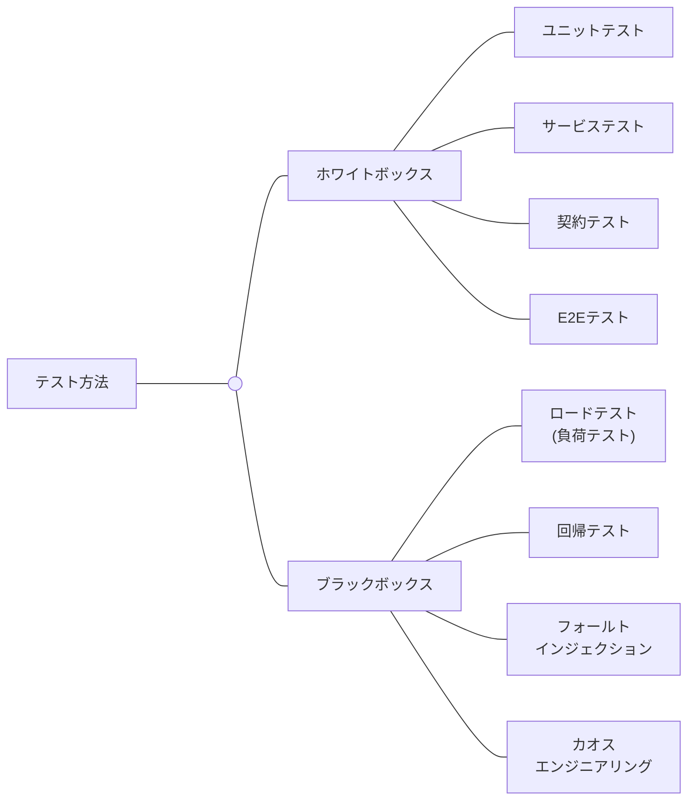
```mermaid
flowchart LR

  テスト方法 ---- テスト方法の基点((" "))
  テスト方法の基点 --- ホワイトボックス
  テスト方法の基点 --- ブラックボックス
  ホワイトボックス --- ユニットテスト
  ホワイトボックス --- サービステスト
  ホワイトボックス --- 契約テスト
  ホワイトボックス --- E2Eテスト
  ブラックボックス --- ロードテスト-負荷テスト["ロードテスト<br>(負荷テスト)"]
  ブラックボックス --- 回帰テスト
  ブラックボックス --- フォールトインジェクション[フォールト<br>インジェクション]
  ブラックボックス --- カオスエンジニアリング[カオス<br>エンジニアリング]

```

## ホワイトボックス

### ユニットテスト

ユニットテストは、マイクロサービスアーキテクチャの文脈でも、同じである。

> 💡 余裕があったら書くぜ！

### サービステスト

> 💡 余裕があったら書くぜ！

### 契約テスト

送信元マイクロサービス (コンシューマー) と宛先マイクロサービス (プロデューサー) の連携のテストを実施します。

このとき、一方のマイクロサービスに他方のマイクロサービスのモックの定義するのではなく、モックの定義を『契約 (Contract) サービス』として切り分けます。

これを双方のマイクロサービス間で共有します。

契約サービス上で、双方のリクエスト / レスポンスの内容が期待値に合致するかを検証します。

Pact では、Pact Broker を契約サービスとして使用できます。

### E2E テスト

> 💡 余裕があったら書くぜ！

## ブラックボックス

### ロードテスト (負荷テスト)

> 💡 余裕があったら書くぜ！

### 回帰テスト

> 💡 余裕があったら書くぜ！

### フォールトインジェクション

> 💡
>
> 余裕があったら書くぜ！
