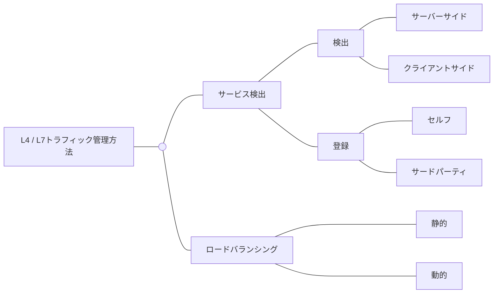
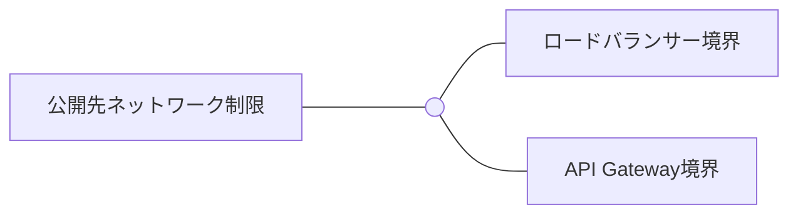
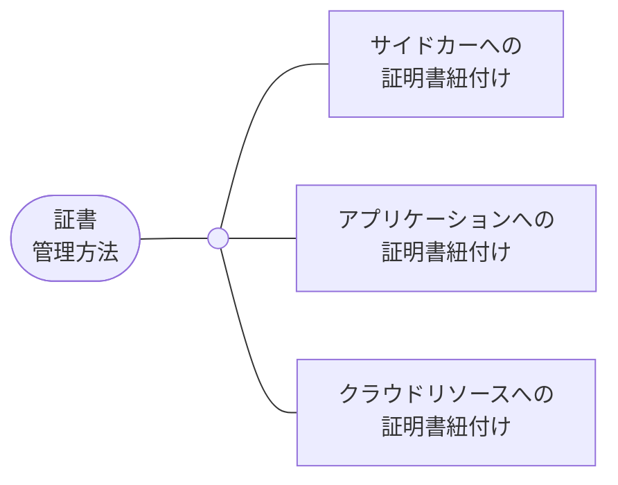
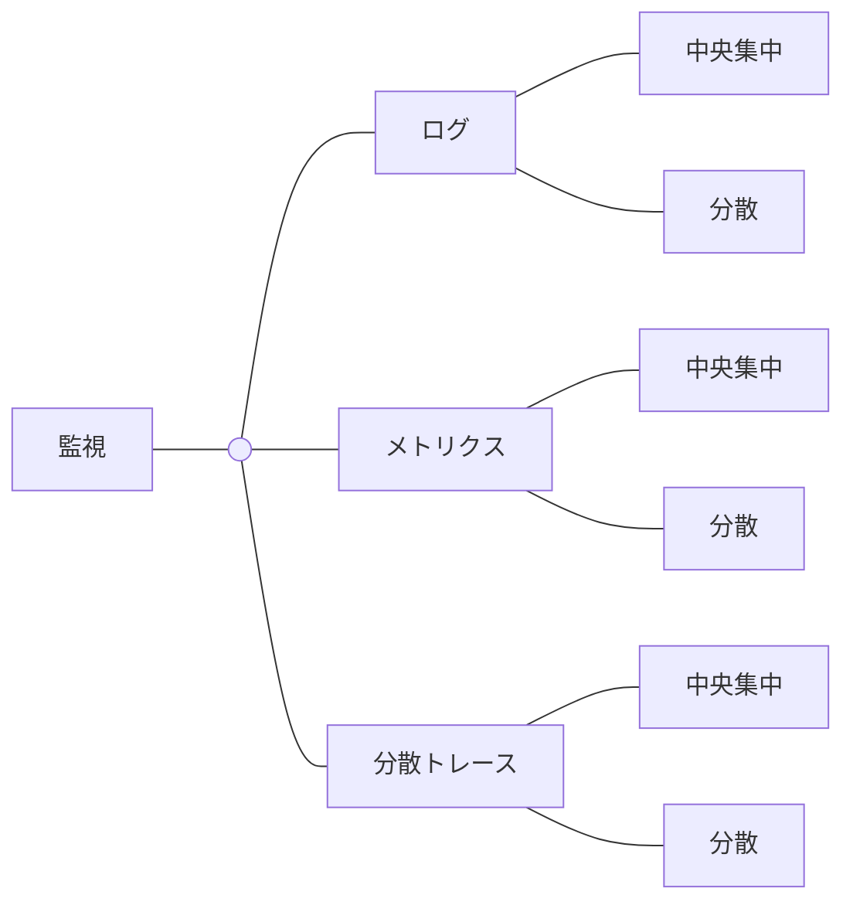
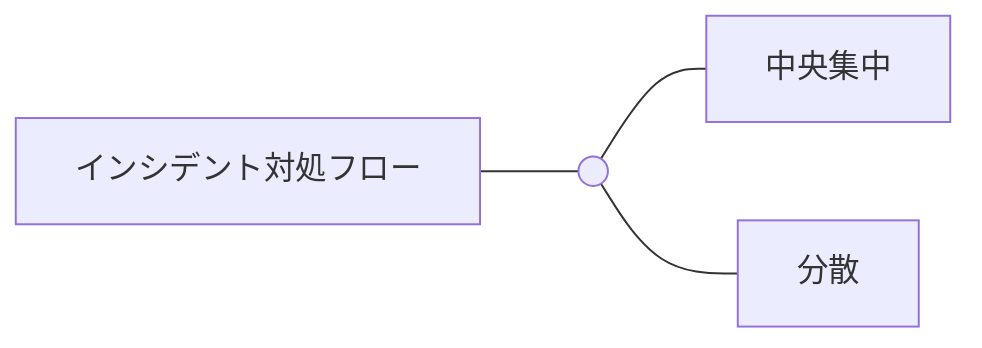

# 【インフラ領域】DDDとクラウドネイティブによるマイクロサービスアーキテクチャ設計の概説

# 本記事について

[【導入】DDDとクラウドネイティブによるマイクロサービスアーキテクチャ設計の概説](https://example.com) の記事のインフラ領域です。

インフラ領域のデザインパターンです。

# 01-04. 導入を参照

[【導入】DDDとクラウドネイティブによるマイクロサービスアーキテクチャ設計の概説](https://example.com)

# 05-14. アプリ領域を参照

[【アプリ領域】DDDとクラウドネイティブによるマイクロサービスアーキテクチャ設計の概説](https://example.com)

# 15. トラフィック管理方法

L4 / L7トラフィック管理のために、宛先情報を動的に検出しなければなりません。

この時、サービス検出という機能を使用しています。

サービス検出の実装方法にはいくつか種類があります。

[【Istio⛵️】Istioのサービス間通信を実現するサービス検出の仕組み - 好きな技術を布教したい 😗](https://hiroki-hasegawa.hatenablog.jp/entry/2022/12/25/060000)

## 宛先検出

### サーバーサイドサービス検出パターン

送信元マイクロサービスから、問い合わせとロードバランシングの責務が切り離されています。

送信元マイクロサービスは、ロードバランサーにリクエストを送信します。

ロードバランサーは、宛先マイクロサービスの場所をサービスレジストリに問い合わせ、またリクエストをロードバランシングする責務を担っています。

なお、本記事では、サーバーサイドパターンを採用します。

(例) Istio、CoreDNS、AWS ALBなど

[Microservices Pattern: Pattern: Server-side service discovery](https://microservices.io/patterns/server-side-discovery.html)

### クライアントサイドサービス検出パターン

通信の送信元マイクロサービスは、宛先マイクロサービスの場所をサービスレジストリに問い合わせ、さらにロードバランシングする責務を担います。

(例) NetflixのEureka、kube-proxyなど

[Microservices Pattern: Pattern: Client-side service discovery](https://microservices.io/patterns/client-side-discovery.html)

## 宛先登録

### セルフパターン

サービス検出時に、起動した送信元マイクロサービスはサービスレジストリに自身の宛先情報を送信し、登録します。

[Microservices Pattern: Pattern: Self Registration](https://microservices.io/patterns/self-registration.html)

### サードパーティパターン

サービス検出時に、サービスレジストラは起動した送信元マイクロサービスを収集し、サービスレジストリに宛先情報を登録します。

多くのツールで、サードパーティパターンが採用されています。

[Microservices Pattern: Pattern: 3rd Party Registration](https://microservices.io/patterns/3rd-party-registration.html)

## ロードバランシング

### 静的方式

宛先の負荷を考慮せずに、ロードバランシングします。

- ラウンドロビン
- 重み付きラウンドロビン
- IPハッシュ

### 動的方式

宛先の負荷をリアルタイムに考慮して、ロードバランシングします。

- 最小コネクション数 (最小未処理コネクション数、Least Connection)
- 重み付きコネクション数
- 最小レスポンス時間

# 15-02. トラフィック管理方法

## L3

### VPC CNIアドオンやkube-proxyによるIPアドレス管理方法

VPC CNIアドオンは、kubeletやAWS ENIと連携し、マイクロサービスPodをAWS EKSクラスター内のネットワークに参加させます。

kube-proxyはNode内のiptablesを更新し、AWS EKSクラスター内で各ツールがトラフィック管理を実行できるようにします。

| 図中の登場キャラクター  | 説明                                                                                                                                                                                                                                                                 |
| ----------------------- | -------------------------------------------------------------------------------------------------------------------------------------------------------------------------------------------------------------------------------------------------------------------- |
| AWS ENI                 | ENIには、サブネットからIPアドレスが割り当てられている。ENIをAWSリソースに紐づけると、ENIはそのAWSリソースにIPアドレスを割り当てる。                                                                                                                                  |
| AWS kube-proxy アドオン | kube-proxyはNode内のiptablesを更新し、AWS EKSクラスター内で L4トラフィックを管理できるようにする。Node内のiptableに対して、PodのIPアドレスを追加 / 削除リクエストを送信する。AWSマネージドPodとして稼働する。                                                        |
| AWS VPC CNIアドオン     | NodeにアタッチされたENIに対して、IPアドレスの取得 / 解放リクエストを送信する。また、新しいPodに対して、IPアドレスの割当 / 解放リクエストを送信する。必要に応じて、新しいENIのアタッチをAWS EKSコントロールプレーンにリクエストする。AWSマネージドPodとして稼働する。 |

## サービスメッシュ内

### IstioによるL4/L7トラフィック管理

Istioは、指定したNamespaceに属するPodにサービスメッシュの機能を提供します。

管理下のPodにistio-proxyを挿入します。

istio-proxyは、Podのアウトバウンド通信をL4 / L7ロードバランシングします。

.drawio.png>)

| 図中の登場キャラクター            | 説明                                                                                                                                                                                                                                                |
| --------------------------------- | --------------------------------------------------------------------------------------------------------------------------------------------------------------------------------------------------------------------------------------------------- |
| AWS ALB                           | AWS EKSクラスター外の通信をCluster内のNodePort ServiceにL7ロードバランシングする。                                                                                                                                                                  |
| Istioコントロールプレーン         | KubernetesリソースやIstioリソースの宛先情報に基づいて、istio-proxy内のEnvoyプロセスを設定する。宛先情報はインメモリで保管する。                                                                                                                     |
| Istioデータプレーン (istio-proxy) | ダウンストリームのistio-proxyからのリクエストをアップストリームにL7ロードバランシングする。また、　アップストリームがAWS EKSクラスター外の場合は、プロトコルに応じたロードバランシングになる。プロトコルがMySQLの場合はL4ロードバランシングになる。 |
| NodePort Service                  | kube-proxyの更新したiptableを使用して、AWS ALBからのリクエストをIstio Ingress GatewayにL4ロードバランシングする。                                                                                                                                   |

### Istioによるクライアントの判定

Istio IngressGatewayがサービスメッシュ外からの通信をサービスメッシュ内にロードバランシングします。

クライアント (ブラウザ、外部API) に応じて、適切なフロントエンドアプリやAPI Gatewayにルーティングできます。

| 図中の登場キャラクター      | 説明                                                                                                                                                                                          |
| --------------------------- | --------------------------------------------------------------------------------------------------------------------------------------------------------------------------------------------- |
| Istio Gateway               | NodePort Serviceからのリクエストを受信する。                                                                                                                                                  |
| Istio VirtualService (1)    | 宛先とするフロントエンドアプリケーションのServiceを決定する。PCブラウザやスマホブラウザからのリクエストは、User-Agentヘッダーにブラウザを判定できる値を持つ。VirtualServiceでこれを判定する。 |
| Istio VirtualService (2)    | 宛先とするフロントエンドアプリケーションのServiceを決定する。外部APIからのリクエストは、HostヘッダーにAPIのドメインを持つ。VirtualServiceでこれを判定する。                                   |
| Kubernetes NodePort Service | kube-proxyの更新したiptableを使用して、ALBからのリクエストを受信し、Istio IngressGateway PodにL4ロードバランシングする。                                                                      |

.drawio.png>)

Istio IngressGatewayについては、以下のブログで解説しているため、5000兆回ブックマークしてくれると嬉しいです！

[【Istio⛵️】Istioによって抽象化されるEnvoyのHTTPSリクエスト処理の仕組み - 好きな技術を布教したい 😗](https://hiroki-hasegawa.hatenablog.jp/entry/2024/01/16/013404)

## サービスメッシュ外

Istioは、指定したNamespace以外に属するPodにはサービスメッシュの機能を提供しません。

サービスメッシュ外のNamespaceでは、CoreDNSを使用して、トラフィックを管理します。

.drawio.png>)

| 図中の登場キャラクター       |                                                                                                                                                                                                                                                                                                                                                                                                      |
| ---------------------------- | ---------------------------------------------------------------------------------------------------------------------------------------------------------------------------------------------------------------------------------------------------------------------------------------------------------------------------------------------------------------------------------------------------- |
| AWS ALB                      | AWS EKSクラスター外の通信をCluster内のNodePort ServiceにL7ロードバランシングする。                                                                                                                                                                                                                                                                                                                   |
| AWS CoreDNSアドオン          | Podの名前解決を実施する。                                                                                                                                                                                                                                                                                                                                                                            |
| Kubernetes ClusterIP Service | kube-proxyの更新したiptableを使用して、PodからのリクエストをPodにL4ロードバランシングする。                                                                                                                                                                                                                                                                                                          |
| Kubernetes ConfigMap         | AWS CoreDNSアドオンの各種設定を管理する。Terraformで `json` ファイルとして作成する。                                                                                                                                                                                                                                                                                                                 |
| Kubernetes NodePort Service  | kube-proxyの更新したiptableを使用して、AWS ALBからのリクエストをIstio Ingress GatewayにL4ロードバランシングする。                                                                                                                                                                                                                                                                                    |
| Pod (送信元)                 | サービスメッシュ外にある任意の送信元Podである。kubeletは、Pod内のコンテナの `/etc/resolv.conf` ファイルに権威DNSサーバー (ここではCoreDNS) のIPアドレスを設定する。リクエスト時に、コンテナは自身の `/etc/resolv.conf` ファイルで権威DNSサーバーのIPアドレスを確認し、DNSサーバーに宛先PodのIPアドレスの正引きを実施する。送信元Podは、取得したIPアドレスを使用して、宛先Podにリクエストを送信する。 |
| Pod (宛先)                   | サービスメッシュ外にある任意の宛先Podである。                                                                                                                                                                                                                                                                                                                                                        |
| iptables (Node内)            | PodのIPアドレスを管理する。                                                                                                                                                                                                                                                                                                                                                                          |
| kubelet                      | Node内でデーモンプロセスとして稼働し、AWS EKSコントロールプレーンからPod作成 / 削除リクエストを受信する。新しいPodをCluster Networkに参加させるために、AWS VPC CNIにリクエストを送信する。                                                                                                                                                                                                           |

# 16. 公開先ネットワーク制限

フロントエンドは、AWS EKSクラスターの外に公開します。

ただし、社内ユーザーに公開すべきフロントエンドと、社内のSWEやSREerにだけ公開するものがあります。

AWS EKSクラスターの入り口で、リクエストを検査し、これらを制御しなければなりません。

[Microservices Security in Action](https://www.oreilly.com/library/view/microservices-security-in/9781617295959/OEBPS/Text/p2.xhtml)

## サービスメッシュ内

### ロードバランサー境界

ロードバランサーを境界として、公開先のネットワークを制限します。

Istioは、指定したNamespaceに属するPodにサービスメッシュの機能を提供します。

サービスメッシュ内には、ユーザーに公開するコンテナと、SWEやSREerにだけ公開するコンテナがあります。

ユーザーに公開するコンテナでは、有害なIPアドレス以外にIPアドレスの制限は不要です。

しかし、ダッシュボードでは、送信元が社内IPアドレスのリクエストだけを許可するような制限が必要になります。

そこで、社外公開用と社内公開用のAWS ALBを配置し、AWS WAFを紐づけるとよいです。

.drawio.png>)

| 図中の登場キャラクター               | 説明                                                                                                                                        |
| ------------------------------------ | ------------------------------------------------------------------------------------------------------------------------------------------- |
| AWS ALB (社外公開用)                 | SQLインジェクションやXSSを検査するAWS WAFを紐付ける。アプリケーションをL7の攻撃から防御できるようにする。                                   |
| AWS ALB (社内公開用)                 | IPアドレスを検査するAWS WAFを紐付ける。SWEやSREerだけがリクエストを送信できるようにする。                                                   |
| AWS Route53                          | ドメインに合わせて、社外公開用または社内公開用のAWS ALBのいずれかに振り分ける。                                                             |
| IDプロバイダー                       | ダッシュボードにログインできるSWEやSREerの認証情報を管理する。                                                                              |
| Istio IngressGateway                 | 宛先とするServiceを決定する。外部APIからのリクエストは、Hostヘッダーにドメインを持つ。VirtualServiceでこれを判定する。                      |
| Keycloak、Temporalなど               | SWEやSREerにだけ公開するコンテナである。ツールのダッシュボードで、ビルトインのSSOがある場合、IDプロバイダーに認証フェーズを直接委譲できる。 |
| フロントエンド (PC / スマホブラウザ) | ユーザーに公開するコンテナである。                                                                                                          |

### API Gateway境界

API Gatewayを境界として、公開先のネットワークを制限します。

これは認証認可と内容が重複するため、ここでは省略します。

## サービスメッシュ外

### ロードバランサー境界

ロードバランサーを境界として、公開先のネットワークを制限します。

Istioは、指定したNamespace以外に属するPodにはサービスメッシュの機能を提供しません。

サービスメッシュ外には、SWEやSREerにだけ公開するコンテナがあります。

送信元が社内IPアドレスのリクエストだけを許可するような制限が必要になります。

そこで、社内公開用のAWS ALBを配置し、AWS WAFを紐づけるとよいです。

.drawio.png>)

| 図中の登場キャラクター                       | 説明                                                                                                                                                                                                                                                                                                                |
| -------------------------------------------- | ------------------------------------------------------------------------------------------------------------------------------------------------------------------------------------------------------------------------------------------------------------------------------------------------------------------- |
| Alertmanager、Grafana、Kiali、Prometheusなど | SWEやSREerにだけ公開するコンテナである。                                                                                                                                                                                                                                                                            |
| AWS ALB (社内公開用)                         | IPアドレスを検査するAWS WAFを紐付ける。SWEやSREerだけがリクエストを送信できるようにする。                                                                                                                                                                                                                           |
| AWS CoreDNSアドオン                          | ツールによっては、連携のために、他のツールのAWS EKSクラスター内ドメインを設定しなければならない。                                                                                                                                                                                                                   |
| AWS Route53                                  | 社内公開用のAWS ALBに振り分ける。                                                                                                                                                                                                                                                                                   |
| IDプロバイダー                               | ダッシュボードにログインできるSWEやSREerの認証情報を管理する。                                                                                                                                                                                                                                                      |
| NAT Gateway                                  | ツールによっては、ダッシュボード間の連携のために、他のツールのAWS EKSクラスター外公開ドメインを設定しなければならない。送信元IPアドレスを固定するために、NAT Gatewayを経由させる。                                                                                                                                  |
| Nginx Ingress Controller                     | 宛先とするServiceを決定する。AWS EKSクラスター外のからのリクエストは、Hostヘッダーにドメインを持つ。Nginx Ingress Controllerでこれを判定する。                                                                                                                                                                      |
| OAuth2 Proxy2                                | ビルトインのSSOがないツール (例：Alertmanager、Kiali、Prometheusなど) のダッシュボードにSSOでログインしたい場合、OAuth2 Proxyを使用する。Nginx Ingress Controllerは、OAuth2 Proxyを介して、認証フェーズをIDプロバイダーに委譲する。SSOがあるツール (例：Grafanaなど) では、OAuth2 Proxyは使用せずに、直接委譲する。 |

# 17. 証明書管理方法

マイクロサービスアーキテクチャでは、システム内で非常に多くのパケット通信が起こります。

パケットのアプリケーションデータを暗号化しなければ、これを第三者に攻撃されかねません。

TLSプロトコルを使用してアプリケーションデータを暗号化することにより、攻撃から防御できます。

> 💡 TLSプロトコルで暗号化できるのは、パケットの構成要素の中で、アプリケーションデータのみです。

[Microservices Security in Action video edition](https://www.oreilly.com/library/view/microservices-security-in/9781617295959VE/MSiA_part3.html)

## TLS認証の種類

- 通常TLS認証
- 相互TLS認証

> 💡 余裕があったらしっかり書くぜ！

## サービスメッシュ内

### AWSとIstioによる証明書管理

Istioは、指定したNamespaceに属するPodにサービスメッシュの機能を提供します。

管理下のPodにistio-proxyを挿入します。

istio-proxyはクライアント証明書 / SSL証明書を持ち、アップストリームとダウンストリームのistio-proxyと相互TLS認証するします。

| 図中の登場キャラクター             | 説明                                                                                                                                                                                                                                                |
| ---------------------------------- | --------------------------------------------------------------------------------------------------------------------------------------------------------------------------------------------------------------------------------------------------- |
| Amazon CA                          | 中間認証局である。AWS Certificate Managerで管理するSSL証明書を署名する。                                                                                                                                                                            |
| Amazon Root CA / Starfield Root CA | ルート認証局である。Amazon CAを署名する。                                                                                                                                                                                                           |
| AWS ALB                            | AWS Certificate Managerの管理するSSL証明書を、AWS ALBに紐づける。ユーザーがAWS EKSクラスターにリクエストを送信するときに、通常のTLSを実行できるようになる。なお、ここでSSL/TLS終端とし、アップストリームのIstio IngressGatewayでSSL/TLSを再開する。 |
| AWS Aurora                         | SSL証明書をAWS Auroraに紐づける。マイクロサービスがAWS Auroraにトランザクションを実行するときに、通常のTLSを実行できるようになる。                                                                                                                  |
| AWS Certificate Manager            | 発行されたSSL証明書を管理する。                                                                                                                                                                                                                     |
| Istioコントロールプレーン          | ルート認証局として、istio-proxyに紐づけるためのクライアント証明書 / SSL証明書を発行する。                                                                                                                                                           |
| Istioデータプレーン (istio-proxy)  | 秘密鍵と証明書要求を作成し、ルート認証局のIstioコントロールプレーンに送信する。また、Istioコントロールプレーンが作成したクライアント証明書 / SSL証明書を取得し、アップストリームとダウンストリームのistio-proxyと相互TLS認証を実行する。            |
| Istio PeerAuthentication           | Namepspaceを指定し、これに属するPodで相互TLS認証を実行する。                                                                                                                                                                                        |
| Kubernetes ConfigMap               | クライアント証明書 / SSL証明書を検証できるCA証明書を管理する。                                                                                                                                                                                      |
| Kubernetes Namespace               | PeerAuthenticationで指定されるNamespaceである。                                                                                                                                                                                                     |
| Kubernetes Secret                  | Istioコントロールプレーンが使用するオレオレ証明書を管理する。Istioコントロールプレーンは、オレオレ証明書を使用して自身を署名し、ルート認証局として機能する。                                                                                        |
| rds-ca                             | ルート認証局である。中間認証局を署名する。                                                                                                                                                                                                          |

## サービスメッシュ外

Istioは、指定したNamespace以外に属するPodにはサービスメッシュの機能を提供しません。

そのため、　他のツール (例：Cert-manager) でクライアント証明書 / SSL証明書を発行し、コンテナに紐づけなければなりません。

> 💡 余裕があったら書くぜ！

# 18. 監視

## ツール

テレメトリーの監視を以下の手順に分けます。

1. 作成
2. 収集
3. 保管
4. 分析可視化

各手順には対応するツールがあり、よりよく監視するためには適切なツールを採用しなければなりません。

[入門 監視 ―モダンなモニタリングのためのデザインパターン](https://www.amazon.co.jp/dp/4873118646)

# 18-2. ログ

## ログ収集パターン

ログ収集パターンには、以下があります。

- 中央集中
- 分散

ここでは、集中ロギングを採用します。

## Fluentd / FluentBitによるログ収集

集中ロギングを実現するツールには、Fluentd / FluentBitがあります。

Fluentd / FluentBitを使用して、AWS EKSクラスター内で作成されるログを収集します。

Fluentd / FluentBitの配置方法には、エージェントパターン (DaemonSet型、サイドカー型) 、フォワーダーアグリゲーターパターンがあります。

ここでは、DaemonSet型のエージェントパターンを設定します。

一方で、AWS EKSコントロールプレーンのログは、そのままAWS CloudWatch Logsに送信できます。

[Common Architecture Patterns with Fluentd and Fluent Bit](https://fluentbit.io/blog/2020/12/03/common-architecture-patterns-with-fluentd-and-fluent-bit/)

ここでは、以下のログが登場します。

- アプリケーションの実行ログ
- istio-proxyのアクセスログ
- EKSコントロールプレーンのログ (実行ログ、監査ログなど)

| 図中の登場キャラクター                     | 説明                                                                                                                                                                                                                                                                                                                                                                         |
| ------------------------------------------ | ---------------------------------------------------------------------------------------------------------------------------------------------------------------------------------------------------------------------------------------------------------------------------------------------------------------------------------------------------------------------------- |
| AWS EBS                                    | コンテナランタイムは、コンテナの標準出力または標準エラー出力したログの実体をAWS EBSボリュームの `/var/log/pods` ディレクトリに出力する。また、`/var/log/container` ディレクトリに各コンテナのログのシンボリックリンクがある。                                                                                                                                                |
| AWS CloudWatch Logs                        | AWS EKSクラスター内のログを収集し、また保管する。                                                                                                                                                                                                                                                                                                                            |
| AWS EKSコントロールプレーン                | AWS EKSコントロールプレーンは、コントロールプレーンコンポーネントのログをAWS CloudWatch Logsに出力する。                                                                                                                                                                                                                                                                     |
| Fluentd / FluentBit                        | DaemonSet型のエージェントパターンを採用し、DaemonSetとして各Nodeに稼働させる。`/var/log/container` ディレクトリに各コンテナのログのシンボリックリンクがある。INPUTセクションでこのディレクトリを指定し、ログを収集する。今回の例では、istio-proxyのアクセスログとアプリケーションの実行ログを収集するとする。OUTPUTセクションで、ログの宛先にAWS CloudWatch Logsを設定する。 |
| Istioコントロールプレーン                  | Istioデータプレーン (istio-proxy) にAccessLoggingプロバイダーの設定を適用する。                                                                                                                                                                                                                                                                                              |
| Istioデータプレーン (istio-proxy)          | アクセスログを出力する。                                                                                                                                                                                                                                                                                                                                                     |
| Istio Telemetry                            | `.spec.accessLogging[*]providers` キーで、AccessLoggingプロバイダーを使用する。                                                                                                                                                                                                                                                                                              |
| Kubernetes ConfigMap (Fluentd / FluentBit) | Fluentd / FluentBitの各種オプションを管理する。                                                                                                                                                                                                                                                                                                                              |
| Kubernetes ConfigMap (Istio)               | `.extensionProviders` キーで、AccessLoggingプロバイダーを宣言する。                                                                                                                                                                                                                                                                                                          |
| SWE / SREer                                | AWS CloudWatch Logsのログインサイト機能で、ログを分析可視化する。AWS CloudWatch Logsのログイベントをメトリクス化すれば、監視できるようになる。                                                                                                                                                                                                                               |
| アプリ                                     | 実行ログを出力する。                                                                                                                                                                                                                                                                                                                                                         |

[Microservices Pattern: Pattern: Log aggregation](https://microservices.io/patterns/observability/application-logging.html)

[Microservices Pattern: Pattern: Exception tracking](https://microservices.io/patterns/observability/exception-tracking.html)

[Microservices Pattern: Pattern: Audit logging](https://microservices.io/patterns/observability/audit-logging.html)

# 18-3. メトリクス

## メトリクス収集パターン

メトリクス収集パターンには、以下があります。

- 中央集中
- 分散

## Prometheusによるメトリクス収集

ここで概説するメトリクスの種類として、以下があります。

- Kubernetesリソース系メトリクス
- Istioリソース系メトリクス
- Kubernetesコンポーネント (kubelet、kube-proxyなど)
- その他のツール (CoreDNS、Karpenterなど)

Prometheus Serverを使用して、AWS EKSクラスター内で作成されるメトリクスを収集します。

| 図中の登場キャラクター            | 説明                                                                                                                                                                                                                                                             |
| --------------------------------- | ---------------------------------------------------------------------------------------------------------------------------------------------------------------------------------------------------------------------------------------------------------------- |
| CloudWatch Metrics                | AWSリソース系メトリクスを収集し、また保管する。AWS EKSクラスター内から収集できるメトリクスの種類は少なく、代わりに、Prometheus Serverに収集してもらうほうが、セットアップが楽である。                                                                            |
| Grafana                           | Prometheus Serverのメトリクスを参照して分析し、ダッシュボードのパネルとして可視化する。                                                                                                                                                                          |
| Istioコントロールプレーン         | Istioデータプレーンのメトリクスを中央集中的に管理する。また、Istioデータプレーン (istio-proxy) にMeticsプロバイダーの設定を適用する。                                                                                                                            |
| Istioデータプレーン (istio-proxy) | IstioコントロールプレーンにIstioリソース系メトリクスを送信する。                                                                                                                                                                                                 |
| Istio Telemetry                   | `.spec.metrics[*]providers` キーで、Metricsプロバイダーを使用する。                                                                                                                                                                                              |
| Kubernetes ConfigMap (Istio)      | `.extensionProviders` キーで、Metricsプロバイダーを宣言する。                                                                                                                                                                                                    |
| Kubernetes ConfigMap (Grafana)    | 各種オプションを設定する。また、ダッシュボードをJSONで管理する。                                                                                                                                                                                                 |
| Kubernetes ConfigMap (Kiali)      | 各種オプションを設定する。また、ダッシュボードをJSONで管理する。                                                                                                                                                                                                 |
| Kiali                             | Prometheusのメトリクスを参照して分析し、メッシュマップとして可視化する。                                                                                                                                                                                         |
| kube-state-metrics                | Podの状態系メトリクス (例：レプリカ数、ヘルスチェック失敗数など) を収集する。                                                                                                                                                                                    |
| Kubernetesコンポーネント          | kubelet、kube-proxyなどである。これらのメトリクスもPrometheus Serverで収集できる。                                                                                                                                                                               |
| Prometheus Server                 | ServiceMonitorを介して、AWS EKSクラスター内の様々なメトリクスを収集する。また、VictroriaMetricsにメトリクスを永続化する。AWS EKSクラスター外から収集できるメトリクスの種類は少なく、代わりに、CloudWatch Metricsに収集してもらうほうが、セットアップが楽である。 |
| Prometheus Node Exporter          | Nodeのハードウェアリソース系メトリクス (CPU使用量、メモリ使用量など) を収集する。                                                                                                                                                                                |
| Prometheus ServiceMonitor         | Prometheus Serverからのリクエストを受信し、対象のServiceからメトリクスを収集する。                                                                                                                                                                               |
| SWE / SREer                       | AWS CloudWatch Metricsでメトリクスを監視する。                                                                                                                                                                                                                   |
| VictoriaMetrics                   | メトリクスを永続データとして管理する。                                                                                                                                                                                                                           |

[Microservices Pattern: Pattern: Application metrics](https://microservices.io/patterns/observability/application-metrics.html)

# 18-4. トレース

## トレース収集パターン

トレース収集パターンには、以下があります。

- 中央集中
- 分散

## OpenTelemetry Collectorによるトレース収集

ここで概説するスパンの種類として、以下があります。

- アプリケーションの作成するスパン
- istio-proxyの作成するスパン

OpenTelemetry Collectorを介して、AWS EKSクラスター内のスパンをAWS X-Rayに送信します。

| 図中の登場キャラクター | 説明 |
| ---------------------- | ---- |
| 力尽きた…              |      |
|                        |      |

[Microservices Pattern: Pattern: Distributed tracing](https://microservices.io/patterns/observability/distributed-tracing.html)

# 19. インシデント対処フロー

## ツール

インシデントの対処フローは、以下の手順になっています。

1. アラート発火
2. アラート通知
3. インシデント管理
4. オンコールチーム

各手順には対応するツールがあり、よりよく監視するためには適切なツールを採用しなければなりません。

このうちで、インシデント管理はマネージドにすることが推奨です。

なぜなら、インシデント管理をセルフホストにすると、インシデント管理システムで障害が起こったことを検知できなくなるになるためです。

## インシデント対処フローパターン

インシデント対処フローパターンには、以下があります。

- 中央集中
- 分散

ここでは、中央集中パターンを採用します。

## AWSリソース、Prometheus、Slackによるインシデント管理

| 図中の登場キャラクター                      | 説明                                                                                                                                                                                                                                                                                                                                                                                                                                                                                |
| ------------------------------------------- | ----------------------------------------------------------------------------------------------------------------------------------------------------------------------------------------------------------------------------------------------------------------------------------------------------------------------------------------------------------------------------------------------------------------------------------------------------------------------------------- |
| Alertmanager                                | Prpmetheusが送信したアラートをインシデント管理ツールに転送する。                                                                                                                                                                                                                                                                                                                                                                                                                    |
| AWS CloudWatch Alarm                        | AWS CloudWatch Logsによるログメトリクスやその他のAWS系メトリクスが、期間中に統計量の閾値を超過したとする。この場合に、超過を検知してアラートイベントを発火する。                                                                                                                                                                                                                                                                                                                    |
| AWS CloudWatch Logs                         | ログを可視化分析し、保管する。メトリクスフィルターを使用して、フィルターパターンに合致したログの発生をデータポイントとして処理する。これを統計し、ログメトリクスとして扱える。                                                                                                                                                                                                                                                                                                      |
| AWS CloudWatch Metrics                      | AWS系メトリクスを収集する。                                                                                                                                                                                                                                                                                                                                                                                                                                                         |
| AWS SNS                                     | AWS CloudWatch Alarmがパブリッシュしたアラートをインシデント管理ツールに転送する。                                                                                                                                                                                                                                                                                                                                                                                                  |
| Fluentd / FluentBit                         | AWS EKSクラスター内のログを収集し、AWS CloudWatch Logsに送信する。                                                                                                                                                                                                                                                                                                                                                                                                                  |
| Kubernetes ConfigMap (Alertmanager)         | Alertmanagerの各種オプションを管理する。                                                                                                                                                                                                                                                                                                                                                                                                                                            |
| PrometheusRule                              | アラートを発火させるために、PromQLで定義したメトリクスの異常期間と統計量の閾値を設定する。アラートルールだけでなく、レコーディングルールも設定できる。レコーディングルールでは、設定したPromQLの取得結果をカスタムメトリクスとして扱い、Prometheus Serverから取得できる。                                                                                                                                                                                                           |
| Prometheus Server                           | AWS EKSクラスター内からメトリクスを収集する。メトリクスがPrometheusRuleで設定した統計の閾値を超過すると、Alertmanagerにアラートを送信する。                                                                                                                                                                                                                                                                                                                                         |
| インシデント管理ツール (Slack、Incident.io) | 特定のマイクロサービスのインシデント対応フローを自動化する。インシデントをSlackが受信すると、Incident.ioがインシデント対応チャンネルを自動的に作成する。その後、まずはインシデントコマンダーを一次担当者に自動的に割り当てる。インシデントコマンダーは、Incident.ioのBotの質問に答えながら、インシデント解決者を二次担当者に割り当てる。インシデントコマンダーは指揮に努める。インシデント解決者は対処に尽力し、対応が完了した後、Botの質問に答えながら振り返りレポートを作成する。 |
| マイクロサービスのオンコールチーム          | 最小構成として、特定のマイクロサービスチームのインシデントコマンダーとインシデント解決者からなる。インシデントコマンダーが一次担当者である。                                                                                                                                                                                                                                                                                                                                        |

## 振り返り

ここで、もう一度、マイクロサービスアーキテクチャを概説します。

インシデント発生から対処に関係する以下を組み込んでいます。

- AWS CloudWatch
- AWS SNS
- Prometheus (Alertmanagerを含む)
- インシデント管理ツール

.png>)

# 20-26. 横断領域を参照

[【横断領域】DDDとクラウドネイティブによるマイクロサービスアーキテクチャ設計の概説](https://example.com)
