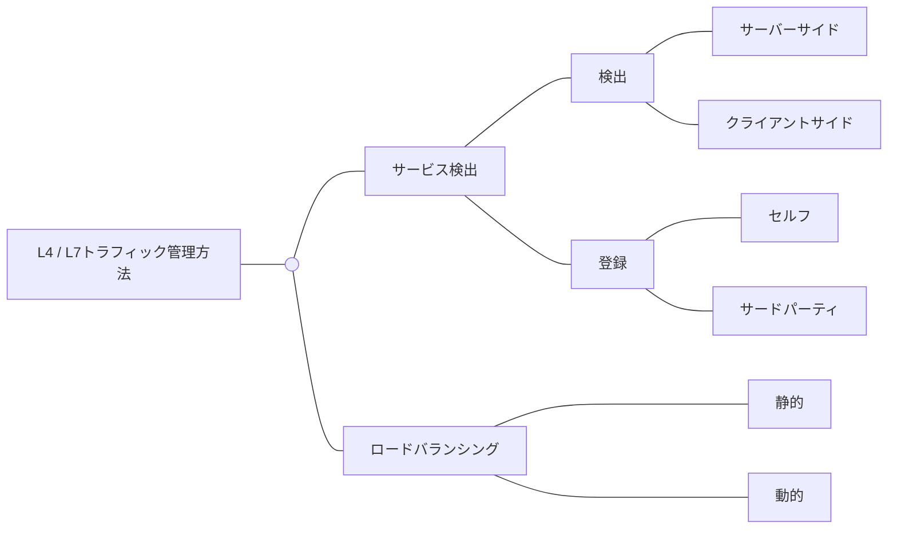
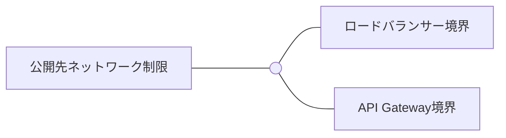
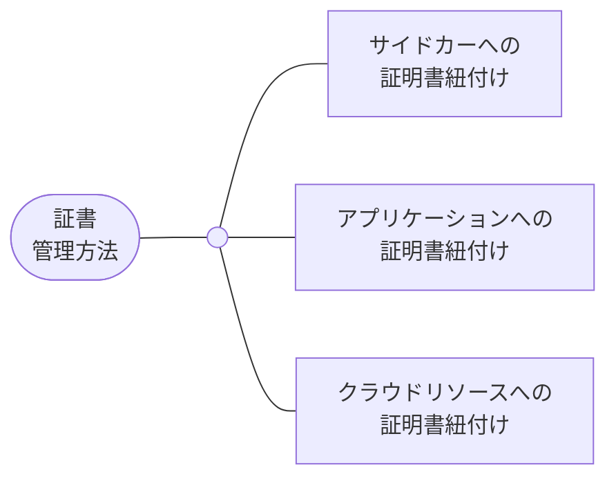
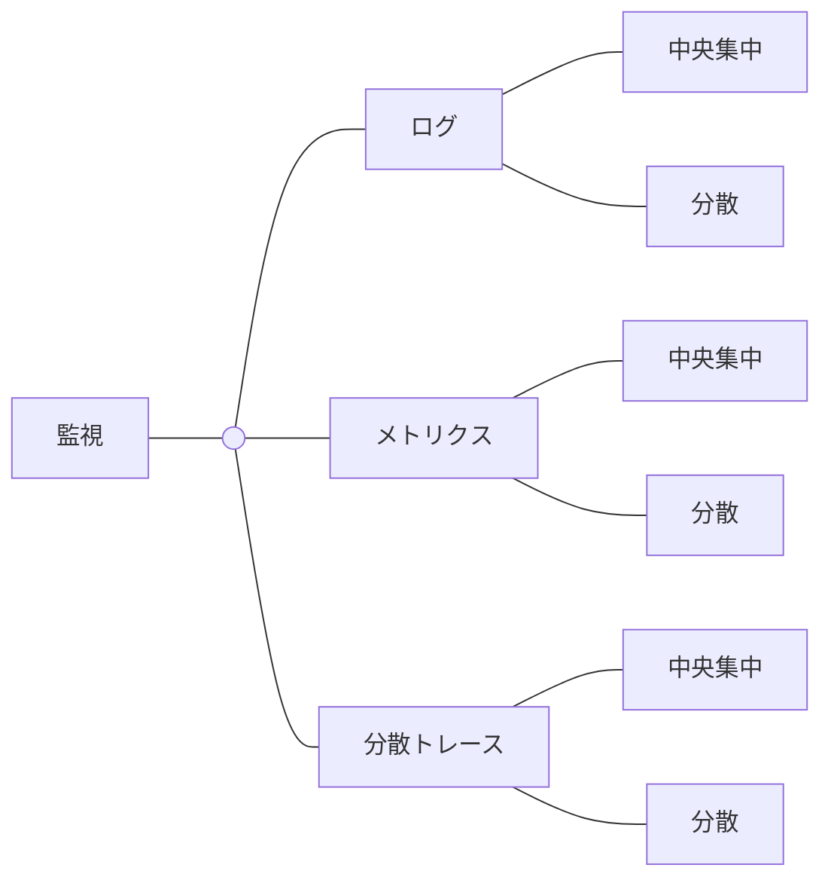
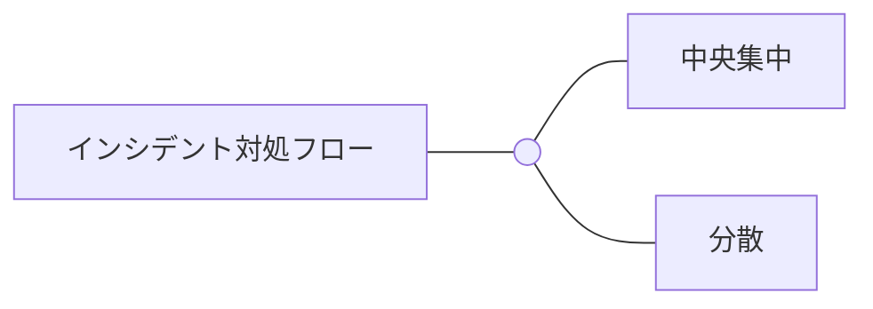

# 【インフラ領域】DDD とクラウドネイティブによるマイクロサービスアーキテクチャ設計の概説

# 本記事について

[【導入】DDD とクラウドネイティブによるマイクロサービスアーキテクチャ設計の概説](https://example.com) の記事のインフラ領域です。

インフラ領域のデザインパターンです。

# 01-04. 導入を参照

[【導入】DDD とクラウドネイティブによるマイクロサービスアーキテクチャ設計の概説](https://example.com)

# 05-14. アプリ領域を参照

[【アプリ領域】DDD とクラウドネイティブによるマイクロサービスアーキテクチャ設計の概説](https://example.com)

# 15. トラフィック管理方法

L4 / L7 トラフィック管理のために、宛先情報を動的に検出しなければなりません。

このとき、サービス検出という機能を使用しています。

サービス検出の実装方法にはいくつか種類があります。

```mermaid
flowchart LR

  L4-/-L7トラフィック管理方法[L4 / L7トラフィック管理方法] --- L4-/-L7トラフィック管理方法の基点(( ))
  L4-/-L7トラフィック管理方法の基点 --- サービス検出
  サービス検出 --- 検出
  検出 --- サーバーサイド
  検出 --- クライアントサイド
  サービス検出 --- 登録
  登録 --- セルフ
  登録 --- サードパーティ
  L4-/-L7トラフィック管理方法の基点 --- ロードバランシング
  ロードバランシング ---- 静的
  ロードバランシング ---- 動的
```

[【Istio⛵️】Istio のサービス間通信を実現するサービス検出の仕組み - 好きな技術を布教したい 😗](https://hiroki-hasegawa.hatenablog.jp/entry/2022/12/25/060000)

## 宛先検出

### サーバーサイドサービス検出パターン

送信元マイクロサービスから、問い合わせとロードバランシングの責務が切り離されています。

送信元マイクロサービスは、ロードバランサーにリクエストを送信します。

ロードバランサーは、宛先マイクロサービスの場所をサービスレジストリに問い合わせ、またリクエストをロードバランシングする責務を担っています。

なお、本記事では、サーバーサイドパターンを採用します。

(例) Istio、CoreDNS、AWS ALB など

[Microservices Pattern: Pattern: Server-side service discovery](https://microservices.io/patterns/server-side-discovery.html)

### クライアントサイドサービス検出パターン

通信の送信元マイクロサービスは、宛先マイクロサービスの場所をサービスレジストリに問い合わせ、さらにロードバランシングする責務を担います。

(例) Netflix の Eureka、kube-proxy など

[Microservices Pattern: Pattern: Client-side service discovery](https://microservices.io/patterns/client-side-discovery.html)

## 宛先登録

### セルフパターン

サービス検出時に、起動した送信元マイクロサービスはサービスレジストリに自身の宛先情報を送信し、登録します。

[Microservices Pattern: Pattern: Self Registration](https://microservices.io/patterns/self-registration.html)

### サードパーティパターン

サービス検出時に、サービスレジストラは起動した送信元マイクロサービスを収集し、サービスレジストリに宛先情報を登録します。

多くのツールで、サードパーティパターンが採用されています。

[Microservices Pattern: Pattern: 3rd Party Registration](https://microservices.io/patterns/3rd-party-registration.html)

## ロードバランシング

### 静的方式

宛先の負荷を考慮せずに、ロードバランシングします。

- ラウンドロビン
- 重み付きラウンドロビン
- IP ハッシュ

### 動的方式

宛先の負荷をリアルタイムに考慮して、ロードバランシングします。

- 最小コネクション数 (最小未処理コネクション数、Least Connection)
- 重み付きコネクション数
- 最小レスポンス時間

# 15-02. トラフィック管理方法

## L3

### VPC CNI アドオンや kube-proxy による IP アドレス管理方法

VPC CNI アドオンは、kubelet や AWS ENI と連携し、マイクロサービス Pod を Amazon EKS クラスター内のネットワークに参加させます。

kube-proxy は Node 内の iptables を更新し、Amazon EKS クラスター内で各ツールがトラフィック管理できるようにする。

| 図中の登場キャラクター  | 説明                                                                                                                                                                                                                                                                                  |
| ----------------------- | ------------------------------------------------------------------------------------------------------------------------------------------------------------------------------------------------------------------------------------------------------------------------------------- |
| AWS ENI                 | ENI には、サブネットから IP アドレスが割り当てられている。ENI を AWS リソースに紐づけると、ENI はその AWS リソースに IP アドレスを割り当てる。                                                                                                                                        |
| AWS kube-proxy アドオン | kube-proxy は Node 内の iptables を更新し、Amazon EKS クラスター内で L4 トラフィックを管理できるようにする。Node 内の iptable に対して、Pod の IP アドレスを追加 / 削除リクエストを送信する。AWS マネージド Pod として稼働する。                                                      |
| Amazon VPC CNI アドオン | Node にアタッチされた ENI に対して、IP アドレスの取得 / 解放リクエストを送信する。また、新しい Pod に対して、IP アドレスの割当 / 解放リクエストを送信する。必要に応じて、新しい ENI のアタッチを Amazon EKS コントロールプレーンにリクエストする。AWS マネージド Pod として稼働する。 |

## サービスメッシュ内

### Istio による L4/L7 トラフィック管理

Istio は、指定した Namespace に属する Pod へサービスメッシュの機能を提供する。

管理下の Pod に istio-proxy を挿入します。

istio-proxy は、Pod のアウトバウンド通信を L4 / L7 ロードバランシングします。

.drawio.png>)

| 図中の登場キャラクター             | 説明                                                                                                                                                                                                                                                             |
| ---------------------------------- | ---------------------------------------------------------------------------------------------------------------------------------------------------------------------------------------------------------------------------------------------------------------- |
| AWS ALB                            | Amazon EKS クラスター外の通信を Cluster 内の NodePort Service に L7 ロードバランシングする。                                                                                                                                                                     |
| Istio コントロールプレーン         | Kubernetes リソースや Istio リソースの宛先情報に基づいて、istio-proxy 内の Envoy プロセスを設定する。宛先情報はインメモリで保管する。                                                                                                                            |
| Istio データプレーン (istio-proxy) | ダウンストリームの istio-proxy からのリクエストをアップストリームに L7 ロードバランシングする。また、　アップストリームが Amazon EKS クラスター外の場合は、プロトコルに応じたロードバランシングになる。プロトコルが MySQL の場合は L4 ロードバランシングになる。 |
| NodePort Service                   | kube-proxy の更新した iptable を使用して、AWS ALB からのリクエストを Istio Ingress Gateway に L4 ロードバランシングする。                                                                                                                                        |

### Istio によるクライアントの判定

Istio IngressGateway がサービスメッシュ外からの通信をサービスメッシュ内にロードバランシングします。

クライアント (ブラウザ、外部 API) に応じて、適切なフロントエンドアプリや API Gateway にルーティングできます。

| 図中の登場キャラクター      | 説明                                                                                                                                                                                               |
| --------------------------- | -------------------------------------------------------------------------------------------------------------------------------------------------------------------------------------------------- |
| Istio Gateway               | NodePort Service からのリクエストを受信する。                                                                                                                                                      |
| Istio VirtualService (1)    | 宛先とするフロントエンドアプリケーションの Service を決定する。PC ブラウザやスマホブラウザからのリクエストは、User-Agent ヘッダーにブラウザを判定できる値を持つ。VirtualService でこれを判定する。 |
| Istio VirtualService (2)    | 宛先とするフロントエンドアプリケーションの Service を決定する。外部 API からのリクエストは、Host ヘッダーに API のドメインを持つ。VirtualService でこれを判定する。                                |
| Kubernetes NodePort Service | kube-proxy の更新した iptable を使用して、ALB からのリクエストを受信し、Istio IngressGateway Pod に L4 ロードバランシングする。                                                                    |

.drawio.png>)

Istio IngressGateway については、以下のブログで解説しているため、5000 兆回ブックマークしてくれると嬉しいです！

[【Istio⛵️】Istio によって抽象化される Envoy の HTTPS リクエスト処理の仕組み - 好きな技術を布教したい 😗](https://hiroki-hasegawa.hatenablog.jp/entry/2024/01/16/013404)

## サービスメッシュ外

Istio は、指定した Namespace 以外に属する Pod にはサービスメッシュの機能を提供しません。

サービスメッシュ外の Namespace では、CoreDNS を使用して、トラフィックを管理します。

.drawio.png>)

| 図中の登場キャラクター       |                                                                                                                                                                                                                                                                                                                                                                                                                              |
| ---------------------------- | ---------------------------------------------------------------------------------------------------------------------------------------------------------------------------------------------------------------------------------------------------------------------------------------------------------------------------------------------------------------------------------------------------------------------------- |
| AWS ALB                      | Amazon EKS クラスター外の通信を Cluster 内の NodePort Service に L7 ロードバランシングする。                                                                                                                                                                                                                                                                                                                                 |
| AWS CoreDNS アドオン         | Pod の名前解決を実施する。                                                                                                                                                                                                                                                                                                                                                                                                   |
| Kubernetes ClusterIP Service | kube-proxy の更新した iptable を使用して、Pod からのリクエストを Pod に L4 ロードバランシングする。                                                                                                                                                                                                                                                                                                                          |
| Kubernetes ConfigMap         | AWS CoreDNS アドオンの各種設定を管理する。Terraform で `json` ファイルとして作成する。                                                                                                                                                                                                                                                                                                                                       |
| Kubernetes NodePort Service  | kube-proxy の更新した iptable を使用して、AWS ALB からのリクエストを Istio Ingress Gateway に L4 ロードバランシングする。                                                                                                                                                                                                                                                                                                    |
| Pod (送信元)                 | サービスメッシュ外にある任意の送信元 Pod である。kubelet は、Pod 内のコンテナの `/etc/resolv.conf` ファイルに権威 DNS サーバー (ここでは CoreDNS) の IP アドレスを設定する。リクエスト時に、コンテナは自身の `/etc/resolv.conf` ファイルで権威 DNS サーバーの IP アドレスを確認し、DNS サーバーに宛先 Pod の IP アドレスの正引きを実施する。送信元 Pod は、取得した IP アドレスを使用して、宛先 Pod にリクエストを送信する。 |
| Pod (宛先)                   | サービスメッシュ外にある任意の宛先 Pod である。                                                                                                                                                                                                                                                                                                                                                                              |
| iptables (Node 内)           | Pod の IP アドレスを管理する。                                                                                                                                                                                                                                                                                                                                                                                               |
| kubelet                      | Node 内でデーモンプロセスとして稼働し、Amazon EKS コントロールプレーンから Pod 作成 / 削除リクエストを受信する。新しい Pod を Cluster Network に参加させるために、Amazon VPC CNI にリクエストを送信する。                                                                                                                                                                                                                    |

# 16. 公開先ネットワーク制限

フロントエンドは、Amazon EKS クラスターの外に公開します。

ただし、社内ユーザーに公開すべきフロントエンドと、社内の SWE や SREer にだけ公開するものがあります。

Amazon EKS クラスターの入り口で、リクエストを検査し、これらを制御しなければなりません。

```mermaid
flowchart LR

  公開先ネットワーク制限 ---- 公開先ネットワーク制限の基点((" "))
  公開先ネットワーク制限の基点 --- ロードバランサー境界
  公開先ネットワーク制限の基点 --- API-Gateway境界[API Gateway境界]

```

[Microservices Security in Action](https://www.oreilly.com/library/view/microservices-security-in/9781617295959/OEBPS/Text/p2.xhtml)

## サービスメッシュ内

### ロードバランサー境界

ロードバランサーを境界として、公開先のネットワークを制限します。

Istio は、指定した Namespace に属する Pod へサービスメッシュの機能を提供する。

サービスメッシュ内には、ユーザーに公開するコンテナと、SWE や SREer にだけ公開するコンテナがあります。

ユーザーに公開するコンテナでは、有害な IP アドレス以外に IP アドレスの制限は不要です。

しかし、ダッシュボードでは、送信元が社内 IP アドレスのリクエストだけを許可するような制限が必要になります。

そこで、社外公開用と社内公開用の AWS ALB を配置し、AWS WAF を紐づけるとよいです。

.drawio.png>)

| 図中の登場キャラクター               | 説明                                                                                                                                              |
| ------------------------------------ | ------------------------------------------------------------------------------------------------------------------------------------------------- |
| AWS ALB (社外公開用)                 | SQL インジェクションや XSS を検査する AWS WAF を紐付ける。アプリケーションを L7 の攻撃から防御できるようにする。                                  |
| AWS ALB (社内公開用)                 | IP アドレスを検査する AWS WAF を紐付ける。SWE や SREer だけがリクエストを送信できるようにする。                                                   |
| Amazon Route 53                      | ドメインに合わせて、社外公開用または社内公開用の AWS ALB のいずれかに振り分ける。                                                                 |
| ID プロバイダー                      | ダッシュボードにログインできる SWE や SREer の認証情報を管理する。                                                                                |
| Istio IngressGateway                 | 宛先とする Service を決定する。外部 API からのリクエストは、Host ヘッダーにドメインを持つ。VirtualService でこれを判定する。                      |
| Keycloak、Temporal など              | SWE や SREer にだけ公開するコンテナである。ツールのダッシュボードで、ビルトインの SSO がある場合、ID プロバイダーに認証フェーズを直接委譲できる。 |
| フロントエンド (PC / スマホブラウザ) | ユーザーに公開するコンテナである。                                                                                                                |

### API Gateway 境界

API Gateway を境界として、公開先のネットワークを制限します。

これは認証認可と内容が重複するため、ここでは省略します。

## サービスメッシュ外

### ロードバランサー境界

ロードバランサーを境界として、公開先のネットワークを制限します。

Istio は、指定した Namespace 以外に属する Pod にはサービスメッシュの機能を提供しません。

サービスメッシュ外には、SWE や SREer にだけ公開するコンテナがあります。

送信元が社内 IP アドレスのリクエストだけを許可するような制限が必要になります。

そこで、社内公開用の AWS ALB を配置し、AWS WAF を紐づけるとよいです。

.drawio.png>)

| 図中の登場キャラクター                        | 説明                                                                                                                                                                                                                                                                                                                             |
| --------------------------------------------- | -------------------------------------------------------------------------------------------------------------------------------------------------------------------------------------------------------------------------------------------------------------------------------------------------------------------------------- |
| Alertmanager、Grafana、Kiali、Prometheus など | SWE や SREer にだけ公開するコンテナである。                                                                                                                                                                                                                                                                                      |
| AWS ALB (社内公開用)                          | IP アドレスを検査する AWS WAF を紐付ける。SWE や SREer だけがリクエストを送信できるようにする。                                                                                                                                                                                                                                  |
| AWS CoreDNS アドオン                          | ツールによっては、連携のために、他のツールの Amazon EKS クラスター内ドメインを設定しなければならない。                                                                                                                                                                                                                           |
| Amazon Route 53                               | 社内公開用の AWS ALB に振り分ける。                                                                                                                                                                                                                                                                                              |
| ID プロバイダー                               | ダッシュボードにログインできる SWE や SREer の認証情報を管理する。                                                                                                                                                                                                                                                               |
| NAT Gateway                                   | ツールによっては、ダッシュボード間の連携のために、他のツールの Amazon EKS クラスター外公開ドメインを設定しなければならない。送信元 IP アドレスを固定するために、NAT Gateway を経由させる。                                                                                                                                       |
| Nginx Ingress Controller                      | 宛先とする Service を決定する。Amazon EKS クラスター外のからのリクエストは、Host ヘッダーにドメインを持つ。Nginx Ingress Controller でこれを判定する。                                                                                                                                                                           |
| OAuth2 Proxy2                                 | ビルトインの SSO がないツール (例：Alertmanager、Kiali、Prometheus など) のダッシュボードに SSO でログインしたい場合、OAuth2 Proxy を使用する。Nginx Ingress Controller は、OAuth2 Proxy を介して、認証フェーズを ID プロバイダーに委譲する。SSO があるツール (例：Grafana など) では、OAuth2 Proxy は使用せずに、直接委譲する。 |

# 17. 証明書管理方法

マイクロサービスアーキテクチャでは、システム内で非常に多くのパケット通信が起こります。

パケットのアプリケーションデータを暗号化しなければ、これを第三者に攻撃されかねません。

TLS プロトコルを使用してアプリケーションデータを暗号化することにより、攻撃から防御できます。

```mermaid
flowchart LR

  証書管理方法([証書<br>管理方法]) --- 証明書管理方法の基点(( ))
  証明書管理方法の基点 --- サイドカーへの証明書紐付け[サイドカーへの<br>証明書紐付け]
  証明書管理方法の基点 --- アプリケーションへの証明書紐付け[アプリケーションへの<br>証明書紐付け]
  証明書管理方法の基点 --- クラウドリソースへの証明書紐付け[クラウドリソースへの<br>証明書紐付け]

```

> 💡 TLS プロトコルで暗号化できるのは、パケットの構成要素なか中で、アプリケーションデータのみです。

[Microservices Security in Action video edition](https://www.oreilly.com/library/view/microservices-security-in/9781617295959VE/MSiA_part3.html)

## TLS 認証の種類

- 通常 TLS 認証
- 相互 TLS 認証

> 💡 余裕があったらしっかり書くぜ！

## サービスメッシュ内

### AWS と Istio による証明書管理

Istio は、指定した Namespace に属する Pod へサービスメッシュの機能を提供する。

管理下の Pod に istio-proxy を挿入します。

istio-proxy はクライアント証明書 / SSL 証明書を持ち、アップストリームとダウンストリームの istio-proxy と相互 TLS 認証するします。

| 図中の登場キャラクター             | 説明                                                                                                                                                                                                                                                                 |
| ---------------------------------- | -------------------------------------------------------------------------------------------------------------------------------------------------------------------------------------------------------------------------------------------------------------------- |
| Amazon CA                          | 中間認証局である。AWS Certificate Manager で管理する SSL 証明書を署名する。                                                                                                                                                                                          |
| Amazon Root CA / Starfield Root CA | ルート認証局である。Amazon CA を署名する。                                                                                                                                                                                                                           |
| AWS ALB                            | AWS Certificate Manager の管理する SSL 証明書を、AWS ALB に紐づける。ユーザーが Amazon EKS クラスターにリクエストを送信するときに、通常の TLS を実行できるようになる。なお、ここで SSL/TLS 終端とし、アップストリームの Istio IngressGateway で SSL/TLS を再開する。 |
| Amazon Aurora                      | SSL 証明書を Amazon Aurora に紐づける。マイクロサービスが Amazon Aurora にトランザクション処理を実行するときに、通常の TLS を実行できるようになる。                                                                                                                  |
| AWS Certificate Manager            | 発行された SSL 証明書を管理する。                                                                                                                                                                                                                                    |
| Istio コントロールプレーン         | ルート認証局として、istio-proxy に紐づけるためのクライアント証明書 / SSL 証明書を発行する。                                                                                                                                                                          |
| Istio データプレーン (istio-proxy) | 秘密鍵と証明書要求を作成し、ルート認証局の Istio コントロールプレーンに送信する。また、Istio コントロールプレーンが作成したクライアント証明書 / SSL 証明書を取得し、アップストリームとダウンストリームの istio-proxy と相互 TLS 認証を実行する。                     |
| Istio PeerAuthentication           | Namepspace を指定し、これに属する Pod で相互 TLS 認証を実行する。                                                                                                                                                                                                    |
| Kubernetes ConfigMap               | クライアント証明書 / SSL 証明書を検証できる CA 証明書を管理する。                                                                                                                                                                                                    |
| Kubernetes Namespace               | PeerAuthentication で指定される Namespace である。                                                                                                                                                                                                                   |
| Kubernetes Secret                  | Istio コントロールプレーンが使用するオレオレ証明書を管理する。Istio コントロールプレーンは、オレオレ証明書を使用して自身を署名し、ルート認証局として機能する。                                                                                                       |
| rds-ca                             | ルート認証局である。中間認証局を署名する。                                                                                                                                                                                                                           |

## サービスメッシュ外

Istio は、指定した Namespace 以外に属する Pod にはサービスメッシュの機能を提供しません。

そのため、　他のツール (例：Cert-manager) でクライアント証明書 / SSL 証明書を発行し、コンテナに紐づけなければなりません。

> 💡 余裕があったら書くぜ！

# 18. 監視

```mermaid
flowchart LR

  監視 --- 監視の基点((" "))
  監視の基点 --- ログ
  監視の基点 --- メトリクス
  監視の基点 --- 分散トレース
  ログ --- ログ中央集中[中央集中]
  ログ --- ログ分散[分散]
  メトリクス --- メトリクス中央集中[中央集中]
  メトリクス --- メトリクス分散[分散]
  分散トレース --- 分散トレース中央集中[中央集中]
  分散トレース --- 分散トレース分散[分散]

```

## ツール

テレメトリーの監視を以下の手順に分けます。

1. 作成
2. 収集
3. 保管
4. 分析可視化

各手順には対応するツールがあり、よりよく監視するためには適切なツールを採用しなければなりません。

[入門 監視 ―モダンなモニタリングのためのデザインパターン](https://www.amazon.co.jp/dp/4873118646)

# 18-2. ログ

## ログ収集パターン

ログ収集パターンには、以下があります。

- 中央集中
- 分散

ここでは、集中ロギングを採用します。

## Fluentd / FluentBit によるログ収集

集中ロギングを実現するツールには、Fluentd / FluentBit があります。

Fluentd / FluentBit を使用して、Amazon EKS クラスター内で作成されるログを収集します。

Fluentd / FluentBit の配置方法には、エージェントパターン (DaemonSet 型、サイドカー型) 、フォワーダーアグリゲーターパターンがあります。

ここでは、DaemonSet 型のエージェントパターンを設定します。

一方で、Amazon EKS コントロールプレーンのログは、そのまま Amazon CloudWatch Logs に送信できます。

[Common Architecture Patterns with Fluentd and Fluent Bit](https://fluentbit.io/blog/2020/12/03/common-architecture-patterns-with-fluentd-and-fluent-bit/)

ここでは、以下のログが登場します。

- アプリケーションの実行ログ
- istio-proxy のアクセスログ
- EKS コントロールプレーンのログ (実行ログ、監査ログなど)

| 図中の登場キャラクター                     | 説明                                                                                                                                                                                                                                                                                                                                                                                     |
| ------------------------------------------ | ---------------------------------------------------------------------------------------------------------------------------------------------------------------------------------------------------------------------------------------------------------------------------------------------------------------------------------------------------------------------------------------- |
| AWS EBS                                    | コンテナランタイムは、コンテナの標準出力または標準エラー出力したログの実体を AWS EBS ボリュームの `/var/log/pods` ディレクトリに出力する。また、`/var/log/container` ディレクトリに各コンテナのログのシンボリックリンクがある。                                                                                                                                                          |
| Amazon CloudWatch Logs                     | Amazon EKS クラスター内のログを収集し、また保管する。                                                                                                                                                                                                                                                                                                                                    |
| Amazon EKS コントロールプレーン            | Amazon EKS コントロールプレーンは、コントロールプレーンコンポーネントのログを Amazon CloudWatch Logs に出力する。                                                                                                                                                                                                                                                                        |
| Fluentd / FluentBit                        | DaemonSet 型のエージェントパターンを採用し、DaemonSet として各 Node に稼働させる。`/var/log/container` ディレクトリに各コンテナのログのシンボリックリンクがある。INPUT セクションでこのディレクトリを指定し、ログを収集する。今回の例では、istio-proxy のアクセスログとアプリケーションの実行ログを収集するとする。OUTPUT セクションで、ログの宛先に Amazon CloudWatch Logs を設定する。 |
| Istio コントロールプレーン                 | Istio データプレーン (istio-proxy) に AccessLogging プロバイダーの設定を適用する。                                                                                                                                                                                                                                                                                                       |
| Istio データプレーン (istio-proxy)         | アクセスログを出力する。                                                                                                                                                                                                                                                                                                                                                                 |
| Istio Telemetry                            | `.spec.accessLogging[*]providers` キーで、AccessLogging プロバイダーを使用する。                                                                                                                                                                                                                                                                                                         |
| Kubernetes ConfigMap (Fluentd / FluentBit) | Fluentd / FluentBit の各種オプションを管理する。                                                                                                                                                                                                                                                                                                                                         |
| Kubernetes ConfigMap (Istio)               | `.extensionProviders` キーで、AccessLogging プロバイダーを宣言する。                                                                                                                                                                                                                                                                                                                     |
| SWE / SREer                                | Amazon CloudWatch Logs のログインサイト機能で、ログを分析可視化する。Amazon CloudWatch Logs のログイベントをメトリクス化すれば、監視できるようになる。                                                                                                                                                                                                                                   |
| アプリ                                     | 実行ログを出力する。                                                                                                                                                                                                                                                                                                                                                                     |

[Microservices Pattern: Pattern: Log aggregation](https://microservices.io/patterns/observability/application-logging.html)

[Microservices Pattern: Pattern: Exception tracking](https://microservices.io/patterns/observability/exception-tracking.html)

[Microservices Pattern: Pattern: Audit logging](https://microservices.io/patterns/observability/audit-logging.html)

# 18-3. メトリクス

## メトリクス収集パターン

メトリクス収集パターンには、以下があります。

- 中央集中
- 分散

## Prometheus によるメトリクス収集

ここで概説するメトリクスの種類として、以下があります。

- Kubernetes リソース系メトリクス
- Istio リソース系メトリクス
- Kubernetes コンポーネント (kubelet、kube-proxy など)
- その他のツール (CoreDNS、Karpenter など)

Prometheus Server を使用して、Amazon EKS クラスター内で作成されるメトリクスを収集します。

| 図中の登場キャラクター             | 説明                                                                                                                                                                                                                                                                        |
| ---------------------------------- | --------------------------------------------------------------------------------------------------------------------------------------------------------------------------------------------------------------------------------------------------------------------------- |
| CloudWatch Metrics                 | AWS リソース系メトリクスを収集し、また保管する。Amazon EKS クラスター内から収集できるメトリクスの種類は少なく、代わりに、Prometheus Server に収集してもらうほうが、セットアップが楽である。                                                                                 |
| Grafana                            | Prometheus Server のメトリクスを参照して分析し、ダッシュボードのパネルとして可視化する。                                                                                                                                                                                    |
| Istio コントロールプレーン         | Istio データプレーンのメトリクスを中央集中的に管理する。また、Istio データプレーン (istio-proxy) に Metics プロバイダーの設定を適用する。                                                                                                                                   |
| Istio データプレーン (istio-proxy) | Istio コントロールプレーンに Istio リソース系メトリクスを送信する。                                                                                                                                                                                                         |
| Istio Telemetry                    | `.spec.metrics[*]providers` キーで、Metrics プロバイダーを使用する。                                                                                                                                                                                                        |
| Kubernetes ConfigMap (Istio)       | `.extensionProviders` キーで、Metrics プロバイダーを宣言する。                                                                                                                                                                                                              |
| Kubernetes ConfigMap (Grafana)     | 各種オプションを設定する。また、ダッシュボードを JSON で管理する。                                                                                                                                                                                                          |
| Kubernetes ConfigMap (Kiali)       | 各種オプションを設定する。また、ダッシュボードを JSON で管理する。                                                                                                                                                                                                          |
| Kiali                              | Prometheus のメトリクスを参照して分析し、メッシュマップとして可視化する。                                                                                                                                                                                                   |
| kube-state-metrics                 | Pod の状態系メトリクス (例：レプリカ数、ヘルスチェック失敗数など) を収集する。                                                                                                                                                                                              |
| Kubernetes コンポーネント          | kubelet、kube-proxy などである。これらのメトリクスも Prometheus Server で収集できる。                                                                                                                                                                                       |
| Prometheus Server                  | ServiceMonitor を介して、Amazon EKS クラスター内の様々なメトリクスを収集する。また、VictroriaMetrics にメトリクスを永続化する。Amazon EKS クラスター外から収集できるメトリクスの種類は少なく、代わりに、CloudWatch Metrics に収集してもらうほうが、セットアップが楽である。 |
| Prometheus Node Exporter           | Node のハードウェアリソース系メトリクス (CPU 使用量、メモリ使用量など) を収集する。                                                                                                                                                                                         |
| Prometheus ServiceMonitor          | Prometheus Server からのリクエストを受信し、対象の Service からメトリクスを収集する。                                                                                                                                                                                       |
| SWE / SREer                        | Amazon CloudWatch Metrics でメトリクスを監視する。                                                                                                                                                                                                                          |
| VictoriaMetrics                    | メトリクスを永続データとして管理する。                                                                                                                                                                                                                                      |

[Microservices Pattern: Pattern: Application metrics](https://microservices.io/patterns/observability/application-metrics.html)

# 18-4. トレース

## トレース収集パターン

トレース収集パターンには、以下があります。

- 中央集中
- 分散

## OpenTelemetry Collector によるトレース収集

ここで概説するスパンの種類として、以下があります。

- アプリケーションの作成するスパン
- istio-proxy の作成するスパン

OpenTelemetry Collector を介して、Amazon EKS クラスター内のスパンを AWS X-Ray に送信します。

| 図中の登場キャラクター | 説明 |
| ---------------------- | ---- |
| 力尽きた…              |      |
|                        |      |

[Microservices Pattern: Pattern: Distributed tracing](https://microservices.io/patterns/observability/distributed-tracing.html)

# 19. インシデント対処フロー

```mermaid
flowchart LR

  インシデント対処フロー --- インシデント対処フローの基点((" "))
  インシデント対処フローの基点 --- 中央集中[中央集中]
  インシデント対処フローの基点 --- 分散[分散]

```

## ツール

インシデントの対処フローは、以下の手順になっています。

1. アラート発火
2. アラート通知
3. インシデント管理
4. オンコールチーム

各手順には対応するツールがあり、よりよく監視するためには適切なツールを採用しなければなりません。

このうちで、インシデント管理はマネージドにすることが推奨です。

なぜなら、インシデント管理をセルフホストにすると、インシデント管理システムで障害が起こったことを検知できなくなるになるためです。

## インシデント対処フローパターン

インシデント対処フローパターンには、以下があります。

- 中央集中
- 分散

ここでは、中央集中パターンを採用します。

## AWS リソース、Prometheus、Slack によるインシデント管理

| 図中の登場キャラクター                      | 説明                                                                                                                                                                                                                                                                                                                                                                                                                                                                                       |
| ------------------------------------------- | ------------------------------------------------------------------------------------------------------------------------------------------------------------------------------------------------------------------------------------------------------------------------------------------------------------------------------------------------------------------------------------------------------------------------------------------------------------------------------------------ |
| Alertmanager                                | Prpmetheus が送信したアラートをインシデント管理ツールに転送する。                                                                                                                                                                                                                                                                                                                                                                                                                          |
| Amazon CloudWatch Alarm                     | Amazon CloudWatch Logs によるログメトリクスやその他の AWS 系メトリクスが、期間中に統計量の閾値を超過したとする。この場合に、超過を検知してアラートイベントを発火する。                                                                                                                                                                                                                                                                                                                     |
| Amazon CloudWatch Logs                      | ログを可視化分析し、保管する。メトリクスフィルターを使用して、フィルターパターンに合致したログの発生をデータポイントとして処理する。これを統計し、ログメトリクスとして扱える。                                                                                                                                                                                                                                                                                                             |
| Amazon CloudWatch Metrics                   | AWS 系メトリクスを収集する。                                                                                                                                                                                                                                                                                                                                                                                                                                                               |
| Amazon SNS                                  | Amazon CloudWatch Alarm がパブリッシュしたアラートをインシデント管理ツールに転送する。                                                                                                                                                                                                                                                                                                                                                                                                     |
| Fluentd / FluentBit                         | Amazon EKS クラスター内のログを収集し、Amazon CloudWatch Logs に送信する。                                                                                                                                                                                                                                                                                                                                                                                                                 |
| Kubernetes ConfigMap (Alertmanager)         | Alertmanager の各種オプションを管理する。                                                                                                                                                                                                                                                                                                                                                                                                                                                  |
| PrometheusRule                              | アラートを発火させるために、PromQL で定義したメトリクスの異常期間と統計量の閾値を設定する。アラートルールだけでなく、レコーディングルールも設定できる。レコーディングルールでは、設定した PromQL の取得結果をカスタムメトリクスとして扱い、Prometheus Server から取得できる。                                                                                                                                                                                                              |
| Prometheus Server                           | Amazon EKS クラスター内からメトリクスを収集する。メトリクスが PrometheusRule で設定した統計の閾値を超過すると、Alertmanager にアラートを送信する。                                                                                                                                                                                                                                                                                                                                         |
| インシデント管理ツール (Slack、Incident.io) | 特定のマイクロサービスのインシデント対応フローを自動化する。インシデントを Slack が受信すると、Incident.io がインシデント対応チャンネルを自動的に作成する。その後、まずはインシデントコマンダーを一次担当者に自動的に割り当てる。インシデントコマンダーは、Incident.io の Bot の質問に答えながら、インシデント解決者を二次担当者に割り当てる。インシデントコマンダーは指揮に努める。インシデント解決者は対処に尽力し、対応が完了した後、Bot の質問に答えながら振り返りレポートを作成する。 |
| マイクロサービスのオンコールチーム          | 最小構成として、特定のマイクロサービスチームのインシデントコマンダーとインシデント解決者からなる。インシデントコマンダーが一次担当者である。                                                                                                                                                                                                                                                                                                                                               |

## 振り返り

ここで、もう一度、マイクロサービスアーキテクチャを概説します。

インシデント発生から対処に関係する以下を組み込んでいます。

- Amazon CloudWatch
- Amazon SNS
- Prometheus (Alertmanager を含む)
- インシデント管理ツール

.png>)

# 20-26. 横断領域を参照

[【横断領域】DDD とクラウドネイティブによるマイクロサービスアーキテクチャ設計の概説](https://example.com)
