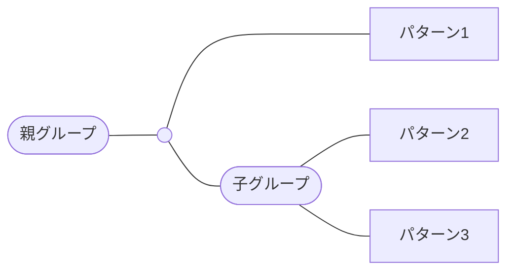
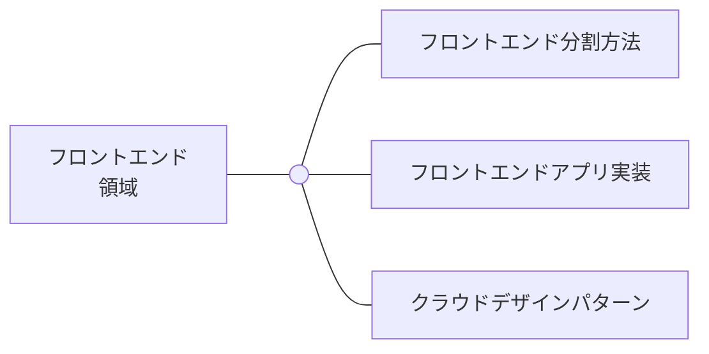
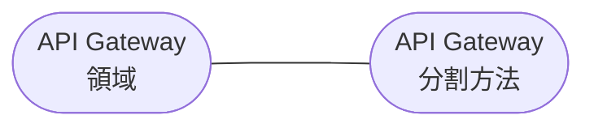
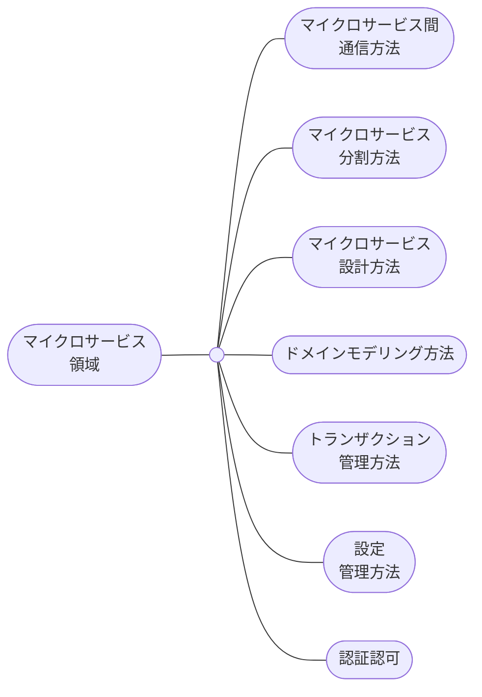

# 【導入】DDDとクラウドネイティブによるマイクロサービスアーキテクチャ設計の概説

# 01. はじめに

どうも、Istioのマスコットやってますカイルくんです。

近年、先輩エンジニアのおかげで、マイクロサービスアーキテクチャの実装方法やより最適なデザインパターンの情報を得られるようになりました。

[Microservices Patterns: With examples in Java](https://www.amazon.co.jp/dp/1617294543)

[Building Microservices: Designing Fine-Grained Systems (English Edition)](https://www.amazon.co.jp/dp/B09B5L4NVT)

また、マイクロサービスアーキテクチャを支えるDDDについても、先輩エンジニアがより具体的な知見を提供してくれています。

[ドメイン駆動設計をはじめよう ―ソフトウェアの実装と事業戦略を結びつける実践技法](https://www.amazon.co.jp/dp/481440073X)

それと同時に、クラウドネイティブのコミュニティは進化しており、マイクロサービスアーキテクチャのデザインパターンとして採用できる様々がツールがあります。

[Platform Engineering on Kubernetes](https://www.amazon.co.jp/dp/1617299324)

一方で、これらを組み合わせ、マイクロサービスアーキテクチャを設計しようとする情報はまだまだ少ないように思います。

そこで、様々な以下の情報

- 現場で携わっている実際のマイクロサービスアーキテクチャ
- 今まで読んできた書籍
- 事例記事
- GitHubのサンプル実装

を集約しつつ、DDDとクラウドネイティブをどのように組み合わせれば、マイクロサービスアーキテクチャを設計できるのかを概説します。

> 💡 ぶっちゃけ、高尚な意義なんてなくて、俺が好きなものを語るだけの記事っすわーーーーー

# 02. ソフトウェアのアーキテクチャスタイルの歴史

## アーキテクチャスタイルとは

アーキテクチャスタイルは、ソフトウェアアーキテクチャを取り巻く技術的なトピックの一つです。

アーキテクチャパターンとも呼びます。

アーキテクチャスタイルとは、とあるアーキテクチャ特性をもつアーキテクチャのことです。

以下は、アーキテクチャスタイルのトピックです。

- マイクロサービスアーキテクチャ
- モノリスアーキテクチャ
- レイヤードアーキテクチャ
- …

今回は、特にマイクロサービスアーキテクチャを語っていきます。

> 💡 アーキテクチャ特性は話が外れるため、ソフトウェアアーキテクチャの基礎 を確認してくれよな！🤚🏻
> [ソフトウェアアーキテクチャの基礎](https://www.oreilly.co.jp//books/9784873119823/)

## マイクロサービスアーキテクチャに関する歴史

マイクロサービスアーキテクチャに関連するアーキテクチャスタイルがいくつかあります。

マイクロサービスアーキテクチャが提唱されたのは 2014年のことです。

マイクロサービスアーキテクチャは銀の弾丸ではありません。

マイクロサービスアーキテクチャの提唱以降も、各人が様々なアーキテクチャスタイルを提唱しています。

また、開発組織の規模やアプリケーションの特徴によって、適切なアーキテクチャを採用すべきです。

(まぁ、俺はマイクロサービスアーキテクチャが好きってこと。それだけの話や。)

以下の表で、マイクロサービスアーキテクチャに関する歴史を解説しました。

| 年代                                                                                                           | アーキテクチャスタイル         | 説明                                                                                                                                                                                                                                                                                                                                                                                                 | 参考                                                                                                                                                                                                            |
| -------------------------------------------------------------------------------------------------------------- | ------------------------------ | ---------------------------------------------------------------------------------------------------------------------------------------------------------------------------------------------------------------------------------------------------------------------------------------------------------------------------------------------------------------------------------------------------- | --------------------------------------------------------------------------------------------------------------------------------------------------------------------------------------------------------------- |
| 1999年                                                                                                         | モノリシックアーキテクチャ     | バックエンドのアーキテクチャとしてモノリシックアーキテクチャが台頭していた。                                                                                                                                                                                                                                                                                                                         | [https://en.wikipedia.org/wiki/Monolithic_application](https://en.wikipedia.org/wiki/Monolithic_application)                                                                                                    |
| 1900年後半〜2000年前半                                                                                         | サービス指向アーキテクチャ     | Michael BellやThomas Erlらが、アプリを機能の粒度で分割するアーキテクチャを提唱した。ただ『機能』という粒度に分割の指針がなかった。様々な課題があったため、概念としては提唱されていても、実装方法の確立にまでは至らなかった。                                                                                                                                                                         | ・[https://en.wikipedia.org/wiki/Service-oriented_architecture](https://en.wikipedia.org/wiki/Service-oriented_architecture) ・[https://www.amazon.co.jp/dp/B09B5L4NVT](https://www.amazon.co.jp/dp/B09B5L4NVT) |
| 2003年                                                                                                         | DDD                            | Eric EvansはDDDを提唱した。DDDは、オブジェクト指向分析設計から派生した分析設計の方法の一種である。特に機能要件を解決するアプリケーションに有効である。オブジェクト指向分析設計のベタープラクティスを集め、より強化することにつながった。                                                                                                                                                             | ・[https://www.amazon.co.jp/dp/481440073X](https://www.amazon.co.jp/dp/481440073X)                                                                                                                              |
| ・[https://en.wikipedia.org/wiki/Domain-driven_design](https://en.wikipedia.org/wiki/Domain-driven_design)     |                                |                                                                                                                                                                                                                                                                                                                                                                                                      |                                                                                                                                                                                                                 |
| 2014年                                                                                                         | マイクロサービスアーキテクチャ | Simon Brownは、モノリシックアーキテクチャは、時間経過とともに、無秩序でつぎはぎだらけになり得ることを指摘した。Martin FowlerとJames Lewisは、サービス指向アーキテクチャとDDDを統合し、アプリを独立したマイクロサービスの集まりに分割するアーキテクチャを提唱した。サービス指向アーキテクチャにDDDの高凝集/低結合の考え方を取り入れることで、サービス指向アーキテクチャを実装可能な理論に昇華させた。 | ・[https://dzone.com/articles/distributed-big-balls-mud](https://dzone.com/articles/distributed-big-balls-mud)                                                                                                  |
| ・[https://martinfowler.com/articles/microservices.html](https://martinfowler.com/articles/microservices.html) |                                |                                                                                                                                                                                                                                                                                                                                                                                                      |                                                                                                                                                                                                                 |

|
| 2015年 | モジュラーモノリス | Martin Flowlerはモジュラーモノリスを提唱した。モジュラモノリスでは、マイクロサービスアーキテクチャとモノリスアーキテクチャの間をとった粒度で、アプリを細かいモジュールに分割する。最初にモジュラーモノリスとして設計し、マイクロサービスアーキテクチャに移行していくという選択肢もある。 | ・[https://martinfowler.com/bliki/MonolithFirst.html](https://martinfowler.com/bliki/MonolithFirst.html) |

## マイクロサービスアーキテクチャのデザインパターン

マイクロサービスアーキテクチャでは特有の技術 / 組織的な問題が起こります。

これを解決するためのデザインパターンがたくさんあり、本記事ではこれらを取り上げます。

取り上げるデザインパターンの多くは、 https://www.amazon.co.jp/dp/1617294543 にも登場します。

[Microservices Pattern: A pattern language for microservices](https://microservices.io/patterns/)

[Microservices Pattern: Microservice Architecture pattern](https://microservices.io/patterns/microservices.html#related-patterns)

# 03. クラウドネイティブ

## CNCFによる定義づけ

CNCFは、クラウドネイティブを以下のように定義づけしています。

マイクロサービスアーキテクチャを構築するために適した技術であることがわかります。

> クラウドネイティブ技術は、パブリッククラウド、プライベートクラウド、ハイブリッドクラウドなどの近代的でダイナミックな環境において、スケーラブルなアプリケーションを構築および実行するための能力を組織にもたらします。 このアプローチの代表例に、コンテナ、サービスメッシュ、マイクロサービス、イミュータブルインフラストラクチャ、および宣言型APIがあります。

[https://github.com/cncf/toc/blob/main/DEFINITION.md](https://github.com/cncf/toc/blob/main/DEFINITION.md)

## クラウドネイティブに関する歴史

| 年代      | 技術                   | 説明                                                                                     | 参考                                                                                                                           |
| --------- | ---------------------- | ---------------------------------------------------------------------------------------- | ------------------------------------------------------------------------------------------------------------------------------ |
| 2004      | AWS                    | AWSは、同社初のクラウドサービスとしてSQSを公開した。                                     | [https://en.wikipedia.org/wiki/Amazon_Web_Services](https://en.wikipedia.org/wiki/Amazon_Web_Services)                         |
| 2008      | Google Cloud           | Google Cloudは、同社初のクラウドサービスとしてApp Engineを公開した。                     | [https://en.wikipedia.org/wiki/Google_Cloud_Platform](https://en.wikipedia.org/wiki/Google_Cloud_Platform)                     |
| 2010      | Azure                  | Azureは、同社初のクラウドサービスとしてWindows Azureを公開した。                         | [https://en.wikipedia.org/wiki/Microsoft_Azure](https://en.wikipedia.org/wiki/Microsoft_Azure)                                 |
| 2013      | Docker                 | dotCloudが、仮想化技術としてコンテナを公開した。                                         | [https://en.wikipedia.org/wiki/Docker\_(software)](<https://en.wikipedia.org/wiki/Docker_(software)>)                          |
| 2014      | Kubernetes             | GoogleがKubernetesを発表した。                                                           | [https://kubernetes.io/blog/2024/06/06/10-years-of-kubernetes/](https://kubernetes.io/blog/2024/06/06/10-years-of-kubernetes/) |
| 2014-2024 | CNCFプロジェクト21分野 | Kubernetesの登場後、CNCFでは21分野に渡るクラウドネイティブ技術のプロジェクトが登場した。 | [https://landscape.cncf.io/](https://landscape.cncf.io/)                                                                       |

## CNCFによるツール分類

CNCFでは、ツールを以下で分類しています。

本記事で登場するツールの一部を例として紹介しました。

| 分類                                   | 例                                                                             |
| -------------------------------------- | ------------------------------------------------------------------------------ |
| アプリケーション定義とイメージビルド   | Docker Compose、Helm、OpenAPI                                                  |
| 継続的インテグレーションとデリバリー   | ArgoCD (CD)、GitHub Actions (CI)                                               |
| DB                                     | AWS Aurora                                                                     |
| ストリーミングとメッセージング         | 今回は言及しません                                                             |
| スケジューリングとオーケストレーション | AWS EKS                                                                        |
| サービスメッシュ                       | Istio🐬                                                                        |
| リモートプロシージャーコール           | gRPC                                                                           |
| サービスプロキシ                       | Envoy                                                                          |
| API Gateway                            | 今回はサービスプロキシのNginxで代替                                            |
| 調整とサービスディスカバリー           | CoreDNS                                                                        |
| クラウドネイティブネットワーク         | AWS VPC CNI                                                                    |
| コンテナランタイム                     | Containerd                                                                     |
| セキュリティとコンプライアンス         | Keycloak、OAuth2 Proxy                                                         |
| コンテナレジストリ                     | AWS ECR                                                                        |
| 自動化と設定                           | Terraform                                                                      |
| キー管理                               | AWS KMS                                                                        |
| 可観測性                               | AWS CloudWatch、Fluentd / FluentBit、Grafana、Kiali、OpenTelemetry、Prometheus |
| カオスエンジニアリング                 | 今回は言及しません                                                             |
| 継続的最適化                           | 今回は言及しません                                                             |
| 機能フラグ                             | 今回は言及しません                                                             |

[CNCF Landscape](https://landscape.cncf.io/)

# 04. マイクロサービスアーキテクチャ設計の全体像

## マイクロサービスアーキテクチャパターンとクラウドネイティブ

### 凡例

### フロントエンド領域

マイクロサービスアーキテクチャのフロントエンド領域のデザインパターンは以下のとおりです。

### API Gateway領域

マイクロサービスアーキテクチャのAPI Gateway領域のデザインパターンは以下のとおりです。

### マイクロサービス領域

マイクロサービスアーキテクチャのマイクロサービス領域のデザインパターンは以下のとおりです。

### ストレージ領域

マイクロサービスアーキテクチャのストレージ領域のデザインパターンは以下のとおりです。

### インフラ領域

マイクロサービスアーキテクチャのインフラ領域のデザインパターンは以下のとおりです。

### アプリ・インフラ間横断領域

## システム全体から概説

マイクロサービスアーキテクチャをシステム全体から概説します。

主に以下のツールからなります。

| ユースケース (五十音順)      | ツール (アルファベット順)                                           |
| ---------------------------- | ------------------------------------------------------------------- |
| IaC                          | Helm、Kubernetes、Terraform                                         |
| L7ロードバランサー           | AWS ALB                                                             |
| L7/L4ロードバランサー        | Istio EgressGateway、Istio IngressGateway、Nginx Ingress Controller |
| コンテナオーケストレーション | AWS EKS                                                             |
| コンテナランタイム           | Containerd                                                          |
| サービスメッシュ             | Istio🐬                                                             |
| CI/CD                        | ArgoCD、GitHub Actions                                              |
| テレメトリー                 | Fluentd / FluentBit、Grafana、Kiali、OpenTelemetry、Prometheus      |
| 認証関連                     | OAuth2 Proxy、Keycloak                                              |
| Node管理                     | Karpenter                                                           |
| Pod管理                      | descheduler                                                         |
| インシデント管理             | Slack、Incident.io                                                  |
| その他                       | 周辺のAWSリソース                                                   |

## マイクロサービスアーキテクチャから概説

マイクロサービスアーキテクチャをより詳細に概説します。

主に以下のツールからなります。(五十音順)

| ユースケース (五十音順)      | ツール (アルファベット順)                                                |
| ---------------------------- | ------------------------------------------------------------------------ |
| API Gateway                  | Nginx                                                                    |
| L7ロードバランサー           | AWS ALB                                                                  |
| L7/L4ロードバランサー        | Istio EgressGateway、Istio IngressGateway                                |
| IDプロバイダー               | Google、Keycloak                                                         |
| コンテナオーケストレーション | AWS EKS                                                                  |
| コンテナランタイム           | Containerd                                                               |
| サービスメッシュ             | Istio🐬                                                                  |
| DB                           | Aurora MySQL                                                             |
| フロントエンドアプリ         | 任意の言語                                                               |
| マイクロサービス             | 任意の言語、Keyacloak (認証サービス) 、Temporal (Sagaオーケストレーター) |
| その他                       | 周辺のAWSリソース                                                        |

# 05-15. アプリ領域を参照

[【アプリ領域】DDDとクラウドネイティブによるマイクロサービスアーキテクチャ設計の概説](https://example.com)

# 16-19. インフラ領域を参照

[【インフラ領域】DDDとクラウドネイティブによるマイクロサービスアーキテクチャ設計の概説](https://example.com)

# 20-26. 横断領域を参照

[【横断領域】DDDとクラウドネイティブによるマイクロサービスアーキテクチャ設計の概説](https://example.com)

# 27. おわりに

マイクロサービスアーキテクチャのことになると、早口になるタイプのオタクです。

どうかこの想い、同志に届いて欲しいです。

# 謝辞

この歌をよ…

お前たちにさ…

捧げるぜ🥴

概説の基礎になる知識をくれた人たち (順不同)

- 長澤氏 (Kubernetes) @Tsubasa Nagasawa
- bells17氏 (Kubernetes) @bells17(Daiki Hayakawa)
- 青山氏 (Kubernetes) @Masaya Aoyama
- Satoken氏 (Kubernetes) @Kengo Sato
- 寺岡氏 (Istio) @Yoshinori Teraoka
- 河野氏 (認証認可) @Takeshi Kono
- 中楯氏 (トランザクション管理) @Naoki Nakadate
- 山田氏 (マイクロフロントエンド) @Yunosuke Yamada
- 現場のアプリエンジニアの方々

人生をお世話になっている友達たち (順不同)

- nwiizoくん @Shuya Motouchi
- 逆井くん
