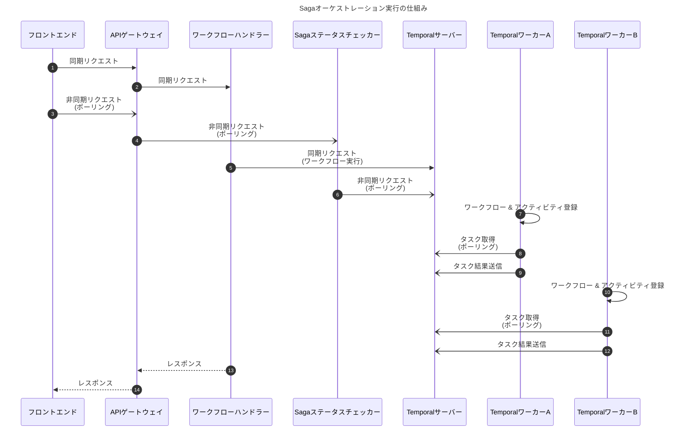

# Temporal＠ワークフロー

## はじめに

本サイトにつきまして、以下をご認識のほど宜しくお願いいたします。

> - https://hiroki-it.github.io/tech-notebook/

<br>

## 01. Temporalの仕組み

### アーキテクチャ

Temporalは、Temporalクライアント、Temporalサーバー、ステート用データベース、Temporalワーカー、からなる。


> - https://medium.com/safetycultureengineering/building-resilient-microservice-workflows-with-temporal-a-next-gen-workflow-engine-a9637a73572d
> - https://michaelangelo.io/blog/temporal-sqs#temporal-components
> - https://blog.lorensr.me/how-durable-execution-works-462c060f7cb7
> - https://temporal.io/blog/sergey-inversion-of-execution

<br>

### Temporalクライアント

Temporalクライアントは、Temporalサーバーをコールし、Temporalワーカーによって登録されたワークフローを実行する。

> - https://medium.com/safetycultureengineering/building-resilient-microservice-workflows-with-temporal-a-next-gen-workflow-engine-a9637a73572d
> - https://temporal.io/blog/sergey-inversion-of-execution

<br>

### Temporalサーバー

Temporalサーバーは、内臓するメッセージ仲介システムを操作してワークフローの現在のステートを管理し、またステートの履歴をデータベースに永続化する。

> - https://medium.com/safetycultureengineering/building-resilient-microservice-workflows-with-temporal-a-next-gen-workflow-engine-a9637a73572d
> - https://temporal.io/blog/sergey-inversion-of-execution

<br>

### ステート用データベース

#### ▼ ステート用データベース

ステート用データベースは、Sagaのステートの履歴を保管する。

Temporalサーバーで処理中に障害が起こった場合でも、ワークフローの途中から処理を実行できるようにする。

#### ▼ PostgreSQLの場合

主に、`temporal`データベースと`temporal_visibility`を使用する。

```bash
$ psql -U temporal -h temporal-postgresql -p 5432 -d temporal

# 現在はtemporalデータベース
# データベースの一覧
temporal=# \l

                                      List of databases
        Name         |  Owner   | Encoding |  Collate   |   Ctype    |   Access privileges
---------------------+----------+----------+------------+------------+-----------------------
 postgres            | temporal | UTF8     | en_US.utf8 | en_US.utf8 |
 template0           | temporal | UTF8     | en_US.utf8 | en_US.utf8 | =c/temporal          +
                     |          |          |            |            | temporal=CTc/temporal
 template1           | temporal | UTF8     | en_US.utf8 | en_US.utf8 | =c/temporal          +
                     |          |          |            |            | temporal=CTc/temporal
 temporal            | temporal | UTF8     | en_US.utf8 | en_US.utf8 |
 temporal_visibility | temporal | UTF8     | en_US.utf8 | en_US.utf8 |
```

`temporal`データベースには、例えば以下のテーブルがある。(SQLスキーマを参照)

- namespaces
- namespace_metadata
- shards
- executions
- current_executions
- buffered_events
- tasks
- ...

```bash
$ psql -U temporal -h temporal-postgresql -p 5432 -d temporal

# 現在のデータベースのテーブル一覧
temporal=# \dt
                   List of relations
 Schema |           Name            | Type  |  Owner
--------+---------------------------+-------+----------
 public | activity_info_maps        | table | temporal
 public | buffered_events           | table | temporal
 ...
```

> - https://github.com/temporalio/temporal/blob/main/schema/postgresql/v12/temporal/schema.sql
> - https://github.com/temporalio/temporal/blob/main/schema/mysql/v8/visibility/schema.sql

#### ▼ MySQLの場合

主に、`temporal`データベースと`temporal_visibility`を使用する。

> - https://github.com/temporalio/temporal/blob/main/schema/mysql/v8/temporal/schema.sql
> - https://github.com/temporalio/temporal/blob/main/schema/postgresql/v12/visibility/schema.sql

<br>

### Temporalワーカー

『制御の反転』という仕組みになっており、実際にワークフローやアクティビティを実行するのは、TemporalサーバーではなくTemporalワーカーである。

1. Temporalワーカーは、Temporalサーバーにワークフローやアクティビティを登録する。
2. Temporalワーカーは、Temporalサーバー内のメッセージ仲介システムにポーリングを実施し、ワークフローの現在のステートを取得する。
3. Temporalクライアントは、ワークフローを開始する。
4. Temporalワーカーは、ワークフロー内のアクティビティを実行し、結果をTemporalサーバーのメッセージ仲介システムに格納する。
5. Temporalワーカーは、ワークフローの現在のステートに応じて次のアクティビティを実行する。


> - https://learn.temporal.io/examples/go/background-checks/application-design/#what-does-the-component-topology-look-like
> - https://temporal.io/blog/sergey-inversion-of-execution

<br>

## 02. ユースケース

### Sagaオーケストレーターとして

#### ▼ Sagaオーケストレーターとして

TemporalをSagaパターンのオーケストレーターとして使用する。

なお、Temporalサーバー内にメッセージ仲介システムが内臓されている。

そのため、タイムアウト処理、再試行処理、キャンセル処理などの点でTemporalの外部にメッセージ仲介システム (例：AWS SQS) やメッセージブローカー (例：RebbitMQ) は不要である。


> - https://learn.temporal.io/tutorials/php/booking_saga/#review-the-saga-architecture-pattern
> - https://temporal.io/blog/saga-pattern-made-easy
> - https://github.com/efortuna/sagas-temporal-trip-booking/tree/main
> - https://community.temporal.io/t/springboot-microservices-managed-by-temporal-io-rabbitmq/1489/4
> - https://community.temporal.io/t/springboot-microservices-managed-by-temporal-io-rabbitmq/1489/6
> - https://spiral.dev/blog/temporal-workflow-and-microservices
> - https://github.com/guntenbein/temporal_microservices/tree/main/cmd

#### ▼ マネージドサービスよりも適切な理由

Temporalの大きな特徴は、次のとおりである。

- プログラミング言語でワークフローを定義できるため、複雑なビジネスロジックを実装できる
- コンテナとして動かせるため、アプリとインフラを責務分離できる。

一方で、マネージドサービスとしてはAWS Step Functionsがあり、次の点でデメリットがある。

- AWS SDKを使用しない限り、プログラミング言語でマネージドサービスを定義できないため、複雑なビジネスロジックを実装しにくい。
- アプリとインフラの責務分離できていないものが多く、アプリチームとインフラチームが分業しにくくなる原因になる。

マイクロサービスアーキテクチャのトランザクション管理の文脈でワークフローエンジンを使用したい場合、ワークフローエンジン自体がマイクロサービスである。

そのため、これを複雑なビジネスロジックを実装でき、また分業できることが望ましい。

なお、Temporalに類似したOSSとして、他にCadenceがある。

#### ▼ Temporalクライアント

Temporalクライアントは、Temporalサーバーのエンドポイントをコールするサーバーとして実装する。

```go
package main

import (
	"context"
	"encoding/json"
	"log"
	"net/http"

	"documentation-samples-go/yourapp"

	"go.temporal.io/sdk/client"
)

func main() {

	// Temporalサーバーに接続する
	temporalClient, err := client.Dial(client.Options{
		HostPort: client.DefaultHostPort,
	})

	if err != nil {
		log.Fatalln("Unable to create Temporal Client", err)
	}

	defer temporalClient.Close()

	// Temporalクライアントがワークフローを実行するエンドポイント
	http.HandleFunc("/start", func(w http.ResponseWriter, r *http.Request) {
		// ワークフローを実行するラッパー関数
		startWorkflowHandler(w, r, temporalClient)
	})

	// サーバーを起動する
	err = http.ListenAndServe(":8091", nil)

	if err != nil {
		log.Fatalln("Unable to run http server", err)
	}
}

func startWorkflowHandler(w http.ResponseWriter, r *http.Request, temporalClient client.Client) {

	workflowOptions := client.StartWorkflowOptions{
		ID:        "your-workflow-id",
		TaskQueue: "your-custom-task-queue-name",
	}

	workflowParams := yourapp.YourWorkflowParam{
		WorkflowParamX: "Hello World!",
		WorkflowParamY: 999,
	}

	// Temporalサーバーでワークフローを実行する
	workflowExecution, err := temporalClient.ExecuteWorkflow(
		context.Background(),
		workflowOptions,
		// ワークフローの定義
		yourapp.YourWorkflowDefinition,
		workflowParams,
	)

	if err != nil {
		log.Fatalln("Unable to execute the Workflow", err)
	}

	log.Println("Started Workflow!")

	log.Println("WorkflowID:", workflowExecution.GetID())

	log.Println("RunID:", workflowExecution.GetRunID())

	var result yourapp.YourWorkflowResultObject

	workflowExecution.Get(context.Background(), &result)

	if err != nil {
		log.Fatalln("Unable to get Workflow result:", err)
	}

	b, err := json.Marshal(result)

	if err != nil {
		log.Fatalln(err)
		return
	}

	log.Println(string(b))
}
```

> - https://github.com/temporalio/documentation/blob/main/sample-apps/go/yourapp/gateway/main.go
> - https://docs.temporal.io/develop/go/temporal-clients

#### ▼ Temporalサーバーとステート用データベース

制御が反転しているため、Temporalサーバーはユーザーが何かを実装する必要はない。

#### ▼ アクティビティ定義用のTemporalワーカー

アクティビティ定義用のTemporalワーカーは、ワークフロー定義を登録する。

また、実際にローカルトランザクションを実行する。

```go
package main

import (
	"log"

	"go.temporal.io/sdk/activity"
	"go.temporal.io/sdk/client"
	"go.temporal.io/sdk/worker"
	"go.temporal.io/sdk/workflow"

	"documentation-samples-go/yourapp"
)

func main() {


	temporalClient, err := client.Dial(client.Options{})

	if err != nil {
		log.Fatalln("Unable to create client", err)
	}

	defer temporalClient.Close()

	yourWorker := worker.New(temporalClient, "your-custom-task-queue-name", worker.Options{})

	yourWorker.RegisterWorkflow(yourapp.YourWorkflowDefinition)

	registerWFOptions := workflow.RegisterOptions{
		Name: "JustAnotherWorkflow",
	}

	yourWorker.RegisterWorkflowWithOptions(yourapp.YourSimpleWorkflowDefinition, registerWFOptions)

	message := "This could be a connection string or endpoint details"

	number := 100

	activities := &yourapp.YourActivityObject{
		Message: &message,
		Number:  &number,
	}

	yourWorker.RegisterActivity(activities)

	registerAOptions := activity.RegisterOptions{
		Name: "JustAnotherActivity",
	}

	yourWorker.RegisterActivityWithOptions(yourapp.YourSimpleActivityDefinition, registerAOptions)

	err = yourWorker.Run(worker.InterruptCh())

	if err != nil {
		log.Fatalln("Unable to start Worker", err)
	}
}
```

> - https://github.com/temporalio/documentation/blob/main/sample-apps/go/yourapp/worker/main_dacx.go

```go
package activity

import (
	"context"

	"go.temporal.io/sdk/activity"
)

// パラメーター
type YourActivityParam struct {
	ActivityParamX string
	ActivityParamY int
}


type YourActivityObject struct {
	Message *string
	Number  *int
}

// アクティビティ
func (a *YourActivityObject) PrintInfo(ctx context.Context, param YourActivityParam) error {
	logger := activity.GetLogger(ctx)

	logger.Info("The message is:", param.ActivityParamX)

	logger.Info("The number is:", param.ActivityParamY)

	return nil
}

// アクティビティ
func (a *YourActivityObject) GetInfo(ctx context.Context) (*YourActivityResultObject, error) {

	return &YourActivityResultObject{
		ResultFieldX: *a.Message,
		ResultFieldY: *a.Number,
	}, nil
}
```

> - https://github.com/temporalio/documentation/blob/main/sample-apps/go/yourapp/your_activity_definition_dacx.go

#### ▼ ワークフロー定義用のTemporalワーカー

ワークフロー定義用のTemporalワーカーは、ワークフロー定義を登録する。

```go
package workflow

import (
	"time"

	"go.temporal.io/sdk/workflow"
)

func YourWorkflowDefinition(ctx workflow.Context, param YourWorkflowParam) (*YourWorkflowResultObject, error) {

	activityOptions := workflow.ActivityOptions{
		StartToCloseTimeout: 10 * time.Second,
	}

	ctx = workflow.WithActivityOptions(ctx, activityOptions)

	// ワークフローのパラメーターを定義する
	activityParam := YourActivityParam{
		ActivityParamX: param.WorkflowParamX,
		ActivityParamY: param.WorkflowParamY,
	}

	var a *YourActivityObject

	var activityResult YourActivityResultObject

	// (1)
	// ワークフローのステップを実行する
	// パラメーターの入力
	err := workflow.ExecuteActivity(ctx, a.YourActivityDefinition, activityParam).Get(ctx, &activityResult)

	if err != nil {
		return nil, err
	}

	var infoResult *YourActivityResultObject

	// (2)
	// ワークフローのステップを実行する
	// GetInfoアクティビティ
	err = workflow.ExecuteActivity(ctx, a.GetInfo).Get(ctx, &infoResult)

	if err != nil {
		return nil, err
	}

	infoParam := YourActivityParam{
		ActivityParamX: infoResult.ResultFieldX,
		ActivityParamY: infoResult.ResultFieldY,
	}

	// (3)
	// ワークフローのステップを実行する
	// PrintInfoアクティビティ
	err = workflow.ExecuteActivity(ctx, a.PrintInfo, infoParam).Get(ctx, nil)

	if err != nil {
		return nil, err
	}

	workflowResult := &YourWorkflowResultObject{
		WFResultFieldX: activityResult.ResultFieldX,
		WFResultFieldY: activityResult.ResultFieldY,
	}

	// ワークフロー全体の処理結果を返却する
	return workflowResult, nil
}
```

> - https://github.com/temporalio/documentation/blob/main/sample-apps/go/yourapp/your_workflow_definition_dacx.go

<br>

### 補償トランザクション

ローカルトランザクションで失敗した場合は、まずそのマイクロサービスが自身のトランザクションをロールバックする。

その後、それまでにコールされた`defer`関数を実行し補償トランザクションを実行する。

```go
package saga

import (
	"time"

	"go.uber.org/multierr"

	"go.temporal.io/sdk/temporal"
	"go.temporal.io/sdk/workflow"
)

func TransferMoney(ctx workflow.Context, transferDetails TransferDetails) (err error) {
	retryPolicy := &temporal.RetryPolicy{
		InitialInterval:    time.Second,
		BackoffCoefficient: 2.0,
		MaximumInterval:    time.Minute,
		MaximumAttempts:    3,
	}

	options := workflow.ActivityOptions{
		StartToCloseTimeout: time.Minute,
		RetryPolicy:         retryPolicy,
	}

	ctx = workflow.WithActivityOptions(ctx, options)

	err = workflow.ExecuteActivity(ctx, Withdraw, transferDetails).Get(ctx, nil)
	if err != nil {
		return err
	}

	// 補償トランザクション
	defer func() {
		if err != nil {
			errCompensation := workflow.ExecuteActivity(ctx, WithdrawCompensation, transferDetails).Get(ctx, nil)
			err = multierr.Append(err, errCompensation)
		}
	}()

	// ローカルトランザクション
	// 失敗した場合、まずは自身のトランザクションをロールバックする
	// その後、前のdefer関数を実行し、前のローカルトランザクションを元に戻す補償トランザクションを実行する
	err = workflow.ExecuteActivity(ctx, Deposit, transferDetails).Get(ctx, nil)
	if err != nil {
		return err
	}

	// 補償トランザクション
	defer func() {
		if err != nil {
			errCompensation := workflow.ExecuteActivity(ctx, DepositCompensation, transferDetails).Get(ctx, nil)
			err = multierr.Append(err, errCompensation)
		}

		// uncomment to have time to shut down worker to simulate worker rolling update and ensure that compensation sequence preserves after restart
		// workflow.Sleep(ctx, 10*time.Second)
	}()

	// ローカルトランザクション
	// 失敗した場合、まずは自身のトランザクションをロールバックする
	// その後、前のdefer関数を実行し、前のローカルトランザクションを元に戻す補償トランザクションを実行する
	err = workflow.ExecuteActivity(ctx, StepWithError, transferDetails).Get(ctx, nil)
	if err != nil {
		return err
	}

	return nil
}
```

> - https://github.com/temporalio/samples-go/blob/main/saga/workflow.go

<br>

### 仕組み

記入中...



> - https://temporal.io/blog/workflow-engine-principles
> - https://keithtenzer.com/temporal/Temporal_Fundamentals_Basics/#application-worker
> - https://keithtenzer.com/temporal/Temporal_Fundamentals_Basics/#workflow-starter
> - https://github.com/Azure-Samples/saga-orchestration-serverless/blob/main/docs/architecture/workflows.md
> - https://github.com/Azure-Samples/saga-orchestration-serverless/blob/main/docs/architecture/additional-patterns.md

<br>

## 03. 実装

### GetWorkflow

Temporalワーカー (アクティビティを持つマイクロサービス) は、実際にローカルトランザクションを実行するマイクロサービスに相当する。

```go
package main

import (
	"context"
	"encoding/json"
	"log"
	"net/http"

	"documentation-samples-go/yourapp"

	"go.temporal.io/sdk/client"
)

func main() {

	// Temporalサーバーに接続する
	temporalClient, err := client.Dial(client.Options{
		HostPort: client.DefaultHostPort,
	})

	workflowRun := temporalClient.GetWorkflow(context.Background, "<ワークフローのID>")

	var result workflowResponse

	// ワークフローの結果を取得する
	err = workflowRun.Get(context.Background(), &result)

	if err != nil {
		...
	}
}
```

> - https://docs.temporal.io/develop/go/temporal-clients#get-workflow-results
