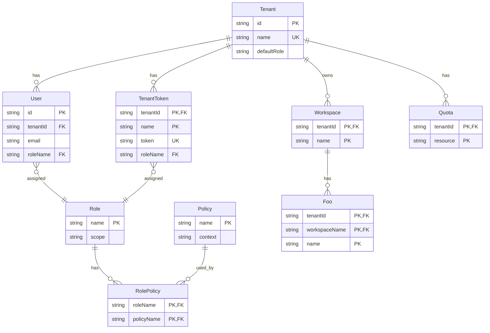

# ER図＠RDB

## マルチテナントの場合

マルチテナントでは、Tenantモデルをデータ分離の境界として扱う。

UserモデルやWorkspaceモデルなどのテナント配下のテーブルは `tenantId` を持つ。

これにより、認可後のRead処理をTenant単位で絞り込める。

Workspaceモデル配下のデータも `tenantId` を含むキーで親子関係を表す。

RoleモデルとPolicyモデルはUserモデルやTenantTokenモデルに紐づけ、画面操作やAPI操作の権限を表現する。

| モデル | 役割 |
| --- | --- |
| `Tenant` | マルチテナントにおけるデータ分離の単位 |
| `User` | Tenantに所属する利用者。Roleを通じて操作権限を持つ |
| `TenantToken` | Tenantに紐づくAPIアクセス用のトークン。Userと同様にRoleを持つ |
| `Role` | UserやTenantTokenに割り当てる権限のまとまり |
| `Policy` | 画面やAPIに対する操作可否を表すルール |
| `RolePolicy` | RoleとPolicyを多対多で紐づける中間モデル |
| `Workspace` | Tenant配下で業務データをまとめる作業領域 |
| `Quota` | Tenantごとの利用上限 |
| `Foo` | Workspace配下に作成される業務データの例 |

 
