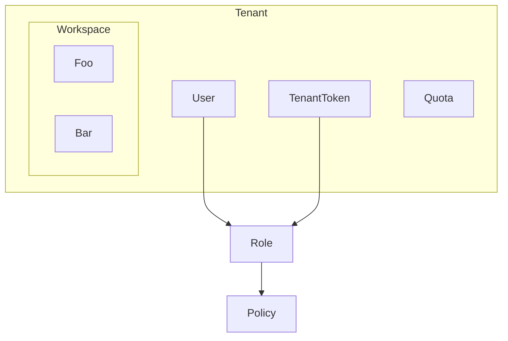
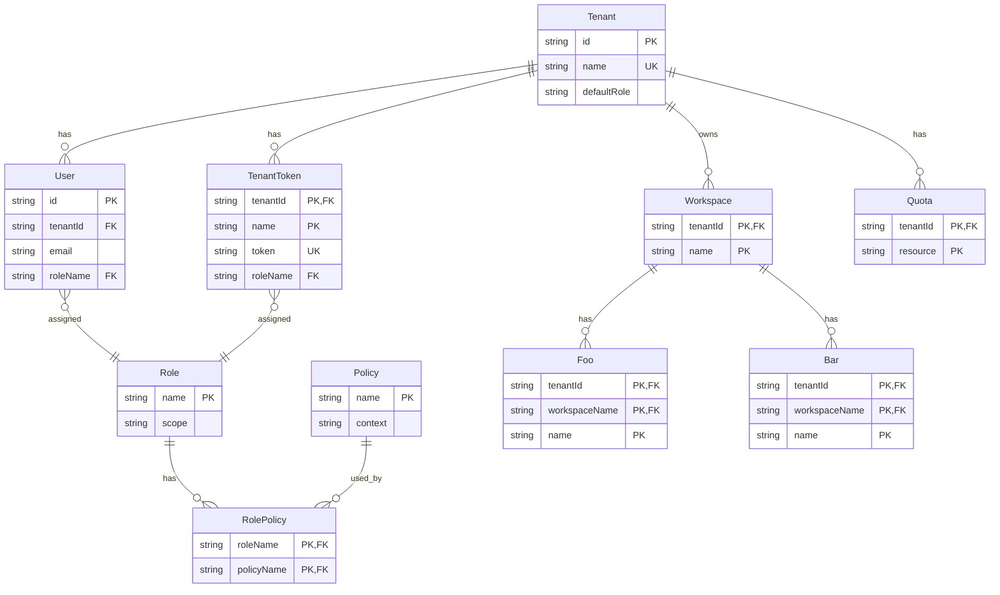

# ER図＠RDB

## マルチテナントの場合

マルチテナントでは、`Tenant` モデルをデータ分離の境界として扱う。

`Tenant` モデルを境界として見ると、`Workspace` モデルや `Foo` モデル、`Bar` モデルは `Tenant` モデルの内側にある。

`User` モデルや `Workspace` モデルなどのテナント配下のテーブルは `tenantId` を持つ。

これにより、認可後の Read 処理を `Tenant` 単位で絞り込める。

`Workspace` モデル配下のデータも `tenantId` を含むキーで親子関係を表す。

`Role` モデルと `Policy` モデルは `User` モデルや `TenantToken` モデルに紐づけ、画面操作や API 操作の権限を表現する。

`RolePolicy` のような中間モデルを用意すると、モデル間を多対多で紐付けられる。

| モデル        | 役割                                                                   |
| ------------- | ---------------------------------------------------------------------- |
| `Tenant`      | マルチテナントにおけるデータ分離の単位                                 |
| `User`        | `Tenant` に所属する利用者。`Role` を通じて操作権限を持つ               |
| `TenantToken` | `Tenant` に紐づくAPIアクセス用のトークン。`User` と同様に `Role` を持つ |
| `Role`        | `User` や `TenantToken` に割り当てる権限のまとまり                      |
| `Policy`      | 画面やAPIに対する操作可否を表すルール                                  |
| `RolePolicy`  | `Role` と `Policy` を多対多で紐づける中間モデル                         |
| `Workspace`   | `Tenant` 配下で業務データをまとめる作業領域                            |
| `Quota`       | `Tenant` ごとの利用上限                                                |
| `Foo`         | `Workspace` 配下に作成される業務データの例1                            |
| `Bar`         | `Workspace` 配下に作成される業務データの例2                            |

 
