# ER 図＠RDB

## データモデルパターン

### 汎用的なパターン

#### ▼ Things, Thing Types, and Categories

モノと、モノの種類と、種類を「車体の形」「動力」などの複数の分類体系で分類する分類を、それぞれ別のテーブルで表す。

「Type and Instance」と「Relationships」を組み合わせたパターンである。

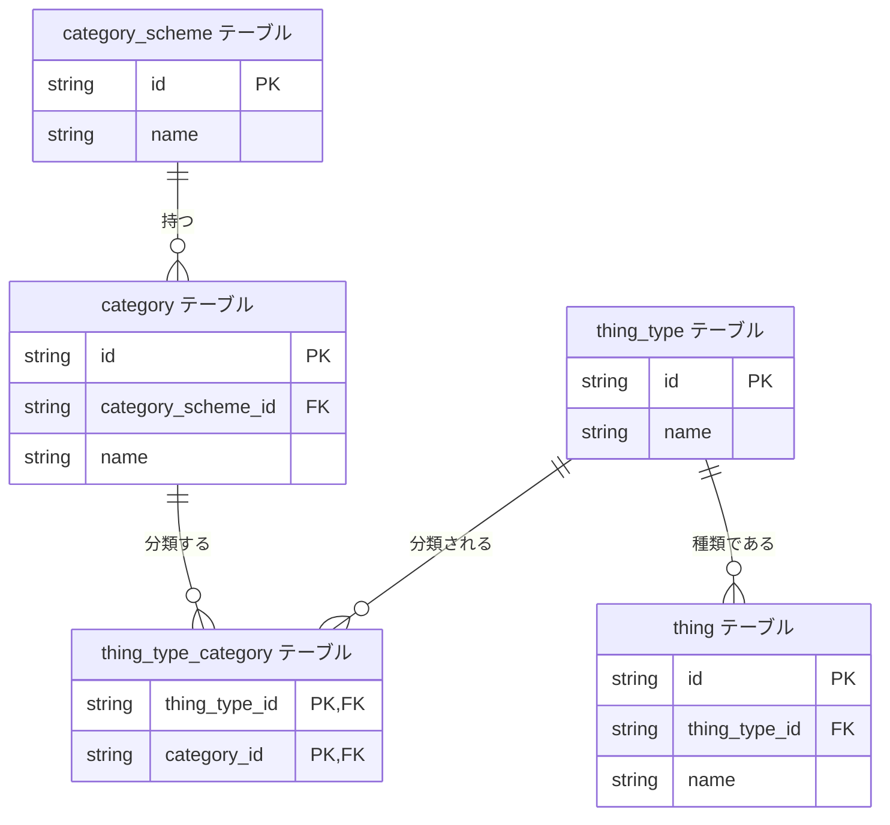
```mermaid
erDiagram
  category_scheme["category_scheme テーブル"] {
    string id PK
    string name
  }

  category["category テーブル"] {
    string id PK
    string category_scheme_id FK
    string name
  }

  thing_type["thing_type テーブル"] {
    string id PK
    string name
  }

  thing_type_category["thing_type_category テーブル"] {
    string thing_type_id PK,FK
    string category_id PK,FK
  }

  thing["thing テーブル"] {
    string id PK
    string thing_type_id FK
    string name
  }

  category_scheme ||--o{ category : "持つ"
  category ||--o{ thing_type_category : "分類する"
  thing_type ||--o{ thing_type_category : "分類される"
  thing_type ||--o{ thing : "種類である"
```

#### ▼ Type and Instance

種類（型）と実際の個々のモノ（実体）を、種類に共通する情報を記録する種類テーブルと、個々のモノを記録する実体テーブルで表す。

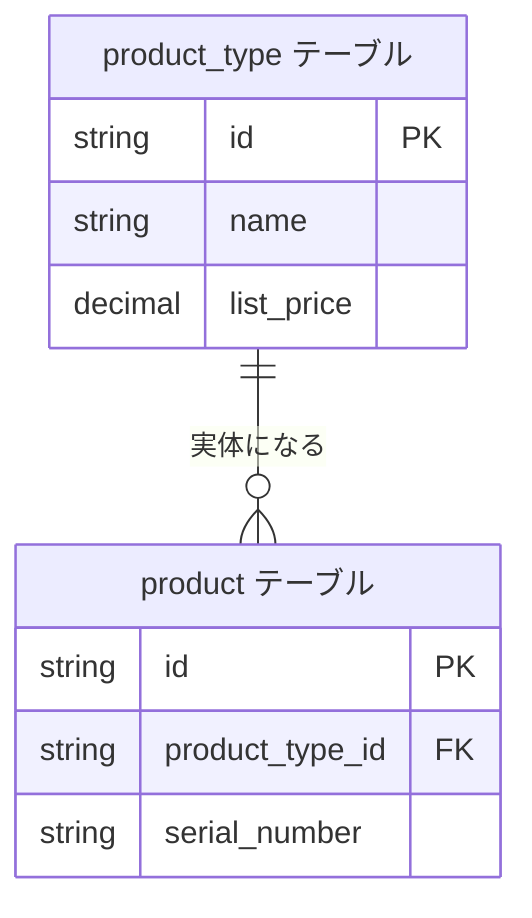
```mermaid
erDiagram
  product_type["product_type テーブル"] {
    string id PK
    string name
    decimal list_price
  }

  product["product テーブル"] {
    string id PK
    string product_type_id FK
    string serial_number
  }

  product_type ||--o{ product : "実体になる"
```

#### ▼ Structure

同じテーブルの行同士の親子関係（部品表や階層）を、親と子の組を記録する中間テーブルで表す。

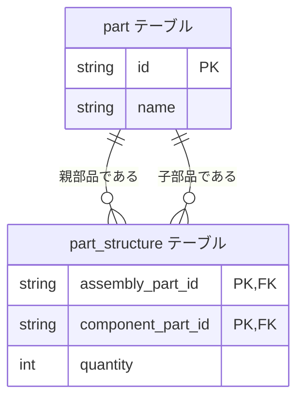
```mermaid
erDiagram
  part["part テーブル"] {
    string id PK
    string name
  }

  part_structure["part_structure テーブル"] {
    string assembly_part_id PK,FK
    string component_part_id PK,FK
    int quantity
  }

  part ||--o{ part_structure : "親部品である"
  part ||--o{ part_structure : "子部品である"
```

#### ▼ Heterogeneous Entities

種類ごとに項目が異なるデータを、共通の項目を記録する親テーブルと、種類ごとの項目を記録する子テーブルで表す。

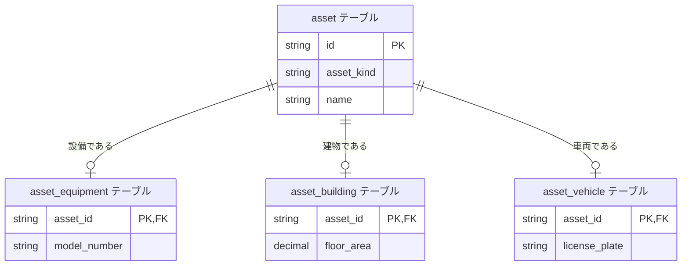
```mermaid
erDiagram
  asset["asset テーブル"] {
    string id PK
    string asset_kind
    string name
  }

  asset_equipment["asset_equipment テーブル"] {
    string asset_id PK,FK
    string model_number
  }

  asset_building["asset_building テーブル"] {
    string asset_id PK,FK
    decimal floor_area
  }

  asset_vehicle["asset_vehicle テーブル"] {
    string asset_id PK,FK
    string license_plate
  }

  asset ||--o| asset_equipment : "設備である"
  asset ||--o| asset_building : "建物である"
  asset ||--o| asset_vehicle : "車両である"
```

#### ▼ Roles

誰が何にどの立場で関わるかを、当事者とモノと役割の種類をつなぐ役割テーブルで表す。

「Type and Instance」を応用したパターンである。

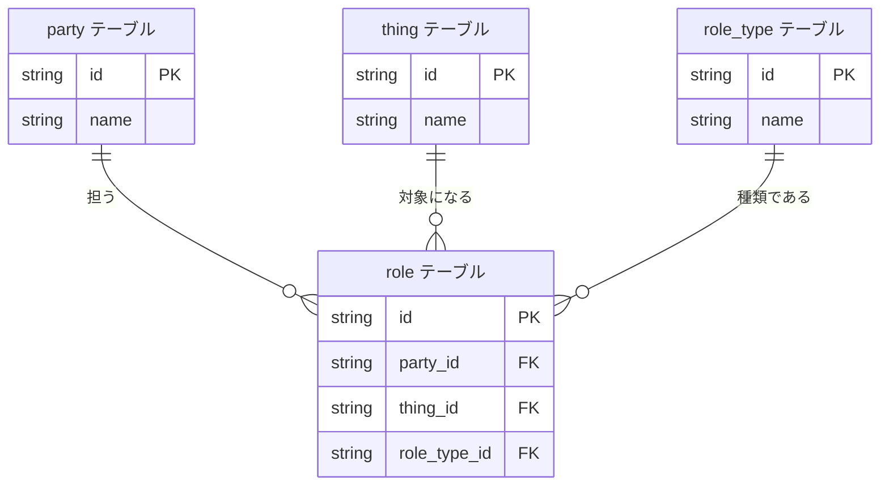
```mermaid
erDiagram
  party["party テーブル"] {
    string id PK
    string name
  }

  thing["thing テーブル"] {
    string id PK
    string name
  }

  role_type["role_type テーブル"] {
    string id PK
    string name
  }

  role["role テーブル"] {
    string id PK
    string party_id FK
    string thing_id FK
    string role_type_id FK
  }

  party ||--o{ role : "担う"
  thing ||--o{ role : "対象になる"
  role_type ||--o{ role : "種類である"
```

#### ▼ Addresses

持ち主と住所を、別々のテーブルと、「自宅」「請求先」などの住所の使い道を記録する中間テーブルで表す。

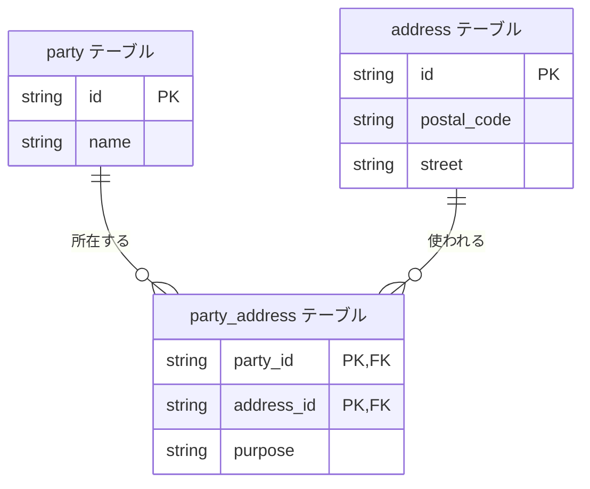
```mermaid
erDiagram
  party["party テーブル"] {
    string id PK
    string name
  }

  address["address テーブル"] {
    string id PK
    string postal_code
    string street
  }

  party_address["party_address テーブル"] {
    string party_id PK,FK
    string address_id PK,FK
    string purpose
  }

  party ||--o{ party_address : "所在する"
  address ||--o{ party_address : "使われる"
```

#### ▼ Resources

人や資産などの資源を、共通の親テーブルと、どの活動でどの資源をどれだけ使ったかを記録する使用実績テーブルで表す。

「Heterogeneous Entities」を応用したパターンである。

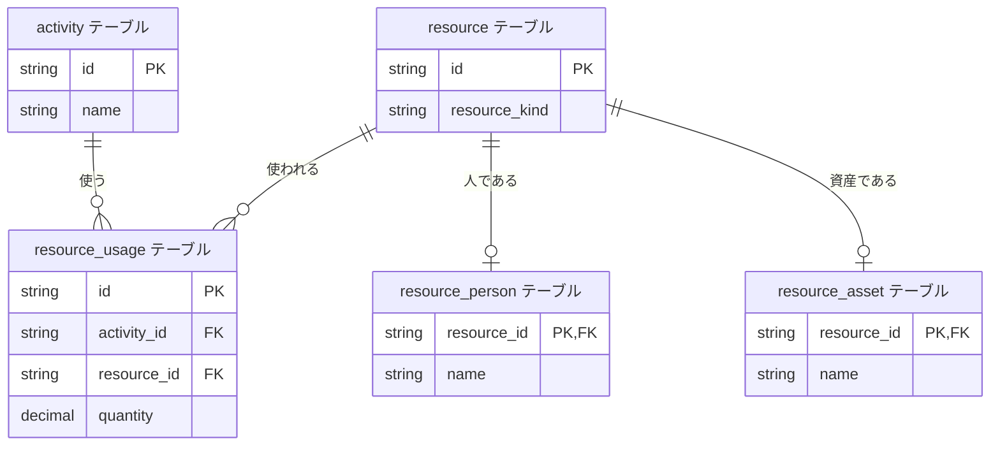
```mermaid
erDiagram
  activity["activity テーブル"] {
    string id PK
    string name
  }

  resource["resource テーブル"] {
    string id PK
    string resource_kind
  }

  resource_person["resource_person テーブル"] {
    string resource_id PK,FK
    string name
  }

  resource_asset["resource_asset テーブル"] {
    string resource_id PK,FK
    string name
  }

  resource_usage["resource_usage テーブル"] {
    string id PK
    string activity_id FK
    string resource_id FK
    decimal quantity
  }

  activity ||--o{ resource_usage : "使う"
  resource ||--o{ resource_usage : "使われる"
  resource ||--o| resource_person : "人である"
  resource ||--o| resource_asset : "資産である"
```

#### ▼ Relationships

モノ同士のつながりを、つながりの元と先と種類を記録するテーブルで表す。

「Type and Instance」を応用したパターンである。

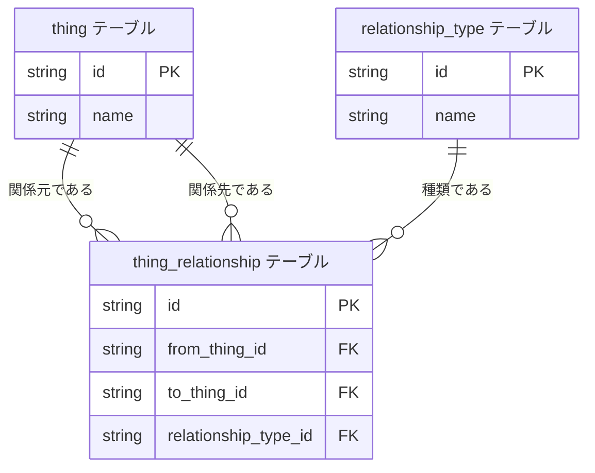
```mermaid
erDiagram
  thing["thing テーブル"] {
    string id PK
    string name
  }

  relationship_type["relationship_type テーブル"] {
    string id PK
    string name
  }

  thing_relationship["thing_relationship テーブル"] {
    string id PK
    string from_thing_id FK
    string to_thing_id FK
    string relationship_type_id FK
  }

  thing ||--o{ thing_relationship : "関係元である"
  thing ||--o{ thing_relationship : "関係先である"
  relationship_type ||--o{ thing_relationship : "種類である"
```

#### ▼ Variable Length Records

項目の数や種類が決まっていないデータを、列ではなく、項目の定義と値をそれぞれ1行ずつ記録するテーブルで表す。

「Type and Instance」を応用したパターンである。

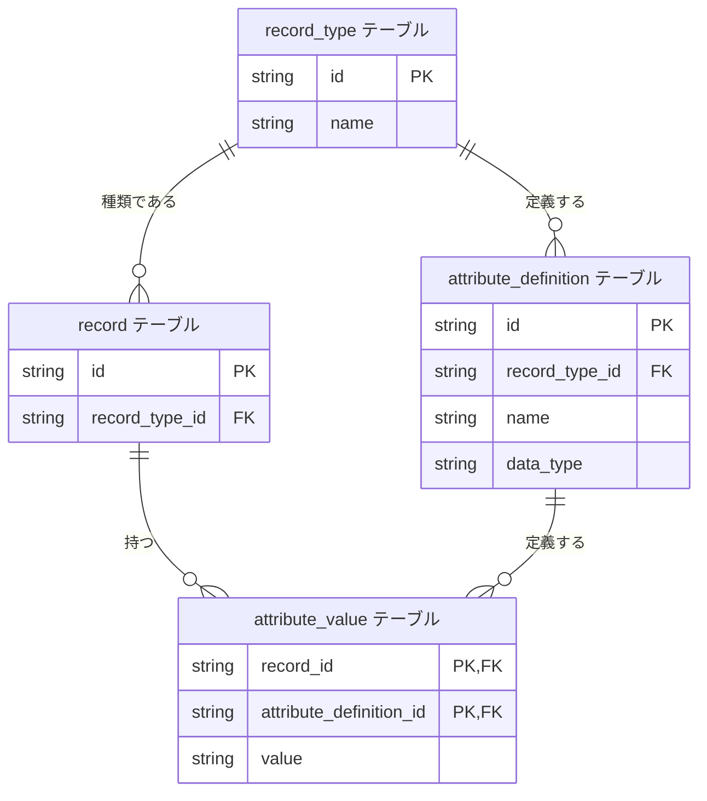
```mermaid
erDiagram
  record_type["record_type テーブル"] {
    string id PK
    string name
  }

  attribute_definition["attribute_definition テーブル"] {
    string id PK
    string record_type_id FK
    string name
    string data_type
  }

  record["record テーブル"] {
    string id PK
    string record_type_id FK
  }

  attribute_value["attribute_value テーブル"] {
    string record_id PK,FK
    string attribute_definition_id PK,FK
    string value
  }

  record_type ||--o{ attribute_definition : "定義する"
  record_type ||--o{ record : "種類である"
  record ||--o{ attribute_value : "持つ"
  attribute_definition ||--o{ attribute_value : "定義する"
```

#### ▼ Usually One, Sometimes Many

普通は1つだがまれに複数になるつながり（例：勤務先）を、主となるものを示すフラグの列を持つ中間テーブルで表す。

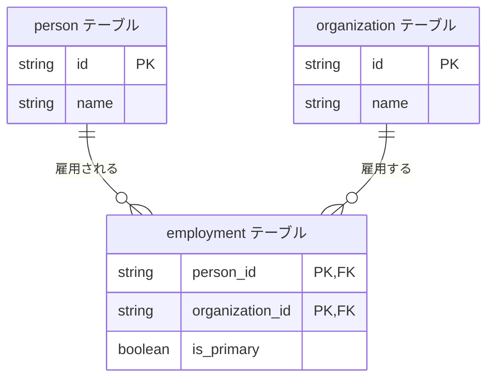
```mermaid
erDiagram
  person["person テーブル"] {
    string id PK
    string name
  }

  organization["organization テーブル"] {
    string id PK
    string name
  }

  employment["employment テーブル"] {
    string person_id PK,FK
    string organization_id PK,FK
    boolean is_primary
  }

  person ||--o{ employment : "雇用される"
  organization ||--o{ employment : "雇用する"
```

#### ▼ Mathematical Expressions in the Data Model

変数を計算する式を、演算子と順序を持つ項を1行ずつ記録するテーブルで表す。

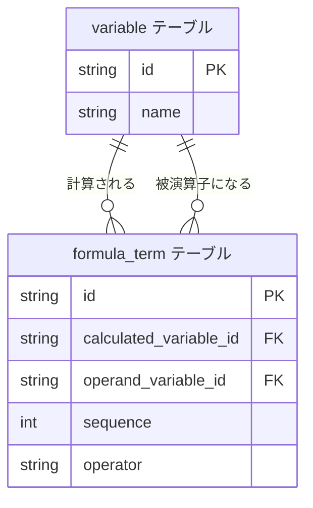
```mermaid
erDiagram
  variable["variable テーブル"] {
    string id PK
    string name
  }

  formula_term["formula_term テーブル"] {
    string id PK
    string calculated_variable_id FK
    string operand_variable_id FK
    int sequence
    string operator
  }

  variable ||--o{ formula_term : "計算される"
  variable ||--o{ formula_term : "被演算子になる"
```

#### ▼ The Universal Data Model

あらゆるモノを、種類・項目・つながりのテーブルの組み合わせだけで表す。

「Things, Thing Types, and Categories」と「Variable Length Records」と「Relationships」を組み合わせたパターンである。

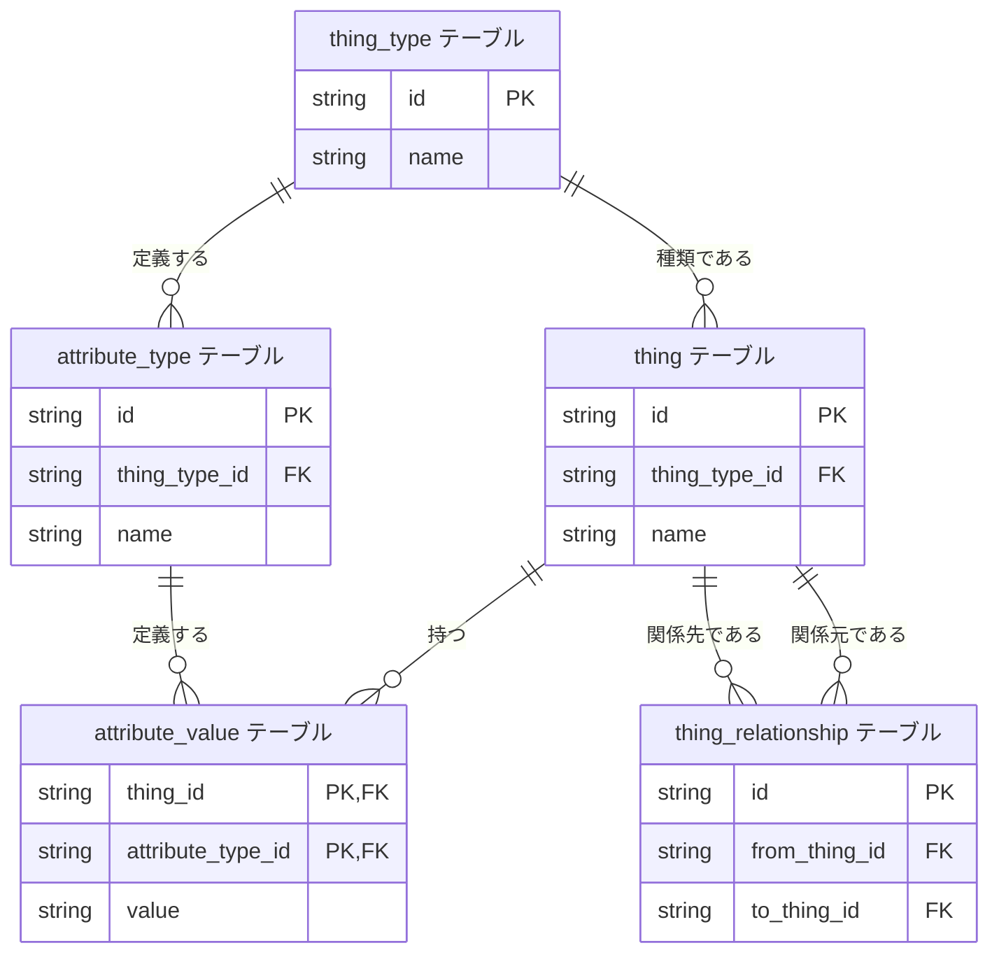
```mermaid
erDiagram
  thing_type["thing_type テーブル"] {
    string id PK
    string name
  }

  thing["thing テーブル"] {
    string id PK
    string thing_type_id FK
    string name
  }

  attribute_type["attribute_type テーブル"] {
    string id PK
    string thing_type_id FK
    string name
  }

  attribute_value["attribute_value テーブル"] {
    string thing_id PK,FK
    string attribute_type_id PK,FK
    string value
  }

  thing_relationship["thing_relationship テーブル"] {
    string id PK
    string from_thing_id FK
    string to_thing_id FK
  }

  thing_type ||--o{ thing : "種類である"
  thing_type ||--o{ attribute_type : "定義する"
  thing ||--o{ attribute_value : "持つ"
  attribute_type ||--o{ attribute_value : "定義する"
  thing ||--o{ thing_relationship : "関係元である"
  thing ||--o{ thing_relationship : "関係先である"
```

 

### ドメイン領域に特化したパターン

#### ▼ Parties

人と組織を、契約や住所などの相手として同じ形で紐づけられる「当事者（Party）」という共通の親テーブルで表す。

「Heterogeneous Entities」を応用したパターンである。

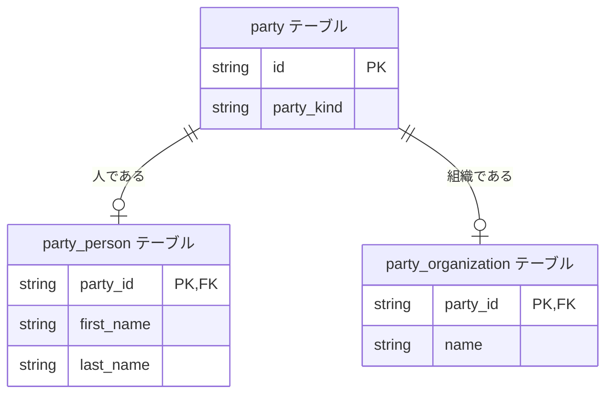
```mermaid
erDiagram
  party["party テーブル"] {
    string id PK
    string party_kind
  }

  party_person["party_person テーブル"] {
    string party_id PK,FK
    string first_name
    string last_name
  }

  party_organization["party_organization テーブル"] {
    string party_id PK,FK
    string name
  }

  party ||--o| party_person : "人である"
  party ||--o| party_organization : "組織である"
```

#### ▼ Employee Assignments

組織の職位と人を、別々のテーブルと、誰がどの職位にいつからいつまで就いていたかを記録する配属テーブルで表す。

「Relationships」を応用したパターンである。

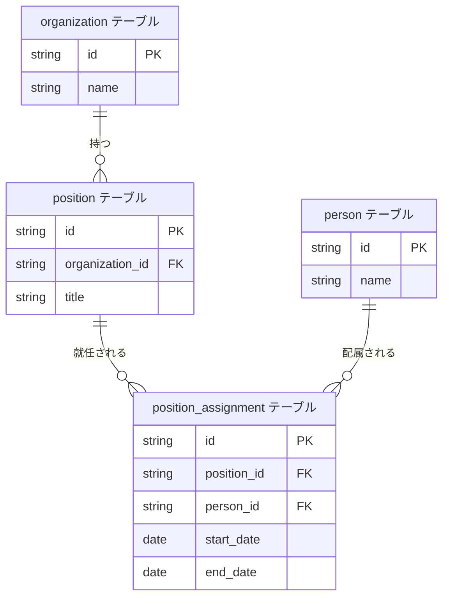
```mermaid
erDiagram
  organization["organization テーブル"] {
    string id PK
    string name
  }

  position["position テーブル"] {
    string id PK
    string organization_id FK
    string title
  }

  person["person テーブル"] {
    string id PK
    string name
  }

  position_assignment["position_assignment テーブル"] {
    string id PK
    string position_id FK
    string person_id FK
    date start_date
    date end_date
  }

  organization ||--o{ position : "持つ"
  position ||--o{ position_assignment : "就任される"
  person ||--o{ position_assignment : "配属される"
```

#### ▼ Reporting Relationships

上司と部下などの報告関係を、上位と下位の当事者と関係の種類を記録するテーブルで表す。

「Relationships」を応用したパターンである。

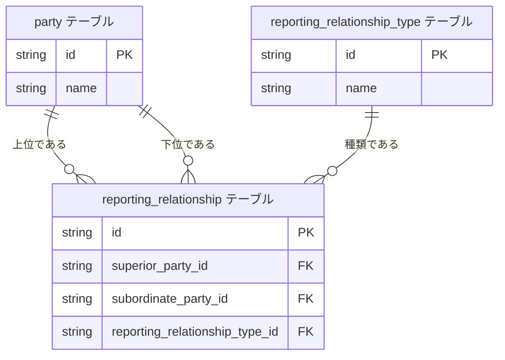
```mermaid
erDiagram
  party["party テーブル"] {
    string id PK
    string name
  }

  reporting_relationship_type["reporting_relationship_type テーブル"] {
    string id PK
    string name
  }

  reporting_relationship["reporting_relationship テーブル"] {
    string id PK
    string superior_party_id FK
    string subordinate_party_id FK
    string reporting_relationship_type_id FK
  }

  party ||--o{ reporting_relationship : "上位である"
  party ||--o{ reporting_relationship : "下位である"
  reporting_relationship_type ||--o{ reporting_relationship : "種類である"
```

#### ▼ Geographic Locations

国や都市などの地域の階層を、親の地域を指す列を持つ地域テーブルと、いずれかの地域に属する拠点テーブルで表す。

「Structure」を応用したパターンである。

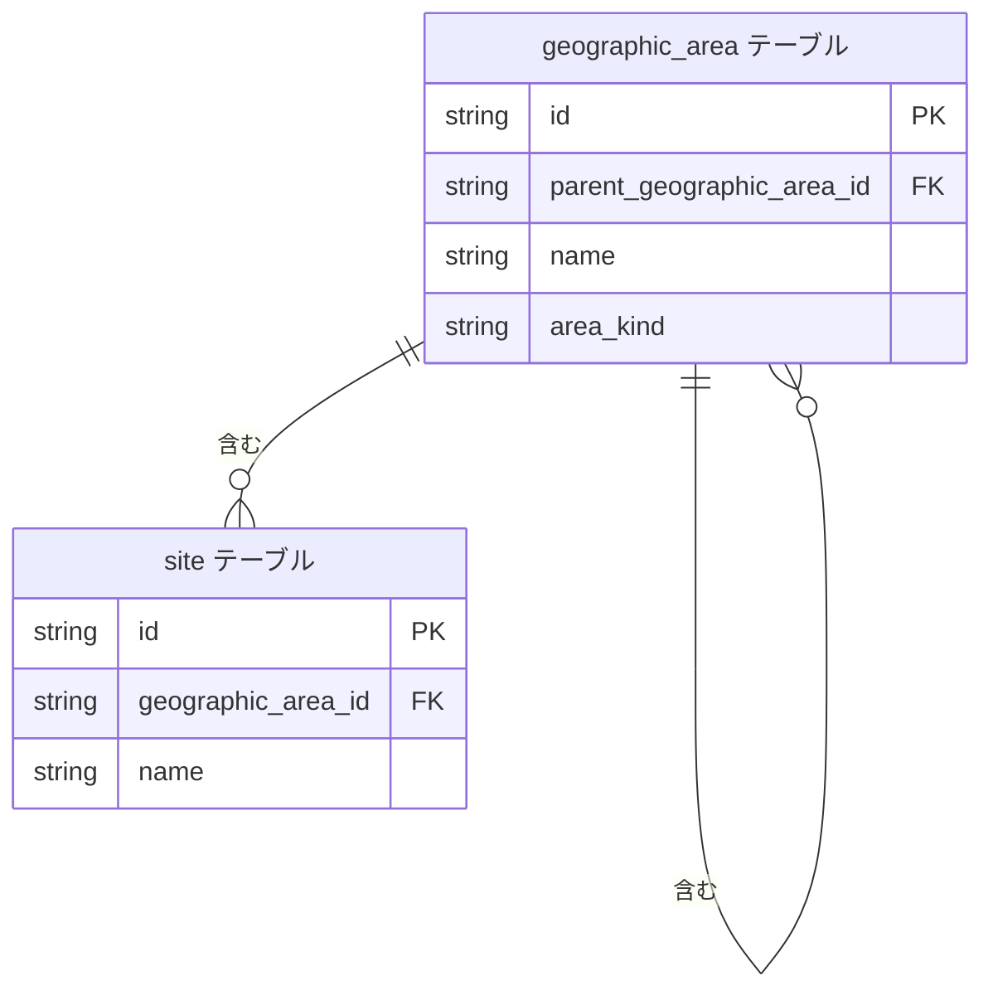
```mermaid
erDiagram
  geographic_area["geographic_area テーブル"] {
    string id PK
    string parent_geographic_area_id FK
    string name
    string area_kind
  }

  site["site テーブル"] {
    string id PK
    string geographic_area_id FK
    string name
  }

  geographic_area ||--o{ geographic_area : "含む"
  geographic_area ||--o{ site : "含む"
```

#### ▼ Products and Product Types

製品の種類と個々の製品を、別々のテーブルと、製品の種類同士の構成（どの部品が何個必要か）を記録するテーブルで表す。

「Type and Instance」と「Structure」を組み合わせたパターンである。

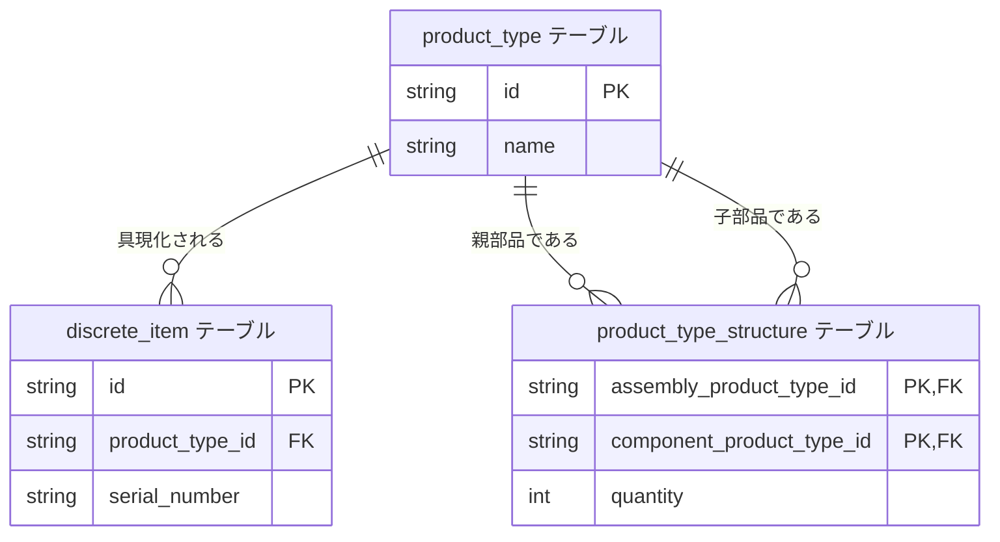
```mermaid
erDiagram
  product_type["product_type テーブル"] {
    string id PK
    string name
  }

  discrete_item["discrete_item テーブル"] {
    string id PK
    string product_type_id FK
    string serial_number
  }

  product_type_structure["product_type_structure テーブル"] {
    string assembly_product_type_id PK,FK
    string component_product_type_id PK,FK
    int quantity
  }

  product_type ||--o{ discrete_item : "具現化される"
  product_type ||--o{ product_type_structure : "親部品である"
  product_type ||--o{ product_type_structure : "子部品である"
```

#### ▼ Inventory

どの製品の種類がどの拠点にいくつあるかを、在庫テーブルで表す。

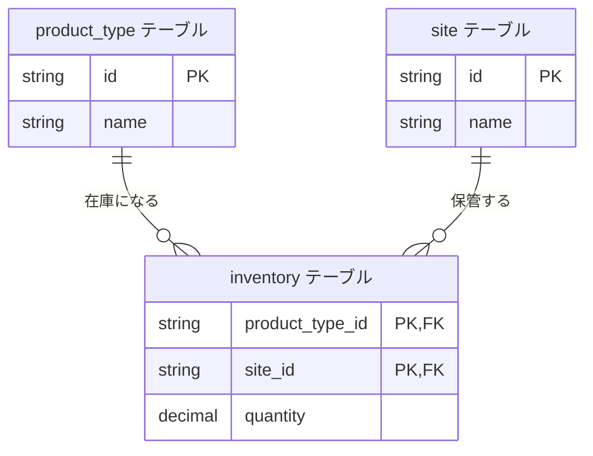
```mermaid
erDiagram
  product_type["product_type テーブル"] {
    string id PK
    string name
  }

  site["site テーブル"] {
    string id PK
    string name
  }

  inventory["inventory テーブル"] {
    string product_type_id PK,FK
    string site_id PK,FK
    decimal quantity
  }

  product_type ||--o{ inventory : "在庫になる"
  site ||--o{ inventory : "保管する"
```

#### ▼ Work Orders

作業指示を、複数の作業のテーブルと、作業ごとに誰が何時間働き、どの資産を何時間使ったかを記録するテーブルで表す。

「Resources」を応用したパターンである。

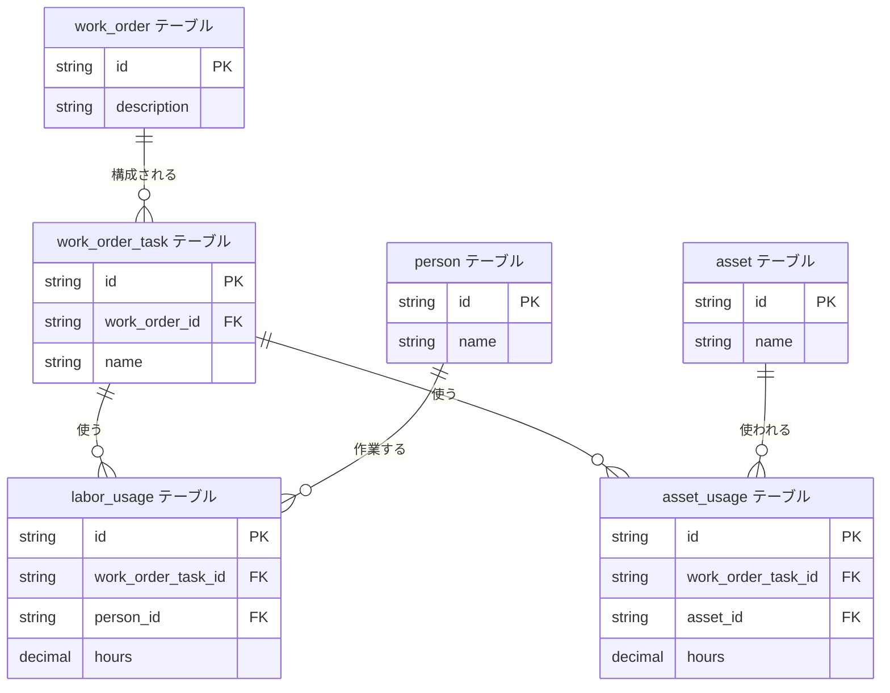
```mermaid
erDiagram
  work_order["work_order テーブル"] {
    string id PK
    string description
  }

  work_order_task["work_order_task テーブル"] {
    string id PK
    string work_order_id FK
    string name
  }

  person["person テーブル"] {
    string id PK
    string name
  }

  labor_usage["labor_usage テーブル"] {
    string id PK
    string work_order_task_id FK
    string person_id FK
    decimal hours
  }

  asset["asset テーブル"] {
    string id PK
    string name
  }

  asset_usage["asset_usage テーブル"] {
    string id PK
    string work_order_task_id FK
    string asset_id FK
    decimal hours
  }

  work_order ||--o{ work_order_task : "構成される"
  work_order_task ||--o{ labor_usage : "使う"
  person ||--o{ labor_usage : "作業する"
  work_order_task ||--o{ asset_usage : "使う"
  asset ||--o{ asset_usage : "使われる"
```

#### ▼ Purchase Orders and Sales Orders

発注と受注を、買い手と売り手を記録する注文テーブルと、製品ごとの数量と単価を記録する明細テーブルで表す。

「Parties」を応用したパターンである。

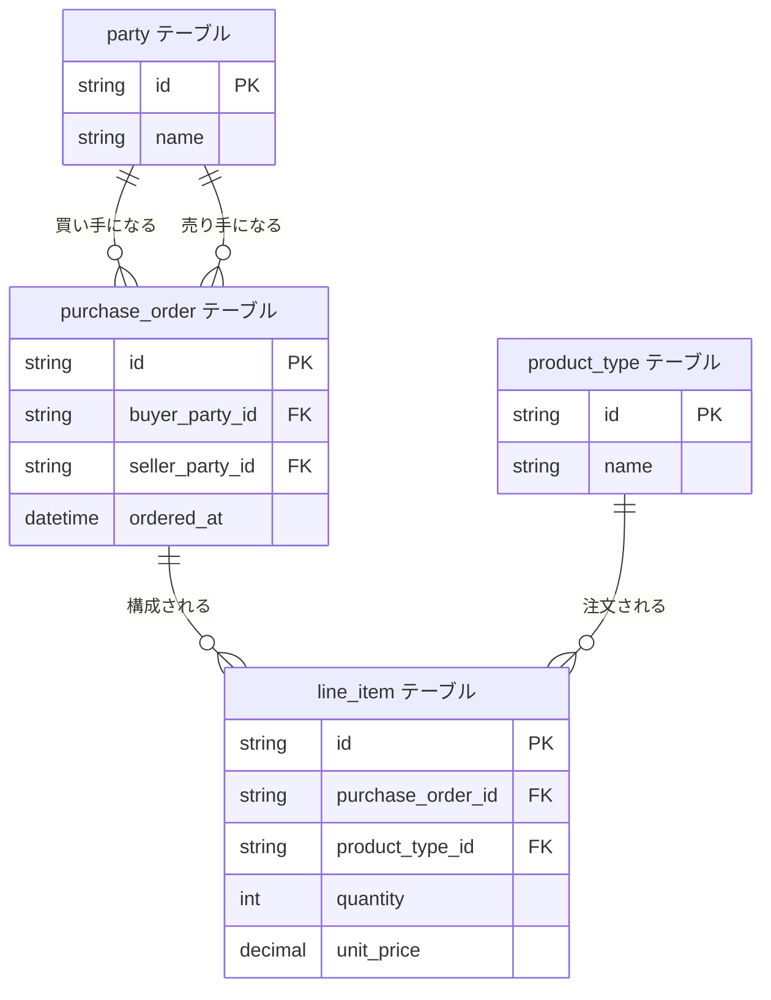
```mermaid
erDiagram
  party["party テーブル"] {
    string id PK
    string name
  }

  purchase_order["purchase_order テーブル"] {
    string id PK
    string buyer_party_id FK
    string seller_party_id FK
    datetime ordered_at
  }

  product_type["product_type テーブル"] {
    string id PK
    string name
  }

  line_item["line_item テーブル"] {
    string id PK
    string purchase_order_id FK
    string product_type_id FK
    int quantity
    decimal unit_price
  }

  party ||--o{ purchase_order : "買い手になる"
  party ||--o{ purchase_order : "売り手になる"
  purchase_order ||--o{ line_item : "構成される"
  product_type ||--o{ line_item : "注文される"
```

#### ▼ Contract Roles

契約にどの当事者がどの立場（売り手、保証人など）で関わるかを、契約の役割テーブルで表す。

「Roles」を応用したパターンである。

```mermaid
erDiagram
  contract["contract テーブル"] {
    string id PK
    date signed_on
  }

  party["party テーブル"] {
    string id PK
    string name
  }

  contract_role_type["contract_role_type テーブル"] {
    string id PK
    string name
  }

  contract_role["contract_role テーブル"] {
    string contract_id PK,FK
    string party_id PK,FK
    string contract_role_type_id FK
  }

  contract ||--o{ contract_role : "関わる"
  party ||--o{ contract_role : "担う"
  contract_role_type ||--o{ contract_role : "種類である"
```

#### ▼ Basic Bookkeeping

1つの取引を、取引テーブルと、勘定ごとの借方と貸方を記録する仕訳テーブルで表す。

```mermaid
erDiagram
  accounting_transaction["accounting_transaction テーブル"] {
    string id PK
    date transaction_date
    string description
  }

  account["account テーブル"] {
    string id PK
    string name
    string account_kind
  }

  accounting_entry["accounting_entry テーブル"] {
    string id PK
    string accounting_transaction_id FK
    string account_id FK
    decimal amount
    string debit_or_credit
  }

  accounting_transaction ||--o{ accounting_entry : "構成される"
  account ||--o{ accounting_entry : "記帳される"
```

#### ▼ Samples, Tests, and Observations

サンプルに対する検査と、検査で測った項目ごとの値（観測値）を、別々のテーブルで表す。

「Type and Instance」を応用したパターンである。

```mermaid
erDiagram
  sample["sample テーブル"] {
    string id PK
    datetime collected_at
  }

  test_type["test_type テーブル"] {
    string id PK
    string name
  }

  test["test テーブル"] {
    string id PK
    string sample_id FK
    string test_type_id FK
    datetime tested_at
  }

  variable["variable テーブル"] {
    string id PK
    string name
    string unit
  }

  observation["observation テーブル"] {
    string id PK
    string test_id FK
    string variable_id FK
    decimal value
  }

  sample ||--o{ test : "検査される"
  test_type ||--o{ test : "種類である"
  test ||--o{ observation : "生み出す"
  variable ||--o{ observation : "測定される"
```

#### ▼ Material Requirements Planning

完成品の生産計画と、部品表と、部品がいつ何個必要かを計算した発注の計画を、それぞれ別のテーブルで表す。

「Products and Product Types」を応用したパターンである。

```mermaid
erDiagram
  product_type["product_type テーブル"] {
    string id PK
    string name
  }

  product_type_structure["product_type_structure テーブル"] {
    string assembly_product_type_id PK,FK
    string component_product_type_id PK,FK
    int quantity
  }

  master_schedule_item["master_schedule_item テーブル"] {
    string id PK
    string product_type_id FK
    date due_date
    int quantity
  }

  firm_planned_order["firm_planned_order テーブル"] {
    string id PK
    string product_type_id FK
    date due_date
    int quantity
  }

  product_type ||--o{ master_schedule_item : "計画される"
  product_type ||--o{ product_type_structure : "親部品である"
  product_type ||--o{ product_type_structure : "子部品である"
  product_type ||--o{ firm_planned_order : "注文される"
```

#### ▼ Monitoring Processes

資産に付けた測定点（タグ）と、測定点ごとに測定した時刻と値を記録するテーブルで表す。

「Samples, Tests, and Observations」を応用したパターンである。

```mermaid
erDiagram
  asset["asset テーブル"] {
    string id PK
    string name
  }

  variable["variable テーブル"] {
    string id PK
    string name
    string unit
  }

  tag["tag テーブル"] {
    string id PK
    string asset_id FK
    string variable_id FK
    string name
  }

  tag_value["tag_value テーブル"] {
    string tag_id PK,FK
    datetime time PK
    decimal value
  }

  asset ||--o{ tag : "監視される"
  variable ||--o{ tag : "測定される"
  tag ||--o{ tag_value : "記録する"
```

#### ▼ The Document

文書の種類、文書同士の構成（章や添付など）、文書に誰がどの立場（作成者、受領者など）で関わるかを、それぞれ別のテーブルで表す。

「Type and Instance」と「Structure」と「Roles」を組み合わせたパターンである。

```mermaid
erDiagram
  document_type["document_type テーブル"] {
    string id PK
    string name
  }

  document["document テーブル"] {
    string id PK
    string document_type_id FK
    string title
  }

  document_structure["document_structure テーブル"] {
    string parent_document_id PK,FK
    string child_document_id PK,FK
    int sequence
  }

  party["party テーブル"] {
    string id PK
    string name
  }

  document_role["document_role テーブル"] {
    string document_id PK,FK
    string party_id PK,FK
    string role_name
  }

  document_type ||--o{ document : "種類である"
  document ||--o{ document_structure : "含む"
  document ||--o{ document_structure : "一部である"
  document ||--o{ document_role : "関わる"
  party ||--o{ document_role : "担う"
```

#### ▼ Versions

文書の版を、文書とは別のテーブルで表し、どの版がどの版を置き換えたかを、前の版を指す列で表す。

「Structure」を応用したパターンである。

```mermaid
erDiagram
  document["document テーブル"] {
    string id PK
    string title
  }

  document_version["document_version テーブル"] {
    string id PK
    string document_id FK
    string superseded_document_version_id FK
    int version_number
  }

  document ||--o{ document_version : "持つ"
  document_version ||--o| document_version : "置き換える"
```

 

## 事例

### マルチテナントの場合

マルチテナントでは、`tenant` テーブルをデータ分離の境界として扱う。

```mermaid
flowchart TB
  subgraph tenant["tenant"]
    user["user"]
    tenant_token["tenant_token"]
    quota["quota"]

    subgraph workspace["workspace"]
      foo["foo"]
      bar["bar"]
    end
  end

  role["role"]
  policy["policy"]

  user --> role
  tenant_token --> role
  role --> policy
```

`tenant` テーブルを境界として見ると、`workspace` テーブルや `foo` テーブル、`bar` テーブルは `tenant` テーブルの内側にある。

`user` テーブルや `workspace` テーブルなどのテナント配下のテーブルは `tenant_id` を持つ。

これにより、認可後の Read 処理を `tenant` 単位で絞り込める。

`workspace` テーブル配下のデータも `tenant_id` を含むキーで親子関係を表す。

`role` テーブルと `policy` テーブルは `user` テーブルや `tenant_token` テーブルに紐づけ、画面操作や API 操作の権限を表現する。

`role_policy` のような中間テーブルを用意すると、テーブル間を多対多で紐付けられる。

<table>
  <thead>
    <tr>
      <th>テーブル</th>
      <th>役割</th>
    </tr>
  </thead>
  <tbody>
    <tr>
      <td><code>tenant</code></td>
      <td>マルチテナントにおけるデータ分離の単位</td>
    </tr>
    <tr>
      <td><code>user</code></td>
      <td><code>tenant</code> に所属する利用者。<code>role</code> を通じて操作権限を持つ</td>
    </tr>
    <tr>
      <td><code>tenant_token</code></td>
      <td><code>tenant</code> に紐づく API アクセス用のトークン。<code>user</code> と同様に <code>role</code> を持つ</td>
    </tr>
    <tr>
      <td><code>role</code></td>
      <td><code>user</code> や <code>tenant_token</code> に割り当てる権限のまとまり</td>
    </tr>
    <tr>
      <td><code>policy</code></td>
      <td>画面や API に対する操作可否を表すルール</td>
    </tr>
    <tr>
      <td><code>role_policy</code></td>
      <td><code>role</code> と <code>policy</code> を多対多で紐づける中間テーブル</td>
    </tr>
    <tr>
      <td><code>workspace</code></td>
      <td><code>tenant</code> 配下で業務データをまとめる作業領域</td>
    </tr>
    <tr>
      <td><code>quota</code></td>
      <td><code>tenant</code> ごとの利用上限</td>
    </tr>
    <tr>
      <td><code>foo</code></td>
      <td><code>workspace</code> 配下に作成される業務データの例 1</td>
    </tr>
    <tr>
      <td><code>bar</code></td>
      <td><code>workspace</code> 配下に作成される業務データの例 2</td>
    </tr>
  </tbody>
</table>

```mermaid
erDiagram
  tenant ||--o{ user : "持つ"
  tenant ||--o{ tenant_token : "持つ"
  tenant ||--o{ workspace : "所有する"
  tenant ||--o{ quota : "持つ"

  user }o--|| role : "割り当てられる"
  tenant_token }o--|| role : "割り当てられる"
  role ||--o{ role_policy : "持つ"
  policy ||--o{ role_policy : "使われる"

  workspace ||--o{ foo : "持つ"
  workspace ||--o{ bar : "持つ"

  tenant["tenant テーブル"] {
    string id PK
    string name UK
    string default_role
  }

  user["user テーブル"] {
    string id PK
    string tenant_id FK
    string email
    string role_name FK
  }

  tenant_token["tenant_token テーブル"] {
    string tenant_id PK,FK
    string name PK
    string token UK
    string role_name FK
  }

  role["role テーブル"] {
    string name PK
    string scope
  }

  policy["policy テーブル"] {
    string name PK
    string context
  }

  role_policy["role_policy テーブル"] {
    string role_name PK,FK
    string policy_name PK,FK
  }

  workspace["workspace テーブル"] {
    string tenant_id PK,FK
    string name PK
  }

  quota["quota テーブル"] {
    string tenant_id PK,FK
    string resource PK
  }

  foo["foo テーブル"] {
    string tenant_id PK,FK
    string workspace_name PK,FK
    string name PK
  }

  bar["bar テーブル"] {
    string tenant_id PK,FK
    string workspace_name PK,FK
    string name PK
  }
```

 

### 監視ドメインの場合

監視ドメインでは、監視の設定（`monitor` テーブル）と監視の結果（`check_result` テーブル）を分けて扱う。

```mermaid
erDiagram
  project["project テーブル"] {
    string id PK
    string name
  }

  monitor["monitor テーブル"] {
    string id PK
    string project_id FK
    string name
    string monitor_kind
    string schedule
  }

  monitor_http["monitor_http テーブル"] {
    string monitor_id PK,FK
    string url
    int expected_status_code
  }

  monitor_tls["monitor_tls テーブル"] {
    string monitor_id PK,FK
    string hostname
    int port
  }

  region["region テーブル"] {
    string id PK
    string name
  }

  monitor_region["monitor_region テーブル"] {
    string monitor_id PK,FK
    string region_id PK,FK
    boolean enabled
  }

  check_result["check_result テーブル"] {
    string id PK
    string monitor_id FK
    string region_id FK
    datetime checked_at
    string status
    int response_time_ms
  }

  incident["incident テーブル"] {
    string id PK
    string monitor_id FK
    string status
    datetime opened_at
    datetime resolved_at
  }

  incident_check_result["incident_check_result テーブル"] {
    string incident_id PK,FK
    string check_result_id PK,FK
  }

  project ||--o{ monitor : "持つ"
  monitor ||--o| monitor_http : "HTTP監視である"
  monitor ||--o| monitor_tls : "TLS監視である"
  monitor ||--o{ monitor_region : "実行される"
  region ||--o{ monitor_region : "実行する"
  monitor ||--o{ check_result : "記録する"
  region ||--o{ check_result : "記録する"
  monitor ||--o{ incident : "起票される"
  incident ||--o{ incident_check_result : "根拠にする"
  check_result ||--o{ incident_check_result : "根拠になる"
```

`monitor` テーブルは監視の種類に共通する設定を記録し、種類ごとの設定は `monitor_http` テーブルや `monitor_tls` テーブルに記録する（Heterogeneous Entities）。

`check_result` テーブルは、監視の設定とリージョンごとに、実行した時刻と結果を記録する（Monitoring Processes）。

`incident` テーブルは、インシデントの根拠になった監視の結果を `incident_check_result` テーブルで紐づける（Relationships）。

 
