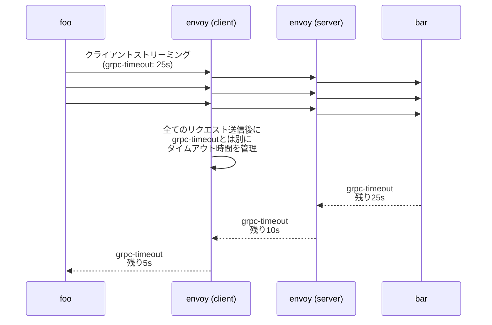
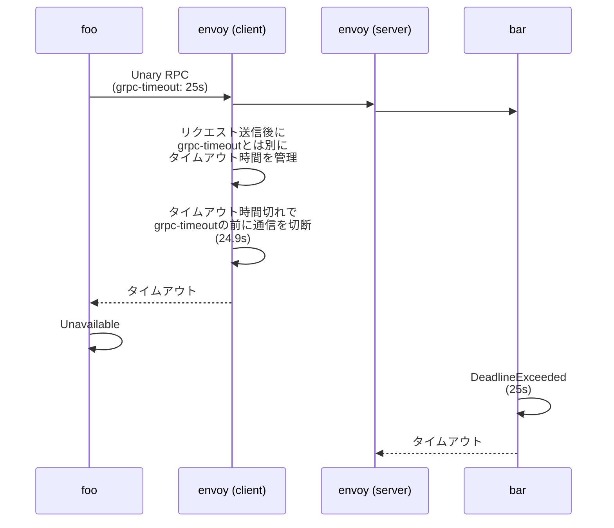

# envoy.yaml＠Envoy

## はじめに

本サイトにつきまして、以下をご認識のほど宜しくお願いいたします。

> - https://hiroki-it.github.io/tech-notebook/

<br>

## 01. セットアップ

### インストール

かなり大変なため、DockerfileやIstio経由でインストールすることが推奨。

> - https://www.envoyproxy.io/docs/envoy/latest/start/install

<br>

### 手動セットアップの場合

#### ▼ Dockerfile

Dockerfileにて、独自の`/etc/envoy/envoy.yaml`ファイルを組み込む。

拡張子は、`.yml`ではなく、`.yaml`とする。

> - https://www.envoyproxy.io/docs/envoy/latest/start/docker

```dockerfile
FROM envoyproxy/envoy:v1.20.1
COPY envoy.yaml /etc/envoy/envoy.yaml
RUN chmod go+r /etc/envoy/envoy.yaml
```

<br>

### 自動セットアップの場合

#### ▼ Istio

Istioは、Envoyをベースとしたリバースプロキシを自動的に挿入する。この場合、`/etc/istio/proxy/envoy-rev0.json`ファイルを設定ファイルとして扱う。

> - https://istio.io/latest/docs/ops/deployment/architecture/#envoy
> - https://cloud.tencent.com/developer/article/1701214

<br>

### 設定ファイルに関する補足情報

#### ▼ ドキュメントの探し方

執筆時点 (2022/11/16) では、設定ファイルのドキュメントの記載が不十分である。

設定ファイルのYAMLファイルのデータ型や階層は、APIのJSON形式と同じ構成になっている。

そのため、設定ファイルのドキュメントで探す代わりに、APIのドキュメントを確認した方が良い。

> - https://www.envoyproxy.io/docs/envoy/latest/api-v3/api

#### ▼ 設計規約について

Envoyでは、YAMLファイルのキー名がスネークケースになっている。

一方で、サービスメッシュツール (例：Istio、Linkerd) では、ローワーキャメルケースを使用している。

> - https://docs.solo.io/gloo-edge/master/guides/security/rate_limiting/envoy/

<br>

## 02. admin

### adminとは

記入中...

> - https://www.envoyproxy.io/docs/envoy/latest/start/quick-start/admin#admin

<br>

### access_log_path

#### ▼ access_log_pathとは

Envoyのアクセスログの出力先を設定する。

**＊実装例＊**

```yaml
admin:
  access_log_path: /dev/null
```

<br>

## 03. admin.address

### addressとは

記入中...

<br>

### socket_address

#### ▼ protocol

管理ダッシュボードで受信するインバウンド通信のプロトコルを設定する。

**＊実装例＊**

```yaml
admin:
  address:
    socket_address:
      protocol: TCP
```

#### ▼ address

受信したパケットのうちで、宛先IPアドレスでフィルタリング可能にする。

『`0.0.0.0`』とすると、任意の宛先IPアドレスを指定するパケットをフィルタリングできるようになる。

**＊実装例＊**

```yaml
admin:
  address:
    socket_address:
      address: 0.0.0.0
```

#### ▼ port_value

管理ダッシュボードでインバウンド通信を待ち受けるポート番号を設定する。

**＊実装例＊**

```yaml
admin:
  address:
    socket_address:
      port_value: 9901
```

<br>

## 04. static_resources

### static_resourcesとは

静的な値を設定する。

執筆時点 (2022/11/12) では、`listeners`キーと`clusters`キーのみを設定できる。

> - https://www.envoyproxy.io/docs/envoy/latest/start/quick-start/configuration-static#static-resources
> - https://www.envoyproxy.io/docs/envoy/latest/configuration/overview/bootstrap#config-overview-bootstrap

<br>

## 05. static_resources.listeners

### listenersとは

受信するインバウンド通信のリスナーを設定する。

> - https://www.envoyproxy.io/docs/envoy/latest/start/quick-start/configuration-static#listeners

<br>

### address

#### ▼ protocol

受信するインバウンド通信のプロトコルを設定する。

**＊実装例＊**

```yaml
static_resources:
  listeners:
    - address:
        socket_address:
          protocol: TCP
```

#### ▼ address

受信したパケットのうちで、宛先IPアドレスでフィルタリング可能にする。

『`0.0.0.0`』とすると、任意の宛先IPアドレスを指定するパケットをフィルタリングできるようになる。

**＊実装例＊**

```yaml
static_resources:
  listeners:
    - address:
        socket_address:
          address: 0.0.0.0
```

#### ▼ port_value

受信したパケットのうちで、宛先ポート番号でフィルタリング可能にする。

**＊実装例＊**

```yaml
static_resources:
  listeners:
    - address:
        socket_address:
          port_value: 80
```

<br>

### filter_chains.filters

#### ▼ name

使用するフィルターを設定する

**＊実装例＊**

HTTPフィルターの一種である`network.http_connection_manager`を指定する。

```yaml
static_resources:
  listeners:
    - filter_chains:
        - filters:
            - name: envoy.filters.network.http_connection_manager
```

> - https://www.envoyproxy.io/docs/envoy/latest/api-v3/config/filter/filter

#### ▼ typed_config.access_log

Envoyのアクセスログの出力方法を設定する。

**＊実装例＊**

標準出力に出力する。

```yaml
static_resources:
  listeners:
    - filter_chains:
        - filters:
            - typed_config:
                access_log:
                  - name: envoy.access_loggers.stdout
                    typed_config:
                      "@type": type.googleapis.com/envoy.extensions.access_loggers.stream.v3.StdoutAccessLog
```

> - https://www.envoyproxy.io/docs/envoy/latest/api-v3/config/accesslog/v3/accesslog.proto

#### ▼ typed_config.route_config

特定のルーティング先に関する処理を設定する。

| 項目            | 説明                                                                                                                                                                                                      |
| --------------- | --------------------------------------------------------------------------------------------------------------------------------------------------------------------------------------------------------- |
| `name`          | ルート名を設定する。                                                                                                                                                                                      |
| `virtual_hosts` | ルーティング先を設定する。特に`domains`キーには、受信するインバウンド通信の`Host`ヘッダーの値を設定する。補足として`Host`ヘッダーには、インバウンド通信のルーティング先のドメイン名が割り当てられている。 |

**＊実装例＊**

```yaml
static_resources:
  listeners:
    - filter_chains:
        - filters:
            - name: envoy.filters.network.http_connection_manager
              typed_config:
                "@type": type.googleapis.com/envoy.extensions.filters.network.http_connection_manager.v3.HttpConnectionManager
                route_config:
                  name: foo_route
                  virtual_hosts:
                    - name: foo_service
                      # ホストベース
                      domains:
                        - "*"
                      routes:
                        - match:
                            # パスベース
                            prefix: "/"
                          route:
                            cluster: foo_cluster
                            timeout: 30s
                            max_stream_duration:
                              # ストリーミングRPCの確立後のタイムアウト時間を設定する
                              max_connection_duration: 15
                              # ストリーミングRPC全体のタイムアウト時間を設定する
                              max_stream_duration: 30
                              # クライアント側でgrpc-timeoutヘッダーを使用している場合に、これをストリーミングRPCのタイムアウト時間として設定する (max_grpc_timeoutも同じ)
                              # ただし、grpc_timeout_header_maxの設定値を超えて、grpc-timeoutヘッダーを設定できない
                              grpc_timeout_header_max: 30
```

> - https://www.envoyproxy.io/docs/envoy/latest/api-v3/config/route/v3/route.proto
> - https://blog.kamijin-fanta.info/2020/12/consul-with-envoy/
> - https://www.envoyproxy.io/docs/envoy/latest/api-v3/config/route/v3/route_components.proto#config-route-v3-routeaction-maxstreamduration

なお、`max_stream_duration`は`max_grpc_timeout`の移行先として追加された設定である。

> - https://github.com/envoyproxy/envoy/issues/12578
> - https://github.com/envoyproxy/envoy/pull/13018

Envoyは、gRPCのストリーミングのタイムアウトを適切に処理できておらず、`max_grpc_timeout`は非推奨となった。

gRPCは、TCPコネクションの確立前にタイムアウト時間を開始し、ストリーミング時に残りのタイムアウト時間を`grpc-timeout`ヘッダーに設定する。

一方でEnvoyは、gRPCクライアントからのリクエストの終了後にタイムアウトを開始し、`grpc-timeout`ヘッダーとは別にタイムアウトを管理する。

これにより、クライアント側が想定しているタイムアウト時間よりも短い時間でEnvoyがタイムアウト時間を迎える可能性がある。

<!-- prettier-ignore-start -->



<!-- prettier-ignore-end -->

例えば、gRPCサーバーでタイムアウトが起こった時、適切にエラーを処理できない。

gRPCサーバーからのレスポンスよりも先に、gRPCクライアント側のEnvoyは通信を切断してしまう。

そのため、gRPCクライアントにて、ステータスコードを`DeadlineExceeded`ではなく、`Unavailable`としてしまう。

<!-- prettier-ignore-start -->



<!-- prettier-ignore-end -->

```yaml
# 期待する例外スロー
gRPCクライアント # タイムアウト (DeadlineExceededを受信)
⬇⬆︎︎
⬇⬆︎︎
Envoy
⬇⬆︎︎
--------------
⬇⬆︎︎
Envoy
⬇⬆︎︎
⬇⬆︎︎
gRPCサーバー # タイムアウト (DeadlineExceededを投げる)
```

```yaml
gRPCクライアント # タイムアウト (Unavailableを受信)
⬇⬆︎︎
⬇⬆︎︎
Envoy
⬇⬆︎︎
--------------
⬇⬆︎︎
Envoy
⬇⬆︎︎
⬇⬆︎︎
gRPCサーバー # タイムアウト (DeadlineExceededを投げる)
```

> - https://github.com/istio/istio/pull/45234#discussion_r1213965308

しかし、移行先の`max_stream_duration`にもgRPCストリーミングのレスポンスの送信とタイムアウトの切断のタイミングに問題がある。

> - https://github.com/envoyproxy/envoy/issues/16129
> - https://github.com/envoyproxy/envoy/issues/13925#issuecomment-725205029

そこで、サービスメッシュツール (例：Istio) では、`max_grpc_timeout`を使用し続けている。

> - https://github.com/istio/istio/pull/45234#discussion_r1213965308
> - https://github.com/istio/istio/issues/45141
> - https://github.com/istio/istio/pull/42049

#### ▼ http_protocol_options

```yaml
static_resources:
  clusters:
    - typed_extension_protocol_options:
        envoy.extensions.upstreams.http.v3.HttpProtocolOptions:
          "@type": type.googleapis.com/envoy.extensions.upstreams.http.v3.HttpProtocolOptions
          http_protocol_options:
```

> - https://www.envoyproxy.io/docs/envoy/latest/api-v3/config/core/v3/protocol.proto#config-core-v3-httpprotocoloptions

#### ▼ typed_config.stat_prefix

統計ダッシュボードのメトリクスの接頭辞を設定する。

**＊実装例＊**

```yaml
static_resources:
  listeners:
    - filter_chains:
        - filters:
            - typed_config:
                stat_prefix: ingress_http
```

> - https://www.envoyproxy.io/docs/envoy/latest/start/quick-start/admin#stat-prefix
> - https://i-beam.org/2019/02/03/envoy-static-load-balancer/

<br>

### filter_chains.filters.typed_config.@type

#### ▼ typed_config.@type

使用する拡張機能名を (例：フィルターなど) 設定する。

拡張機能名を指定することにより、その拡張機能の設定を定義できるようになる。

これは、Envoyではなく、gRPCの機能の由来している。

RPCでは、JSON内のデータのデータ型を指定するために使用する。

> - https://www.envoyproxy.io/docs/envoy/latest/configuration/overview/extension#config-overview-extension-configuration
> - https://developers.google.com/protocol-buffers/docs/reference/google.protobuf#any

#### ▼ `network.tcp_proxy`

`network.tcp_proxy`はデフォルトで有効になっているネットワークフィルターである。

Envoyが`L4`プロトコルを処理できるようになる。

`network.http_connection_manager`とは異なり、ルート値ではなくクラスター値に処理を繋ぐ。

**＊実装例＊**

```yaml
static_resources:
  listeners:
    - filter_chains:
        - filters:
            - name: envoy.filters.network.tcp_proxy
              typed_config:
                "@type": type.googleapis.com/envoy.extensions.filters.network.tcp_proxy.v3.TcpProxy
                # クラスター値
                cluster: foo_cluster
                ...
```

> - https://www.envoyproxy.io/docs/envoy/latest/configuration/listeners/network_filters/tcp_proxy_filter
> - https://www.envoyproxy.io/docs/envoy/latest/api-v3/config/filter/network/network

#### ▼ `network.http_connection_manager`

`network.http_connection_manager`はデフォルトで有効になっているネットワークフィルターである。

Envoyが`L7`プロトコルを処理できるようになる。

`network.tcp_proxy`とは異なり、ルート値に処理を繋ぐ。

**＊実装例＊**

```yaml
static_resources:
  listeners:
    - filter_chains:
        - filters:
            - name: envoy.filters.network.http_connection_manager
              typed_config:
                "@type": type.googleapis.com/envoy.extensions.filters.network.http_connection_manager.v3.HttpConnectionManager
                # ルート値
                route_config:
                   name: foo_route
                   ...
```

> - https://www.envoyproxy.io/docs/envoy/latest/intro/arch_overview/http/http_connection_management
> - https://www.envoyproxy.io/docs/envoy/latest/api-v3/config/filter/network/network

#### ▼ `http.router`

`http.router`はデフォルトで有効になっているHTTPフィルターである。

```yaml
static_resources:
  listeners:
    - filter_chains:
        - filters:
            - name: envoy.filters.http.router
              typed_config:
                # HTTPフィルターを指定する
                "@type": type.googleapis.com/envoy.extensions.filters.http.router.v3.Router
```

> - https://www.envoyproxy.io/docs/envoy/latest/configuration/http/http_filters/router_filter

#### ▼ `http.grpc_web`

`http.grpc_web`はデフォルトで有効になっているHTTPフィルターである。

```yaml
static_resources:
  listeners:
    - filter_chains:
        - filters:
            - name: envoy.filters.http.grpc_web
              typed_config:
                # HTTPフィルターを指定する
                "@type": type.googleapis.com/envoy.extensions.filters.http.grpc_web.v3.GrpcWeb
```

> - https://www.envoyproxy.io/docs/envoy/latest/configuration/http/http_filters/grpc_web_filter

<br>

### name

#### ▼ nameとは

インバウンド通信を受信するリスナーの名前を設定する。

**＊実装例＊**

```yaml
static_resources:
  listeners:
    - name: foo_listener
```

> - https://www.envoyproxy.io/docs/envoy/latest/api-v3/config/listener/v3/listener.proto

<br>

## 06. static_resources.clusters

### clustersとは

インバウンド通信のルーティング先のマイクロサービスをグループ化する。

対象が`1`個であっても、`clusters`キーは必須である。

> - https://www.envoyproxy.io/docs/envoy/latest/start/quick-start/configuration-static#clusters

<br>

### circuit_breakers

#### ▼ circuit_breakersとは

ルーティング先の同時接続の上限数を設定する。

制限を超過した場合、宛先へのルーティングが停止し、直近の成功時の処理結果を返信する (サーキットブレイカー) 。

**＊実装例＊**

```yaml
static_resources:
  clusters:
    - circuit_breakers:
        thresholds:
          - "priority": "DEFAULT",
            "max_connections": 100000,
            "max_pending_requests": 100000,
            "max_requests": 100000
          - "priority": "HIGH",
            "max_connections": 100000,
            "max_pending_requests": 100000,
            "max_requests": 100000
```

> - https://www.envoyproxy.io/docs/envoy/latest/configuration/upstream/cluster_manager/cluster_circuit_breakers.html?highlight=circuit_breakers

<br>

### connect_timeout

#### ▼ connect_timeoutとは

ルーティング時のタイムアウト時間を設定する。

**＊実装例＊**

```yaml
static_resources:
  clusters:
    - connect_timeout: 10s
```

<br>

### dns_lookup_family

#### ▼ dns_lookup_familyとは

記入中...

**＊実装例＊**

```yaml
static_resources:
  clusters:
    - dns_lookup_family: v4_only
```

<br>

### lb_policy

#### ▼ lb_policyとは

ルーティングのアルゴリズムを設定する。

**＊実装例＊**

```yaml
static_resources:
  clusters:
    - lb_policy: round_robin
```

<br>

### load_assignment

#### ▼ endpoints

ルーティング先のIPアドレスとポート番号のリストを設定する。

> - https://www.envoyproxy.io/docs/envoy/latest/api-v3/extensions/filters/http/router/v3/router.proto#envoy-v3-api-msg-extensions-filters-http-router-v3-router

**＊実装例＊**

```yaml
static_resources:
  clusters:
    - load_assignment:
        endpoints:
          - lb_endpoints:
              - endpoint:
                  address: 192.168.0.1 # クラスターのIPアドレス
                  port_value: 80
              - endpoint:
                  address: 192.168.0.1
                  port_value: 81
              - endpoint:
                  address: foo-service.foo-namespace.svc.cluster.local # クラスター (ここではKubernetesのService) の完全修飾ドメイン名
                  port_value: 82
```

#### ▼ cluster_name

ルーティング先のグループの名前を設定する。

**＊実装例＊**

```yaml
static_resources:
  clusters:
    - load_assignment:
        cluster_name: foo_cluster
```

<br>

### name

#### ▼ nameとは

ルーティング先のグループの名前を設定する。

**＊実装例＊**

```yaml
static_resources:
  clusters:
    - name: foo_cluster
```

<br>

### transport_socket

#### ▼ name

ルーティング時に使用するソケット名を設定する。

**＊実装例＊**

```yaml
static_resources:
  clusters:
    - transport_socket:
        name: envoy.transport_sockets.tls
```

#### ▼ typed_config

HTTPSリクエストを送受信する場合に、証明書を設定する。

**＊実装例＊**

サービスメッシュツールを使用せずに、`envoy`コンテナを直接的に稼働させるとする。

また、静的な値を設定したとする。

> - https://www.envoyproxy.io/docs/envoy/latest/configuration/security/secret#example-one-static-resource

```yaml
static_resources:
  clusters:
    ...
    - connect_timeout: 0.25s
      load_assignment:
        cluster_name: local_service_tls
        transport_socket:
          name: envoy.transport_sockets.tls
          typed_config:
            "@type": type.googleapis.com/envoy.extensions.transport_sockets.tls.v3.UpstreamTlsContext
            common_tls_context:
              # static_resources.secretsキーで定義したクライアント証明書を設定する。
              tls_certificate_sds_secret_configs:
                - name: client-cert

  listeners:
    ...
    - filter_chains:
        transport_socket:
          name: envoy.transport_sockets.tls
          typed_config:
            "@type": type.googleapis.com/envoy.extensions.transport_sockets.tls.v3.DownstreamTlsContext
            common_tls_context:
              # static_resources.secretsキーで定義したSSL証明書を設定する。
              tls_certificate_sds_secret_configs:
                - name: server-cert
              validation_context_sds_secret_config:
                name: validation_context

  secrets:
    ## SSL証明書
    - name: server-cert
      tls_certificate:
        certificate_chain:
          filename: certs/server-cert.pem
        private_key:
          filename: certs/server-key.pem
    # クライアント証明書
    - name: client-cert
      tls_certificate:
        certificate_chain:
          filename: certs/client-cert.pem
        private_key:
          filename: certs/client-key.pem
    - name: validation_context
      validation_context:
        trusted_ca:
          filename: certs/ca-cert.pem
        verify_certificate_hash:
          E0:F3:C8:CE:5E:2E:A3:05:F0:70:1F:F5:12:E3:6E:2E:97:92:82:84:A2:28:BC:F7:73:32:D3:39:30:A1:B6:FD
```

**＊実装例＊**

サービスメッシュツールを使用せずに、`envoy`コンテナを直接的に稼働させるとする。また、コントロールプレーンのSDS-APIから取得した動的な値を設定したとする。

> - https://www.envoyproxy.io/docs/envoy/latest/configuration/security/secret#example-two-sds-server

<br>

### type

#### ▼ typeとは

サービスディスカバリーの種類を設定する。

ルーティング先のアドレスをIPアドレスではなくドメイン名で指定する場合、必須である。

> - https://www.envoyproxy.io/docs/envoy/latest/intro/arch_overview/upstream/service_discovery#arch-overview-service-discovery-types

**＊実装例＊**

```yaml
static_resources:
  clusters:
    - type: logical_dns
```

<br>

## 06-02. clusters.typed_extension_protocol_options

### envoy.extensions.upstreams.http.v3.HttpProtocolOptions

#### ▼ common_http_protocol_options

```yaml
static_resources:
  clusters:
    - typed_extension_protocol_options:
        envoy.extensions.upstreams.http.v3.HttpProtocolOptions:
          "@type": type.googleapis.com/envoy.extensions.upstreams.http.v3.HttpProtocolOptions
          common_http_protocol_options:
            idle_timeout: 1s
```

#### ▼ connect_timeout

```yaml
static_resources:
  clusters:
    - typed_extension_protocol_options:
        envoy.extensions.upstreams.http.v3.HttpProtocolOptions:
          "@type": type.googleapis.com/envoy.extensions.upstreams.http.v3.HttpProtocolOptions
          connect_timeout: 5s
```

#### ▼ http2_protocol_options

HTTP/2 (例：gRPCなど) について設定する。

```yaml
static_resources:
  clusters:
    - typed_extension_protocol_options:
        envoy.extensions.upstreams.http.v3.HttpProtocolOptions:
          "@type": type.googleapis.com/envoy.extensions.upstreams.http.v3.HttpProtocolOptions
          http2_protocol_options:
            # ストリーミングRPCの最大同時接続数を設定する
            max_concurrent_streams: 100
```

> - https://www.envoyproxy.io/docs/envoy/latest/api-v3/config/core/v3/protocol.proto#envoy-v3-api-msg-config-core-v3-http2protocoloptions

#### ▼ upstream_http_protocol_options

```yaml
static_resources:
  clusters:
    - typed_extension_protocol_options:
        envoy.extensions.upstreams.http.v3.HttpProtocolOptions:
          "@type": type.googleapis.com/envoy.extensions.upstreams.http.v3.HttpProtocolOptions
          upstream_http_protocol_options:
            auto_sni: true
```

<br>

## 05. dynamic_resources

### dynamic_resourcesとは

動的に宛先情報を設定する。

> - https://www.envoyproxy.io/docs/envoy/latest/start/quick-start/configuration-dynamic-filesystem#dynamic-resources

<br>

### ads_config

#### ▼ ads_configとは

ADS-APIに関して設定する。EnvoyがADS-APIにリクエストを送信するように設定できる。

> - https://www.envoyproxy.io/docs/envoy/latest/configuration/overview/xds_api#aggregated-discovery-service

#### ▼ grpc_services

ADS-APIとして使用するクラスター名を設定する。クラスターとはgRPCを使用してパケットを送受信する。ADS-APIの宛先情報は、`static_resources.clusters`キー配下で設定しておく。

> - https://www.envoyproxy.io/docs/envoy/latest/api-v3/config/core/v3/grpc_service.proto#envoy-v3-api-msg-config-core-v3-grpcservice-envoygrpc

**＊実装例＊**

サービスメッシュツールを使用せずに、`envoy`コンテナを直接的に稼働させるとする。

```yaml
dynamic_resources:
  ads_config:
    api_type: grpc
    grpc_services:
      - envoy_grpc:
          cluster_name: xds_cluster

# Envoyの識別子を設定する。
node:
  cluster: foo-cluster
  id: foo-id

static_resources:
  clusters:
    # XDS-APIをクラスターとする。
    - name: xds_cluster
      connect_timeout: 0.25s
      lb_policy: ROUND_ROBIN
      http2_protocol_options: {}
      load_assignment:
        cluster_name: xds_cluster
        endpoints:
          - lb_endpoints:
              - endpoint:
                  address:
                    # XDS-APIの宛先情報
                    socket_address:
                      address: 127.0.0.1
                      port_value: 15010
    # 定義したXDS-APIのクラスターを指定する。
    - name: services_cluster
      type: EDS
      connect_timeout: 0.25s
      lb_policy: ROUND_ROBIN
      eds_cluster_config:
        eds_config:
          resource_api_version: V3
          api_config_source:
            api_type: GRPC
            transport_api_version: V3
            grpc_services:
              - envoy_grpc:
                  cluster_name: xds_cluster
```

> - https://github.com/salrashid123/envoy_control/blob/eaa30c1ec5d6bb7baa8ddc1a3a78d9125313cb6a/baseline.yaml#L9-L15
> - https://github.com/salrashid123/envoy_control/blob/eaa30c1ec5d6bb7baa8ddc1a3a78d9125313cb6a/baseline.yaml#L27-L40
> - https://github.com/salrashid123/envoy_discovery/blob/8f939d1ba7aaf8724651a9e2530099da4ab686d6/envoy_config.yaml#L39-L74
> - https://i-beam.org/2019/03/13/envoy-xds-server/

**＊実装例＊**

Istioを使用して、`envoy`コンテナを稼働させるとする。

Kubernetesでは、YAMLファイルのキー名の設計規約がローワーキャメルケースであることに注意する。

```yaml
dynamicResources:
  adsConfig:
    apiType: grpc
    grpcServices:
      - envoyGrpc:
          clusterName: xds-grpc

staticResources:
  clusters:
    - connectTimeout: 1s
      http2ProtocolOptions: {}
      name: xdsCluster
      type: static
      # xds-apiの宛先情報を設定する。
      loadAssignment:
        clusterName: xdsCluster
        endpoints:
          - lbEndpoints:
              - endpoint:
                  address:
                    pipe:
                      # ここではソケットファイルを指定している。
                      # envoyとxds-apiのプロセス間で、パケットを送受信する。
                      path: ./etc/istio/proxy/xds
```

#### ▼ set_node_on_first_message_only

記入中...

**＊実装例＊**

```yaml
dynamic_resources:
  ads_config:
    set_node_on_first_message_only: true
```

#### ▼ transport_api_version

記入中...

**＊実装例＊**

```yaml
dynamic_resources:
  ads_config:
    transport_api_version: V3
```

<br>

### cds_config

#### ▼ cds_configとは

CDS-APIに関して設定する。

#### ▼ path

`cds.yaml`ファイル (CDS-APIから取得した動的な宛先情報が設定されたファイル) を読み込む。

**＊実装例＊**

```yaml
dynamic_resources:
  cds_config:
    path: /var/lib/envoy/cds.yaml
```

<br>

### lds_config

#### ▼ lds_configとは

LDS-APIに関して設定する。

#### ▼ path

`lds.yaml`ファイル (LDS-APIから取得した動的な宛先情報が設定されたファイル) を読み込む。

**＊実装例＊**

```yaml
dynamic_resources:
  lds_config:
    path: /var/lib/envoy/lds.yaml
```

<br>
