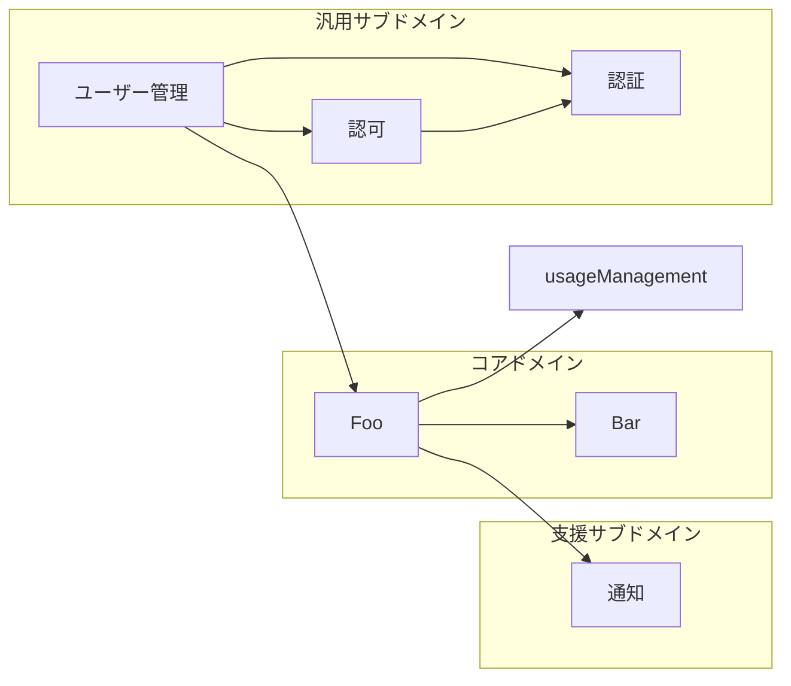

# ルール＠Codex

## はじめに

本サイトにつきまして、以下をご認識のほど宜しくお願いいたします。

> - https://hiroki-it.github.io/tech-notebook/

<br>

## 01. ドメインオブジェクトの規約

### Remixの場合

````markdown
# ドメイン設計

## 境界づけられたコンテキスト

プロダクトが扱う境界づけられたコンテキストを定義づける。

### 種類

次の基準で境界づけられたコンテキストの種類を定義する。

| 境界づけられたコンテキストの種類 | ドメインの種類   | 説明                                     |
| -------------------------------- | ---------------- | ---------------------------------------- |
| Foo                              | コアドメイン     | Fooに関わる業務を扱う                    |
| Bar                              | コアドメイン     | Barに関わる業務を扱う                    |
| 通知                             | 支援サブドメイン | 通知に関わる業務を扱う                   |
| ユーザー管理                     | 汎用サブドメイン | ユーザーや組織に関わる業務を扱う         |
| 認証                             | 汎用サブドメイン | ログインやトークン認証に関わる業務を扱う |
| 認可                             | 汎用サブドメイン | ロールやポリシーに関わる業務を扱う       |

### コンテキストマップ



## ドメインオブジェクト

プロダクトで使用されているドメインオブジェクト（ルートエンティティ、エンティティ、値オブジェクト）を一覧化し、分類する。

`prisma/schema.prisma`に定義されたORMのデータモデルをドメインオブジェクト相当として考える。

### 種類

次の基準でドメインオブジェクトの種類に分類する。

また、ドメインオブジェクトがどの境界づけられたコンテキストに属するかに分類する。

- ルートエンティティ
  - 識別子をもつ
  - 内包するエンティティや値オブジェクトを含む集約全体の状態を変更できる
  - ユースケースは、異なる境界づけられたコンテキストに属するルートエンティティの状態を同時に変更できない
- エンティティ
  - 識別子をもつ
  - 集約の外部から直接変更することはできず、通常はルートエンティティ経由で集約の状態を変更する
- 値オブジェクト
  - 識別子をもたない
  - ドメインルール上でのプリミティブ値や性質を表す

| 名前              | オブジェクトの種類 | 属する境界づけられたコンテキストの種類 |
| ----------------- | ------------------ | -------------------------------------- |
| Auth              | エンティティ       | 認証                                   |
| Foo               | ルートエンティティ | Foo                                    |
| Foo1              | エンティティ       | Foo                                    |
| Foo2              | エンティティ       | Foo                                    |
| Foo3              | 値オブジェクト     | Foo                                    |
| Organization      | ルートエンティティ | ユーザー管理                           |
| OrganizationToken | エンティティ       | ユーザー管理                           |
| Policy            | ルートエンティティ | 認可                                   |
| Role              | ルートエンティティ | 認可                                   |
| RolePolicy        | エンティティ       | 認可                                   |
| Session           | エンティティ       | 認証                                   |
| User              | ルートエンティティ | ユーザー管理                           |
````
