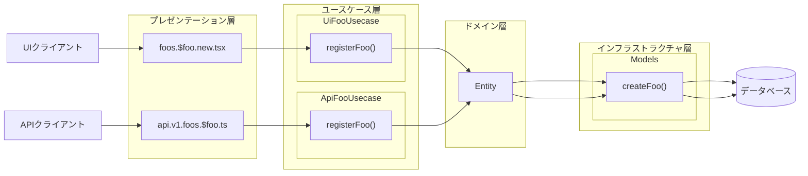

# スキル＠Codex

## はじめに

本サイトにつきまして、以下をご認識のほど宜しくお願いいたします。

> - https://hiroki-it.github.io/tech-notebook/

<br>

## 01. 要件定義

```markdown
---
name: define-requirements-with-working-mock
description: 動くモックを使って要件定義を進め、機能要件を固める
---

# 要件定義

## このスキルの使い方

要件定義を、文章だけでなく動くモックを使って進めるためのスキルである。

## 手順

### 1. 対象範囲の確認

- ユーザーに、対象業務、利用者、対象画面、未確定事項を確認する。
- 画面要件が曖昧でも、最初の数画面を作る前提で進める。
- このスキルでは機能要件を対象とし、非機能要件の深掘りは扱わない。

### 2. 動くモックの作成

- 主要な利用シナリオを表せる画面からモック化する。
- モックは画像ではなく、クリック、入力、画面遷移を確認できる形で作る。
- 見た目の作り込みより、要件の抜け漏れを見つけやすいことを優先する。

### 3. 単一ファイルでの共有

- 可能な限り、一つの HTML に複数画面をまとめる。例えば、一覧、詳細、登録を同一ファイルに置き、表示切り替えで疑似遷移を表現する。

### 4. レビューと要件整理

- 打ち合わせではモックを操作しながらコメントを受ける。
- 直せる内容はその場で直し、指摘は画面単位ではなく業務シナリオ単位でも整理する。

### 5. 機能要件の抽出

- モックから、利用者が実現したい操作を機能要件として抽出する。
- 機能要件は、表示項目、入力項目、操作、画面遷移、入力チェック、エラー表示の観点で整理する。
- 実装方式には広げず、利用者が期待する振る舞いとして記述する。

### 6. 出力

- 成果物として、モックと対応づいた機能要件一覧を出力する。
- 未確定事項は機能要件に含めず、確認事項として分離する。

### 7. 完了条件

- 利用者が主要シナリオをモック上で確認できる。
- 主要な機能要件が抽出され、対応する画面やシナリオを追跡できる。
- 未確定事項が機能要件と分離されている。

### 8. スキルの後に

- 機能要件に基づいて、ユースケース図やドメインオブジェクト図を作成する。
```

参考：https://zenn.dev/nttdata_tech/articles/8a010aff542625#4.1-%E8%A6%81%E4%BB%B6%E5%AE%9A%E7%BE%A9

<br>

## 02. アプリケーションアーキテクチャ設計

### Remixの場合

````markdown
---
name: design-application-architecture-for-new-feature
description: 新機能を既存のアーキテクチャに準拠しながら設計する
---

# 新機能のアーキテクチャ設計スキル

## このスキルの使い方

これは新機能のアーキテクチャ設計の手順を明文化したスキルである。

ユーザーがフロントエンドとバックエンドの両方を含む新機能のアーキテクチャ設計を依頼したら、`./.claude/rules/application-architecture-design.md` の規約を参考にしながら、以下の手順で進める。

このスキルはレイヤー、ファイル、関数だけを設計するものであり、具体的な実装は機能要件や非機能要件に応じて調整する必要がある。

### 1. 全体像

1.  `./.codex/rules/application-architecture-design.md` から、レイヤードアーキテクチャにおけるフロントエンドとバックエンドの各層がどのディレクトリに相当するのかを確認する。
2.  まずはフロントエンドの設計に進む。

### 2. フロントエンドの設計

#### プレゼンテーション層

1. ユーザーにフロントエンドのUIモックの提出を求める。UIモックがないようであれば、フロントエンドの機能要件の入力を求め、この内容に基づいてUIモックをこの場で作成する。
2. フロントエンドの機能要件とUIモックに基づいてプレゼンテーション層を後述の番号で設計していく。
3. ユーザーにUIのパスが何になるかを求める。ユースケース（下書き、閲覧、登録、更新、削除）に応じたパスが必要である。例えば、`<機能名>/`（閲覧）、`<機能名>/new`（登録）、`<機能名>/edit`（更新）、`<機能名>/delete`(削除）になる。
4. 提示されたパスに対応する`<パス>.tsx`ファイルが`./app/presentation/routes`ディレクトリにあるかを探す。もしなければ、新しい`<パス>.tsx`ファイルを作成する。
5. `.tsx`ファイルに`component()`関数（名前は自由）を実装する。`component()`では、UIモックを実装するUIロジック、CSSスタイリング、状態管理のロジックを実装する。
   - ほかの`<パス>.tsx`ファイルで再利用するUIロジックやCSSスタイリングでないかぎり、`./app/presentation/components`ディレクトリにファイルを作成しない。再利用するものであれば、`./app/presentation/components`ディレクトリ配下の適切なディレクトリにファイルを作成する。
   - ほかの`<パス>.tsx`ファイルで再利用する状態管理でないかぎり、`./app/presentation/hooks`ディレクトリにファイルを作成しない。
6. フロントエンドにバリデーションが必要であれば、`./app/presentation/component/validators`ディレクトリに`<バリデーションの対象名>Validator.ts`を作成する。ここにバリデーションをロジックを実装する。
7. バックエンドの設計に進む。

### 3. バックエンドの設計

#### プレゼンテーション層

1. バックエンドの機能要件の入力を求め、この内容に基づいてプレゼンテーション層を後述の番号で設計していく。
2. `.tsx`ファイルに`loader()`と`action()`を作成する。
3. バックエンドにバリデーションが必要であれば、`./app/presentation/routes`ディレクトリに`loader()`にバリデーションロジックを実装する。
4. ユースケース層の設計に進む。

#### ユースケース層

1. バックエンドの機能要件の入力を求め、この内容に基づいてユースケース層を後述の番号で設計していく。
2. `./app/usecases`ディレクトリに`ui<機能名>Usecase.ts`を作成し、機能要件のユースケース（閲覧、登録、更新、削除）に応じた関数を実装する。
   - 下書き系 (UI特有のユースケースで、APIでは不要) ：いくつかの`getDraftXxx` (デフォルト値を含むドメインオブジェクト)
   - 閲覧系：いくつかの`getXxx`（単一ドメインオブジェクト）、いくつかの`listXxx`（複数ドメインオブジェクト）、`searchXxx`など
   - 作成系：`registerXxx`（単一ドメインオブジェクト）
   - 更新系：`changeXxx`（単一ドメインオブジェクト）
   - 削除系：`deleteXxx`（単一ドメインオブジェクト）
3. `./app/presentation/routes`ディレクトリにある下書き系 (UI特有のユースケースで、APIでは不要) または閲覧系ユースケースに対応したuiルートを確認する。このuiルートの`loader()`で、`ui<機能名>Usecase.ts`にある閲覧系ユースケースの関数を呼び出す。
4. `./app/presentation/routes`ディレクトリにある登録・更新・削除系ユースケースに対応したuiルートを確認する。このuiルートの`action()`で、`ui<機能名>Usecase.ts`にある登録・更新・削除系ユースケースの関数を呼び出す。
5. ドメイン層の設計に進む。

#### ドメイン層

本アプリケーションにはドメイン層がまだない。既存の多くの箇所でプレゼンテーション層とインフラストラクチャ層に相当するディレクトリにロジックが分散している状態である。

既存のプレゼンテーション層からドメイン層を抽出するよりも、ユースケース層を抽出する方が優先のため、現時点ではドメイン層を明確化しなくてよい。

よって、そのままインフラストラクチャ層の設計に進む。

#### インフラストラクチャ層

1. バックエンドの機能要件の入力を求め、この内容に基づいてドメイン層とインフラストラクチャ層を後述の番号で設計していく。
2. 新しいORMのデータモデルが必要であれば、`./prisma/schema.prisma`にデータモデルを実装する。
3. `./app/infrastructure/models`ディレクトリに`<データモデル名>.server.ts`を作成する。ここに登録・更新・削除系ユースケースに応じたCRUD関数を実装する。
   - READ系：`getXxx`
   - CREATE系：`createXxx`
   - UPDATE系：`updateXxx`
   - DELETE系：`deleteXxx`
   - なんらかの理由でCREATEとUPDATEをかねたい場合：`saveXxx`
4. `./app/usecases`ディレクトリにある`ui<機能名>Usecase.ts`を確認する。各ユースケースの関数で、`<データモデル名>.server.ts`にあるCRUD関数を呼び出す。

### 4. セルフレビュー

成果物が `./.codex/rules/application-architecture-design.md` に記載の規約に準拠しているかを確認する。準拠していなければ修正する。

### 5. ドキュメント化

1. `./docs/<機能名>/`のディレクトリを新しく作成し、ここに今回のアーキテクチャ設計を解説するドキュメントを記載する。

- レイヤー間の依存関係の図
- 新しく追加するファイルを置くディレクトリのツリー
- 新しく追加する関数の役割、引数、返却値

2. `./docs/<機能名>/`のディレクトリに新機能全体のユースケース図を`usecase-diagram.mmd`の名前で作成する。次はその例である。

```mermaid
graph LR

   UiClient[UIクライアント]
   ApiClient[APIクライアント]
   FooValidator[入力値のFooが妥当かを確認する]
   BarValidator[送信データのFooが妥当かを確認する]

   subgraph UiUsecases["【UI】〇〇機能"]
      UiGetDraft([〇〇の下書きを閲覧する (UI特有のユースケースで、APIでは不要) ])
      UiGet([〇〇を閲覧する])
      UiRegister([〇〇を登録する])
      UiChange([〇〇を更新する])
      UiDelete([〇〇を削除する])
   end

   UiClient --> UiGet
   UiClient --> UiRegister
   UiClient --> UiChange
   UiClient --> UiDelete
   UiRegister -. << include >> .-> FooValidator
   UiChange -. << include >> .-> FooValidator

   subgraph ApiUsecases["【API】〇〇機能"]
      ApiGet([〇〇を閲覧する])
      ApiRegister([〇〇を登録する])
      ApiChange([〇〇を更新する])
      ApiDelete([〇〇を削除する])
   end

   ApiClient --> ApiGet
   ApiClient --> ApiRegister
   ApiClient --> ApiChange
   ApiClient --> ApiDelete
   ApiRegister -. << include >> .-> BarValidator
   ApiChange -. << include >> .-> BarValidator
```
````

3. `./docs/<機能名>/` のディレクトリに新機能全体のコンポーネント図を `component-diagram.mmd` の名前で作成する。次はその例である。



````

<br>

## 02. UI設計

```markdown
---
name: design-ui
description: 機能要件に応じたUI設計する
---

# UI設計スキル

## このスキルの使い方

これはUI設計の手順を明文化したスキルである。

## 手順

1. UI定義書を読み込む
2. 一枚のHTMLでUIのモックを実装する
````

```markdown
# UI定義書

- 入力フィールド
  - 任意テキスト
  - パスワード
  - セレクトボックス
  - チェックボックス
  - ラジオボタン
  - 日付
- ボタン
  - 作成ボタン
  - 変更ボタン
  - 削除ボタン
- 外部リンク
- トースト
  - 成功
  - 失敗
- ローディング表示
  - ローディングスピナー
  - プログレスバー
- ナビゲーション表示
  - ページネーション
  - タブ
  - パンくずリスト
- モーダル
- 確認ダイアログ
- ポップアップ
- 表
  - データ表
  - カードリスト
- ステータス表示
- 使いやすいURL
  - クエリストリング
    - ページネーション番号
    - 検索キーワード
    - ソート順序
  - パスパラメーター
    - ユーザー向けのID
  - アンカー
  - 履歴管理
    - 例えば、SPAではページ遷移しているように見えても、ブラウザでは遷移を記録していない場合がある。
    - そのため、意図的に履歴を管理しないと、戻るボタンが期待通り動かないという問題が起きる。
```

<br>

## 03. textlint

```markdown
---
name: textlint
description: リポジトリ内のMarkdownに対してtextlintを実行し、検出された指摘を修正し、errorが0になるまで繰り返す。`yarn textlint ./src/**/*.md` の実行と修正ループを依頼されたときに使用する。
---

# Textlint

## Workflow

以下のループを追加し、`textlint` の error が 0 になるまで繰り返す:

1. Run `yarn textlint ./src/**/*.md`
2. 検出結果を修正
3. Run `yarn textlint ./src/**/*.md`
4. 検出結果を修正

textlintで error が **0件** になるまで、手順 1〜4 を繰り返す。

### Fixing guidance

- 文章の意図を保ちつつ、ルールを満たすための最小限の修正を優先する。
- ルールが明らかにリポジトリに不適切な場合は、修正で無理に合わせ続けるのではなく `.textlintrc*` の調整を提案する。
```

<br>
