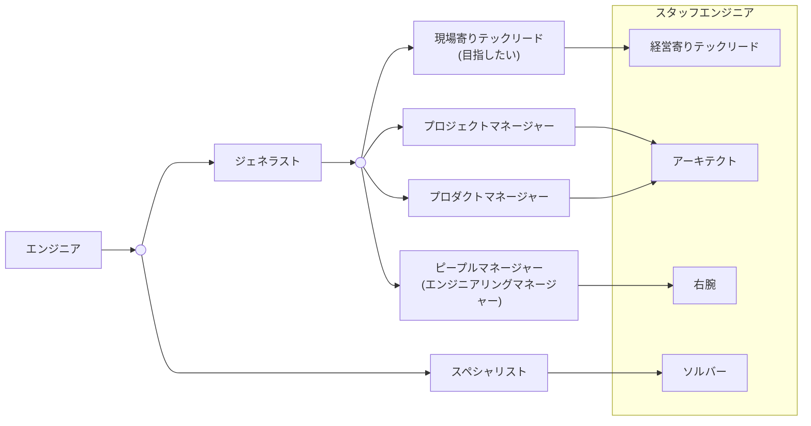

# 組織論＠開発手法

## はじめに

本サイトにつきまして、以下をご認識のほど宜しくお願いいたします。

> - https://hiroki-it.github.io/tech-notebook/

 

## 01. エンジニアチームの作り方

### 指向タイプ

#### ▼ 技術指向

技術そのものや、これの仕組み (アルゴリズム、アーキテクチャなど) にモチベーションがあるタイプ。

個人的なイメージとして、XaaSだと仕組みがブラックボックスのため、仕組みを知れるOSSが好きな人がこれに当てはまる。

どんなプロダクトを作るかではなく、どんな技術を使用するかが重要である。

深く狭い `I` 型人材になる傾向がある。

> - https://note.com/cwmasaki/n/nb181309fac93
> - https://blog.trainocate.co.jp/blog/IT-engineer

#### ▼ プロダクト指向

プロダクト (ちょっとしたツールも含む) を開発し、それを使ってもらうことにモチベーションがあるタイプ。

極論、技術を使用しなくともよく、プロダクトを提供できさえすればよい。

個人的なイメージとして、OSSだとプロダクトの開発が遅くなるため、素早く開発できるXaaSが好きな人がこれに当てはまる。

広く浅い `ー` 型人材になる傾向がある。

> - https://note.com/cwmasaki/n/nb181309fac93
> - https://thinkit.co.jp/article/17898

#### ▼ 組織指向

チームを作り、人をまとめることにモチベーションがあるタイプ。

個人的なイメージとして、後輩の指導や調整が上手い人がこれに当てはまる。

広く浅い `ー` 型人材になる傾向がある。

> - https://note.com/cwmasaki/n/nb181309fac93

 

### チーム構成

いずれのタイプが良いというわけでない。

より良いプロダクトを開発するためには、チームにこれらの人材全てが揃っているべきである。

> - https://note.com/cwmasaki/n/nb181309fac93

 

## 02. エンジニアのキャリアパス

### キャリアパスの種類

ITエンジニアには、さまざまなキャリアパスがある。

メンバーのITエンジニアから始まって、例えば以下のパスがある (他にもたくさん) 。

> - https://www.nogawanogawa.work/entry/management_career
> - https://www.netvisionacademy.com/column/910/

 

### エンジニアのキャリアパス例

キャリアパス例を示した。

CTPやVPoEといった職種は省略している。

現場寄りテックリードを目指したい。

注意点として、『現場寄りテックリード』にはマネージメントスキルが必要である。

> - https://qiita.com/vankobe/items/9a951d814db6b1180074#%E8%AA%B2%E9%A1%8C%E3%83%AA%E3%83%BC%E3%83%80%E3%83%BC%E3%81%AF%E5%85%A8%E3%81%A6%E3%82%92%E6%B1%82%E3%82%81%E3%82%89%E3%82%8C%E3%82%8B-or-%E3%83%AA%E3%83%BC%E3%83%80%E3%83%BC%E3%81%98%E3%82%83%E3%81%AA%E3%81%91%E3%82%8C%E3%81%B0%E6%B1%82%E3%82%81%E3%82%89%E3%82%8C%E3%81%AA%E3%81%84
> - https://www.youtube.com/watch?v=ljFZqeXYLXo
> - https://qiita.com/darquro/items/d9efb7b5b789c152905f#%E3%82%A8%E3%83%B3%E3%82%B8%E3%83%8B%E3%82%A2%E3%83%AA%E3%83%B3%E3%82%B0%E3%83%9E%E3%83%8D%E3%83%BC%E3%82%B8%E3%83%A3%E3%83%BC%E3%81%AE%E4%BB%95%E4%BA%8B
> - https://qiita.com/hirokidaichi/items/95678bb1cef32629c317#%E3%83%86%E3%82%AF%E3%83%8E%E3%83%AD%E3%82%B8%E3%83%BC%E3%83%9E%E3%83%8D%E3%82%B8%E3%83%A1%E3%83%B3%E3%83%88
> - https://scrapbox.io/ohbarye/%E3%82%A8%E3%83%B3%E3%82%B8%E3%83%8B%E3%82%A2%E3%83%AA%E3%83%B3%E3%82%B0%E3%83%9E%E3%83%8D%E3%82%B8%E3%83%A1%E3%83%B3%E3%83%88%E3%82%B9%E3%82%AD%E3%83%AB
> - https://roadmap.sh/engineering-manager
> - https://pr.forkwell.com/tech_event_reports/staff-engineer/

 

### Individual Contributorとマネージャーの違い

ピープルマネージメント（人事評価、面接など）するかしないかがキャリアパスの分かれ目になっている。

- ピープルマネージメントをしないあらゆる役割（PL / PM / PdMなども含む） → Individual Contributor
- ピープルマネージメントをする役割（EM） → マネージャー

PL / PM / PdMが専業でその役割を果たす場合（Individual Contributor）と、EMも兼務している場合（マネージャー）がある

> 次に、外資系企業のキャリアパスについて見ていきたいと思います。
> 日本語でいう「管理職」はマネージャー と呼ばれます。
> ただ、管理職ではない社員のタイトルにもマネージャーという単語が入っていることがあり（例としてプロダクトマネージャーがあります）、明確に区別したい場合は直接の部下を持つ人、という意味で「ピープルマネージャー（People manager）」と呼ぶこともあります。

LegalOn Technologiesがメルカリを参考にしたキャリアパスを公開している。

LegalOn Technologiesでは、エンジニアにIC・TL・Managerの３つのラダーがある。

ラダーがかなり細分化されて、ラダーに応じてどうあるべきかの役割わかりやすい。

> - https://docs.google.com/spreadsheets/d/1jad5ybRc5XqIPMRyz9eHAwCL6rUlFJ5NCakqoO_Uu08/edit?pli=1&gid=1832796022#gid=1832796022
> - https://tech.legalforce.co.jp/entry/2023/08/04/144207

 

### 現場エンジニアの種類

現場のエンジニアの肩書と役割である。

ただし、組織によって肩書きの役割が異なる。

そのため、肩書きによらず 『何の役割を担っていたか？』が重要である。

(肩書きは役割の後についてくる)

| 仕事                                | メンバーエンジニア | メンターエンジニア | サブリードエンジニア | リードエンジニア (現場リーダー) | プロジェクトマネージャー |
| ----------------------------------- | :----------------: | :----------------: | :------------------: | :-----------------------------: | :----------------------: |
| 社内外合意形成                      |                    |                    |                      |                                 |            ✅            |
| タスク管理                          |                    |                    |                      |               ✅                |            ✅            |
| プロジェクト計画                    |                    |                    |                      |                                 |            ✅            |
| 工数/費用の見積もり                 |                    |                    |                      |               ✅                |            ✅            |
| 契約                                |                    |                    |                      |                                 |            ✅            |
| 要件定義 (スクラムの場合は要件整理) |                    |                    |          ✅          |               ✅                |            ✅            |
| UIデザイン                          |         ✅         |         ✅         |          ✅          |               ✅                |            ✅            |
| システム設計                        |         ✅         |         ✅         |          ✅          |               ✅                |            ✅            |
| 実装                                |         ✅         |         ✅         |          ✅          |               ✅                |                          |
| テスト                              |         ✅         |         ✅         |          ✅          |               ✅                |                          |
| リリース                            |         ✅         |         ✅         |          ✅          |               ✅                |                          |
| 運用保守                            |         ✅         |         ✅         |          ✅          |               ✅                |                          |

> - https://qiita.com/ma91n/items/207f32db1b51754d6933#2-11-%E5%8F%A3%E3%81%A0%E3%81%91%E3%81%A7%E3%81%AF%E3%81%AA%E3%81%8F%E6%AD%A3%E8%A7%A3%E3%82%92%E6%8F%90%E7%A4%BA%E3%81%99%E3%82%8B%E3%81%AE%E3%82%82%E5%A4%A7%E4%BA%8B
> - https://www.nogawanogawa.work/entry/management_career

 

### 年齢の経験の対応

プロジェクトマネジメントに進むかどうかは年齢とは関係ない。

ただ、リードエンジニア (現場リーダー) の経験は `35` 歳までに `2` 年積んでおきたい (つまり、少なくとも `33` 歳までには経験を始める)

そうでないと、`30` 代後半で書類選考すら通りにくくなる。

> - https://youtu.be/1u82PcgOgFs?t=289
> - https://note.com/spectol/n/ne36f77560b6f

 
